# Neon Database Schema Diagram

Complete visual representation of all 8 schemas and their tables/views in the Marketing DB.

## Database Structure Overview

```mermaid
graph TB
    subgraph DB["🗄️ MARKETING DB (Neon PostgreSQL)"]
        
        subgraph BIT["🔔 BIT Schema (Buyer Intent Tool)"]
            BIT_STATUS["⏳ Ready - No tables yet<br/>Purpose: Intelligence signals"]
        end
        
        subgraph PLE["🔄 PLE Schema (Pipeline Logic Engine)"]
            PLE_STATUS["⏳ Ready - No tables yet<br/>Purpose: Lead loop automation"]
        end
        
        subgraph INTAKE["📥 INTAKE Schema (Raw Data Staging)"]
            INTAKE_T1["📊 company_raw_intake<br/>447 rows | 25 cols"]
        end
        
        subgraph MARKETING["📢 MARKETING Schema (Core Business)"]
            MARK_T1["📊 company_master<br/>708 rows | 29 cols"]
            MARK_T2["📊 company_slots<br/>1,232 rows | 5 cols"]
            MARK_T3["📊 contact_enrichment<br/>0 rows | 11 cols"]
            MARK_T4["📊 email_verification<br/>0 rows | 8 cols"]
            MARK_T5["📊 people_master<br/>0 rows | 26 cols"]
            MARK_T6["📊 pipeline_errors<br/>0 rows | 11 cols"]
            MARK_T7["📊 pipeline_events<br/>52 rows | 8 cols"]
            
            MARK_V1["👁️ marketing_ceo"]
            MARK_V2["👁️ marketing_cfo"]
            MARK_V3["👁️ marketing_hr"]
            MARK_V4["👁️ v_phase_stats"]
            MARK_V5["👁️ vw_error_rate_24h"]
            MARK_V6["👁️ vw_health_crawl_staleness"]
            MARK_V7["👁️ vw_health_profile_staleness"]
            MARK_V8["👁️ vw_queue_sizes"]
            MARK_V9["👁️ vw_unresolved_errors"]
        end
        
        subgraph COMPANY["🏢 COMPANY Schema (Company Views)"]
            COMP_V1["👁️ next_company_urls_30d"]
            COMP_V2["👁️ vw_anchor_staleness"]
            COMP_V3["👁️ vw_company_slots"]
            COMP_V4["👁️ vw_due_renewals_ready"]
            COMP_V5["👁️ vw_next_renewal"]
        end
        
        subgraph PEOPLE["👥 PEOPLE Schema (Contact Views)"]
            PEOPLE_V1["👁️ contact_enhanced_view"]
            PEOPLE_V2["👁️ due_email_recheck_30d"]
            PEOPLE_V3["👁️ next_profile_urls_30d"]
            PEOPLE_V4["👁️ vw_profile_monitoring"]
            PEOPLE_V5["👁️ vw_profile_staleness"]
        end
        
        subgraph PUBLIC["🌐 PUBLIC Schema (System)"]
            PUB_T1["📊 shq_validation_log<br/>1 row | 9 cols"]
            PUB_V1["👁️ due_email_recheck_30d"]
            PUB_V2["👁️ next_company_urls_30d"]
            PUB_V3["👁️ next_profile_urls_30d"]
        end
        
        subgraph ARCHIVE["📦 ARCHIVE Schema (Historical)"]
            ARCH_INFO["46 tables | 48,000+ rows<br/>8.5 MB archived data<br/><br/>Key tables:<br/>• storage_evaluation_state_county_zip_v2 (41,551 rows)<br/>• storage_evaluation_focus_states (6,337 rows)<br/>• shq_schema_registry (688 rows)<br/>• Various archived marketing/people tables"]
        end
    end
    
    style BIT fill:#fff4e6,stroke:#ff9800,stroke-width:3px
    style PLE fill:#e8f5e9,stroke:#4caf50,stroke-width:3px
    style INTAKE fill:#e3f2fd,stroke:#2196f3,stroke-width:3px
    style MARKETING fill:#fce4ec,stroke:#e91e63,stroke-width:4px
    style COMPANY fill:#f3e5f5,stroke:#9c27b0,stroke-width:3px
    style PEOPLE fill:#e0f2f1,stroke:#009688,stroke-width:3px
    style PUBLIC fill:#fff9c4,stroke:#fbc02d,stroke-width:3px
    style ARCHIVE fill:#efebe9,stroke:#795548,stroke-width:3px
```

## Detailed Schema Breakdown

### 📊 Table Distribution

| Schema | Tables | Views | Total Rows | Purpose |
|--------|--------|-------|------------|---------|
| **BIT** | 0 | 0 | 0 | Buyer intent signals (future) |
| **PLE** | 0 | 0 | 0 | Lead automation (future) |
| **INTAKE** | 1 | 0 | 447 | Raw data staging |
| **MARKETING** | 7 | 9 | 1,992 | Core business logic |
| **COMPANY** | 0 | 5 | - | Company management views |
| **PEOPLE** | 0 | 5 | - | Contact management views |
| **PUBLIC** | 1 | 3 | 1 | System utilities |
| **ARCHIVE** | 46 | 0 | 48,000+ | Historical data |
| **TOTAL** | **55** | **22** | **50,440+** | - |

## Data Flow Diagram

## Entity Relationship Overview

## Schema Purposes

### 🔔 **BIT** (Buyer Intent Tool)
- **Purpose:** Track buying intent signals
- **Status:** Schema ready, awaiting table creation
- **Future Tables:** `signal`, `company_intelligence`, `people_intelligence`

### 🔄 **PLE** (Pipeline Logic Engine)
- **Purpose:** Perpetual lead loop automation
- **Status:** Schema ready, awaiting table creation
- **Future Tables:** `lead_cycles`, `re_engagement_rules`

### 📥 **INTAKE**
- **Purpose:** Raw data ingestion and staging
- **Tables:** `company_raw_intake` (447 companies awaiting promotion)
- **Flow:** External sources → Intake → Marketing

### 📢 **MARKETING** (Primary Schema)
- **Purpose:** Core business operations
- **Active Data:** 1,992 rows across 7 tables
- **Key Tables:**
  - `company_master` - Golden company records (708)
  - `company_slots` - Role-based positions (1,232)
  - `people_master` - Contact records (ready for data)
  - `pipeline_events` - Event tracking (52)

### 🏢 **COMPANY**
- **Purpose:** Company-focused analytical views
- **Views Only:** 5 views for monitoring and querying
- **Key Views:**
  - Renewal tracking
  - Staleness monitoring
  - URL queues

### 👥 **PEOPLE**
- **Purpose:** Contact-focused analytical views
- **Views Only:** 5 views for contact management
- **Key Views:**
  - Email recheck queues
  - Profile staleness
  - Enhanced contact data

### 🌐 **PUBLIC**
- **Purpose:** System utilities and legacy compatibility
- **Tables:** `shq_validation_log` (1 row)
- **Views:** 3 legacy compatibility views

### 📦 **ARCHIVE**
- **Purpose:** Historical data preservation
- **Tables:** 46 archived tables (8.5 MB)
- **Data:** 48,000+ archived rows from Oct 2024 cleanup
- **Notable:** State/county/zip data, schema registry history

---

**Generated:** 2025-11-03  
**Database:** Marketing DB (Neon PostgreSQL 17)  
**Total Size:** ~10 MB (1.4 MB active + 8.5 MB archived)

