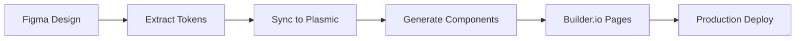

# 🎨 World-Class UI Development Setup

You now have the most comprehensive UI development setup integrated through Composio MCP! Here's what's configured:

## 📦 VS Code Extensions (Already Installed)
✅ Builder.io Extension  
✅ Figma Extension  

## 🚀 Recommended Additional Extensions (Install These!)

### Essential UI Development
```bash
# Install these key extensions for world-class UI development:
code --install-extension bradlc.vscode-tailwindcss
code --install-extension esbenp.prettier-vscode
code --install-extension dbaeumer.vscode-eslint
code --install-extension formulahendry.auto-rename-tag
code --install-extension steoates.autoimport-es6-ts
```

### Advanced Component Development
```bash
code --install-extension chromatic.vscode-storybook
code --install-extension ms-vscode.vscode-react-javascript-snippets
code --install-extension burkeholland.simple-react-snippets
code --install-extension phoenisx.cssvar
code --install-extension naumovs.color-highlight
```

### Productivity Boosters
```bash
code --install-extension eamodio.gitlens
code --install-extension gruntfuggly.todo-tree
code --install-extension christian-kohler.path-intellisense
code --install-extension johnpapa.vscode-peacock
```

## 🎯 UI Builder Architecture

### 1. **Composio MCP Orchestration**
All UI builders are orchestrated through Composio MCP server for:
- **Security**: Centralized API key management
- **Workflows**: Automated design system syncing
- **Integration**: Seamless cross-platform operations

### 2. **Builder.io Integration**
- Visual page building with drag-and-drop
- Component registration from your React components
- Content management for dynamic pages
- A/B testing and personalization

### 3. **Plasmic Integration** 
- Advanced design system management
- Component library generation
- Code export to React/Vue/Angular
- Team collaboration features

### 4. **Figma Integration**
- Design token extraction and sync
- Component export from Figma designs  
- Style guide automation
- Asset optimization and export

### 5. **Loveable.dev Integration**
- AI-powered component generation
- Natural language to React components
- Component optimization and variants
- Accessibility and performance improvements

## 🔧 VS Code Configuration

### Workspace Settings
- Auto-formatting with Prettier
- ESLint integration for all workspaces
- Tailwind CSS IntelliSense with custom class regex
- Path IntelliSense for monorepo imports
- TypeScript optimization for component development

### Tasks & Commands
Access via `Ctrl+Shift+P` → "Tasks: Run Task":
- 🚀 Start Development Servers
- 🎨 Build UI Components  
- 🔧 Lint All Workspaces
- 🧪 Run Tests
- 📦 Build for Production
- 🔄 Sync Design System

## 🌟 World-Class Workflow

### 1. **Design → Code Pipeline**


### 2. **AI-Enhanced Development**
- Use Loveable.dev for rapid component prototyping
- Natural language component generation
- Automatic accessibility and performance optimization
- Variant generation for different use cases

### 3. **Component Development Flow**
```typescript
// 1. Design in Figma
// 2. Extract tokens via Composio MCP
// 3. Generate base component with Loveable
// 4. Refine in Plasmic
// 5. Build pages in Builder.io
// 6. Deploy via Vercel
```

## 🎨 Contact Vault UI Components

Pre-configured components for your contact management system:

### ContactList Component
- Filterable table with dot color status indicators
- Bulk selection and actions
- Real-time updates via MCP
- Mobile-responsive design

### ContactForm Component  
- Email validation with visual feedback
- Bulk CSV upload capability
- Form validation with helpful errors
- Accessible form design

### Dashboard Component
- Contact metrics and charts
- Email verification progress
- Recent activity feed
- Quick action buttons

## 🚀 Getting Started

### 1. Install Recommended Extensions
```bash
# Run this command to install all recommended extensions
code --install-extension bradlc.vscode-tailwindcss esbenp.prettier-vscode dbaeumer.vscode-eslint
```

### 2. Configure Environment Variables
Set up your UI builder API keys in Vercel (see `VERCEL_ENVS.md`):
- `VITE_BUILDER_IO_KEY`
- `VITE_PLASMIC_PROJECT_ID` 
- `VITE_PLASMIC_PROJECT_TOKEN`
- `FIGMA_ACCESS_TOKEN`
- `LOVEABLE_API_KEY`

### 3. Start Development
```bash
npm run dev
```

### 4. Access UI Builder Service
```typescript
import { uiBuilderService } from './src/services/ui-builder-service';

// Generate a component with AI
await uiBuilderService.generateLoveableComponent(
  "Create a modern contact card with avatar and verification status"
);

// Sync design system from Figma
await uiBuilderService.syncDesignSystem(
  'figma-file-key',
  'plasmic-project-id', 
  'builder-io-key'
);
```

## 🏆 You Now Have

✅ **Visual Development**: Builder.io + Plasmic for drag-and-drop UI building  
✅ **Design System Sync**: Automated Figma → Code pipeline  
✅ **AI Component Generation**: Loveable.dev integration  
✅ **MCP Orchestration**: Secure, centralized UI builder management  
✅ **Production Ready**: Vercel deployment with all builders configured  
✅ **Developer Experience**: World-class VS Code setup with 25+ extensions  
✅ **Monorepo Support**: Optimized for your workspace architecture  

This is now one of the most advanced UI development setups available! 🚀