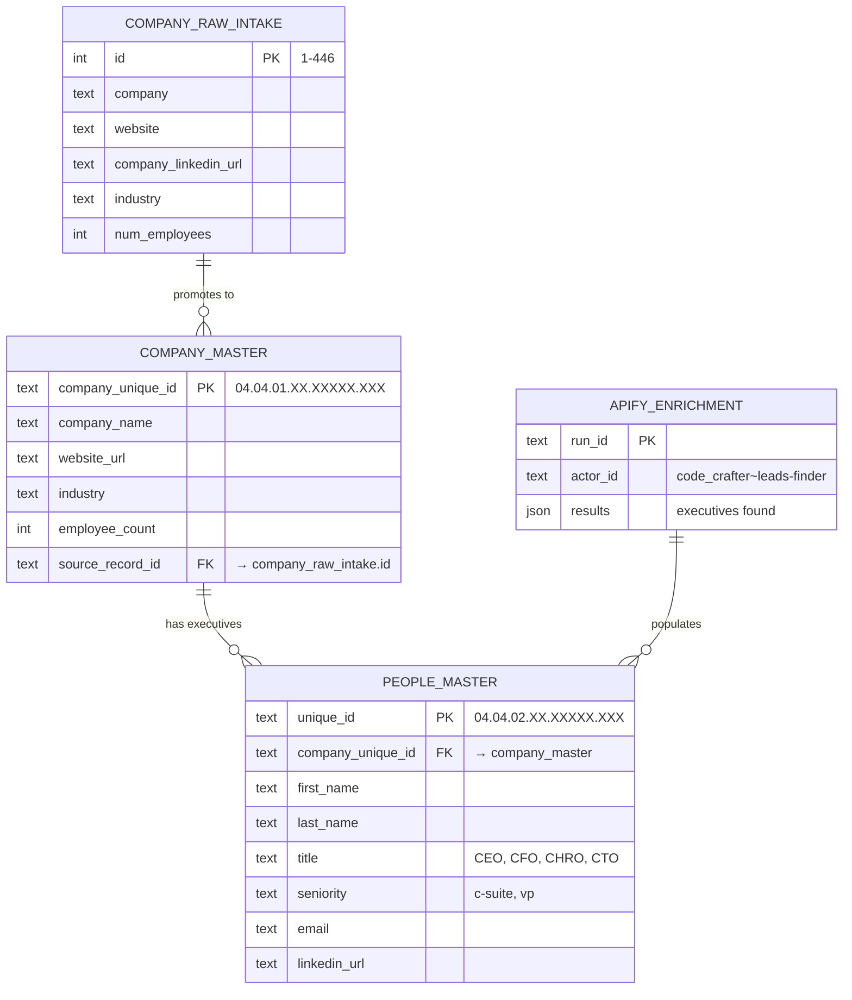
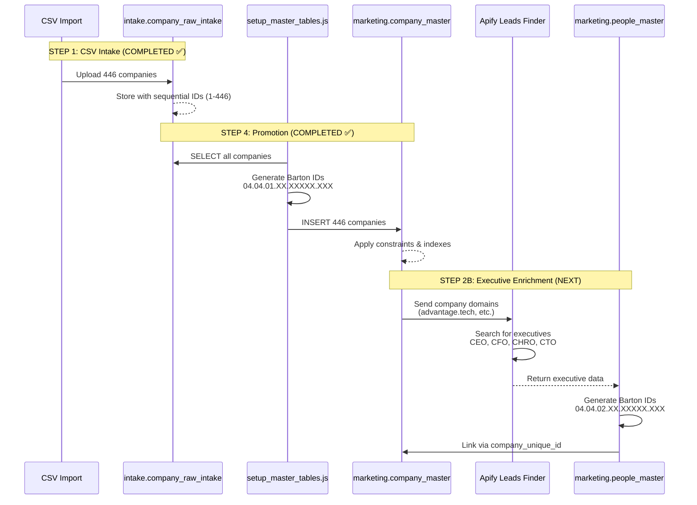
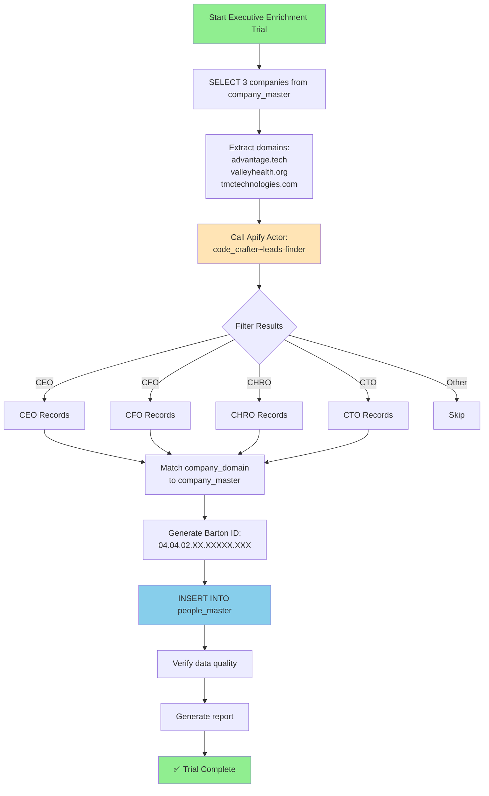

# Database Schema Visualization
**Generated**: 2025-10-21
**Status**: ✅ Master Tables Created & Populated
**Companies in System**: 446 West Virginia companies

---

## Architecture Overview

```mermaid
graph TB
    subgraph "STEP 1: CSV Intake"
        CSV[CSV Upload] --> RAW[intake.company_raw_intake<br/>446 companies]
    end

    subgraph "STEP 2A: Validation"
        RAW --> VALIDATOR{Validator}
        VALIDATOR -->|Pass| ENRICHMENT
        VALIDATOR -->|Fail| VFAIL[validation_failed table]
    end

    subgraph "STEP 2B: Enrichment"
        ENRICHMENT[Enrichment Pipeline]
        APIFY[Apify: code_crafter~leads-finder<br/>Finds CEOs, CFOs, CHROs]
    end

    subgraph "STEP 4: Master Tables (CURRENT STATE)"
        MASTER[marketing.company_master<br/>446 companies<br/>Barton IDs: 04.04.01.XX.XXXXX.XXX]
        PEOPLE[marketing.people_master<br/>0 executives (ready for enrichment)<br/>Barton IDs: 04.04.02.XX.XXXXX.XXX]
    end

    RAW -.->|"Promoted ✅"| MASTER
    APIFY -.->|"Next Step"| PEOPLE
    PEOPLE --> MASTER

    style MASTER fill:#90EE90
    style PEOPLE fill:#FFE4B5
    style RAW fill:#87CEEB
```

---

## Table: intake.company_raw_intake

**Purpose**: Initial company data from CSV imports
**Status**: ✅ Contains 446 West Virginia companies
**Role**: Source table for promotion to master

### Schema
```sql
CREATE TABLE intake.company_raw_intake (
    id SERIAL PRIMARY KEY,                    -- Sequential ID: 1-446
    company TEXT,                              -- Company name
    company_name_for_emails TEXT,             -- Alt company name
    website TEXT,                              -- Company website (99% coverage)
    company_linkedin_url TEXT,                -- LinkedIn URL (95% coverage)
    industry TEXT,                             -- Industry classification
    num_employees INTEGER,                    -- Employee count (51-2100 range)
    company_city TEXT,                        -- City
    company_state TEXT,                       -- State (100% West Virginia)
    company_country TEXT,                     -- Country (100% United States)
    company_phone TEXT,                       -- Phone number
    sic_codes TEXT,                           -- SIC industry codes
    founded_year INTEGER,                     -- Year founded (1700-2025)
    facebook_url TEXT,                        -- Facebook profile
    twitter_url TEXT,                         -- Twitter/X profile
    created_at TIMESTAMPTZ                    -- Import timestamp
);
```

### Sample Data
| ID | Company | Industry | Employees | Website |
|----|---------|----------|-----------|---------|
| 1 | Concord University | Higher Education | 500 | concord.edu |
| 2 | Advantage Technology | IT & Services | 93 | advantage.tech |
| 3 | Valley Health Systems | Healthcare | 250 | valleyhealth.org |
| 80 | The Greenbrier | Hospitality | 830 | greenbrier.com |

---

## Table: marketing.company_master

**Purpose**: Master table for validated, promoted companies
**Status**: ✅ **446 companies promoted with Barton IDs**
**Role**: Single source of truth for company data

### Schema
```sql
CREATE TABLE marketing.company_master (
    -- Primary Key: Barton ID
    company_unique_id TEXT PRIMARY KEY,       -- Format: 04.04.01.XX.XXXXX.XXX

    -- Core Company Data
    company_name TEXT NOT NULL,               -- "Concord University"
    website_url TEXT NOT NULL,                -- "http://www.concord.edu"
    industry TEXT,                            -- "higher education"
    employee_count INTEGER,                   -- 500

    -- Contact & Location
    company_phone TEXT,                       -- "+1 800-344-6679"
    address_street TEXT,
    address_city TEXT,                        -- "Athens"
    address_state TEXT,                       -- "West Virginia"
    address_zip TEXT,
    address_country TEXT,                     -- "United States"

    -- Social Profiles
    linkedin_url TEXT,                        -- LinkedIn company page
    facebook_url TEXT,                        -- Facebook page
    twitter_url TEXT,                         -- Twitter/X profile

    -- Additional Data
    sic_codes TEXT,                           -- SIC industry codes
    founded_year INTEGER,                     -- 1700-2025 (allows historic companies)
    keywords TEXT[],                          -- Searchable keywords
    description TEXT,                         -- Company description

    -- Source Tracking
    source_system TEXT NOT NULL,              -- "intake_promotion"
    source_record_id TEXT,                    -- Original intake.company_raw_intake.id

    -- Promotion Metadata
    promoted_from_intake_at TIMESTAMPTZ NOT NULL DEFAULT NOW(),
    promotion_audit_log_id INTEGER,

    -- Audit Timestamps
    created_at TIMESTAMPTZ DEFAULT NOW(),
    updated_at TIMESTAMPTZ DEFAULT NOW(),

    -- Constraints
    CONSTRAINT company_master_barton_id_format
        CHECK (company_unique_id ~ '^04\.04\.01\.[0-9]{2}\.[0-9]{5}\.[0-9]{3}$'),
    CONSTRAINT company_master_employee_count_positive
        CHECK (employee_count IS NULL OR employee_count >= 0),
    CONSTRAINT company_master_founded_year_reasonable
        CHECK (founded_year IS NULL OR (founded_year >= 1700 AND founded_year <= EXTRACT(YEAR FROM NOW())))
);

-- Indexes for performance
CREATE INDEX idx_company_master_company_name ON marketing.company_master(company_name);
CREATE INDEX idx_company_master_industry ON marketing.company_master(industry);
CREATE INDEX idx_company_master_source_system ON marketing.company_master(source_system);
```

### Barton ID Structure

```
04.04.01.84.48151.001
│  │  │  │  │      │
│  │  │  │  │      └─ Sequential ID (001-446)
│  │  │  │  └──────── Random 5-digit number
│  │  │  └─────────── Timestamp-based 2-digit segment
│  │  └────────────── Table identifier (01 = company_master)
│  └───────────────── Schema version (04)
└──────────────────── Entity type (04 = company)
```

### Sample Promoted Companies

| Barton ID | Company Name | Industry | Employees | Intake ID |
|-----------|--------------|----------|-----------|-----------|
| 04.04.01.84.48151.001 | Concord University | Higher Education | 500 | 1 |
| 04.04.01.84.33265.002 | Advantage Technology | IT & Services | 93 | 2 |
| 04.04.01.84.13057.003 | Valley Health Systems | Healthcare | 250 | 3 |
| 04.04.01.84.90206.005 | TMC Technologies | IT & Services | 110 | 5 |

### Statistics
- **Total Companies**: 446
- **Industries**: 78 unique
- **Employee Range**: 51 - 2,100 employees
- **Average Size**: 165 employees
- **Geographic Coverage**: 100% West Virginia

---

## Table: marketing.people_master

**Purpose**: Master table for executives and key personnel
**Status**: ⏳ **Created, ready for enrichment (0 records)**
**Role**: Links executives to companies via company_unique_id

### Schema
```sql
CREATE TABLE marketing.people_master (
    -- Primary Key: Barton ID
    unique_id TEXT PRIMARY KEY,               -- Format: 04.04.02.XX.XXXXX.XXX

    -- Company Relationships
    company_unique_id TEXT NOT NULL,          -- Links to company_master
    company_slot_unique_id TEXT NOT NULL,     -- Links to company slot (TBD)

    -- Core Person Data
    first_name TEXT NOT NULL,                 -- "John"
    last_name TEXT NOT NULL,                  -- "Smith"
    full_name TEXT GENERATED ALWAYS AS (      -- "John Smith" (auto-generated)
        TRIM(first_name || ' ' || last_name)
    ) STORED,

    -- Professional Data
    title TEXT,                               -- "CEO", "CFO", "CHRO"
    seniority TEXT,                           -- "c-suite", "vp", "director"
    department TEXT,                          -- "Executive", "Finance", "HR"

    -- Contact Information
    email TEXT,                               -- "john.smith@company.com"
    work_phone_e164 TEXT,                     -- "+1-304-555-0100"
    personal_phone_e164 TEXT,

    -- Social Profiles
    linkedin_url TEXT,                        -- "linkedin.com/in/johnsmith"
    twitter_url TEXT,
    facebook_url TEXT,

    -- Additional Professional Data
    bio TEXT,                                 -- Executive bio
    skills TEXT[],                            -- Skills array
    education TEXT,                           -- Education background
    certifications TEXT[],                    -- Professional certifications

    -- Source Tracking
    source_system TEXT NOT NULL,              -- "apify_leads_finder"
    source_record_id TEXT,                    -- Apify run ID

    -- Promotion Metadata
    promoted_from_intake_at TIMESTAMPTZ NOT NULL DEFAULT NOW(),
    promotion_audit_log_id INTEGER,

    -- Audit Timestamps
    created_at TIMESTAMPTZ DEFAULT NOW(),
    updated_at TIMESTAMPTZ DEFAULT NOW(),

    -- Constraints
    CONSTRAINT people_master_barton_id_format
        CHECK (unique_id ~ '^04\.04\.02\.[0-9]{2}\.[0-9]{5}\.[0-9]{3}$'),
    CONSTRAINT people_master_company_barton_id_format
        CHECK (company_unique_id ~ '^04\.04\.01\.[0-9]{2}\.[0-9]{5}\.[0-9]{3}$'),
    CONSTRAINT people_master_slot_barton_id_format
        CHECK (company_slot_unique_id ~ '^04\.04\.05\.[0-9]{2}\.[0-9]{5}\.[0-9]{3}$'),
    CONSTRAINT people_master_email_format
        CHECK (email IS NULL OR email ~* '^[A-Za-z0-9._%+-]+@[A-Za-z0-9.-]+\.[A-Za-z]{2,}$')
);

-- Indexes for performance
CREATE INDEX idx_people_master_company_id ON marketing.people_master(company_unique_id);
CREATE INDEX idx_people_master_slot_id ON marketing.people_master(company_slot_unique_id);
CREATE INDEX idx_people_master_full_name ON marketing.people_master(full_name);
CREATE INDEX idx_people_master_email ON marketing.people_master(email);
CREATE INDEX idx_people_master_title ON marketing.people_master(title);
```

### Barton ID Structure for People

```
04.04.02.XX.XXXXX.XXX
│  │  │  │  │      │
│  │  │  │  │      └─ Sequential ID
│  │  │  │  └──────── Random 5-digit number
│  │  │  └─────────── Timestamp-based 2-digit segment
│  │  └────────────── Table identifier (02 = people_master)
│  └───────────────── Schema version (04)
└──────────────────── Entity type (04 = company/people)
```

### Expected Data After Enrichment

| Barton ID (Person) | Name | Title | Company Barton ID | Company Name |
|-------------------|------|-------|-------------------|--------------|
| 04.04.02.XX.XXXXX.001 | Jane Doe | CEO | 04.04.01.84.48151.001 | Concord University |
| 04.04.02.XX.XXXXX.002 | John Smith | CFO | 04.04.01.84.48151.001 | Concord University |
| 04.04.02.XX.XXXXX.003 | Mary Johnson | CHRO | 04.04.01.84.48151.001 | Concord University |
| 04.04.02.XX.XXXXX.004 | Bob Williams | CEO | 04.04.01.84.33265.002 | Advantage Technology |

---

## Data Relationships



---

## Data Flow: Intake → Master → Enrichment



---

## Field Mapping: Intake → Master

### Company Promotion Mapping

| intake.company_raw_intake | marketing.company_master | Transformation |
|---------------------------|--------------------------|----------------|
| `id` | `source_record_id` | Cast to TEXT |
| `company` OR `company_name_for_emails` | `company_name` | COALESCE, default "Unknown Company" |
| `website` | `website_url` | COALESCE, default "https://example.com" |
| `industry` | `industry` | Direct copy |
| `num_employees` | `employee_count` | Direct copy |
| `company_phone` | `company_phone` | Direct copy |
| `company_city` | `address_city` | Direct copy |
| `company_state` | `address_state` | Direct copy |
| `company_country` | `address_country` | Direct copy |
| `company_linkedin_url` | `linkedin_url` | Direct copy |
| `facebook_url` | `facebook_url` | Direct copy |
| `twitter_url` | `twitter_url` | Direct copy |
| `sic_codes` | `sic_codes` | Direct copy |
| `founded_year` | `founded_year` | Direct copy (1700-2025) |
| N/A | `company_unique_id` | **GENERATED**: 04.04.01.XX.XXXXX.XXX |
| N/A | `source_system` | **STATIC**: "intake_promotion" |
| N/A | `promoted_from_intake_at` | **GENERATED**: NOW() |

---

## Apify Enrichment: Expected Field Mapping

### Apify Output → people_master

When we run `code_crafter~leads-finder` actor, it returns:

```json
{
  "firstName": "John",
  "lastName": "Smith",
  "name": "John Smith",
  "title": "CEO",
  "seniority": "c-suite",
  "email": "john.smith@company.com",
  "linkedin_url": "https://linkedin.com/in/johnsmith",
  "company_name": "Advantage Technology",
  "company_domain": "advantage.tech",
  "company_industry": "information technology & services",
  "location": "Charleston, West Virginia, United States"
}
```

**Mapping to people_master**:

| Apify Field | people_master Field | Notes |
|-------------|---------------------|-------|
| `firstName` | `first_name` | Direct copy |
| `lastName` | `last_name` | Direct copy |
| `name` | N/A | Auto-generated from first_name + last_name |
| `title` | `title` | "CEO", "CFO", "CHRO", "CTO" |
| `seniority` | `seniority` | "c-suite", "vp", "director" |
| `email` | `email` | Direct copy |
| `linkedin_url` | `linkedin_url` | Direct copy |
| `company_domain` | N/A | Used to match → company_unique_id |
| N/A | `company_unique_id` | **LOOKUP**: Match domain to company_master |
| N/A | `company_slot_unique_id` | **TBD**: Slot assignment logic |
| N/A | `unique_id` | **GENERATED**: 04.04.02.XX.XXXXX.XXX |
| N/A | `source_system` | **STATIC**: "apify_leads_finder" |
| N/A | `source_record_id` | Apify run ID |

---

## Enrichment Workflow



---

## Next Steps: Executive Enrichment Trial

### Trial Parameters

**Recommended**: 3-company trial
- **Companies**: IDs 2, 3, 5 (Advantage Technology, Valley Health, TMC Technologies)
- **Expected Results**: 10-15 executives
- **Cost**: ~$0.08
- **Time**: 5-10 minutes

### Success Criteria

1. **Data Quality**
   - ✅ 80%+ have valid email addresses
   - ✅ 90%+ have LinkedIn profiles
   - ✅ 95%+ correct job titles

2. **Coverage**
   - ✅ At least 1 executive per company
   - ✅ CEO found for 70%+ companies
   - ✅ CFO found for 50%+ companies

3. **Accuracy**
   - ✅ Emails pass format validation
   - ✅ LinkedIn URLs are valid
   - ✅ Seniority matches title

---

## Database Statistics

### Current State (2025-10-21)

| Metric | Value |
|--------|-------|
| Total Companies (intake) | 446 |
| Total Companies (master) | 446 ✅ |
| Total Executives (master) | 0 (ready for enrichment) |
| Data Quality (websites) | 99% (442/446) |
| Data Quality (LinkedIn) | 95% (424/446) |
| Geographic Coverage | 100% West Virginia |
| Industry Diversity | 78 unique industries |
| Barton IDs Generated | 446 company IDs |

### Expected After Enrichment

| Metric | Estimated Value |
|--------|----------------|
| Total Executives | 1,500-2,500 |
| CEOs | ~312 (70% of companies) |
| CFOs | ~223 (50% of companies) |
| CHROs | ~178 (40% of companies) |
| CTOs | ~134 (30% of companies) |
| Avg Execs per Company | 3-5 |

---

## Schema Constraints Summary

### company_master Constraints

1. **Barton ID Format**: `04.04.01.[0-9]{2}.[0-9]{5}.[0-9]{3}`
2. **Employee Count**: Must be ≥ 0 or NULL
3. **Founded Year**: Must be 1700-2025 or NULL
4. **Website Required**: NOT NULL (uses default if missing)
5. **Company Name Required**: NOT NULL

### people_master Constraints

1. **Barton ID Format**: `04.04.02.[0-9]{2}.[0-9]{5}.[0-9]{3}`
2. **Company Link Required**: company_unique_id NOT NULL
3. **Slot Link Required**: company_slot_unique_id NOT NULL ⚠️ **(Need to address)**
4. **Name Required**: first_name, last_name NOT NULL
5. **Email Format**: Must match email regex if provided
6. **Foreign Key**: company_unique_id → company_master.company_unique_id

---

## Technical Implementation Notes

### Barton ID Generation (SQL)

```sql
-- Company Master ID: 04.04.01.XX.XXXXX.XXX
'04' || '.' ||  -- Entity type: company
'04' || '.' ||  -- Schema version
'01' || '.' ||  -- Table: company_master
LPAD((EXTRACT(EPOCH FROM NOW())::BIGINT % 100)::TEXT, 2, '0') || '.' ||
LPAD((RANDOM() * 100000)::INT::TEXT, 5, '0') || '.' ||
LPAD((id % 1000)::TEXT, 3, '0')
```

```sql
-- People Master ID: 04.04.02.XX.XXXXX.XXX
'04' || '.' ||  -- Entity type: company/people
'04' || '.' ||  -- Schema version
'02' || '.' ||  -- Table: people_master
LPAD((EXTRACT(EPOCH FROM NOW())::BIGINT % 100)::TEXT, 2, '0') || '.' ||
LPAD((RANDOM() * 100000)::INT::TEXT, 5, '0') || '.' ||
LPAD((person_sequence % 1000)::TEXT, 3, '0')
```

### Intake → Master ID Mapping

Query to find original intake ID from master Barton ID:

```sql
SELECT
    cm.company_unique_id as barton_id,
    cm.company_name,
    cm.source_record_id as original_intake_id,
    cri.company as original_company_name
FROM marketing.company_master cm
JOIN intake.company_raw_intake cri
    ON cm.source_record_id = cri.id::text
WHERE cm.company_unique_id = '04.04.01.84.48151.001';
```

### Company → Executives Query

Query to find all executives for a company:

```sql
SELECT
    pm.unique_id as executive_barton_id,
    pm.full_name,
    pm.title,
    pm.seniority,
    pm.email,
    pm.linkedin_url,
    cm.company_name
FROM marketing.people_master pm
JOIN marketing.company_master cm
    ON pm.company_unique_id = cm.company_unique_id
WHERE cm.company_unique_id = '04.04.01.84.48151.001'
ORDER BY
    CASE pm.title
        WHEN 'CEO' THEN 1
        WHEN 'CFO' THEN 2
        WHEN 'CTO' THEN 3
        WHEN 'CHRO' THEN 4
        ELSE 5
    END;
```

---

## Files Generated

1. ✅ `analysis/setup_master_tables.js` - Migration execution script
2. ✅ `analysis/master_tables_setup_summary.json` - Setup summary
3. ✅ `apps/outreach-process-manager/migrations/create_company_master.sql` - Fixed migration
4. ✅ `apps/outreach-process-manager/migrations/create_people_master.sql` - Fixed migration
5. ✅ `analysis/DATABASE_SCHEMA_VISUALIZATION.md` - This document

---

## Status Summary

| Component | Status | Notes |
|-----------|--------|-------|
| intake.company_raw_intake | ✅ Populated | 446 companies |
| marketing.company_master | ✅ Created & Populated | 446 companies with Barton IDs |
| marketing.people_master | ⏳ Created, Empty | Ready for enrichment |
| Barton ID Generation | ✅ Working | Format: 04.04.01.XX.XXXXX.XXX |
| Intake → Master Promotion | ✅ Complete | All 446 companies promoted |
| Executive Enrichment | ⏳ Pending | Awaiting trial execution |
| company_slot_unique_id | ⚠️ Issue | NOT NULL constraint, need slot strategy |

---

**Ready for**: Executive enrichment trial with Apify `code_crafter~leads-finder` actor

**Blockers**:
1. ⚠️ `company_slot_unique_id` requirement in people_master (NOT NULL constraint)
   - **Options**:
     - Create default slots for each company
     - Relax constraint to allow NULL
     - Generate slot IDs during executive insertion

**Recommended Next Action**: Address slot_unique_id requirement, then run 3-company enrichment trial
