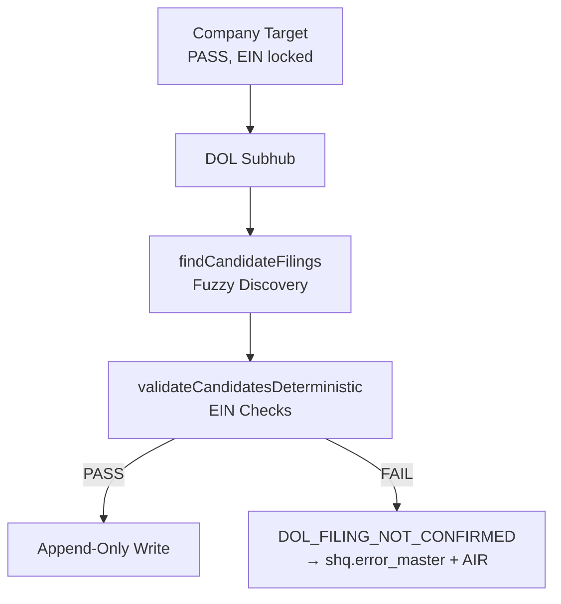

# DOL EIN Fuzzy Filing Discovery
## Architecture Overview

**Created**: 2025-01-02
**Status**: ✅ Complete
**Links**: [[DOL_EIN_RESOLUTION]] | [[COMPANY_TARGET_IDENTITY]] | [[5500_PROJECTION_LAYER]]

---

## Summary

This document describes the fuzzy filing discovery feature added to the DOL Subhub. The feature enables locating Form 5500 filings using approximate string matching while maintaining strict deterministic validation.

---

## Boundary Rule

> **DOL fuzzy matching is allowed ONLY to locate candidate Form 5500 filings.**
> It must NEVER:
> - ❌ Attach an EIN
> - ❌ Resolve company identity
> - ❌ Decide truth
> - ❌ Write data

---

## Execution Flow

---

## Files Delivered

| File | Purpose |
|------|---------|
| `ctb/sys/dol-ein/findCandidateFilings.js` | Fuzzy discovery + deterministic validation |
| `ctb/sys/dol-ein/ein_validator.js` | Updated with `DOL_FILING_NOT_CONFIRMED` |
| `ctb/sys/company-target/identity_validator.js` | Upstream EIN resolution |
| `ctb/data/infra/migrations/011_5500_projection_views.sql` | 5500 projection views |
| `ctb/data/infra/migrations/012_company_target_ein_error_routing.sql` | Error routing indexes |
| `doctrine/ple/DOL_EIN_RESOLUTION.md` | Updated doctrine |
| `doctrine/ple/COMPANY_TARGET_IDENTITY.md` | New doctrine |
| `doctrine/ple/5500_PROJECTION_LAYER.md` | New doctrine |

---

## Error Codes

| Code | Trigger | Layer |
|------|---------|-------|
| `EIN_NOT_RESOLVED` | Fuzzy EIN match failed | Company Target |
| `DOL_FILING_NOT_CONFIRMED` | Deterministic validation rejected all | DOL |
| `IDENTITY_GATE_FAILED` | Missing required fields | Both |

---

## Related Documents

- [[PRD-DOL-EIN-FUZZY-FILING-DISCOVERY]]
- [[ADR-DOL-FUZZY-BOUNDARY]]
- [[hub_tasks]]

---

## Tags

#dol #ein #fuzzy #5500 #architecture
