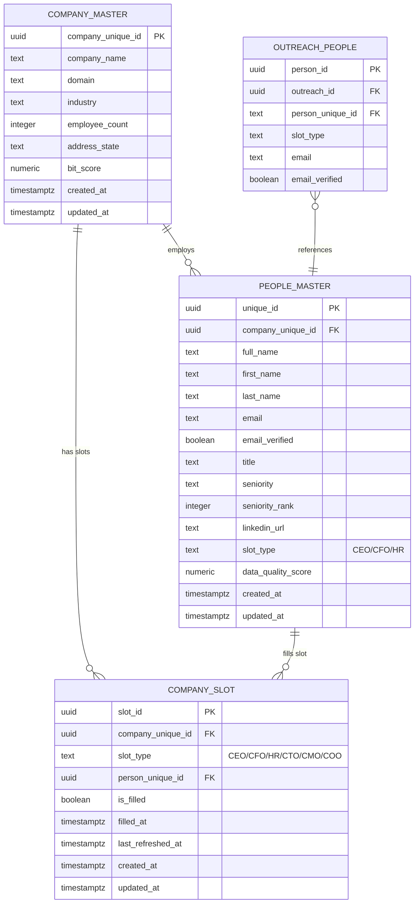
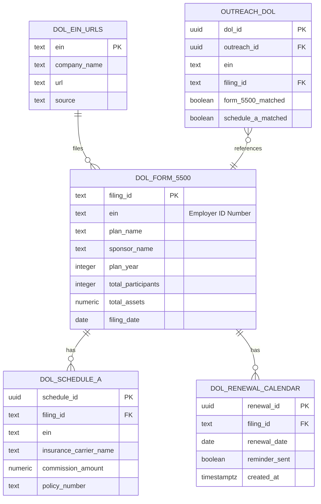
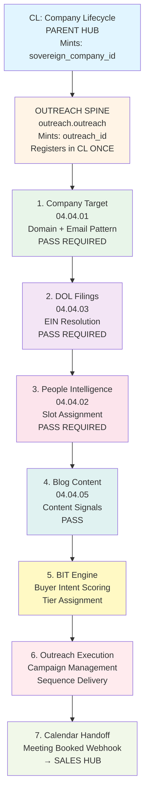
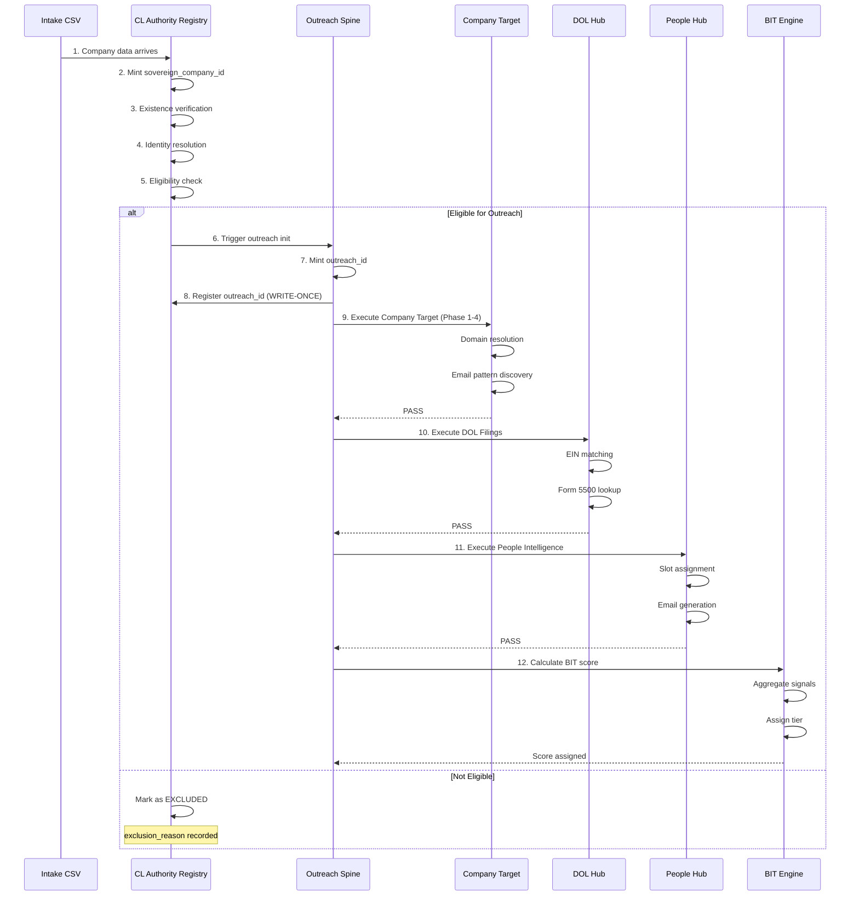
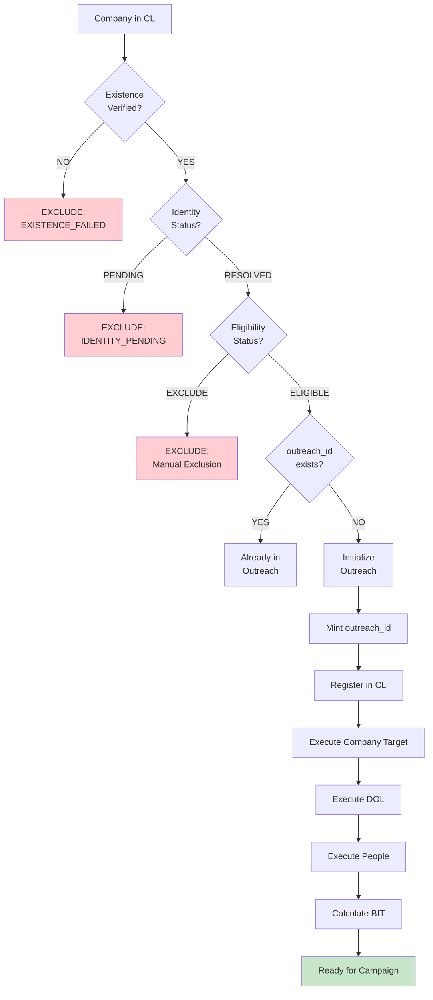

# Database ERD Diagrams - Barton Outreach Core

This document contains Entity Relationship Diagrams (ERDs) in Mermaid format for the Barton Outreach Core database.

---

## Table of Contents

1. [Core Architecture: CL → Outreach](#core-architecture-cl--outreach)
2. [Outreach Operational Spine](#outreach-operational-spine)
3. [People Intelligence Schema](#people-intelligence-schema)
4. [DOL Filings Schema](#dol-filings-schema)
5. [Complete System Overview](#complete-system-overview)

---

## Core Architecture: CL → Outreach

This diagram shows the parent-child relationship between CL Authority Registry and Outreach Operational Spine.

```mermaid
erDiagram
    CL_COMPANY_IDENTITY ||--o{ CL_COMPANY_DOMAINS : "has"
    CL_COMPANY_IDENTITY ||--o{ CL_COMPANY_NAMES : "has"
    CL_COMPANY_IDENTITY ||--o{ CL_IDENTITY_CONFIDENCE : "has"
    CL_COMPANY_IDENTITY ||--o| OUTREACH_OUTREACH : "registers (WRITE-ONCE)"

    CL_COMPANY_IDENTITY {
        uuid company_unique_id PK "Minted by CL"
        uuid sovereign_company_id "Sovereign ID"
        text company_name
        text company_domain
        text normalized_domain
        text linkedin_company_url
        text source_system
        uuid outreach_id "WRITE-ONCE pointer"
        uuid sales_process_id "WRITE-ONCE pointer"
        uuid client_id "WRITE-ONCE pointer"
        timestamptz outreach_attached_at
        timestamptz sales_opened_at
        timestamptz client_promoted_at
        boolean existence_verified
        text identity_status
        integer identity_pass
        text eligibility_status
        text exclusion_reason
        text entity_role
        text final_outcome
        timestamptz created_at
    }

    CL_COMPANY_DOMAINS {
        uuid domain_id PK
        uuid company_unique_id FK
        text domain
        text domain_type
        boolean is_primary
        timestamptz created_at
    }

    CL_COMPANY_NAMES {
        uuid name_id PK
        uuid company_unique_id FK
        text name_variant
        text name_type
        boolean is_canonical
        timestamptz created_at
    }

    CL_IDENTITY_CONFIDENCE {
        uuid company_unique_id PK_FK
        numeric domain_confidence
        numeric name_confidence
        numeric linkedin_confidence
        numeric overall_confidence
        timestamptz updated_at
    }

    OUTREACH_OUTREACH {
        uuid outreach_id PK "Minted by Outreach"
        uuid sovereign_id FK "Points to CL"
        varchar domain
        timestamptz created_at
        timestamptz updated_at
    }
```

---

## Outreach Operational Spine

This diagram shows the outreach.outreach table and all its child sub-hubs.

```mermaid
erDiagram
    OUTREACH_OUTREACH ||--o| OUTREACH_COMPANY_TARGET : "has"
    OUTREACH_OUTREACH ||--o| OUTREACH_DOL : "has"
    OUTREACH_OUTREACH ||--o{ OUTREACH_PEOPLE : "has"
    OUTREACH_OUTREACH ||--o| OUTREACH_BLOG : "has"
    OUTREACH_OUTREACH ||--o| OUTREACH_BIT_SCORES : "has"
    OUTREACH_OUTREACH ||--o{ OUTREACH_BIT_SIGNALS : "has"
    OUTREACH_OUTREACH ||--o{ OUTREACH_MANUAL_OVERRIDES : "has"
    OUTREACH_OUTREACH ||--o{ OUTREACH_CAMPAIGNS : "has"
    OUTREACH_OUTREACH ||--o{ OUTREACH_SEQUENCES : "has"
    OUTREACH_OUTREACH ||--o{ OUTREACH_SEND_LOG : "has"

    OUTREACH_OUTREACH {
        uuid outreach_id PK
        uuid sovereign_id FK
        varchar domain
        timestamptz created_at
        timestamptz updated_at
    }

    OUTREACH_COMPANY_TARGET {
        uuid target_id PK
        uuid outreach_id FK
        text company_unique_id "Legacy reference"
        varchar email_method "Email pattern"
        varchar method_type "Pattern type"
        numeric confidence_score "0.00-1.00"
        boolean is_catchall
        text outreach_status
        varchar execution_status
        integer bit_score_snapshot
        integer sequence_count
        text active_sequence_id
        timestamptz first_targeted_at
        timestamptz last_targeted_at
        timestamptz imo_completed_at
        text source
        timestamptz created_at
        timestamptz updated_at
    }

    OUTREACH_DOL {
        uuid dol_id PK
        uuid outreach_id FK
        text ein "Employer ID Number"
        text filing_id "FK to dol.form_5500"
        boolean form_5500_matched
        boolean schedule_a_matched
        numeric match_confidence
        text match_method
        timestamptz created_at
        timestamptz updated_at
    }

    OUTREACH_PEOPLE {
        uuid person_id PK
        uuid outreach_id FK
        text person_unique_id "FK to people.people_master"
        text slot_type "CEO/CFO/HR"
        text email "Generated email"
        boolean email_verified
        text linkedin_url
        text title
        text seniority
        timestamptz created_at
        timestamptz updated_at
    }

    OUTREACH_BLOG {
        uuid blog_id PK
        uuid outreach_id FK
        text blog_url
        text rss_feed_url
        timestamptz last_checked_at
        integer signal_count
        timestamptz created_at
        timestamptz updated_at
    }

    OUTREACH_BIT_SCORES {
        uuid outreach_id PK_FK
        integer bit_score "0-100"
        text bit_tier "PLATINUM/GOLD/SILVER/BRONZE"
        timestamptz score_updated_at
        timestamptz tier_assigned_at
        integer signal_count
        timestamptz created_at
        timestamptz updated_at
    }

    OUTREACH_BIT_SIGNALS {
        uuid signal_id PK
        uuid outreach_id FK
        text signal_type "DOL_FILING/BLOG_PRESSURE/MOVEMENT"
        integer signal_impact
        timestamptz signal_timestamp
        text signal_hash "24h dedup"
        timestamptz created_at
    }

    OUTREACH_MANUAL_OVERRIDES {
        uuid override_id PK
        uuid outreach_id FK
        text override_type "EXCLUDE/INCLUDE/TIER_FORCE"
        text reason
        text applied_by
        timestamptz applied_at
        timestamptz expires_at
        boolean is_active
    }

    OUTREACH_CAMPAIGNS {
        uuid campaign_id PK
        uuid outreach_id FK
        text campaign_name
        text campaign_type
        text campaign_status
        timestamptz started_at
        timestamptz completed_at
        timestamptz created_at
        timestamptz updated_at
    }

    OUTREACH_SEQUENCES {
        uuid sequence_id PK
        uuid outreach_id FK
        uuid campaign_id FK
        integer sequence_step
        text sequence_type
        text sequence_status
        timestamptz scheduled_at
        timestamptz sent_at
        timestamptz created_at
        timestamptz updated_at
    }

    OUTREACH_SEND_LOG {
        uuid send_id PK
        uuid outreach_id FK
        uuid sequence_id FK
        text recipient_email
        text send_status
        text send_provider
        timestamptz scheduled_at
        timestamptz sent_at
        timestamptz opened_at
        timestamptz clicked_at
        timestamptz replied_at
        timestamptz created_at
    }
```

---

## People Intelligence Schema

This diagram shows the people schema tables and their relationships.



---

## DOL Filings Schema

This diagram shows the DOL schema tables and their relationships.



---

## Complete System Overview

This diagram shows the high-level relationships between all major schemas.

```mermaid
erDiagram
    CL_COMPANY_IDENTITY ||--o| OUTREACH_OUTREACH : "registers outreach_id"
    CL_COMPANY_IDENTITY ||--o| COMPANY_MASTER : "references"

    OUTREACH_OUTREACH ||--o| OUTREACH_COMPANY_TARGET : "has target"
    OUTREACH_OUTREACH ||--o| OUTREACH_DOL : "has DOL data"
    OUTREACH_OUTREACH ||--o{ OUTREACH_PEOPLE : "has people"
    OUTREACH_OUTREACH ||--o| OUTREACH_BLOG : "has blog"
    OUTREACH_OUTREACH ||--o| OUTREACH_BIT_SCORES : "has BIT score"
    OUTREACH_OUTREACH ||--o{ OUTREACH_BIT_SIGNALS : "has signals"

    COMPANY_MASTER ||--o{ PEOPLE_MASTER : "employs"
    COMPANY_MASTER ||--o{ COMPANY_SLOT : "has slots"
    PEOPLE_MASTER ||--o{ COMPANY_SLOT : "fills slot"

    DOL_FORM_5500 ||--o{ DOL_SCHEDULE_A : "has schedule"
    DOL_FORM_5500 ||--o{ DOL_RENEWAL_CALENDAR : "has renewal"

    OUTREACH_DOL }o--|| DOL_FORM_5500 : "references filing"
    OUTREACH_PEOPLE }o--|| PEOPLE_MASTER : "references person"

    CL_COMPANY_IDENTITY {
        uuid company_unique_id PK
        uuid sovereign_company_id
        text company_name
        text company_domain
        uuid outreach_id "WRITE-ONCE"
        uuid sales_process_id "WRITE-ONCE"
        uuid client_id "WRITE-ONCE"
        text identity_status
        text eligibility_status
    }

    OUTREACH_OUTREACH {
        uuid outreach_id PK
        uuid sovereign_id FK
        varchar domain
    }

    OUTREACH_COMPANY_TARGET {
        uuid target_id PK
        uuid outreach_id FK
        varchar email_method
        text outreach_status
    }

    OUTREACH_DOL {
        uuid dol_id PK
        uuid outreach_id FK
        text ein
        text filing_id FK
    }

    OUTREACH_PEOPLE {
        uuid person_id PK
        uuid outreach_id FK
        text person_unique_id FK
        text slot_type
    }

    OUTREACH_BLOG {
        uuid blog_id PK
        uuid outreach_id FK
        text blog_url
    }

    OUTREACH_BIT_SCORES {
        uuid outreach_id PK_FK
        integer bit_score
        text bit_tier
    }

    OUTREACH_BIT_SIGNALS {
        uuid signal_id PK
        uuid outreach_id FK
        text signal_type
    }

    COMPANY_MASTER {
        uuid company_unique_id PK
        text company_name
        text domain
    }

    PEOPLE_MASTER {
        uuid unique_id PK
        uuid company_unique_id FK
        text full_name
        text email
    }

    COMPANY_SLOT {
        uuid slot_id PK
        uuid company_unique_id FK
        uuid person_unique_id FK
        text slot_type
    }

    DOL_FORM_5500 {
        text filing_id PK
        text ein
        text sponsor_name
    }

    DOL_SCHEDULE_A {
        uuid schedule_id PK
        text filing_id FK
    }

    DOL_RENEWAL_CALENDAR {
        uuid renewal_id PK
        text filing_id FK
    }
```

---

## Waterfall Architecture Diagram

This diagram shows the hub execution order and dependencies.



---

## Data Flow: Intake → CL → Outreach



---

## Marketing Eligibility Flow



---

## Notes on Diagrams

### Rendering

These diagrams use Mermaid syntax and can be rendered in:
- GitHub (native support)
- GitLab (native support)
- VS Code (with Mermaid extension)
- Confluence (with Mermaid macro)
- Online: https://mermaid.live/

### Color Coding

In the Waterfall Architecture diagram:
- **Blue** (CL): Parent hub
- **Orange** (Outreach): Operational spine
- **Green** (Company Target): First sub-hub
- **Purple** (DOL): Second sub-hub
- **Pink** (People): Third sub-hub
- **Teal** (Blog): Fourth sub-hub
- **Yellow** (BIT): Scoring engine
- **Red** (Execution): Campaign execution
- **Light Green** (Handoff): Sales handoff

### Key Relationships

1. **CL → Outreach**: One-to-one (WRITE-ONCE)
2. **Outreach → Sub-Hubs**: One-to-one or one-to-many
3. **Company Master → People**: One-to-many
4. **People Master → Slots**: One-to-many
5. **DOL Form 5500 → Schedule A**: One-to-many

### Foreign Key Notation

- `||--o|` : One-to-one
- `||--o{` : One-to-many
- `}o--||` : Many-to-one

---

**Document Generated**: 2026-01-28
**Status**: v1.0 OPERATIONAL BASELINE
