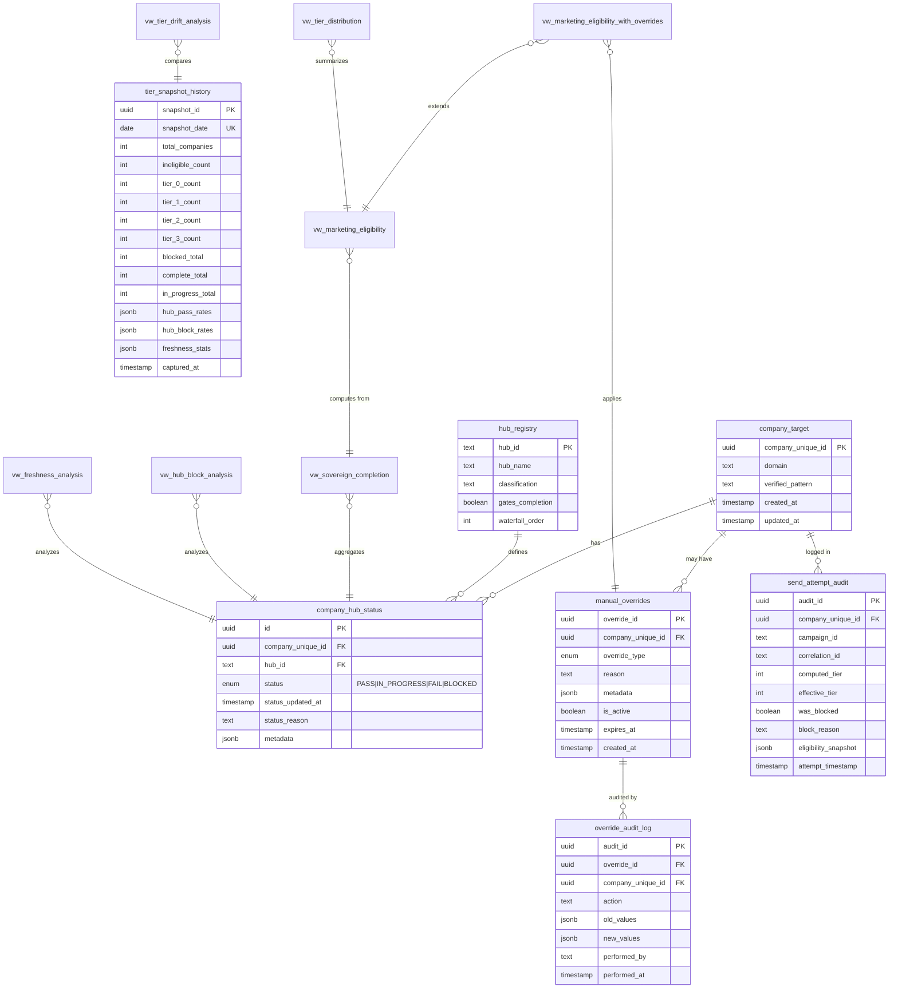

# Tier Telemetry ERD

## Document Info

| Field | Value |
|-------|-------|
| **Version** | 1.0.0 |
| **Date** | 2026-01-20 |
| **Author** | IMO-Creator |
| **Status** | FROZEN (v1.0 Baseline) |

---

## Entity Relationship Diagram



---

## Tables

### tier_snapshot_history

Daily snapshots of tier distribution.

| Column | Type | Description |
|--------|------|-------------|
| snapshot_id | UUID | Primary key |
| snapshot_date | DATE | Date of snapshot (unique) |
| total_companies | INT | Total company count |
| ineligible_count | INT | Tier -1 count |
| tier_0_count | INT | Tier 0 count |
| tier_1_count | INT | Tier 1 count |
| tier_2_count | INT | Tier 2 count |
| tier_3_count | INT | Tier 3 count |
| blocked_total | INT | Total blocked |
| complete_total | INT | Total complete |
| in_progress_total | INT | Total in progress |
| hub_pass_rates | JSONB | Pass rate by hub |
| hub_block_rates | JSONB | Block rate by hub |
| freshness_stats | JSONB | Stale % by hub |
| captured_at | TIMESTAMPTZ | Capture timestamp |

### send_attempt_audit

Append-only audit of send attempts.

| Column | Type | Description |
|--------|------|-------------|
| audit_id | UUID | Primary key |
| company_unique_id | UUID | Target company |
| campaign_id | TEXT | Campaign identifier |
| correlation_id | TEXT | Request correlation |
| computed_tier | INT | Tier before overrides |
| effective_tier | INT | Tier after overrides |
| was_blocked | BOOLEAN | Whether blocked |
| block_reason | TEXT | Why blocked |
| eligibility_snapshot | JSONB | Full state at time |
| attempt_timestamp | TIMESTAMPTZ | When attempted |

---

## Views

### Telemetry Views (READ-ONLY)

| View | Purpose | Source |
|------|---------|--------|
| vw_tier_distribution | Tier counts and percentages | vw_marketing_eligibility |
| vw_hub_block_analysis | Block rate by hub | company_hub_status |
| vw_freshness_analysis | Stale % by hub | company_hub_status |
| vw_signal_gap_analysis | Signal coverage gaps | company_hub_status |
| vw_tier_telemetry_summary | Dashboard summary | Multiple |
| vw_tier_drift_analysis | Day-over-day changes | tier_snapshot_history |

### Authoritative Views (FROZEN)

| View | Purpose | Authority |
|------|---------|-----------|
| vw_sovereign_completion | Hub status aggregation | ADR-006 |
| vw_marketing_eligibility | Tier computation | ADR-006 |
| vw_marketing_eligibility_with_overrides | **THE** source of truth | ADR-007 |

---

## Functions

### fn_capture_tier_snapshot()

Captures a daily snapshot to tier_snapshot_history.

```sql
SELECT outreach.fn_capture_tier_snapshot();
```

Returns: UUID of created snapshot

---

## Relationships

```
company_target
    │
    ├──► company_hub_status (1:N per hub)
    │         │
    │         └──► hub_registry (N:1 lookup)
    │
    ├──► manual_overrides (1:N overrides)
    │         │
    │         └──► override_audit_log (1:N audit)
    │
    └──► send_attempt_audit (1:N attempts)

Views:
    company_hub_status ──► vw_sovereign_completion
                               │
                               ▼
                        vw_marketing_eligibility
                               │
                               ▼
                    vw_marketing_eligibility_with_overrides ◄── manual_overrides
                               │
                               ▼
                        vw_tier_distribution
                               │
                               ▼
                    tier_snapshot_history ──► vw_tier_drift_analysis
```

---

## References

- `infra/migrations/2026-01-20-tier-telemetry-views.sql`
- `infra/migrations/2026-01-19-kill-switches.sql`
- ADR-009: Tier Telemetry Analytics
- ADR-006: Sovereign Completion Infrastructure
