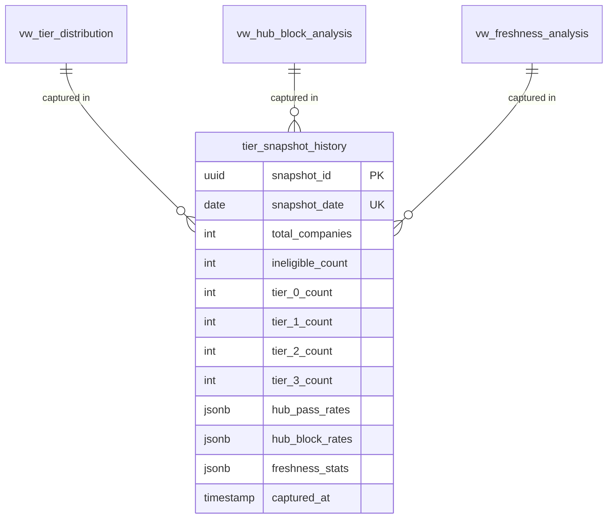

# Tier Telemetry

#analytics #telemetry #read-only #v1

## Overview

Tier Telemetry provides visibility into tier distribution and drift without touching tier computation logic.

> [!note] READ-ONLY
> All telemetry views are READ-ONLY. They do not modify tier computation, kill switches, or hub status.

---

## Views

### vw_tier_distribution

Shows count and percentage at each tier.

```sql
SELECT * FROM outreach.vw_tier_distribution;
```

| Column | Description |
|--------|-------------|
| marketing_tier | Tier number (-1 to 3) |
| tier_name | Human-readable name |
| company_count | Count of companies |
| percentage | Percentage of total |

---

### vw_hub_block_analysis

Shows blocking rates by hub in waterfall order.

```sql
SELECT * FROM outreach.vw_hub_block_analysis ORDER BY waterfall_order;
```

| Column | Description |
|--------|-------------|
| hub_name | Hub name |
| pass_count | Companies with PASS |
| in_progress_count | Companies IN_PROGRESS |
| fail_count | Companies with FAIL |
| blocked_by_upstream_count | Blocked by upstream |
| blocked_percentage | % blocked |

---

### vw_freshness_analysis

Shows freshness decay by hub.

```sql
SELECT * FROM outreach.vw_freshness_analysis;
```

| Column | Description |
|--------|-------------|
| hub_name | Hub name |
| freshness_days | Freshness window |
| fresh_count | Within window |
| stale_count | Outside window |
| stale_percentage | % stale |

---

### vw_signal_gap_analysis

Shows signal coverage gaps by hub.

```sql
SELECT * FROM outreach.vw_signal_gap_analysis;
```

| Column | Description |
|--------|-------------|
| hub_name | Hub name |
| companies_with_signals | Has signals |
| companies_lacking_signals | Missing signals |
| lacking_signals_percentage | % lacking |

---

### vw_tier_telemetry_summary

Aggregated dashboard summary.

---

### vw_tier_drift_analysis

Day-over-day tier changes with deltas.

---

## Daily Snapshots

### Capture Snapshot

```python
from analytics import capture_tier_snapshot

stats = capture_tier_snapshot()
print(f"Snapshot ID: {stats['snapshot_id']}")
```

### Get Drift Analysis

```python
from analytics import get_tier_drift

drift = get_tier_drift(days=7)
if drift['has_drift']:
    print("WARNING: Significant drift detected!")
```

---

## Markdown Report

Generate a formatted markdown report:

```bash
python ops/metrics/tier_report.py --output report.md --days 7
```

---

## ERD



---

## Related Documents

- [[V1 Operational Baseline]]
- [[Sovereign Completion Overview]]
- ADR-009: Tier Telemetry Analytics

---

## References

- `infra/migrations/2026-01-20-tier-telemetry-views.sql`
- `ops/metrics/tier_snapshot.py`
- `ops/metrics/tier_report.py`
