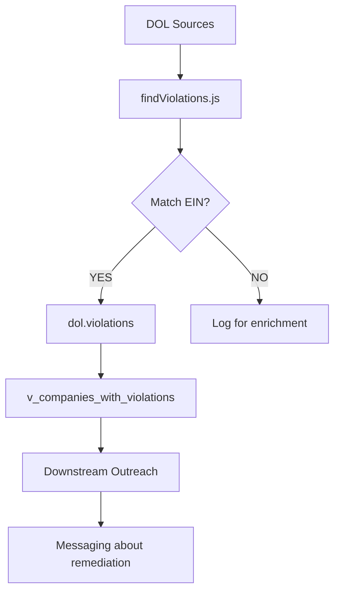

# DOL Violation Discovery
## Architecture Note | Barton Outreach Core

**Date**: 2025-01-02
**Tags**: #architecture #dol #violations #osha #ebsa #outreach
**Status**: #implemented

---

## Overview

The DOL Subhub includes violation discovery capability to pull violator data from DOL sources and match to existing EIN linkages. This enables downstream outreach about compliance remediation services.

**Related**: [[DOL-EIN-Fuzzy-Discovery]]

---

## Purpose

1. **Pull violator data** from DOL agencies (OSHA, EBSA, WHD, OFCCP)
2. **Match to EIN** using existing `dol.ein_linkage`
3. **Store facts** for downstream outreach systems

This is **FACT STORAGE ONLY** — no scoring, no outreach triggers in DOL.

---

## Architecture



---

## Source Agencies

| Agency | Description | Data Source |
|--------|-------------|-------------|
| **OSHA** | Workplace safety | enforcedata.dol.gov |
| **EBSA** | Benefits plans | dol.gov/agencies/ebsa |
| **WHD** | Wage and hour | dol.gov/agencies/whd |
| **OFCCP** | Federal contractors | dol.gov/agencies/ofccp |
| **MSHA** | Mine safety | msha.gov |

---

## Data Model

### `dol.violations` (Append-Only)

| Column | Type | Description |
|--------|------|-------------|
| `violation_id` | VARCHAR | Barton ID |
| `ein` | VARCHAR | EIN (must exist in linkage) |
| `company_unique_id` | VARCHAR | Linked company |
| `source_agency` | VARCHAR | OSHA, EBSA, etc. |
| `violation_type` | VARCHAR | Type of violation |
| `severity` | VARCHAR | WILLFUL, SERIOUS, etc. |
| `penalty_initial` | DECIMAL | Initial penalty |
| `penalty_current` | DECIMAL | Current penalty |
| `status` | VARCHAR | OPEN, CONTESTED, etc. |
| `violation_description` | TEXT | Description |
| `source_url` | TEXT | Citation URL |
| `hash_fingerprint` | VARCHAR | Deduplication hash |

---

## Views for Outreach

| View | Purpose |
|------|---------|
| `dol.v_companies_with_violations` | Open/contested violations |
| `dol.v_violation_summary` | Aggregate stats by company |
| `dol.v_recent_violations` | Last 90 days |

---

## Boundary Enforcement

### DOL Subhub DOES
- ✅ Discover violations from DOL sources
- ✅ Match violations to existing EIN
- ✅ Store violations as facts
- ✅ Provide views for downstream

### DOL Subhub DOES NOT
- ❌ Score violations
- ❌ Trigger outreach
- ❌ Create EIN linkages from violations

---

## Implementation Files

| File | Purpose |
|------|---------|
| `ctb/sys/dol-ein/findViolations.js` | Discovery + matching |
| `doctrine/schemas/dol_violations-schema.sql` | Table + views |

---

## AIR Events

| Event | Trigger |
|-------|---------|
| `VIOLATION_DISCOVERED` | New violation found |
| `VIOLATION_EIN_MATCHED` | Matched to EIN |
| `VIOLATION_EIN_NOT_FOUND` | No linkage exists |
| `VIOLATION_DUPLICATE` | Duplicate skipped |
| `VIOLATION_BATCH_COMPLETE` | Batch done |

---

## Related Documents

- [[DOL_EIN_RESOLUTION|DOL EIN Resolution Doctrine]]
- [[PRD-DOL-EIN-FUZZY-FILING-DISCOVERY|PRD]]
- [[ADR-DOL-FUZZY-BOUNDARY|ADR]]

---

## Outreach Use Case

```
1. DOL publishes OSHA violation for Company X
2. DOL Subhub discovers violation
3. Match to EIN → Company X exists in ein_linkage
4. Store violation facts in dol.violations
5. Outreach team queries v_companies_with_violations
6. Outreach sends message about remediation services
```

---

**End of DOL Violation Discovery Architecture Note**
