# 🏗️ Architecture Diagrams

Visual representation of Barton Outreach system architecture.

---

## System Overview

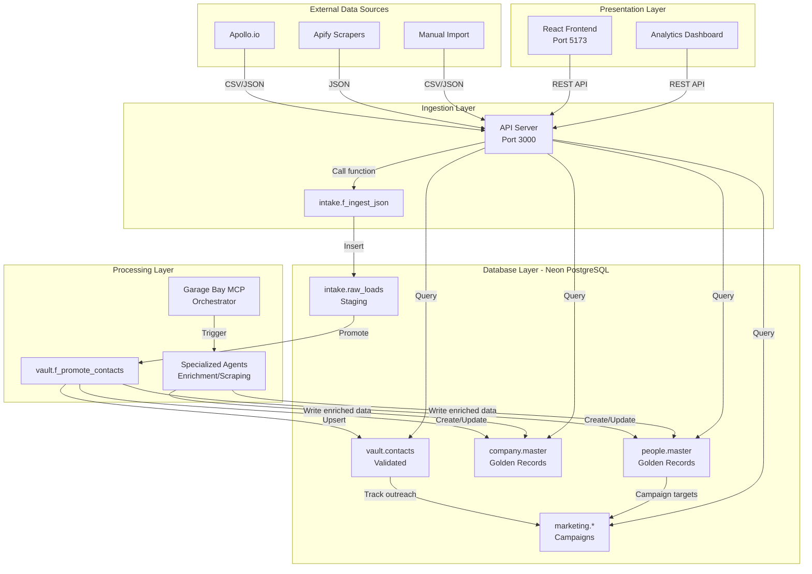

---

## Data Ingestion Flow

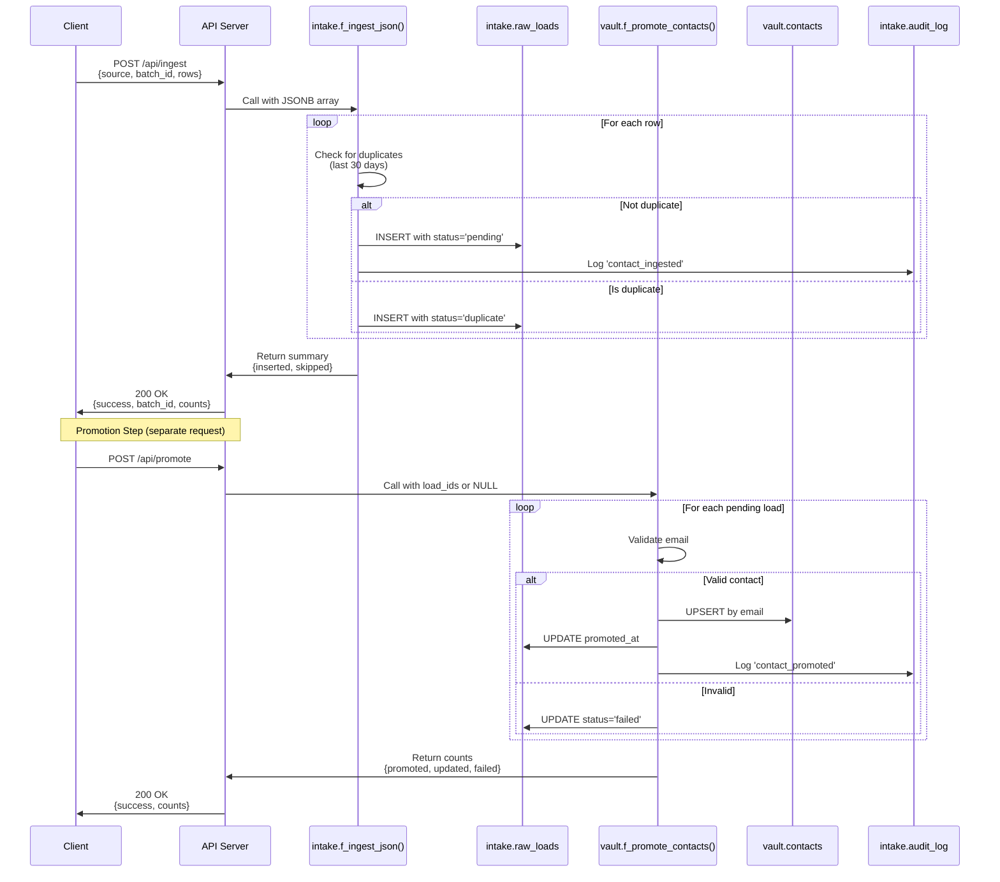

---

## Campaign Outreach Flow

```mermaid
flowchart LR
    subgraph "1. Campaign Setup"
        Create[Create Campaign]
        Define[Define Target Criteria]
        Template[Create Message Template]
    end

    subgraph "2. Target Selection"
        Query[Query vault.contacts]
        Filter[Apply Filters<br/>score >= 80<br/>status = active]
        Enrich[Enrich from people.master]
    end

    subgraph "3. Execution"
        Send[Send Messages]
        Track[Track in outreach_history]
        Update[Update sent_count]
    end

    subgraph "4. Response Tracking"
        Monitor[Monitor Responses]
        LogOpen[Log opened_at]
        LogReply[Log replied_at]
        UpdateMetrics[Update response_count]
    end

    subgraph "5. Attribution"
        Convert[Conversion Event]
        Attr[marketing.attribution]
        Report[feedback_reports]
    end

    Create --> Define --> Template
    Template --> Query
    Query --> Filter --> Enrich
    Enrich --> Send
    Send --> Track --> Update
    Update --> Monitor
    Monitor --> LogOpen --> LogReply --> UpdateMetrics
    UpdateMetrics --> Convert --> Attr --> Report
```

---

## Deployment Architecture

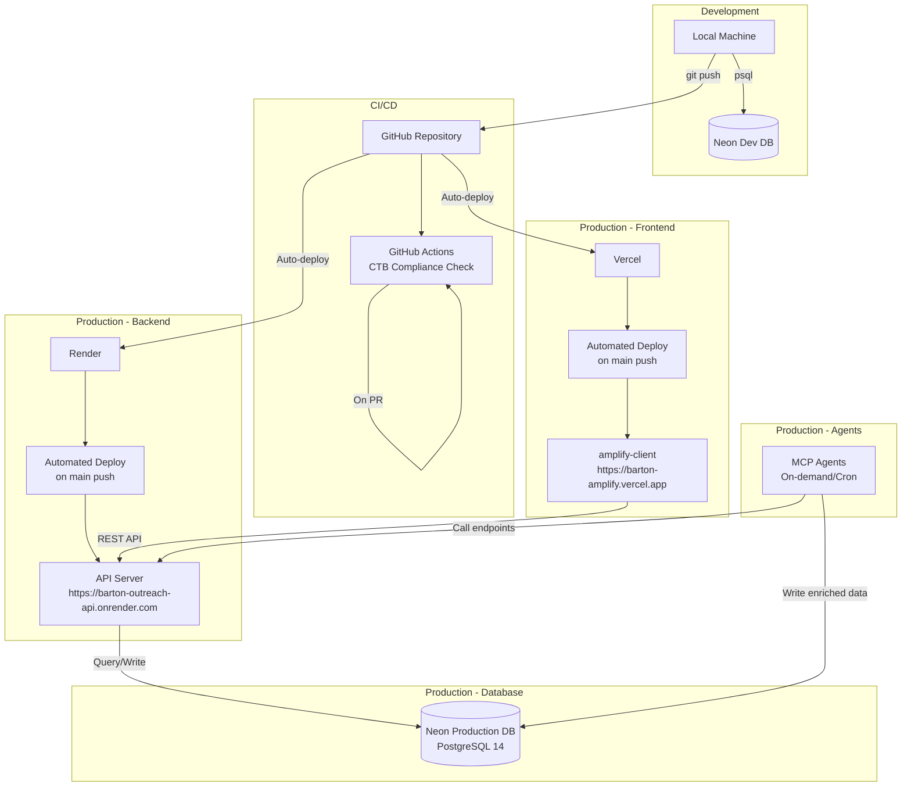

---

## Database Schema Layers

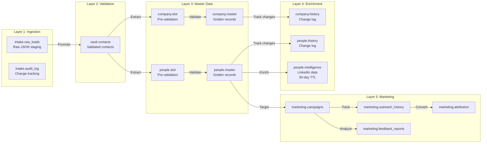

---

## CTB Branch Dependencies

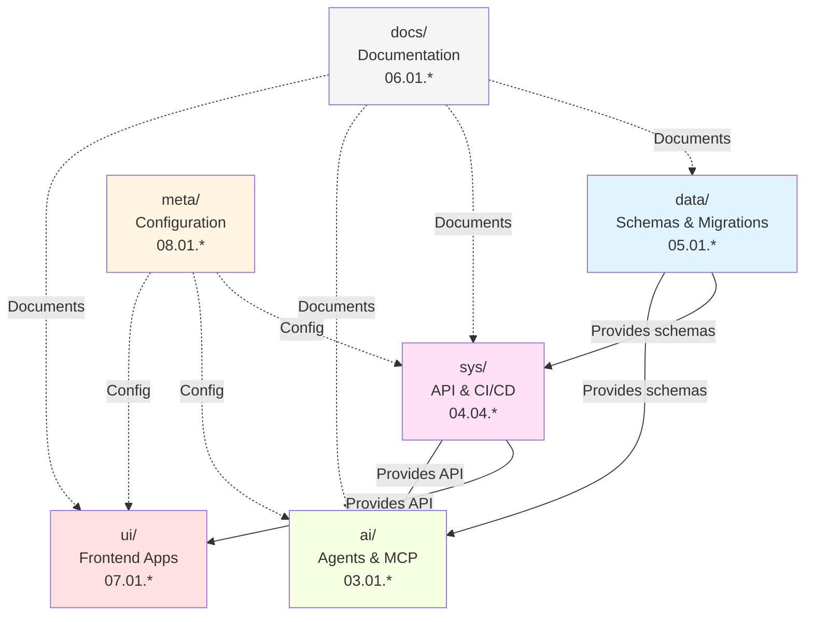

---

## MCP Orchestration Flow

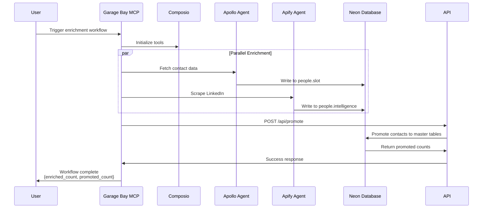

---

## User Interaction Flow

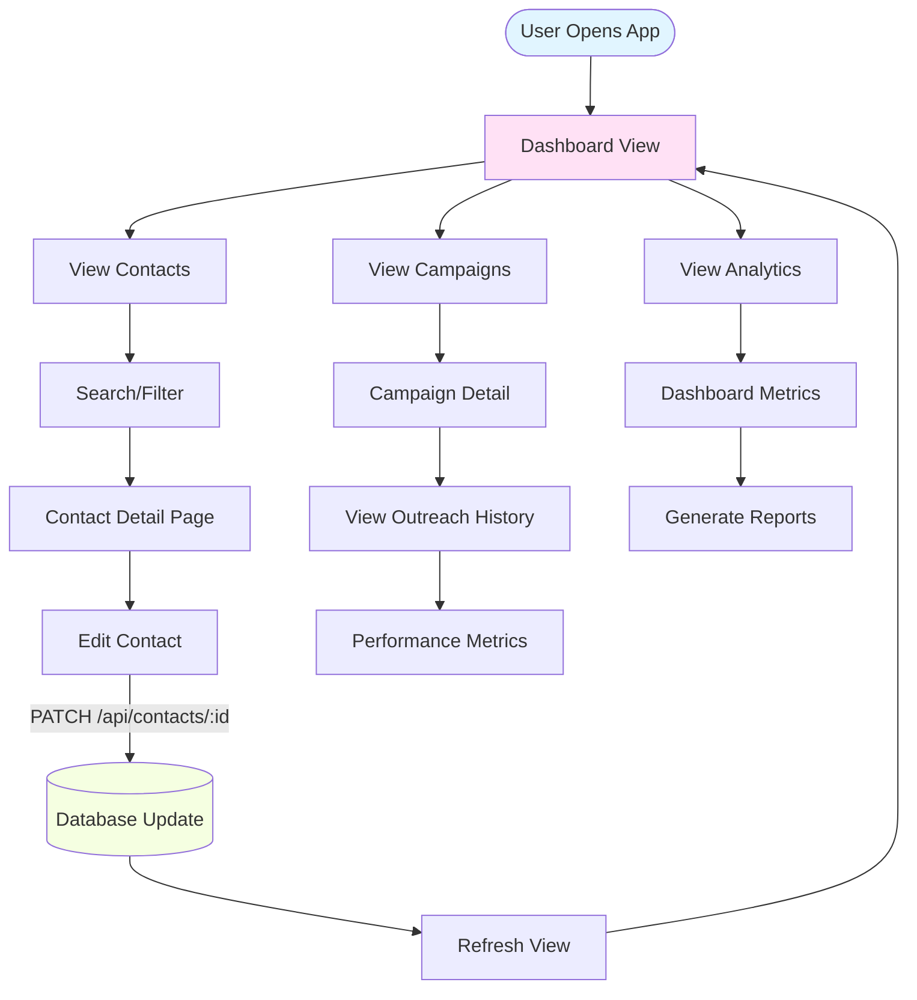

---

## Security & Access Control

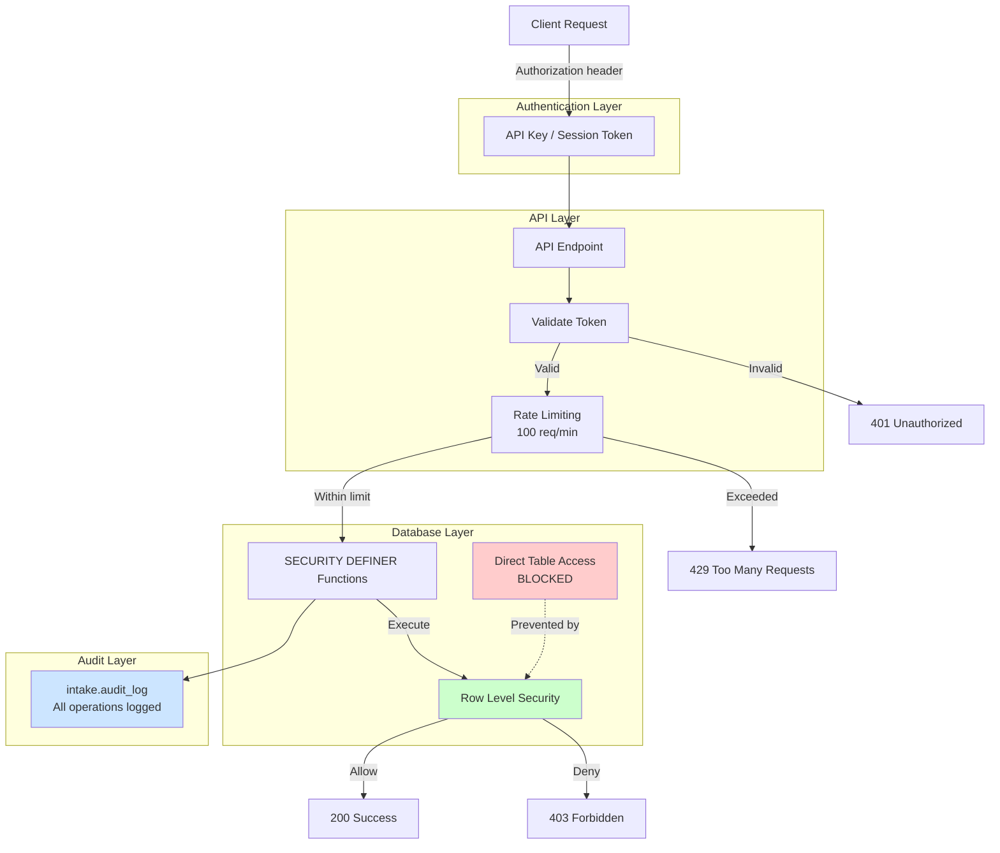

---

## Backup & Recovery

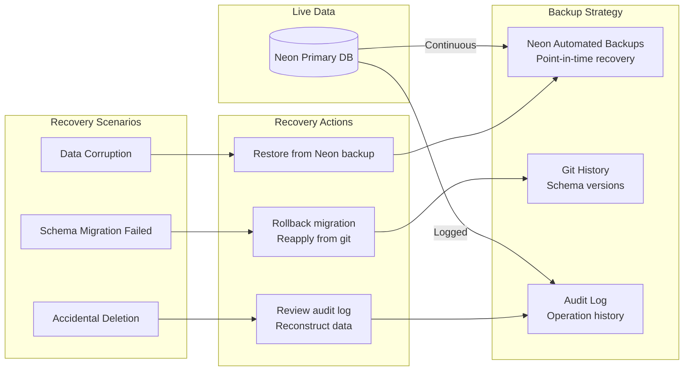

---

## Performance Optimization

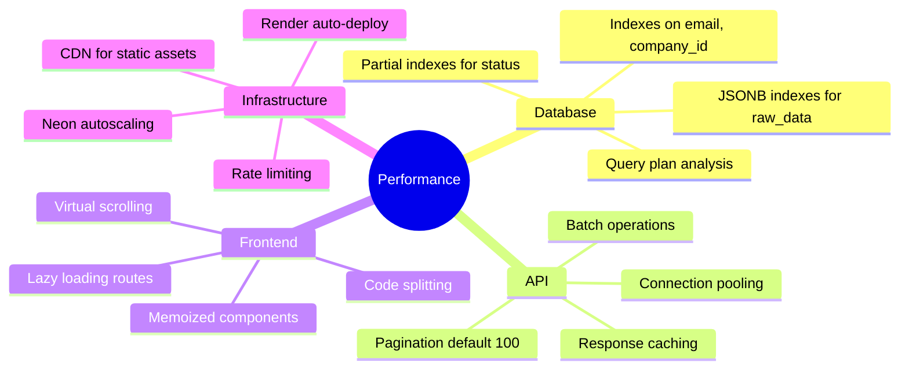

---

## Monitoring & Observability

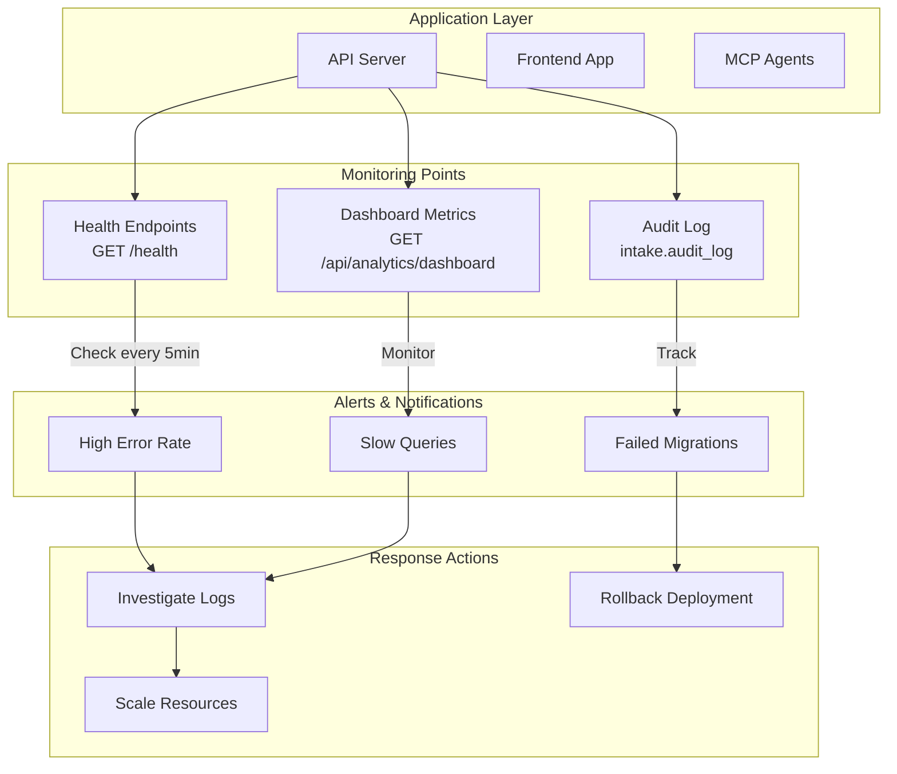

---

**Diagram Format**: Mermaid (renders in GitHub, VS Code, many documentation systems)

**Last Updated**: 2025-10-23

**Related Docs**:
- System overview: `ctb/sys/README.md`
- Database details: `ctb/data/SCHEMA.md`
- API reference: `ctb/sys/api/API.md`
- Dependencies: `DEPENDENCIES.md`
