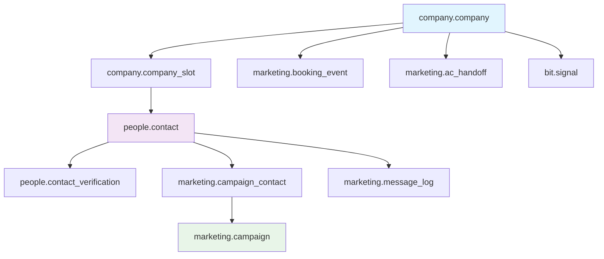

<!--
─────────────────────────────────────────────
📁 CTB Classification Metadata
─────────────────────────────────────────────
CTB Branch: docs
Barton ID: 06.01.00
Unique ID: CTB-3DBE9487
Blueprint Hash:
Last Updated: 2025-10-23
Enforcement: ORBT
─────────────────────────────────────────────
-->

# Database Schema Documentation
## Barton Outreach Core - Complete Data Architecture

This document provides a comprehensive overview of the database schema for the Barton Outreach Core system, including all table relationships, data flows, and integration points for the complete pipeline: **Ingestor → Neon → Apify → PLE → Bit**.

---

## 🏗️ **Schema Overview**

The database is organized into **5 schemas** with clear separation of concerns:

```
📦 Database Schemas
├── 🏢 company      - Company management & renewal tracking
├── 👥 people       - Contact management & verification  
├── 📧 marketing    - Campaign management & messaging
├── 🎯 bit          - Buyer Intent Tool signals
└── 🔧 ple          - Pipeline Logic Engine (future)
```

---

## 📊 **Core Entity Relationships**



---

## 🏢 **Company Schema**

### **company.company** (Core Company Table)
**Purpose**: Central repository for all company information with renewal tracking

| Column | Type | Description |
|--------|------|-------------|
| `company_id` | BIGSERIAL | Primary key |
| `company_name` | TEXT | Company name (required) |
| `ein` | TEXT | Employer Identification Number |
| `website_url` | TEXT | Company website |
| `linkedin_url` | TEXT | LinkedIn company page |
| `news_url` | TEXT | News/blog URL |
| `address_line1` | TEXT | Street address |
| `address_line2` | TEXT | Additional address info |
| `city` | TEXT | City |
| `state_region` | TEXT | State/region |
| `postal_code` | TEXT | ZIP/postal code |
| `country` | TEXT | Country |
| `renewal_month` | INT | Month of renewal (1-12) |
| `renewal_notice_window_days` | INT | Days before renewal to start campaign (default: 120) |
| `created_at` | TIMESTAMPTZ | Record creation time |
| `updated_at` | TIMESTAMPTZ | Last update time |
| `last_site_checked_at` | TIMESTAMPTZ | Last website scrape |
| `last_linkedin_checked_at` | TIMESTAMPTZ | Last LinkedIn scrape |
| `last_news_checked_at` | TIMESTAMPTZ | Last news scrape |

**Relationships**:
- One-to-many with `company.company_slot`
- One-to-many with `bit.signal`
- One-to-many with `marketing.booking_event`

---

### **company.company_slot** (Role Management)
**Purpose**: Exactly 3 slots per company (CEO, CFO, HR) for contact assignment

| Column | Type | Description |
|--------|------|-------------|
| `company_slot_id` | BIGSERIAL | Primary key |
| `company_id` | BIGINT | FK to company.company |
| `role_code` | company.role_code_t | ENUM: 'CEO', 'CFO', 'HR' |
| `contact_id` | BIGINT | FK to people.contact (nullable) |
| `created_at` | TIMESTAMPTZ | Record creation time |
| `updated_at` | TIMESTAMPTZ | Last update time |

**Constraints**:
- `UNIQUE (company_id, role_code)` - One slot per role per company

**Relationships**:
- Many-to-one with `company.company`
- Many-to-one with `people.contact`

---

## 👥 **People Schema**

### **people.contact** (Contact Information)
**Purpose**: Central contact repository with profile tracking

| Column | Type | Description |
|--------|------|-------------|
| `contact_id` | BIGSERIAL | Primary key |
| `full_name` | TEXT | Contact full name (required) |
| `title` | TEXT | Job title |
| `email` | TEXT | Email address |
| `phone` | TEXT | Phone number |
| `profile_source_url` | TEXT | LinkedIn/profile URL |
| `last_profile_checked_at` | TIMESTAMPTZ | Last profile scrape |
| `created_at` | TIMESTAMPTZ | Record creation time |
| `updated_at` | TIMESTAMPTZ | Last update time |

**Relationships**:
- One-to-one with `people.contact_verification`
- One-to-many with `company.company_slot`
- One-to-many with `marketing.campaign_contact`

---

### **people.contact_verification** (Email Verification)
**Purpose**: 1:1 relationship tracking email verification status

| Column | Type | Description |
|--------|------|-------------|
| `contact_id` | BIGINT | FK to people.contact (PK) |
| `email_status` | people.email_status_t | ENUM: 'green', 'yellow', 'red', 'gray' |
| `email_checked_at` | TIMESTAMPTZ | Last verification time |
| `email_confidence` | NUMERIC(5,2) | Confidence score (0-100) |
| `email_source_url` | TEXT | Verification source |

**Status Meanings**:
- 🟢 **green**: Verified, deliverable
- 🟡 **yellow**: Risky, proceed with caution  
- 🔴 **red**: Invalid, do not send
- ⚪ **gray**: Unknown, needs verification

---

## 📧 **Marketing Schema**

### **marketing.campaign** (Campaign Management)
**Purpose**: Campaign definitions and tracking

| Column | Type | Description |
|--------|------|-------------|
| `campaign_id` | BIGSERIAL | Primary key |
| `name` | TEXT | Campaign name (required) |
| `created_at` | TIMESTAMPTZ | Record creation time |
| `updated_at` | TIMESTAMPTZ | Last update time |

---

### **marketing.campaign_contact** (Campaign Participants)
**Purpose**: Many-to-many relationship between campaigns and contacts

| Column | Type | Description |
|--------|------|-------------|
| `campaign_contact_id` | BIGSERIAL | Primary key |
| `campaign_id` | BIGINT | FK to marketing.campaign |
| `contact_id` | BIGINT | FK to people.contact |
| `created_at` | TIMESTAMPTZ | Record creation time |

---

### **marketing.message_log** (Message Tracking)
**Purpose**: Track all outbound and inbound messages

| Column | Type | Description |
|--------|------|-------------|
| `message_log_id` | BIGSERIAL | Primary key |
| `campaign_id` | BIGINT | FK to marketing.campaign (nullable) |
| `contact_id` | BIGINT | FK to people.contact (nullable) |
| `direction` | TEXT | 'outbound' or 'inbound' |
| `channel` | TEXT | 'email', 'linkedin', 'phone', 'other' |
| `subject` | TEXT | Message subject |
| `body` | TEXT | Message content |
| `sent_at` | TIMESTAMPTZ | Send/receive time |

---

### **marketing.booking_event** (Meeting Bookings)
**Purpose**: Track scheduled meetings and demos

| Column | Type | Description |
|--------|------|-------------|
| `booking_event_id` | BIGSERIAL | Primary key |
| `contact_id` | BIGINT | FK to people.contact |
| `company_id` | BIGINT | FK to company.company |
| `event_time` | TIMESTAMPTZ | Scheduled meeting time |
| `source` | TEXT | Booking source/platform |
| `created_at` | TIMESTAMPTZ | Record creation time |

---

### **marketing.ac_handoff** (Account Handoffs)
**Purpose**: Track handoffs to Account Coordinators

| Column | Type | Description |
|--------|------|-------------|
| `handoff_id` | BIGSERIAL | Primary key |
| `company_id` | BIGINT | FK to company.company |
| `contact_id` | BIGINT | FK to people.contact |
| `notes` | TEXT | Handoff notes |
| `created_at` | TIMESTAMPTZ | Record creation time |

---

## 🎯 **BIT Schema (Buyer Intent Tool)**

### **bit.signal** (Intent Signals)
**Purpose**: Track buying intent signals for companies

| Column | Type | Description |
|--------|------|-------------|
| `signal_id` | BIGSERIAL | Primary key |
| `company_id` | BIGINT | FK to company.company |
| `reason` | TEXT | Signal type (e.g., 'renewal_window_open_120d') |
| `payload` | JSONB | Additional signal data |
| `created_at` | TIMESTAMPTZ | Signal detection time |
| `processed_at` | TIMESTAMPTZ | Signal processing time |

**Common Signal Types**:
- `renewal_window_open_120d` - Company in renewal window
- `executive_movement` - Leadership changes detected
- `funding_raised` - New funding announced
- `job_postings` - Relevant job postings found

---

## 🔍 **Views & Queues**

### **Zero-Wandering Scraper Queues**
These views automatically show what needs scraping/verification:

#### **company.next_company_urls_30d**
Companies with URLs due for scraping (30-day TTL):
```sql
SELECT company_id, url_type, url, last_checked_at
FROM company.next_company_urls_30d;
```

#### **people.next_profile_urls_30d**  
Contacts with profiles due for scraping:
```sql
SELECT contact_id, url, last_checked_at
FROM people.next_profile_urls_30d;
```

#### **people.due_email_recheck_30d**
Contacts with emails due for re-verification:
```sql
SELECT contact_id, full_name, email, email_status, last_checked_at
FROM people.due_email_recheck_30d;
```

### **Business Logic Views**

#### **company.vw_company_slots**
Complete company + slot + contact + verification view:
```sql
SELECT company_id, company_name, role_code, full_name, email, email_status
FROM company.vw_company_slots;
```

#### **company.vw_next_renewal**
Automatic renewal date calculation:
```sql
SELECT company_id, company_name, next_renewal_date, campaign_window_start
FROM company.vw_next_renewal;
```

#### **company.vw_due_renewals_ready**
Companies ready for renewal campaigns (in window + has green contacts):
```sql
SELECT company_id, company_name, next_renewal_date, has_green_contact
FROM company.vw_due_renewals_ready;
```

---

## 🔄 **Data Flow Patterns**

### **Scraper Pattern (Zero-Wandering)**
1. Query queue view (e.g., `company.next_company_urls_30d`)
2. Scrape the URLs returned
3. Update timestamp to mark as processed
4. Item automatically disappears from queue

```sql
-- Get URLs to scrape
SELECT * FROM company.next_company_urls_30d LIMIT 10;

-- After scraping website
UPDATE company.company 
SET last_site_checked_at = now() 
WHERE company_id = $1;

-- After LinkedIn scrape  
UPDATE company.company 
SET last_linkedin_checked_at = now() 
WHERE company_id = $1;
```

### **Email Verification Pattern**
```sql
-- Get emails to verify
SELECT * FROM people.due_email_recheck_30d LIMIT 50;

-- Update verification status
UPDATE people.contact_verification 
SET email_checked_at = now(), 
    email_status = $status,
    email_confidence = $confidence
WHERE contact_id = $1;
```

### **Campaign Ready Pattern**
```sql
-- Find companies ready for renewal campaigns
SELECT * FROM company.vw_due_renewals_ready;

-- Create campaign for ready companies
INSERT INTO marketing.campaign (name) 
VALUES ('Q1 2024 Renewals');

-- Add contacts to campaign
INSERT INTO marketing.campaign_contact (campaign_id, contact_id)
SELECT $campaign_id, contact_id
FROM company.vw_company_slots 
WHERE company_id = $company_id 
  AND email_status = 'green';
```

---

## 🔧 **Pipeline Integration Points**

### **1. Ingestor → Neon**
Data flows from the ingest-companies-people app to Neon via:
- API endpoint: `POST /insert` 
- Pipeline endpoint: `POST /pipeline/execute`
- Target tables: `intake.raw_loads` → promoted to `company.company`

### **2. Neon → Apify** 
URLs are scraped using queues:
- `company.next_company_urls_30d` for company websites/LinkedIn
- `people.next_profile_urls_30d` for individual profiles
- Timestamps updated after scraping

### **3. Apify → PLE**
PLE (Pipeline Logic Engine) orchestrates:
- Data validation and cleaning
- Promotion from `intake` to `company`/`people` schemas
- Signal generation in `bit.signal`

### **4. PLE → Bit**
Component sharing:
- Generate React components from contact data
- Publish to Bit.dev collections
- Version management and reuse

---

## 📋 **Usage Examples**

### **Add a New Company**
```sql
-- 1. Insert company
INSERT INTO company.company (company_name, website_url, renewal_month)
VALUES ('Acme Corp', 'https://acme.com', 6);

-- 2. Create role slots
INSERT INTO company.company_slot (company_id, role_code)
VALUES 
  (currval('company.company_company_id_seq'), 'CEO'),
  (currval('company.company_company_id_seq'), 'CFO'),
  (currval('company.company_company_id_seq'), 'HR');
```

### **Add a Contact and Assign to Slot**
```sql
-- 1. Create contact
INSERT INTO people.contact (full_name, email, title)
VALUES ('John Smith', 'john@acme.com', 'Chief Executive Officer');

-- 2. Create verification record
INSERT INTO people.contact_verification (contact_id, email_status)
VALUES (currval('people.contact_contact_id_seq'), 'gray');

-- 3. Assign to CEO slot
UPDATE company.company_slot 
SET contact_id = currval('people.contact_contact_id_seq')
WHERE company_id = 1 AND role_code = 'CEO';
```

### **Check What Needs Scraping**
```sql
-- Companies needing URL scraping
SELECT * FROM company.next_company_urls_30d;

-- Profiles needing scraping
SELECT * FROM people.next_profile_urls_30d;

-- Emails needing verification
SELECT * FROM people.due_email_recheck_30d;
```

### **Find Campaign-Ready Companies**
```sql
-- Companies in renewal window with verified contacts
SELECT c.company_name, nr.next_renewal_date, nr.campaign_window_start
FROM company.vw_due_renewals_ready nr
JOIN company.company c ON c.company_id = nr.company_id
WHERE nr.has_green_contact = true;
```

---

## 🎯 **Key Design Principles**

### **1. Slot-Based Contact Management**
- Each company has exactly 3 slots: CEO, CFO, HR
- Contacts can be assigned/reassigned to slots
- Supports role-based campaign targeting

### **2. Zero-Wandering Queues**
- Views automatically show work that needs doing
- Items disappear when timestamps are updated
- No manual queue management required

### **3. Separation of Concerns**
- `company` schema: Company data and structure
- `people` schema: Individual contact data  
- `marketing` schema: Campaign and message data
- `bit` schema: Buying intent signals

### **4. Audit Trail**
- All tables have `created_at` and `updated_at`
- Contact verification tracks when/how verified
- Message log tracks all communications

### **5. Extensibility**
- JSONB fields for flexible data storage
- ENUM types for controlled vocabularies
- View-based abstractions for complex queries

---

## 🔍 **Troubleshooting & Maintenance**

### **Check Data Quality**
```sql
-- Companies without complete slots
SELECT c.company_name, COUNT(cs.role_code) as slot_count
FROM company.company c
LEFT JOIN company.company_slot cs ON cs.company_id = c.company_id
GROUP BY c.company_id, c.company_name
HAVING COUNT(cs.role_code) < 3;

-- Contacts without verification records
SELECT p.contact_id, p.full_name, p.email
FROM people.contact p
LEFT JOIN people.contact_verification v ON v.contact_id = p.contact_id
WHERE p.email IS NOT NULL AND v.contact_id IS NULL;
```

### **Performance Monitoring**
```sql
-- Queue sizes
SELECT 'company_urls' as queue, COUNT(*) FROM company.next_company_urls_30d
UNION ALL
SELECT 'profile_urls' as queue, COUNT(*) FROM people.next_profile_urls_30d  
UNION ALL
SELECT 'email_recheck' as queue, COUNT(*) FROM people.due_email_recheck_30d;
```

### **Data Migration Scripts**
Located in `/scripts/`:
- `setup-lean-outreach-schema.mjs` - Full schema setup
- `list-marketing-tables.mjs` - Table inventory
- `test-complete-pipeline.mjs` - End-to-end testing

---

This database schema provides a robust foundation for the complete cold outreach pipeline, with clear separation of concerns, automatic queue management, and comprehensive tracking capabilities.