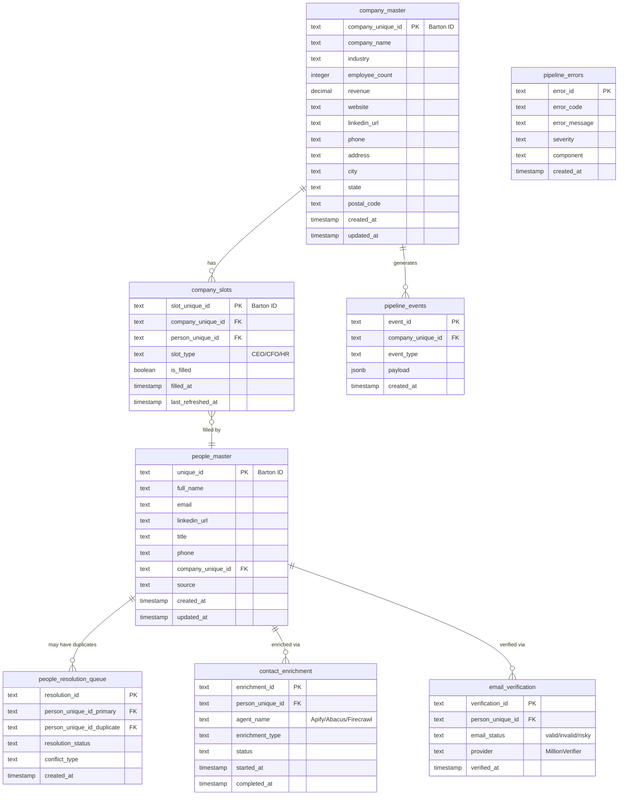
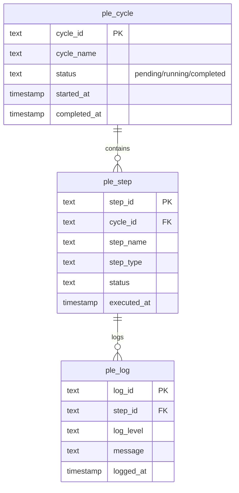
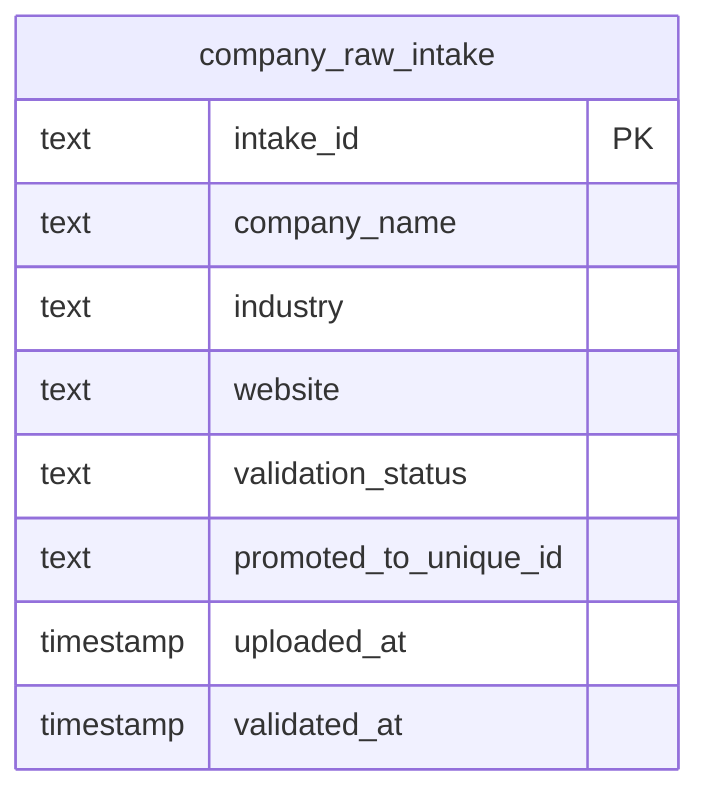

<!--
─────────────────────────────────────────────
📁 CTB Classification Metadata
─────────────────────────────────────────────
CTB Branch: docs
Barton ID: 06.01.00
Unique ID: CTB-10793FD3
Blueprint Hash:
Last Updated: 2025-11-07
Enforcement: ORBT
─────────────────────────────────────────────
-->

# Database Schema Diagram

**Database**: Marketing DB (Neon PostgreSQL)
**Last Exported**: 2025-11-07
**Total Schemas**: 11
**Total Tables**: 64

---

## Primary Production Schema (marketing)



---

## Buyer Intent Tracking Schema (bit)

```mermaid
erDiagram
    bit_signal ||--o{ bit_company_score : aggregates
    bit_signal ||--o{ bit_contact_score : aggregates

    bit_signal {
        text signal_id PK
        text company_unique_id FK
        text signal_type "website/linkedin/hiring"
        text signal_data jsonb
        integer signal_strength
        timestamp detected_at
    }

    bit_company_score {
        text score_id PK
        text company_unique_id FK
        integer total_score
        jsonb signal_breakdown
        timestamp calculated_at
    }

    bit_contact_score {
        text score_id PK
        text person_unique_id FK
        integer engagement_score
        jsonb activity_breakdown
        timestamp calculated_at
    }
```

---

## Product-Led Enrichment Schema (ple)



---

## Data Ingestion Schema (intake)



---

## Key Relationships & Data Flows

### 1. Company Ingestion Flow
```
intake.company_raw_intake (453 rows)
    ↓ [validation & promotion]
marketing.company_master (453 rows)
    ↓ [slot generation: 3 per company]
marketing.company_slots (1,359 rows)
```

### 2. Executive Position Tracking
```
marketing.company_slots (1,359 slots)
    ↓ [filled with executives]
marketing.people_master (170 people)
    ↓ [~12.5% fill rate]
Unfilled slots: ~1,189 (87.5%)
```

### 3. Enrichment Pipeline
```
marketing.people_master (170 contacts)
    ↓ [enrichment needed]
marketing.contact_enrichment (job tracking)
    ↓ [external APIs: Apify, Abacus, Firecrawl]
marketing.people_master (updated with enriched data)
```

### 4. Duplicate Resolution
```
marketing.people_master (170 contacts)
    ↓ [duplicate detection]
marketing.people_resolution_queue (1,206 duplicates)
    ↓ [manual/auto resolution]
marketing.people_master (de-duplicated)
```

### 5. Intent Signal Tracking
```
bit.bit_signal (detected signals)
    ↓ [aggregation by company]
bit.bit_company_score (company-level scores)
    ↓ [aggregation by contact]
bit.bit_contact_score (contact-level scores)
```

---

## Current Data Volumes

| Schema | Table | Rows | Status |
|--------|-------|------|--------|
| **marketing** | company_master | 453 | ✅ Active |
| **marketing** | company_slots | 1,359 | ✅ Active |
| **marketing** | people_master | 170 | ✅ Active |
| **marketing** | people_resolution_queue | 1,206 | ⚠️ Needs resolution |
| **marketing** | pipeline_events | 1,890 | ✅ Active logging |
| **marketing** | pipeline_errors | 0 | ✅ No errors |
| **marketing** | contact_enrichment | 0 | 🔄 Ready |
| **marketing** | email_verification | 0 | 🔄 Ready |
| **intake** | company_raw_intake | 453 | ✅ Active staging |
| **bit** | bit_signal | 0 | 🔄 Ready |
| **bit** | bit_company_score | 0 | 🔄 Ready |
| **bit** | bit_contact_score | 0 | 🔄 Ready |
| **ple** | ple_cycle | 0 | 🔄 Ready |
| **ple** | ple_step | 0 | 🔄 Ready |
| **ple** | ple_log | 0 | 🔄 Ready |

---

## Schema Design Notes

### Barton ID Format
All primary keys use Barton Doctrine format: `NN.NN.NN.NN.NNNNN.NNN`

**Examples**:
- Company Master: `04.04.02.04.30000.###`
- Company Slots: `04.04.02.04.10000.###`
- People Master: `04.04.02.04.20000.###`
- Error Log: `04.04.02.04.40000.###`

### Indexes
- **Total indexes across database**: 200+
- **Most indexed table**: people_master (10 indexes)
- All foreign keys have supporting indexes
- Timestamps indexed for time-based queries

### Foreign Keys
- Proper referential integrity enforced
- Cascade deletes where appropriate
- On-update cascade for ID changes

---

## Visualization Tools

### Generate Fresh Diagram
```bash
# Export latest schema
npm run schema:export

# View schema map
npm run schema:view
```

### View Complete Schema Details
```bash
# Read human-friendly reference
cat ctb/data/SCHEMA_REFERENCE.md

# View JSON schema map
cat ctb/docs/schema_map.json | jq .
```

---

## Related Documentation

- **Complete Schema Reference**: `ctb/data/SCHEMA_REFERENCE.md`
- **Schema Map JSON**: `ctb/docs/schema_map.json`
- **SQL Schema Files**: `ctb/data/infra/*.sql`
- **Migrations**: `ctb/data/infra/migrations/*.sql`
- **Export Script**: `ctb/ops/scripts/export-neon-schema.py`

---

**Last Schema Export**: 2025-11-07
**Database**: Marketing DB (Neon PostgreSQL)
**Schemas**: 11 | **Tables**: 64 | **Rows**: ~53,000+

*This diagram is auto-generated from live database. Run `npm run schema:export` to refresh.*
