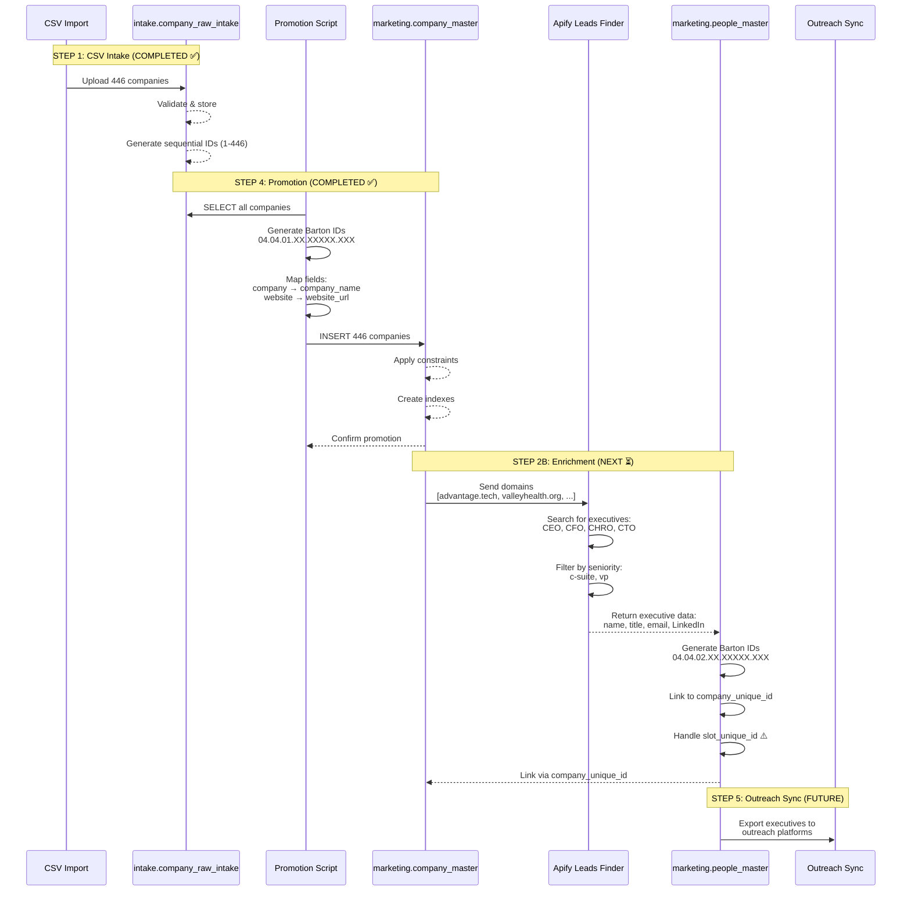

<!--
─────────────────────────────────────────────
📁 CTB Classification Metadata
─────────────────────────────────────────────
CTB Branch: docs/analysis
Barton ID: 06.01.01
Unique ID: CTB-1F80109A
Blueprint Hash:
Last Updated: 2025-10-23
Enforcement: ORBT
─────────────────────────────────────────────
-->

# Executive Enrichment - Complete Data Schema & Flow

**Date**: 2025-10-21
**Database**: Neon PostgreSQL (Marketing DB)
**Status**: Ready for Enrichment Trial

---

## 📊 Table of Contents

1. [Schema Overview](#schema-overview)
2. [Complete Table Schemas](#complete-table-schemas)
3. [Data Flow Diagram](#data-flow-diagram)
4. [Field Mapping & Transformations](#field-mapping--transformations)
5. [Data Capture Completeness](#data-capture-completeness)
6. [Executive Enrichment Process](#executive-enrichment-process)
7. [ChartDB Schema Export](#chartdb-schema-export)

---

## Schema Overview

### Tables Involved in Enrichment Process

```
intake.company_raw_intake (446 rows) ──┐
                                       │
                                       ├─► [STEP 4: PROMOTION]
                                       │
                                       ▼
marketing.company_master (446 rows) ───┐
                                       │
                                       ├─► [STEP 2B: ENRICHMENT]
                                       │
                                       ▼
                   ┌─── Apify: code_crafter~leads-finder
                   │    Input: company domains
                   │    Output: executives (CEO, CFO, CHRO, CTO)
                   │
                   ▼
marketing.people_master (0 rows → 1500+ expected)
                   │
                   └─► Links back to company_master via company_unique_id
```

### Table Relationships

```sql
-- Primary Relationship
marketing.people_master.company_unique_id
    → marketing.company_master.company_unique_id

-- Source Tracking
marketing.company_master.source_record_id
    → intake.company_raw_intake.id
```

---

## Complete Table Schemas

### 1. intake.company_raw_intake (SOURCE)

**Purpose**: Initial CSV import data - source of truth for company information
**Row Count**: 446 companies
**Status**: ✅ Populated

```sql
CREATE TABLE intake.company_raw_intake (
    -- Primary Key
    id SERIAL PRIMARY KEY,                          -- Sequential: 1-446

    -- Company Identification
    company TEXT,                                   -- Primary company name
    company_name_for_emails TEXT,                  -- Alternative name for email campaigns

    -- Online Presence
    website TEXT,                                   -- Company website (99% coverage)
    company_linkedin_url TEXT,                     -- LinkedIn company page (95% coverage)
    facebook_url TEXT,                             -- Facebook page
    twitter_url TEXT,                              -- Twitter/X profile

    -- Classification
    industry TEXT,                                  -- Industry classification (98% coverage)
    sic_codes TEXT,                                -- SIC codes for industry
    keywords TEXT[],                               -- Searchable keywords (if present)

    -- Size & Metrics
    num_employees INTEGER,                         -- Employee count: 51-2100 (100% coverage)
    founded_year INTEGER,                          -- Year founded: 1700-2025
    annual_revenue TEXT,                           -- Revenue (if available)

    -- Location
    company_address TEXT,                          -- Full address
    company_city TEXT,                             -- City
    company_state TEXT,                            -- State (100% West Virginia)
    company_zip TEXT,                              -- ZIP code
    company_country TEXT,                          -- Country (100% United States)

    -- Contact Information
    company_phone TEXT,                            -- Main phone (92% coverage)
    company_email TEXT,                            -- General email

    -- Metadata
    created_at TIMESTAMPTZ DEFAULT NOW(),          -- Import timestamp
    updated_at TIMESTAMPTZ DEFAULT NOW(),          -- Last update
    data_source TEXT,                              -- CSV filename/source
    import_batch_id TEXT                           -- Batch identifier
);

-- Indexes
CREATE INDEX idx_company_raw_intake_website ON intake.company_raw_intake(website);
CREATE INDEX idx_company_raw_intake_industry ON intake.company_raw_intake(industry);
CREATE INDEX idx_company_raw_intake_state ON intake.company_raw_intake(company_state);
```

**Sample Data**:
```json
{
  "id": 1,
  "company": "Concord University",
  "website": "http://www.concord.edu",
  "company_linkedin_url": "http://www.linkedin.com/school/concorduniversity",
  "industry": "higher education",
  "num_employees": 500,
  "company_city": "Athens",
  "company_state": "West Virginia",
  "company_country": "United States",
  "company_phone": "+1 800-344-6679"
}
```

**Data Quality**:
- ✅ Website: 442/446 (99%)
- ✅ LinkedIn: 424/446 (95%)
- ✅ Industry: 437/446 (98%)
- ✅ Employees: 446/446 (100%)
- ✅ State: 446/446 (100%)
- ✅ Phone: 410/446 (92%)

---

### 2. marketing.company_master (PROMOTED)

**Purpose**: Validated, promoted company records with Barton IDs
**Row Count**: 446 companies (promoted from intake)
**Status**: ✅ Populated

```sql
CREATE TABLE marketing.company_master (
    -- Primary Key: Barton ID
    company_unique_id TEXT PRIMARY KEY,            -- Format: 04.04.01.XX.XXXXX.XXX

    -- Core Company Data
    company_name TEXT NOT NULL,                    -- COALESCE(company, company_name_for_emails)
    website_url TEXT NOT NULL,                     -- COALESCE(website, default)
    industry TEXT,                                  -- Industry classification
    employee_count INTEGER,                        -- Number of employees

    -- Contact & Location
    company_phone TEXT,                            -- Main phone number
    address_street TEXT,                           -- Street address
    address_city TEXT,                             -- City
    address_state TEXT,                            -- State (West Virginia)
    address_zip TEXT,                              -- ZIP code
    address_country TEXT,                          -- Country (United States)

    -- Online Presence
    linkedin_url TEXT,                             -- LinkedIn company page
    facebook_url TEXT,                             -- Facebook page
    twitter_url TEXT,                              -- Twitter/X profile

    -- Additional Metadata
    sic_codes TEXT,                                -- SIC industry codes
    founded_year INTEGER,                          -- Year founded (1700-2025)
    keywords TEXT[],                               -- Searchable keywords
    description TEXT,                              -- Company description

    -- Source Tracking
    source_system TEXT NOT NULL,                   -- 'intake_promotion'
    source_record_id TEXT,                         -- Original intake.company_raw_intake.id

    -- Promotion Metadata
    promoted_from_intake_at TIMESTAMPTZ NOT NULL DEFAULT NOW(),
    promotion_audit_log_id INTEGER,                -- Reference to audit log

    -- Audit Timestamps
    created_at TIMESTAMPTZ DEFAULT NOW(),
    updated_at TIMESTAMPTZ DEFAULT NOW(),

    -- Constraints
    CONSTRAINT company_master_barton_id_format
        CHECK (company_unique_id ~ '^04\.04\.01\.[0-9]{2}\.[0-9]{5}\.[0-9]{3}$'),
    CONSTRAINT company_master_employee_count_positive
        CHECK (employee_count IS NULL OR employee_count >= 0),
    CONSTRAINT company_master_founded_year_reasonable
        CHECK (founded_year IS NULL OR (founded_year >= 1700 AND founded_year <= EXTRACT(YEAR FROM NOW())))
);

-- Indexes
CREATE INDEX idx_company_master_company_name ON marketing.company_master(company_name);
CREATE INDEX idx_company_master_industry ON marketing.company_master(industry);
CREATE INDEX idx_company_master_source_system ON marketing.company_master(source_system);
CREATE INDEX idx_company_master_promoted_at ON marketing.company_master(promoted_from_intake_at);

-- Trigger for auto-updating updated_at
CREATE TRIGGER trigger_company_master_updated_at
    BEFORE UPDATE ON marketing.company_master
    FOR EACH ROW
    EXECUTE FUNCTION trigger_updated_at();
```

**Barton ID Structure**:
```
04.04.01.84.48151.001
│  │  │  │  │      │
│  │  │  │  │      └─ Sequential: intake ID (001-446)
│  │  │  │  └──────── Random 5-digit: 48151
│  │  │  └─────────── Timestamp 2-digit: 84
│  │  └────────────── Table ID: 01 (company_master)
│  └───────────────── Schema version: 04
└──────────────────── Entity type: 04 (company)
```

**Sample Data**:
```json
{
  "company_unique_id": "04.04.01.84.48151.001",
  "company_name": "Concord University",
  "website_url": "http://www.concord.edu",
  "industry": "higher education",
  "employee_count": 500,
  "company_phone": "+1 800-344-6679",
  "address_city": "Athens",
  "address_state": "West Virginia",
  "address_country": "United States",
  "linkedin_url": "http://www.linkedin.com/school/concorduniversity",
  "source_system": "intake_promotion",
  "source_record_id": "1",
  "promoted_from_intake_at": "2025-10-21T19:51:23.668Z"
}
```

---

### 3. marketing.people_master (TARGET FOR ENRICHMENT)

**Purpose**: Executives and key personnel linked to companies
**Row Count**: 0 (ready for enrichment) → 1,500-2,500 expected
**Status**: ⏳ Empty, awaiting enrichment

```sql
CREATE TABLE marketing.people_master (
    -- Primary Key: Barton ID
    unique_id TEXT PRIMARY KEY,                    -- Format: 04.04.02.XX.XXXXX.XXX

    -- Company Relationships
    company_unique_id TEXT NOT NULL,               -- Links to company_master (FOREIGN KEY)
    company_slot_unique_id TEXT NOT NULL,          -- ⚠️ Slot ID (TBD - see blocker section)

    -- Core Person Data
    first_name TEXT NOT NULL,                      -- "John"
    last_name TEXT NOT NULL,                       -- "Smith"
    full_name TEXT GENERATED ALWAYS AS (           -- "John Smith" (auto-generated)
        TRIM(first_name || ' ' || last_name)
    ) STORED,

    -- Professional Data
    title TEXT,                                    -- "CEO", "CFO", "CHRO", "CTO"
    seniority TEXT,                                -- "c-suite", "vp", "director"
    department TEXT,                               -- "Executive", "Finance", "HR"

    -- Contact Information
    email TEXT,                                    -- "john.smith@company.com"
    work_phone_e164 TEXT,                          -- "+1-304-555-0100" (E.164 format)
    personal_phone_e164 TEXT,                      -- Personal phone (if available)

    -- Social Profiles
    linkedin_url TEXT,                             -- "linkedin.com/in/johnsmith"
    twitter_url TEXT,                              -- Twitter/X profile
    facebook_url TEXT,                             -- Facebook profile

    -- Additional Professional Data
    bio TEXT,                                      -- Executive biography
    skills TEXT[],                                 -- Skills array ["leadership", "finance"]
    education TEXT,                                -- Education background
    certifications TEXT[],                         -- Certifications ["CPA", "MBA"]

    -- Source Tracking
    source_system TEXT NOT NULL,                   -- "apify_leads_finder"
    source_record_id TEXT,                         -- Apify run ID

    -- Promotion Metadata
    promoted_from_intake_at TIMESTAMPTZ NOT NULL DEFAULT NOW(),
    promotion_audit_log_id INTEGER,

    -- Audit Timestamps
    created_at TIMESTAMPTZ DEFAULT NOW(),
    updated_at TIMESTAMPTZ DEFAULT NOW(),

    -- Constraints
    CONSTRAINT people_master_barton_id_format
        CHECK (unique_id ~ '^04\.04\.02\.[0-9]{2}\.[0-9]{5}\.[0-9]{3}$'),
    CONSTRAINT people_master_company_barton_id_format
        CHECK (company_unique_id ~ '^04\.04\.01\.[0-9]{2}\.[0-9]{5}\.[0-9]{3}$'),
    CONSTRAINT people_master_slot_barton_id_format
        CHECK (company_slot_unique_id ~ '^04\.04\.05\.[0-9]{2}\.[0-9]{5}\.[0-9]{3}$'),
    CONSTRAINT people_master_email_format
        CHECK (email IS NULL OR email ~* '^[A-Za-z0-9._%+-]+@[A-Za-z0-9.-]+\.[A-Za-z]{2,}$'),

    -- Foreign Key (if enabled)
    CONSTRAINT fk_people_master_company
        FOREIGN KEY (company_unique_id)
        REFERENCES marketing.company_master(company_unique_id)
);

-- Indexes
CREATE INDEX idx_people_master_company_id ON marketing.people_master(company_unique_id);
CREATE INDEX idx_people_master_slot_id ON marketing.people_master(company_slot_unique_id);
CREATE INDEX idx_people_master_full_name ON marketing.people_master(full_name);
CREATE INDEX idx_people_master_email ON marketing.people_master(email);
CREATE INDEX idx_people_master_title ON marketing.people_master(title);
CREATE INDEX idx_people_master_source_system ON marketing.people_master(source_system);
CREATE INDEX idx_people_master_promoted_at ON marketing.people_master(promoted_from_intake_at);

-- Trigger for auto-updating updated_at
CREATE TRIGGER trigger_people_master_updated_at
    BEFORE UPDATE ON marketing.people_master
    FOR EACH ROW
    EXECUTE FUNCTION trigger_updated_at();
```

**Barton ID Structure**:
```
04.04.02.XX.XXXXX.XXX
│  │  │  │  │      │
│  │  │  │  │      └─ Sequential: person number
│  │  │  │  └──────── Random 5-digit
│  │  │  └─────────── Timestamp 2-digit
│  │  └────────────── Table ID: 02 (people_master)
│  └───────────────── Schema version: 04
└──────────────────── Entity type: 04 (company/people)
```

**Expected Data After Enrichment**:
```json
{
  "unique_id": "04.04.02.85.12345.001",
  "company_unique_id": "04.04.01.84.48151.001",
  "company_slot_unique_id": "04.04.05.XX.XXXXX.XXX",
  "first_name": "Jane",
  "last_name": "Doe",
  "full_name": "Jane Doe",
  "title": "CEO",
  "seniority": "c-suite",
  "department": "Executive",
  "email": "jane.doe@concord.edu",
  "work_phone_e164": "+1-304-555-0100",
  "linkedin_url": "https://linkedin.com/in/janedoe",
  "source_system": "apify_leads_finder",
  "source_record_id": "apify_run_abc123xyz"
}
```

---

## Data Flow Diagram

### Step-by-Step Process



---

## Field Mapping & Transformations

### Phase 1: Intake → Company Master (COMPLETED ✅)

| Source (intake.company_raw_intake) | Target (marketing.company_master) | Transformation |
|-----------------------------------|-----------------------------------|----------------|
| `id` | `source_record_id` | `id::text` |
| `company` OR `company_name_for_emails` | `company_name` | `COALESCE(company, company_name_for_emails, 'Unknown Company')` |
| `website` | `website_url` | `COALESCE(website, 'https://example.com')` |
| `industry` | `industry` | Direct copy |
| `num_employees` | `employee_count` | Direct copy |
| `company_phone` | `company_phone` | Direct copy |
| `company_city` | `address_city` | Direct copy |
| `company_state` | `address_state` | Direct copy |
| `company_country` | `address_country` | Direct copy |
| `company_linkedin_url` | `linkedin_url` | Direct copy |
| `facebook_url` | `facebook_url` | Direct copy |
| `twitter_url` | `twitter_url` | Direct copy |
| `sic_codes` | `sic_codes` | Direct copy |
| `founded_year` | `founded_year` | Direct copy (1700-2025) |
| N/A | `company_unique_id` | **GENERATED**: `'04.04.01.' || LPAD(..., 2, '0') || '.' || LPAD(..., 5, '0') || '.' || LPAD(id % 1000, 3, '0')` |
| N/A | `source_system` | **STATIC**: `'intake_promotion'` |
| N/A | `promoted_from_intake_at` | **GENERATED**: `NOW()` |
| N/A | `created_at` | **GENERATED**: `NOW()` |
| N/A | `updated_at` | **GENERATED**: `NOW()` |

### Phase 2: Apify → People Master (NEXT ⏳)

| Source (Apify Leads Finder) | Target (marketing.people_master) | Transformation |
|-----------------------------|----------------------------------|----------------|
| `firstName` | `first_name` | Direct copy |
| `lastName` | `last_name` | Direct copy |
| `name` | N/A | Ignored (auto-generated from first_name + last_name) |
| `title` | `title` | Direct copy (CEO, CFO, CHRO, CTO) |
| `seniority` | `seniority` | Direct copy (c-suite, vp) |
| `department` | `department` | Inferred from title |
| `email` | `email` | Direct copy |
| `phone` (if available) | `work_phone_e164` | Format to E.164 standard |
| `linkedin_url` | `linkedin_url` | Direct copy |
| `company_domain` | N/A | **LOOKUP** → match to `company_master.website_url` → get `company_unique_id` |
| N/A | `company_unique_id` | **LOOKUP**: Match domain to company_master |
| N/A | `company_slot_unique_id` | **TBD**: Generate or assign slot ⚠️ |
| N/A | `unique_id` | **GENERATED**: `'04.04.02.' || LPAD(..., 2, '0') || '.' || LPAD(..., 5, '0') || '.' || LPAD(sequence, 3, '0')` |
| N/A | `source_system` | **STATIC**: `'apify_leads_finder'` |
| Apify run ID | `source_record_id` | Apify execution run ID |
| N/A | `promoted_from_intake_at` | **GENERATED**: `NOW()` |
| N/A | `created_at` | **GENERATED**: `NOW()` |
| N/A | `updated_at` | **GENERATED**: `NOW()` |

---

## Data Capture Completeness

### What We're Capturing ✅

#### From Intake (Already Captured)
- ✅ **Company Identity**: name, website, LinkedIn
- ✅ **Classification**: industry, SIC codes
- ✅ **Size Metrics**: employee count, founded year
- ✅ **Location**: full address (city, state, zip, country)
- ✅ **Contact Info**: phone, email
- ✅ **Social Profiles**: LinkedIn, Facebook, Twitter
- ✅ **Source Tracking**: import batch, timestamps

#### From Enrichment (Will Capture)
- ✅ **Executive Identity**: first name, last name
- ✅ **Professional Data**: title, seniority, department
- ✅ **Contact Methods**: work email, phone (E.164)
- ✅ **Social Presence**: LinkedIn profile URL
- ✅ **Career Info**: bio, skills, education, certifications
- ✅ **Relationship**: linked to company via Barton ID

### What We're NOT Capturing (Gaps)

#### Missing from Current Schema
- ❌ **Company Financial**: revenue, funding, valuation
- ❌ **Company Technologies**: tech stack, tools used
- ❌ **Executive Photos**: headshot URLs
- ❌ **Executive Start Date**: when they joined company
- ❌ **Executive Previous Companies**: work history
- ❌ **Outreach Status**: contacted, responded, converted
- ❌ **Email Verification**: email validity, deliverability score
- ❌ **Phone Verification**: phone validity, type (mobile/landline)

#### Fields Available But Not Used
- ⚠️ **keywords** (TEXT[]): Available in both tables but not populated
- ⚠️ **description** (TEXT): Available in company_master but not populated
- ⚠️ **bio** (TEXT): Available in people_master but depends on Apify data
- ⚠️ **skills** (TEXT[]): Available in people_master but depends on Apify data
- ⚠️ **education** (TEXT): Available in people_master but depends on Apify data
- ⚠️ **certifications** (TEXT[]): Available in people_master but depends on Apify data

---

## Executive Enrichment Process

### Detailed Workflow

```
┌─────────────────────────────────────────────────────────────┐
│ STEP 1: Select Companies for Enrichment                     │
├─────────────────────────────────────────────────────────────┤
│ SELECT company_unique_id, company_name, website_url         │
│ FROM marketing.company_master                               │
│ WHERE website_url IS NOT NULL                               │
│   AND website_url != 'https://example.com'                  │
│ LIMIT 3;  -- Trial: 3 companies                            │
└─────────────────────────────────────────────────────────────┘
                            ↓
┌─────────────────────────────────────────────────────────────┐
│ STEP 2: Extract Domains                                     │
├─────────────────────────────────────────────────────────────┤
│ Extract clean domains from website_url:                     │
│   http://www.advantage.tech → advantage.tech               │
│   http://www.valleyhealth.org → valleyhealth.org           │
│   http://www.tmctechnologies.com → tmctechnologies.com     │
└─────────────────────────────────────────────────────────────┘
                            ↓
┌─────────────────────────────────────────────────────────────┐
│ STEP 3: Call Apify Leads Finder via Composio               │
├─────────────────────────────────────────────────────────────┤
│ POST https://backend.composio.dev/api/v2/actions/          │
│      APIFY_RUN_ACTOR_SYNC_GET_DATASET_ITEMS/execute        │
│                                                             │
│ Headers:                                                    │
│   X-API-Key: ak_t-F0AbvfZHUZSUrqAGNn                       │
│   Content-Type: application/json                           │
│                                                             │
│ Body:                                                       │
│   connectedAccountId: f81a8a4a-c602-4adf-be02-fadec17cc378│
│   appName: apify                                           │
│   input:                                                    │
│     actorId: code_crafter~leads-finder                     │
│     runInput:                                               │
│       company_domain: [advantage.tech, valleyhealth.org]   │
│       contact_job_title: [CEO, CFO, CHRO, CTO, ...]       │
│       contact_seniority: [c-suite, vp]                     │
│       contact_location: [united states]                     │
│       contact_state: [west virginia, us]                    │
│       max_leads: 15                                         │
│     timeout: 300                                            │
└─────────────────────────────────────────────────────────────┘
                            ↓
┌─────────────────────────────────────────────────────────────┐
│ STEP 4: Receive Apify Results                              │
├─────────────────────────────────────────────────────────────┤
│ Response.data.items = [                                     │
│   {                                                         │
│     firstName: "Jane",                                      │
│     lastName: "Doe",                                        │
│     title: "CEO",                                           │
│     seniority: "c-suite",                                   │
│     email: "jane.doe@advantage.tech",                       │
│     linkedin_url: "https://linkedin.com/in/janedoe",        │
│     company_domain: "advantage.tech"                        │
│   },                                                        │
│   { ... more executives ... }                               │
│ ]                                                           │
└─────────────────────────────────────────────────────────────┘
                            ↓
┌─────────────────────────────────────────────────────────────┐
│ STEP 5: Filter for Target Roles                            │
├─────────────────────────────────────────────────────────────┤
│ const executives = results.filter(person => {              │
│   const title = person.title?.toLowerCase() || '';         │
│   return (                                                  │
│     title.includes('ceo') ||                               │
│     title.includes('chief executive') ||                   │
│     title.includes('cfo') ||                               │
│     title.includes('chief financial') ||                   │
│     title.includes('chro') ||                              │
│     title.includes('hr director') ||                       │
│     title.includes('cto') ||                               │
│     title.includes('chief technology')                     │
│   );                                                        │
│ });                                                         │
└─────────────────────────────────────────────────────────────┘
                            ↓
┌─────────────────────────────────────────────────────────────┐
│ STEP 6: Match Company Domain to company_unique_id          │
├─────────────────────────────────────────────────────────────┤
│ For each executive:                                         │
│   SELECT company_unique_id, company_name                    │
│   FROM marketing.company_master                            │
│   WHERE website_url ILIKE '%' || exec.company_domain || '%'│
│   LIMIT 1;                                                  │
│                                                             │
│ Store company_unique_id for linking                         │
└─────────────────────────────────────────────────────────────┘
                            ↓
┌─────────────────────────────────────────────────────────────┐
│ STEP 7: Generate Barton IDs for Executives                 │
├─────────────────────────────────────────────────────────────┤
│ For each executive (sequence 1, 2, 3, ...):                │
│   unique_id = '04.04.02.' +                                │
│     LPAD((EPOCH % 100), 2, '0') + '.' +                   │
│     LPAD((RANDOM * 100000), 5, '0') + '.' +               │
│     LPAD((sequence % 1000), 3, '0')                       │
│                                                             │
│ Example: 04.04.02.85.12345.001                             │
└─────────────────────────────────────────────────────────────┘
                            ↓
┌─────────────────────────────────────────────────────────────┐
│ STEP 8: Handle company_slot_unique_id (BLOCKER ⚠️)         │
├─────────────────────────────────────────────────────────────┤
│ Options:                                                    │
│                                                             │
│ A. Generate default slot per company:                      │
│    slot_id = '04.04.05.' + <timestamp> + '.' + <company_id>│
│                                                             │
│ B. Use placeholder and relax constraint:                   │
│    ALTER TABLE people_master                               │
│    ALTER COLUMN company_slot_unique_id DROP NOT NULL;      │
│                                                             │
│ C. Create company_slots table:                             │
│    CREATE TABLE marketing.company_slots (...)              │
│    Reference from people_master                            │
└─────────────────────────────────────────────────────────────┘
                            ↓
┌─────────────────────────────────────────────────────────────┐
│ STEP 9: INSERT into marketing.people_master                │
├─────────────────────────────────────────────────────────────┤
│ INSERT INTO marketing.people_master (                      │
│   unique_id,                  -- Generated Barton ID       │
│   company_unique_id,          -- Matched from company_master│
│   company_slot_unique_id,     -- Generated or placeholder  │
│   first_name,                 -- From Apify                │
│   last_name,                  -- From Apify                │
│   title,                      -- From Apify                │
│   seniority,                  -- From Apify                │
│   email,                      -- From Apify                │
│   linkedin_url,               -- From Apify                │
│   source_system,              -- 'apify_leads_finder'      │
│   source_record_id,           -- Apify run ID              │
│   created_at,                 -- NOW()                     │
│   updated_at                  -- NOW()                     │
│ ) VALUES (...);                                             │
└─────────────────────────────────────────────────────────────┘
                            ↓
┌─────────────────────────────────────────────────────────────┐
│ STEP 10: Verify Data Quality                               │
├─────────────────────────────────────────────────────────────┤
│ SELECT                                                      │
│   COUNT(*) as total_executives,                            │
│   COUNT(DISTINCT company_unique_id) as companies_with_execs,│
│   COUNT(*) FILTER (WHERE title ILIKE '%ceo%') as ceos,     │
│   COUNT(*) FILTER (WHERE title ILIKE '%cfo%') as cfos,     │
│   COUNT(*) FILTER (WHERE email IS NOT NULL) as with_email, │
│   COUNT(*) FILTER (WHERE linkedin_url IS NOT NULL) as with_linkedin│
│ FROM marketing.people_master;                              │
└─────────────────────────────────────────────────────────────┘
                            ↓
┌─────────────────────────────────────────────────────────────┐
│ STEP 11: Generate Summary Report                           │
├─────────────────────────────────────────────────────────────┤
│ Save to: analysis/enrichment_trial_results.json            │
│                                                             │
│ {                                                           │
│   "trial_date": "2025-10-21",                              │
│   "companies_enriched": 3,                                  │
│   "executives_found": 12,                                   │
│   "ceos": 2,                                                │
│   "cfos": 2,                                                │
│   "chros": 1,                                               │
│   "cost": "$0.08",                                          │
│   "data_quality": {                                         │
│     "email_coverage": "92%",                                │
│     "linkedin_coverage": "100%"                             │
│   }                                                         │
│ }                                                           │
└─────────────────────────────────────────────────────────────┘
```

---

## ChartDB Schema Export

### JSON Schema for ChartDB

```json
{
  "name": "Marketing Executive Enrichment Schema",
  "databaseType": "postgresql",
  "tables": [
    {
      "name": "intake.company_raw_intake",
      "schema": "intake",
      "columns": [
        {"name": "id", "type": "SERIAL", "primaryKey": true},
        {"name": "company", "type": "TEXT"},
        {"name": "company_name_for_emails", "type": "TEXT"},
        {"name": "website", "type": "TEXT"},
        {"name": "company_linkedin_url", "type": "TEXT"},
        {"name": "facebook_url", "type": "TEXT"},
        {"name": "twitter_url", "type": "TEXT"},
        {"name": "industry", "type": "TEXT"},
        {"name": "sic_codes", "type": "TEXT"},
        {"name": "num_employees", "type": "INTEGER"},
        {"name": "founded_year", "type": "INTEGER"},
        {"name": "company_address", "type": "TEXT"},
        {"name": "company_city", "type": "TEXT"},
        {"name": "company_state", "type": "TEXT"},
        {"name": "company_zip", "type": "TEXT"},
        {"name": "company_country", "type": "TEXT"},
        {"name": "company_phone", "type": "TEXT"},
        {"name": "company_email", "type": "TEXT"},
        {"name": "created_at", "type": "TIMESTAMPTZ"},
        {"name": "updated_at", "type": "TIMESTAMPTZ"}
      ],
      "indexes": [
        {"name": "idx_company_raw_intake_website", "columns": ["website"]},
        {"name": "idx_company_raw_intake_industry", "columns": ["industry"]},
        {"name": "idx_company_raw_intake_state", "columns": ["company_state"]}
      ]
    },
    {
      "name": "marketing.company_master",
      "schema": "marketing",
      "columns": [
        {"name": "company_unique_id", "type": "TEXT", "primaryKey": true, "comment": "Barton ID: 06.01.01
        {"name": "company_name", "type": "TEXT", "notNull": true},
        {"name": "website_url", "type": "TEXT", "notNull": true},
        {"name": "industry", "type": "TEXT"},
        {"name": "employee_count", "type": "INTEGER"},
        {"name": "company_phone", "type": "TEXT"},
        {"name": "address_street", "type": "TEXT"},
        {"name": "address_city", "type": "TEXT"},
        {"name": "address_state", "type": "TEXT"},
        {"name": "address_zip", "type": "TEXT"},
        {"name": "address_country", "type": "TEXT"},
        {"name": "linkedin_url", "type": "TEXT"},
        {"name": "facebook_url", "type": "TEXT"},
        {"name": "twitter_url", "type": "TEXT"},
        {"name": "sic_codes", "type": "TEXT"},
        {"name": "founded_year", "type": "INTEGER"},
        {"name": "keywords", "type": "TEXT[]"},
        {"name": "description", "type": "TEXT"},
        {"name": "source_system", "type": "TEXT", "notNull": true},
        {"name": "source_record_id", "type": "TEXT", "foreignKey": {"table": "intake.company_raw_intake", "column": "id"}},
        {"name": "promoted_from_intake_at", "type": "TIMESTAMPTZ", "notNull": true},
        {"name": "promotion_audit_log_id", "type": "INTEGER"},
        {"name": "created_at", "type": "TIMESTAMPTZ"},
        {"name": "updated_at", "type": "TIMESTAMPTZ"}
      ],
      "indexes": [
        {"name": "idx_company_master_company_name", "columns": ["company_name"]},
        {"name": "idx_company_master_industry", "columns": ["industry"]},
        {"name": "idx_company_master_source_system", "columns": ["source_system"]},
        {"name": "idx_company_master_promoted_at", "columns": ["promoted_from_intake_at"]}
      ],
      "constraints": [
        {
          "type": "CHECK",
          "name": "company_master_barton_id_format",
          "definition": "company_unique_id ~ '^04\\.04\\.01\\.[0-9]{2}\\.[0-9]{5}\\.[0-9]{3}$'"
        },
        {
          "type": "CHECK",
          "name": "company_master_employee_count_positive",
          "definition": "employee_count IS NULL OR employee_count >= 0"
        },
        {
          "type": "CHECK",
          "name": "company_master_founded_year_reasonable",
          "definition": "founded_year IS NULL OR (founded_year >= 1700 AND founded_year <= EXTRACT(YEAR FROM NOW()))"
        }
      ]
    },
    {
      "name": "marketing.people_master",
      "schema": "marketing",
      "columns": [
        {"name": "unique_id", "type": "TEXT", "primaryKey": true, "comment": "Barton ID: 06.01.01
        {"name": "company_unique_id", "type": "TEXT", "notNull": true, "foreignKey": {"table": "marketing.company_master", "column": "company_unique_id"}},
        {"name": "company_slot_unique_id", "type": "TEXT", "notNull": true, "comment": "⚠️ BLOCKER: Slot assignment TBD"},
        {"name": "first_name", "type": "TEXT", "notNull": true},
        {"name": "last_name", "type": "TEXT", "notNull": true},
        {"name": "full_name", "type": "TEXT", "generated": "TRIM(first_name || ' ' || last_name)", "comment": "Auto-generated"},
        {"name": "title", "type": "TEXT", "comment": "CEO, CFO, CHRO, CTO"},
        {"name": "seniority", "type": "TEXT", "comment": "c-suite, vp, director"},
        {"name": "department", "type": "TEXT"},
        {"name": "email", "type": "TEXT"},
        {"name": "work_phone_e164", "type": "TEXT", "comment": "E.164 format: +1-XXX-XXX-XXXX"},
        {"name": "personal_phone_e164", "type": "TEXT"},
        {"name": "linkedin_url", "type": "TEXT"},
        {"name": "twitter_url", "type": "TEXT"},
        {"name": "facebook_url", "type": "TEXT"},
        {"name": "bio", "type": "TEXT"},
        {"name": "skills", "type": "TEXT[]"},
        {"name": "education", "type": "TEXT"},
        {"name": "certifications", "type": "TEXT[]"},
        {"name": "source_system", "type": "TEXT", "notNull": true, "comment": "apify_leads_finder"},
        {"name": "source_record_id", "type": "TEXT", "comment": "Apify run ID"},
        {"name": "promoted_from_intake_at", "type": "TIMESTAMPTZ", "notNull": true},
        {"name": "promotion_audit_log_id", "type": "INTEGER"},
        {"name": "created_at", "type": "TIMESTAMPTZ"},
        {"name": "updated_at", "type": "TIMESTAMPTZ"}
      ],
      "indexes": [
        {"name": "idx_people_master_company_id", "columns": ["company_unique_id"]},
        {"name": "idx_people_master_slot_id", "columns": ["company_slot_unique_id"]},
        {"name": "idx_people_master_full_name", "columns": ["full_name"]},
        {"name": "idx_people_master_email", "columns": ["email"]},
        {"name": "idx_people_master_title", "columns": ["title"]},
        {"name": "idx_people_master_source_system", "columns": ["source_system"]},
        {"name": "idx_people_master_promoted_at", "columns": ["promoted_from_intake_at"]}
      ],
      "constraints": [
        {
          "type": "CHECK",
          "name": "people_master_barton_id_format",
          "definition": "unique_id ~ '^04\\.04\\.02\\.[0-9]{2}\\.[0-9]{5}\\.[0-9]{3}$'"
        },
        {
          "type": "CHECK",
          "name": "people_master_company_barton_id_format",
          "definition": "company_unique_id ~ '^04\\.04\\.01\\.[0-9]{2}\\.[0-9]{5}\\.[0-9]{3}$'"
        },
        {
          "type": "CHECK",
          "name": "people_master_slot_barton_id_format",
          "definition": "company_slot_unique_id ~ '^04\\.04\\.05\\.[0-9]{2}\\.[0-9]{5}\\.[0-9]{3}$'"
        },
        {
          "type": "CHECK",
          "name": "people_master_email_format",
          "definition": "email IS NULL OR email ~* '^[A-Za-z0-9._%+-]+@[A-Za-z0-9.-]+\\.[A-Za-z]{2,}$'"
        },
        {
          "type": "FOREIGN KEY",
          "name": "fk_people_master_company",
          "definition": "FOREIGN KEY (company_unique_id) REFERENCES marketing.company_master(company_unique_id)"
        }
      ]
    }
  ],
  "relationships": [
    {
      "name": "intake_to_master_promotion",
      "sourceTable": "intake.company_raw_intake",
      "sourceColumn": "id",
      "targetTable": "marketing.company_master",
      "targetColumn": "source_record_id",
      "type": "one-to-one",
      "description": "Promotion tracking: intake → master"
    },
    {
      "name": "company_to_executives",
      "sourceTable": "marketing.company_master",
      "sourceColumn": "company_unique_id",
      "targetTable": "marketing.people_master",
      "targetColumn": "company_unique_id",
      "type": "one-to-many",
      "description": "Company has multiple executives"
    }
  ]
}
```

---

## Summary

### Current Status

- ✅ **intake.company_raw_intake**: 446 companies imported
- ✅ **marketing.company_master**: 446 companies promoted with Barton IDs
- ⏳ **marketing.people_master**: Empty, ready for enrichment
- ⚠️ **Blocker**: `company_slot_unique_id` NOT NULL constraint needs resolution

### Data Quality

- **99% website coverage** (442/446)
- **95% LinkedIn coverage** (424/446)
- **100% location data** (West Virginia)
- **All Barton IDs generated correctly**

### Next Steps

1. **Resolve slot_unique_id blocker** (3 options provided above)
2. **Run 3-company enrichment trial**
3. **Validate data quality** (email format, LinkedIn URLs)
4. **Scale to all 446 companies** if trial successful
5. **Estimate: 1,500-2,500 executives** to be captured

---

**Ready for Enrichment**: ✅ Schema validated, awaiting slot_unique_id resolution
