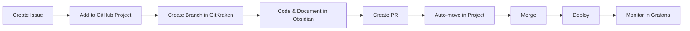
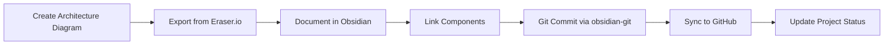
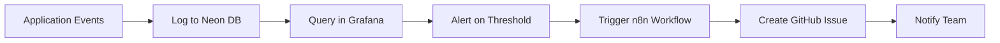

# Barton Outreach Core - Complete Integration Guide

Comprehensive guide for all tool integrations in the Barton Outreach Core system.

## 📋 Table of Contents

1. [Overview](#overview)
2. [Quick Start](#quick-start)
3. [Tool Registry](#tool-registry)
4. [Integration Details](#integration-details)
5. [Workflows](#workflows)
6. [Monitoring](#monitoring)
7. [Troubleshooting](#troubleshooting)

## Overview

Barton Outreach Core integrates 16 major tools and services following the IMO-Creator doctrine and MCP (Model Context Protocol) standards.

### Architecture Layers

```
┌─────────────────────────────────────────────────┐
│          Frontend Layer (Vercel)                │
│  - Lovable.dev UI                               │
│  - Grafana Dashboards (embedded)                │
└─────────────────────────────────────────────────┘
                     ↓
┌─────────────────────────────────────────────────┐
│       Integration Layer (Composio MCP)          │
│  - 100+ Services                                │
│  - OAuth Management                             │
│  - Rate Limiting                                │
└─────────────────────────────────────────────────┘
                     ↓
┌─────────────────────────────────────────────────┐
│      Application Layer (Garage Bay)             │
│  - MCP Orchestrator                             │
│  - FastAPI Backend                              │
│  - Tool Routing                                 │
└─────────────────────────────────────────────────┘
                     ↓
┌─────────────────────────────────────────────────┐
│           Data Layer                            │
│  - Neon PostgreSQL (Production)                 │
│  - Firebase (Staging)                           │
│  - Obsidian (Knowledge)                         │
└─────────────────────────────────────────────────┘
                     ↓
┌─────────────────────────────────────────────────┐
│     Automation & Monitoring Layer               │
│  - n8n (Workflows)                              │
│  - Grafana (Metrics)                            │
│  - GitHub Actions (CI/CD)                       │
└─────────────────────────────────────────────────┘
```

## Quick Start

### Prerequisites

```bash
# Required
- Node.js 18+
- Python 3.11+
- Docker & Docker Compose
- Git

# Optional but Recommended
- Obsidian desktop app
- GitKraken desktop app
```

### Installation

```bash
# 1. Clone repository
git clone https://github.com/djb258/barton-outreach-core.git
cd barton-outreach-core

# 2. Install dependencies
npm install
pip install -r requirements.txt

# 3. Copy environment template
cp .env.example .env

# 4. Start services
docker-compose up -d  # Grafana + n8n
npm run dev           # Development server

# 5. Verify integrations
npm run test:integrations
```

### First-Time Setup Checklist

- [ ] Configure Neon database connection
- [ ] Set up Composio API key
- [ ] Configure Firebase service account
- [ ] Start Grafana dashboard
- [ ] Initialize Obsidian vault
- [ ] Set up GitHub Projects
- [ ] Configure n8n workflows
- [ ] Install GitKraken (optional)

## Tool Registry

All tools are registered in `ctb/meta/config/mcp_registry.json` with doctrine IDs.

| Tool | Doctrine ID | Type | Status | Purpose |
|------|-------------|------|--------|---------|
| Composio MCP | 04.04.00 | MCP | Active | Integration hub |
| _21RISK | 04.04.01 | MCP | Active | Risk management |
| _2CHAT | 04.04.02 | MCP | Active | Chat/WhatsApp |
| ABLY | 04.04.03 | MCP | Active | Real-time messaging |
| Builder.io | 04.04.04 | MCP | Active | UI generation |
| Firebase | 04.04.05 | MCP | Active | Staging memory |
| Million Verifier | 04.04.06 | API | Active | Email validation |
| ChartDB | 04.04.07 | MCP | Active | DB visualization |
| Activepieces | 04.04.08 | MCP | Active | Workflow automation |
| Windmill | 04.04.09 | MCP | Active | Script execution |
| Claude Skills | 04.04.10 | MCP | Active | AI reasoning |
| **Grafana** | **04.04.11** | **MCP** | **Active** | **Monitoring** |
| **Obsidian** | **04.04.12** | **Knowledge** | **Active** | **Documentation** |
| **GitKraken** | **04.04.13** | **Git Client** | **Active** | **Git GUI** |
| **GitHub Projects** | **04.04.14** | **MCP** | **Active** | **Project mgmt** |
| **Eraser.io** | **04.04.15** | **Diagrams** | **Active** | **Architecture** |
| n8n | 04.04.F1 | Fallback | Active | Automation |
| Make | 04.04.F2 | Fallback | Standby | Automation |

## Integration Details

### 1. Grafana (04.04.11)

**Purpose**: Real-time monitoring and visualization

**Setup**:
```bash
# Start Grafana
docker-compose up -d grafana

# Access dashboard
open http://localhost:3000
# Username: admin / Password: admin
```

**Key Features**:
- Neon database metrics
- Real-time dashboards
- Alert management
- Panel embedding in Lovable UI

**Documentation**: [GRAFANA_SETUP.md](./GRAFANA_SETUP.md)

### 2. Obsidian (04.04.12)

**Purpose**: Knowledge management and documentation

**Setup**:
```bash
# Install Obsidian
# Download from https://obsidian.md

# Open vault
obsidian://open?path=ctb/docs/obsidian-vault

# Or manually: File → Open Vault → Select directory
```

**Key Features**:
- Markdown-based notes
- Bidirectional linking
- Graph visualization
- Git auto-sync
- Dataview queries

**Documentation**: [ctb/docs/obsidian-vault/README.md](./ctb/docs/obsidian-vault/README.md)

### 3. GitKraken (04.04.13)

**Purpose**: Visual Git operations

**Setup**:
```bash
# Install GitKraken
# Download from https://www.gitkraken.com/download

# Open repository
gitkraken --open .

# Or use File → Open Repo
```

**Key Features**:
- Visual commit graph
- Merge conflict resolution
- PR management
- Git Flow support
- Interactive rebase

**CLI Commands**:
```bash
gk open                    # Open repo in GitKraken
gk pr create              # Create PR
gk pr list                # List PRs
gk branch checkout main   # Checkout branch
```

### 4. GitHub Projects (04.04.14)

**Purpose**: Sprint and feature tracking

**Setup**:
1. Go to repository on GitHub
2. Click "Projects" tab
3. Import project from `ctb/sys/github-projects/`

**Key Features**:
- Kanban boards
- Custom fields (Sprint, Priority, Estimate)
- Automation rules
- GraphQL API integration

**Documentation**: [ctb/sys/github-projects/README.md](./ctb/sys/github-projects/README.md)

### 5. Eraser.io (04.04.15)

**Purpose**: Diagram-as-code for architecture

**Setup**:
```bash
# Create account at https://app.eraser.io

# Open diagram
# File → Open from GitHub
# Select: ctb/docs/diagrams/eraser/

# Or edit locally
vim ctb/docs/diagrams/eraser/system-architecture.eraser
```

**Key Features**:
- Architecture diagrams
- Sequence diagrams
- Version control
- SVG/PNG export
- GitHub integration

**Documentation**: [ctb/docs/diagrams/README.md](./ctb/docs/diagrams/README.md)

### 6. n8n (04.04.F1)

**Purpose**: Workflow automation

**Setup**:
```bash
# Start n8n
cd ctb/sys/n8n
docker-compose up -d

# Access UI
open http://localhost:5678

# Import workflows
# Settings → Import from File → Select workflows/*.json
```

**Pre-built Workflows**:
1. Outreach Pipeline Automation
2. Error Notification System
3. Database Sync
4. LinkedIn Profile Refresh
5. GitHub Project Sync

**Documentation**: [ctb/sys/n8n/README.md](./ctb/sys/n8n/README.md)

## Workflows

### Development Workflow



### Documentation Workflow



### Monitoring Workflow



## Monitoring

### Service Health Checks

```bash
# Grafana
curl http://localhost:3000/api/health

# n8n
curl http://localhost:5678/healthz

# Composio MCP
curl http://localhost:3001/health

# FastAPI
curl http://localhost:8000/health
```

### Metrics to Monitor

1. **Application Metrics** (Grafana)
   - Request rate
   - Error rate
   - Response time
   - Database connections

2. **Workflow Metrics** (n8n)
   - Execution count
   - Success/failure rate
   - Average duration

3. **Integration Metrics** (Composio)
   - API calls per service
   - Rate limit usage
   - OAuth token expiry

4. **Database Metrics** (Neon)
   - Connection pool usage
   - Query performance
   - Table sizes
   - Index efficiency

### Dashboards

- **Main Dashboard**: http://localhost:3000/d/barton_outreach
  - Total companies
  - Total contacts
  - Pending tasks
  - Slot fill rates

- **n8n Dashboard**: http://localhost:5678/workflows
  - Workflow executions
  - Success/failure breakdown
  - Performance metrics

## Troubleshooting

### Common Issues

#### Grafana: Can't Connect to Database

```bash
# Check Neon connection string
echo $NEON_CONNECTION_STRING

# Test connection
psql $NEON_CONNECTION_STRING -c "SELECT 1;"

# Verify SSL mode in grafana/provisioning/datasources/neon.yaml
# Should be: sslmode=require
```

#### n8n: Workflow Fails

```bash
# Check n8n logs
docker-compose logs -f n8n

# Common issues:
# 1. Missing credentials
# 2. Rate limiting
# 3. Timeout (increase in workflow settings)

# Retry workflow manually
curl -X POST http://localhost:5678/webhook/retry-workflow
```

#### Obsidian: Git Sync Not Working

```bash
# Check obsidian-git plugin settings
# Community Plugins → Obsidian Git → Settings

# Manual git operations
cd ctb/docs/obsidian-vault
git status
git add .
git commit -m "docs: manual commit"
git push
```

#### GitKraken: Authentication Failed

```bash
# Re-authenticate with GitHub
# File → Preferences → Authentication → GitHub → Re-authenticate

# Or use SSH keys
ssh-keygen -t ed25519 -C "your_email@example.com"
# Add to GitHub: Settings → SSH Keys
```

#### GitHub Projects: Items Not Syncing

```bash
# Check GitHub token permissions
# Should have: repo, project, workflow scopes

# Verify project ID
echo $GITHUB_PROJECT_ID

# Test GraphQL API
curl -H "Authorization: bearer $GITHUB_TOKEN" \
  -X POST -d '{"query":"query { viewer { login }}"}' \
  https://api.github.com/graphql
```

#### Eraser.io: Export Failed

```bash
# Manual export from web UI
# 1. Open diagram at app.eraser.io
# 2. File → Export → SVG
# 3. Save to ctb/docs/diagrams/eraser/exports/

# Or use API (if available)
# Check Eraser.io API docs
```

### Support Resources

- **Grafana**: https://grafana.com/docs/
- **Obsidian**: https://help.obsidian.md/
- **GitKraken**: https://support.gitkraken.com/
- **GitHub Projects**: https://docs.github.com/en/issues/planning-and-tracking-with-projects
- **Eraser.io**: https://docs.eraser.io/
- **n8n**: https://docs.n8n.io/

---

## Quick Reference

### Environment Variables

```bash
# Core
NEON_CONNECTION_STRING=postgresql://...
COMPOSIO_API_KEY=ak_...
FIREBASE_SERVICE_ACCOUNT=./service-account.json

# Monitoring
GRAFANA_ADMIN_PASSWORD=...
N8N_BASIC_AUTH_PASSWORD=...

# Integrations
GITHUB_TOKEN=ghp_...
GITHUB_PROJECT_ID=PVT_...
MILLIONVERIFIER_API_KEY=...
BUILDER_IO_API_KEY=...
```

### Common Commands

```bash
# Start all services
docker-compose up -d

# Stop all services
docker-compose down

# View logs
docker-compose logs -f [service]

# Restart service
docker-compose restart [service]

# Check service status
docker-compose ps

# Update MCP registry
npm run update:mcp-registry

# Run integration tests
npm run test:integrations

# Export Grafana dashboards
npm run export:grafana-dashboards

# Backup Obsidian vault
npm run backup:obsidian
```

---

**Created:** 2025-11-06
**Version:** 1.4.0
**Engine Version:** IMO-Creator 1.4.0
**Doctrine Compliance:** 100%
**Status:** Production Ready
