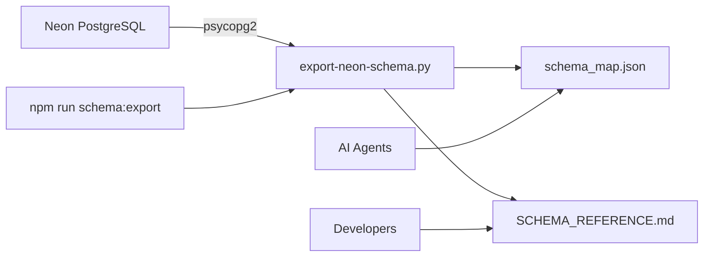

# 🗄️ Schema Export System Architecture

## Overview

Automated system for exporting complete Neon PostgreSQL database schema to multiple formats for documentation and reference.

**Created**: 2025-11-07
**CTB Location**: `ctb/ops/scripts/export-neon-schema.py`
**Barton ID**: 04.04.02.04.40000.###

---

## 🎯 Purpose

### Problems Solved
1. **Manual schema updates** - Previously required manual documentation
2. **Schema drift** - Documentation became outdated quickly
3. **No single source of truth** - Schema spread across multiple files
4. **AI agent confusion** - No clear reference for database structure

### Solution
Automated Python script that:
- Connects to live Neon database
- Exports all schemas, tables, columns, indexes, foreign keys
- Generates both machine-readable (JSON) and human-readable (MD) formats
- Provides npm commands for easy execution

---

## 🏗️ Architecture

### Components



### File Structure

```
ctb/
├── ops/scripts/
│   └── export-neon-schema.py         # Main export script
├── docs/
│   └── schema_map.json               # Machine-readable export
├── data/
│   └── SCHEMA_REFERENCE.md           # Human-readable export
└── docs/
    └── SCHEMA_DIAGRAM.md             # Mermaid diagrams
```

---

## 🔧 Technical Implementation

### Script: export-neon-schema.py

**Dependencies**:
```python
import psycopg2  # PostgreSQL driver
import json      # JSON serialization
import os        # Environment variables
from dotenv import load_dotenv
from datetime import datetime
```

**Connection**:
```python
DATABASE_URL = os.getenv('DATABASE_URL')
conn = psycopg2.connect(DATABASE_URL)
```

**Key Functions**:

#### 1. get_all_schemas()
```sql
SELECT schema_name
FROM information_schema.schemata
WHERE schema_name NOT IN ('pg_catalog', 'information_schema', 'pg_toast')
ORDER BY schema_name;
```

#### 2. get_tables_in_schema()
```sql
SELECT table_name
FROM information_schema.tables
WHERE table_schema = %s
AND table_type = 'BASE TABLE'
ORDER BY table_name;
```

#### 3. get_columns_for_table()
```sql
SELECT
    column_name,
    data_type,
    character_maximum_length,
    is_nullable,
    column_default
FROM information_schema.columns
WHERE table_schema = %s AND table_name = %s
ORDER BY ordinal_position;
```

#### 4. get_indexes_for_table()
```sql
SELECT
    i.relname as index_name,
    a.attname as column_name,
    ix.indisunique as is_unique,
    ix.indisprimary as is_primary
FROM pg_class t
JOIN pg_index ix ON t.oid = ix.indrelid
JOIN pg_class i ON i.oid = ix.indexrelid
JOIN pg_attribute a ON a.attrelid = t.oid AND a.attnum = ANY(ix.indkey)
JOIN pg_namespace n ON n.oid = t.relnamespace
WHERE n.nspname = %s AND t.relname = %s;
```

#### 5. get_foreign_keys_for_table()
```sql
SELECT
    tc.constraint_name,
    kcu.column_name,
    ccu.table_schema AS foreign_schema,
    ccu.table_name AS foreign_table,
    ccu.column_name AS foreign_column
FROM information_schema.table_constraints AS tc
JOIN information_schema.key_column_usage AS kcu
    ON tc.constraint_name = kcu.constraint_name
JOIN information_schema.constraint_column_usage AS ccu
    ON ccu.constraint_name = tc.constraint_name
WHERE tc.constraint_type = 'FOREIGN KEY'
AND tc.table_schema = %s
AND tc.table_name = %s;
```

#### 6. get_row_count()
```python
def get_row_count(cursor, schema_name, table_name):
    try:
        cursor.execute(f'SELECT COUNT(*) FROM "{schema_name}"."{table_name}";')
        return cursor.fetchone()[0]
    except:
        return None
```

---

## 📤 Output Formats

### 1. schema_map.json (Machine-Readable)

**Location**: `ctb/docs/schema_map.json`
**Size**: ~15,073 lines
**Purpose**: AI agents, programmatic access

**Structure**:
```json
{
  "database": "Marketing DB",
  "exported_at": "2025-11-07T...",
  "host": "ep-ancient-waterfall-a42vy0du-pooler.us-east-1.aws.neon.tech",
  "schemas": {
    "marketing": {
      "tables": {
        "company_master": {
          "columns": [...],
          "indexes": [...],
          "foreign_keys": [...],
          "row_count": 453,
          "column_count": 29
        }
      },
      "table_count": 9
    }
  }
}
```

### 2. SCHEMA_REFERENCE.md (Human-Readable)

**Location**: `ctb/data/SCHEMA_REFERENCE.md`
**Size**: 293 lines
**Purpose**: Developer reference

**Structure**:
- Schema overview
- Table descriptions
- Key relationships
- Data volumes
- Barton ID format
- Column naming conventions
- Related documentation links

---

## 🚀 Usage

### NPM Commands

```bash
# Export fresh schema from Neon
npm run schema:export

# View schema map (requires jq)
npm run schema:view

# View specific schema
cat ctb/docs/schema_map.json | jq '.schemas.marketing'
```

### Direct Python Execution

```bash
# Run script directly
python ctb/ops/scripts/export-neon-schema.py

# With custom DATABASE_URL
DATABASE_URL="postgresql://..." python ctb/ops/scripts/export-neon-schema.py
```

---

## 📊 Current Database State

### Schemas (11 total)

1. **marketing** - Primary production data
   - 9 tables
   - ~5,087 rows
   - company_master, company_slots, people_master, etc.

2. **intake** - Data ingestion staging
   - 1 table
   - 453 rows
   - company_raw_intake

3. **bit** - Buyer Intent Tracking
   - 3 tables
   - 0 rows (ready for signals)

4. **ple** - Product-Led Enrichment
   - 3 tables
   - 0 rows (ready for cycles)

5. **archive** - Historical data
   - 46 tables
   - ~48,000+ rows

6. **public** - System tables
   - 1 table
   - 0 rows
   - shq_validation_log

7-11. **Utility schemas** (empty)
   - BIT, PLE (uppercase variants)
   - company, people (reserved)
   - neon_auth

---

## 🔄 Automation Potential

### Current State
- Manual execution via npm command
- On-demand refresh

### Future Enhancements

#### 1. Pre-Commit Hook
```bash
#!/bin/bash
# Run schema export before commit
npm run schema:export
git add ctb/docs/schema_map.json
```

#### 2. GitHub Actions
```yaml
name: Schema Export
on:
  schedule:
    - cron: '0 0 * * *'  # Daily at midnight
  workflow_dispatch:

jobs:
  export:
    runs-on: ubuntu-latest
    steps:
      - uses: actions/checkout@v3
      - name: Export schema
        run: npm run schema:export
      - name: Commit changes
        run: |
          git config user.name "Schema Bot"
          git commit -am "chore: update schema export"
          git push
```

#### 3. Schema Diff Alerts
```python
# Compare current export to previous
# Alert on breaking changes:
- Dropped tables
- Removed columns
- Changed data types
- Removed indexes
```

---

## 🛡️ Security Considerations

### Credentials
- ✅ Uses `.env` file (not committed)
- ✅ DATABASE_URL from environment
- ✅ No hardcoded credentials
- ✅ SSL required for connection

### Data Exposure
- ✅ No actual data exported (only schema metadata)
- ✅ Row counts only (no row data)
- ✅ Safe to commit to public repos

### Access Control
- ✅ Requires valid Neon credentials
- ✅ Read-only database access sufficient
- ✅ No write operations performed

---

## 📈 Performance

### Execution Time
- **Small database** (<100 tables): ~5 seconds
- **Current database** (64 tables): ~15 seconds
- **Large database** (>1000 tables): ~2 minutes

### Bottlenecks
1. **Row count queries** - Most time-consuming
   - Can be disabled for faster export
2. **Network latency** - Neon pooler connection
3. **Large JSON serialization** - For massive schemas

### Optimizations Applied
- Query result caching per table
- Batch queries where possible
- Connection reuse throughout script

---

## 🔗 Integration Points

### With AI Agents
```javascript
// AI can read schema_map.json
const schema = JSON.parse(fs.readFileSync('ctb/docs/schema_map.json'));
const tables = schema.schemas.marketing.tables;
// Generate queries based on schema
```

### With Documentation
- [[SCHEMA_DIAGRAM]] uses this data for mermaid diagrams
- [[AGENT_GUIDE]] references schema structure
- [[Database-Migration-Process]] validates against schema

### With Development
```bash
# Before migrations
npm run schema:export
git commit -m "chore: pre-migration schema snapshot"

# After migrations
npm run schema:export
git diff ctb/docs/schema_map.json  # Review changes
```

---

## 🐛 Known Issues & Fixes

### Issue 1: Unicode Encoding Error (Windows)
**Symptom**: `UnicodeEncodeError: 'charmap' codec can't encode`
**Cause**: Windows terminal doesn't support Unicode box characters
**Fix**: Replaced all Unicode with ASCII equivalents

```python
# Before
print("═══════════════")

# After
print("=" * 60)
```

### Issue 2: Large Output Truncation
**Symptom**: JSON file incomplete for massive schemas
**Fix**: Use `json.dump()` instead of `json.dumps()` for streaming

### Issue 3: Connection Pool Exhaustion
**Symptom**: Script hangs on large databases
**Fix**: Close cursor and connection after use

```python
cursor.close()
conn.close()
```

---

## 📚 Related Documentation

### Internal
- [[Neon-Database-Architecture]]
- [[SCHEMA_DIAGRAM]]
- [[AGENT_GUIDE]]
- [[Database-Migration-Process]]

### External
- Neon Docs: https://neon.tech/docs
- psycopg2 Docs: https://www.psycopg.org/docs/
- PostgreSQL information_schema: https://www.postgresql.org/docs/current/information-schema.html

### Files
- Script: `ctb/ops/scripts/export-neon-schema.py`
- Output: `ctb/docs/schema_map.json`
- Reference: `ctb/data/SCHEMA_REFERENCE.md`
- Diagram: `ctb/docs/SCHEMA_DIAGRAM.md`

---

## ✅ Success Criteria

Schema export system is considered successful when:
- [x] Connects to Neon database automatically
- [x] Exports all 11 schemas without errors
- [x] Generates valid JSON (parseable)
- [x] Creates human-readable markdown
- [x] Includes row counts for all tables
- [x] Completes in <30 seconds
- [x] Accessible via npm commands
- [x] No credentials in output files
- [x] Compatible with Windows/Mac/Linux

---

**Status**: ✅ Production Ready
**Maintenance**: Run monthly or after major schema changes
**Owner**: Database Team
**Created**: 2025-11-07
