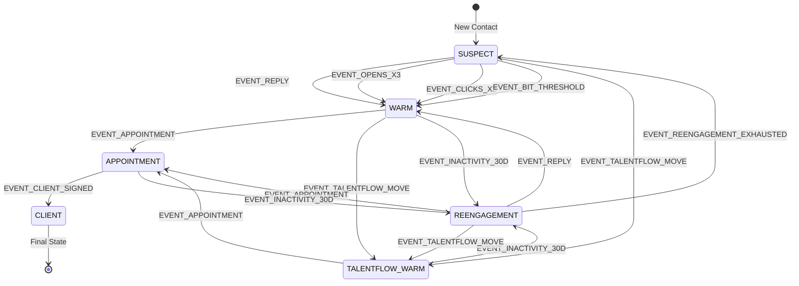
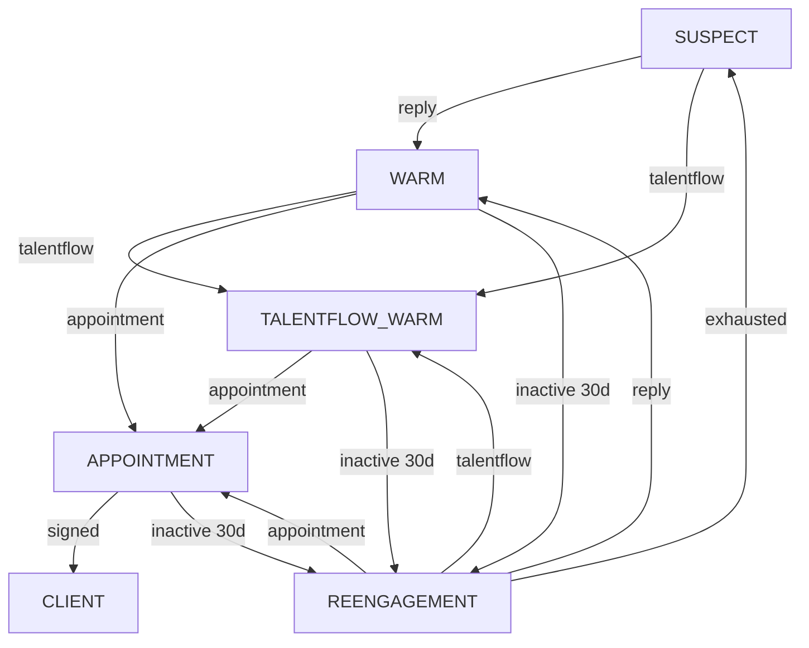

# Funnel State Machine

## Version: 1.0.0
## Last Updated: 2025-12-05

---

## Overview

This document defines the finite state machine (FSM) that governs lifecycle state transitions within the 4-Funnel GTM System. Every contact exists in exactly one state at any given time, and transitions occur only through defined events.

---

## Lifecycle States

### State Definitions

| State | Code | Description | Funnel |
|-------|------|-------------|--------|
| SUSPECT | `SUSPECT` | New contact, no engagement | Funnel 1: Cold |
| WARM | `WARM` | Engaged via email signals | Funnel 3: Warm |
| TALENTFLOW_WARM | `TALENTFLOW_WARM` | TalentFlow signal + engagement | Funnel 2: TalentFlow |
| APPOINTMENT | `APPOINTMENT` | Meeting scheduled | Sales Pipeline |
| CLIENT | `CLIENT` | Contract signed | Customer |

### Terminal States

- **CLIENT**: Final success state. No outgoing transitions.
- **DISQUALIFIED**: Permanent removal from system (not shown in primary flow).
- **UNSUBSCRIBED**: Opted out of communications.

---

## Movement Events

### Event Definitions

| Event Code | Description | Typical Source |
|------------|-------------|----------------|
| `EVENT_REPLY` | Email reply received | Email system webhook |
| `EVENT_CLICKS_X2` | 2+ link clicks from contact | Email tracking |
| `EVENT_OPENS_X3` | 3+ email opens from contact | Email tracking |
| `EVENT_TALENTFLOW_MOVE` | TalentFlow movement detected | TalentFlow Phase 0 |
| `EVENT_BIT_THRESHOLD` | BIT score crosses threshold | BIT scoring engine |
| `EVENT_REENGAGEMENT_TRIGGER` | Re-engagement timer fires | Scheduler (60-90 days) |
| `EVENT_APPOINTMENT` | Meeting booked | Calendar integration |
| `EVENT_CLIENT_SIGNED` | Contract signed | CRM update |
| `EVENT_INACTIVITY_30D` | 30+ days no engagement | Activity monitor |
| `EVENT_REENGAGEMENT_EXHAUSTED` | Max re-engagement attempts | Cycle counter |

---

## State Machine Diagram

### Primary Flow

```
┌─────────────────────────────────────────────────────────────────────────────┐
│                           STATE MACHINE DIAGRAM                             │
└─────────────────────────────────────────────────────────────────────────────┘

                                    ┌────────────┐
                                    │   CLIENT   │
                                    │  (Final)   │
                                    └─────▲──────┘
                                          │
                              EVENT_CLIENT_SIGNED
                                          │
                                    ┌─────┴──────┐
                                    │APPOINTMENT │
                                    │ (Meeting)  │
                                    └─────▲──────┘
                                          │
                              EVENT_APPOINTMENT
                                          │
                    ┌─────────────────────┼─────────────────────┐
                    │                     │                     │
                    │                     │                     │
             ┌──────┴──────┐       ┌──────┴──────┐       ┌──────┴──────┐
             │    WARM     │       │ TALENTFLOW  │       │REENGAGEMENT │
             │  (Engaged)  │◀─────▶│    WARM     │◀─────▶│   (Timer)   │
             └──────▲──────┘       └──────▲──────┘       └──────▲──────┘
                    │                     │                     │
     ┌──────────────┼──────────────┐      │                     │
     │              │              │      │                     │
EVENT_REPLY   EVENT_OPENS_X3  EVENT_     EVENT_          EVENT_REENGAGEMENT
              EVENT_CLICKS_X2  BIT_    TALENTFLOW            _TRIGGER
                              THRESHOLD   _MOVE                 │
     │              │              │      │                     │
     └──────────────┼──────────────┘      │                     │
                    │                     │                     │
                    └─────────────────────┼─────────────────────┘
                                          │
                                    ┌─────┴──────┐
                                    │  SUSPECT   │
                                    │   (Cold)   │
                                    └────────────┘
```

### Detailed Transition Table

| From State | Event | To State | Condition |
|------------|-------|----------|-----------|
| SUSPECT | EVENT_REPLY | WARM | Reply is positive/neutral |
| SUSPECT | EVENT_OPENS_X3 | WARM | 3+ unique opens |
| SUSPECT | EVENT_CLICKS_X2 | WARM | 2+ unique clicks |
| SUSPECT | EVENT_BIT_THRESHOLD | WARM | BIT score >= WARM_THRESHOLD |
| SUSPECT | EVENT_TALENTFLOW_MOVE | TALENTFLOW_WARM | Movement verified |
| WARM | EVENT_APPOINTMENT | APPOINTMENT | Meeting confirmed |
| WARM | EVENT_TALENTFLOW_MOVE | TALENTFLOW_WARM | Movement detected |
| WARM | EVENT_INACTIVITY_30D | REENGAGEMENT | No activity 30+ days |
| TALENTFLOW_WARM | EVENT_APPOINTMENT | APPOINTMENT | Meeting confirmed |
| TALENTFLOW_WARM | EVENT_REPLY | TALENTFLOW_WARM | Maintain state |
| TALENTFLOW_WARM | EVENT_INACTIVITY_30D | REENGAGEMENT | No activity 30+ days |
| REENGAGEMENT | EVENT_REPLY | WARM | Re-engaged successfully |
| REENGAGEMENT | EVENT_TALENTFLOW_MOVE | TALENTFLOW_WARM | New movement |
| REENGAGEMENT | EVENT_APPOINTMENT | APPOINTMENT | Meeting from re-engage |
| REENGAGEMENT | EVENT_REENGAGEMENT_EXHAUSTED | SUSPECT | Recycle to cold |
| APPOINTMENT | EVENT_CLIENT_SIGNED | CLIENT | Contract executed |
| APPOINTMENT | EVENT_INACTIVITY_30D | REENGAGEMENT | Meeting no-show/stalled |

---

## State Transition Diagrams (Mermaid)

### Primary Flow



### Simplified View



---

## State Properties

### SUSPECT
```yaml
state: SUSPECT
funnel: 1 (Cold Universe)
engagement_level: 0
bit_score_min: 0
bit_score_max: WARM_THRESHOLD - 1
sequence_type: cold_outreach
priority: low
```

### WARM
```yaml
state: WARM
funnel: 3 (Warm Universe)
engagement_level: 1-3
bit_score_min: WARM_THRESHOLD
bit_score_max: null
sequence_type: nurture
priority: medium
```

### TALENTFLOW_WARM
```yaml
state: TALENTFLOW_WARM
funnel: 2 (TalentFlow Universe)
engagement_level: 1-3
talentflow_signal: true
movement_age_max: 90 days
sequence_type: talentflow_personalized
priority: high
```

### REENGAGEMENT
```yaml
state: REENGAGEMENT
funnel: 4 (Re-Engagement Universe)
engagement_level: historical
cycle_count: 1-3
cycle_interval: 60-90 days
sequence_type: reengagement
priority: medium
```

### APPOINTMENT
```yaml
state: APPOINTMENT
funnel: null (Sales Pipeline)
meeting_status: scheduled|completed
follow_up_required: true
sequence_type: meeting_prep
priority: highest
```

### CLIENT
```yaml
state: CLIENT
funnel: null (Customer)
contract_status: signed
onboarding_status: pending|complete
sequence_type: customer_success
priority: n/a
```

---

## Transition Validation Rules

### Pre-Transition Checks

1. **State Lock**: Contact must not be in a locked state (e.g., pending review)
2. **Event Validity**: Event must be valid for current state
3. **Threshold Check**: Numeric thresholds must be met (opens >= 3, clicks >= 2)
4. **Cooldown Check**: Minimum time between transitions (prevents flickering)

### Post-Transition Actions

1. **Timestamp Update**: Record transition time
2. **Funnel Update**: Update funnel membership
3. **Sequence Update**: Assign new outreach sequence
4. **Notification**: Trigger appropriate alerts/webhooks
5. **Audit Log**: Record transition in audit trail

---

## Edge Cases

### Simultaneous Events
When multiple events occur simultaneously:
1. Process in priority order: APPOINTMENT > TALENTFLOW > ENGAGEMENT > REENGAGEMENT
2. Apply only the highest-priority transition
3. Log all events, but execute only one transition

### State Flickering Prevention
- Minimum 24-hour cooldown between state changes
- Exception: APPOINTMENT and CLIENT transitions (no cooldown)
- Rapid event accumulation within window counts toward threshold

### Invalid Transitions
Transitions not defined in the table are rejected:
- SUSPECT cannot directly become APPOINTMENT
- CLIENT cannot transition to any other state
- REENGAGEMENT cannot directly become CLIENT

---

## Cross-References

- **Funnel Definitions**: See `4_funnel_doctrine.md`
- **Movement Rules**: See `funnel_rules.md`
- **Event Schemas**: See `event_schemas.md` (future)

---

## Version History

| Version | Date | Author | Changes |
|---------|------|--------|---------|
| 1.0.0 | 2025-12-05 | System | Initial state machine creation |
