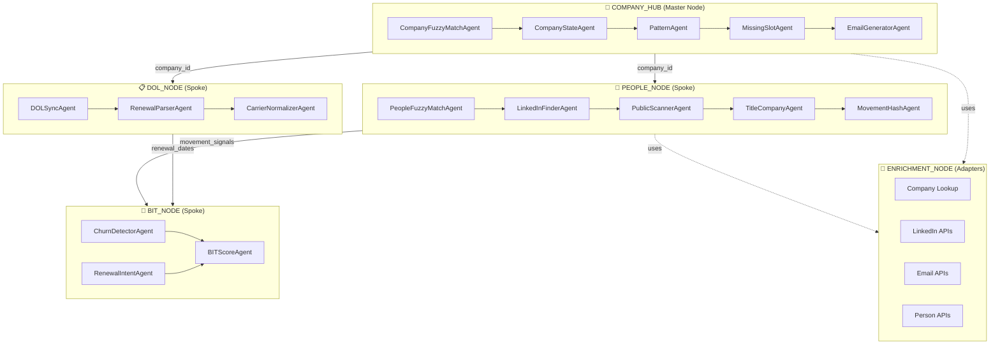
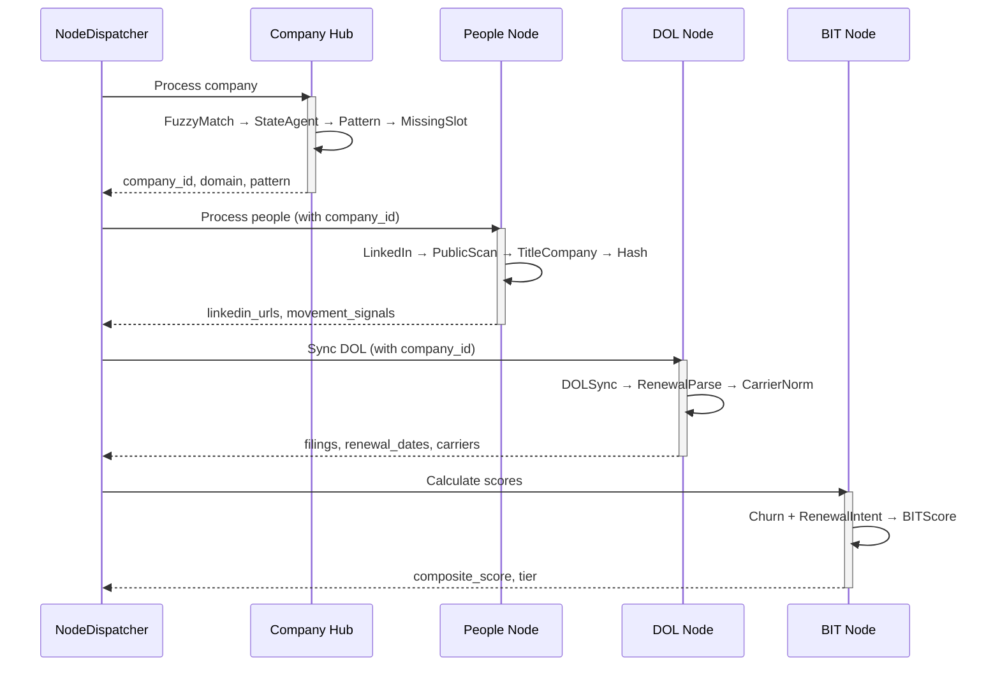

# Talent Engine - Hub-and-Spoke Node Architecture

## Overview

The Talent Engine uses a **Hub-and-Spoke Architecture** where the Company Hub is the master node and all other nodes (spokes) must anchor to a valid company record before processing.

## ASCII Node Diagram

```
┌─────────────────────────────────────────────────────────────────────────────────────┐
│                          TALENT ENGINE - HUB-AND-SPOKE ARCHITECTURE                 │
└─────────────────────────────────────────────────────────────────────────────────────┘

                              ┌─────────────────────────────┐
                              │        COMPANY_HUB          │
                              │       (Master Node)         │
                              │                             │
                              │  ┌───────────────────────┐  │
                              │  │ CompanyFuzzyMatchAgent│  │
                              │  │ CompanyStateAgent     │  │
                              │  │ PatternAgent          │  │
                              │  │ MissingSlotAgent      │  │
                              │  │ EmailGeneratorAgent   │  │
                              │  └───────────────────────┘  │
                              │                             │
                              │  Outputs:                   │
                              │  • company_id (anchor)      │
                              │  • domain                   │
                              │  • email_pattern            │
                              │  • slot definitions         │
                              └─────────────┬───────────────┘
                                            │
            ┌───────────────────────────────┼───────────────────────────────┐
            │                               │                               │
            ▼                               ▼                               ▼
┌───────────────────────┐     ┌───────────────────────┐     ┌───────────────────────┐
│      PEOPLE_NODE      │     │       DOL_NODE        │     │       BIT_NODE        │
│       (Spoke)         │     │       (Spoke)         │     │       (Spoke)         │
│                       │     │                       │     │                       │
│ ┌───────────────────┐ │     │ ┌───────────────────┐ │     │ ┌───────────────────┐ │
│ │LinkedInFinderAgent│ │     │ │ DOLSyncAgent      │ │     │ │ BITScoreAgent     │ │
│ │PublicScannerAgent │ │     │ │ RenewalParserAgent│ │     │ │ ChurnDetectorAgent│ │
│ │TitleCompanyAgent  │ │     │ │ CarrierNormalizer │ │     │ │ RenewalIntentAgent│ │
│ │MovementHashAgent  │ │     │ └───────────────────┘ │     │ └───────────────────┘ │
│ │PeopleFuzzyMatch   │ │     │                       │     │                       │
│ └───────────────────┘ │     │ Outputs:              │     │ Outputs:              │
│                       │     │ • Form 5500 filings   │     │ • BIT composite score │
│ Outputs:              │     │ • Renewal dates       │     │ • Churn analysis      │
│ • LinkedIn URLs       │     │ • Carrier list        │     │ • Renewal intent      │
│ • Titles/Companies    │     │ • EIN mappings        │     │ • Tier assignment     │
│ • Movement hashes     │     │                       │     │                       │
│ • Movement signals    │     │                       │     │                       │
└───────────┬───────────┘     └───────────┬───────────┘     └───────────────────────┘
            │                             │                             ▲
            │                             │                             │
            └─────────────────────────────┴─────────────────────────────┘
                          (Movement + Renewal signals feed BIT Node)


┌─────────────────────────────────────────────────────────────────────────────────────┐
│                              ENRICHMENT_NODE (Utility)                               │
│                                                                                      │
│  Adapters:                                                                           │
│  ┌─────────────────┐  ┌─────────────────┐  ┌─────────────────┐  ┌─────────────────┐ │
│  │ Company Lookup  │  │ LinkedIn APIs   │  │  Email APIs     │  │  Person APIs    │ │
│  │ Adapter         │  │ (Resolver,      │  │  (Pattern,      │  │  (Employment,   │ │
│  │                 │  │  Profile,       │  │   Finder,       │  │   Discovery)    │ │
│  │                 │  │  Accessibility) │  │   Verification) │  │                 │ │
│  └─────────────────┘  └─────────────────┘  └─────────────────┘  └─────────────────┘ │
└─────────────────────────────────────────────────────────────────────────────────────┘
```

## Mermaid Flowchart



## Processing Flow



## Node Registry

| Node | Type | Status | Agents | Primary Output |
|------|------|--------|--------|----------------|
| **COMPANY_HUB** | MASTER | ✅ Active | 5 | company_id, domain, email_pattern |
| **PEOPLE_NODE** | SPOKE | ✅ Active | 5 | linkedin_url, movement_hash |
| **DOL_NODE** | SPOKE | ✅ Active | 3 | renewal_dates, carriers |
| **BIT_NODE** | SPOKE | ✅ Active | 3 | BIT_score, tier |
| **ENRICHMENT_NODE** | UTILITY | ✅ Active | N/A (adapters) | External API access |

## Agent Registry by Node

### COMPANY_HUB (5 Agents)
| Agent | Purpose | Adapters Used |
|-------|---------|---------------|
| CompanyFuzzyMatchAgent | Match raw company input | companyLookupAdapter |
| CompanyStateAgent | Evaluate company readiness | None (local) |
| PatternAgent | Discover email pattern | emailPatternAdapter |
| MissingSlotAgent | Detect empty slots | slotDiscoveryAdapter |
| EmailGeneratorAgent | Generate/verify emails | emailFinderAdapter, emailVerificationAdapter |

### PEOPLE_NODE (5 Agents)
| Agent | Purpose | Adapters Used |
|-------|---------|---------------|
| PeopleFuzzyMatchAgent | Deduplicate people | None (local) |
| LinkedInFinderAgent | Find LinkedIn URLs | linkedInResolverAdapter |
| PublicScannerAgent | Check profile accessibility | linkedInAccessibilityAdapter |
| TitleCompanyAgent | Get current title/company | linkedInProfileAdapter, personEmploymentAdapter |
| MovementHashAgent | Generate change detection hash | None (local) |

### DOL_NODE (3 Agents)
| Agent | Purpose | Adapters Used |
|-------|---------|---------------|
| DOLSyncAgent | Sync Form 5500 filings | DOL ERISA API (TODO) |
| RenewalParserAgent | Extract renewal dates | None (local) |
| CarrierNormalizerAgent | Normalize carrier names | None (local) |

### BIT_NODE (3 Agents)
| Agent | Purpose | Adapters Used |
|-------|---------|---------------|
| BITScoreAgent | Calculate composite score | None (local) |
| ChurnDetectorAgent | Detect executive turnover | None (local) |
| RenewalIntentAgent | Analyze renewal timing | None (local) |

## The Golden Rule

```
┌─────────────────────────────────────────────────────────────────────────┐
│                                                                         │
│   IF company_id IS NULL OR domain IS NULL OR email_pattern IS NULL:    │
│       STOP. DO NOT PROCEED TO SPOKE NODES.                             │
│       → Complete Company Hub processing first.                         │
│                                                                         │
└─────────────────────────────────────────────────────────────────────────┘
```

## Kill Switch Configuration

```typescript
const killSwitches: KillSwitches = {
  COMPANY_HUB: false,  // Master node - rarely killed
  PEOPLE_NODE: false,  // Kill to stop LinkedIn API calls
  DOL_NODE: false,     // Kill to stop DOL sync
  BIT_NODE: false,     // Kill to stop scoring
};
```

## Cost Tracking

Each node tracks its own costs:

```typescript
interface CostTracker {
  COMPANY_HUB: number;  // Pattern discovery, slot discovery
  PEOPLE_NODE: number;  // LinkedIn API calls
  DOL_NODE: number;     // DOL API calls
  BIT_NODE: number;     // Free (local computation)
  total: number;
}
```

## File Structure

```
src/
├── nodes/
│   ├── company_hub/
│   │   ├── CompanyFuzzyMatchAgent.ts
│   │   ├── CompanyStateAgent.ts
│   │   ├── PatternAgent.ts
│   │   ├── MissingSlotAgent.ts
│   │   ├── EmailGeneratorAgent.ts
│   │   └── index.ts
│   │
│   ├── people_node/
│   │   ├── LinkedInFinderAgent.ts
│   │   ├── PublicScannerAgent.ts
│   │   ├── TitleCompanyAgent.ts
│   │   ├── MovementHashAgent.ts
│   │   ├── PeopleFuzzyMatchAgent.ts
│   │   └── index.ts
│   │
│   ├── dol_node/
│   │   ├── DOLSyncAgent.ts
│   │   ├── RenewalParserAgent.ts
│   │   ├── CarrierNormalizerAgent.ts
│   │   └── index.ts
│   │
│   ├── bit_node/
│   │   ├── BITScoreAgent.ts
│   │   ├── ChurnDetectorAgent.ts
│   │   ├── RenewalIntentAgent.ts
│   │   └── index.ts
│   │
│   ├── enrichment_node/
│   │   └── index.ts  (re-exports adapters)
│   │
│   └── index.ts
│
├── dispatcher/
│   ├── NodeDispatcher.ts
│   └── index.ts
│
├── adapters/
│   ├── companyLookupAdapter.ts
│   ├── linkedInResolverAdapter.ts
│   ├── emailPatternAdapter.ts
│   ├── emailVerificationAdapter.ts
│   ├── personEmploymentAdapter.ts
│   ├── slotDiscoveryAdapter.ts
│   ├── types.ts
│   └── index.ts
│
├── models/
│   ├── SlotRow.ts
│   └── CompanyState.ts
│
└── logic/
    ├── fuzzyMatch.ts
    ├── companyChecker.ts
    └── checklist.ts
```

---

*Last Updated: December 2024*
*Architecture Version: 2.0 (Hub-and-Spoke)*
