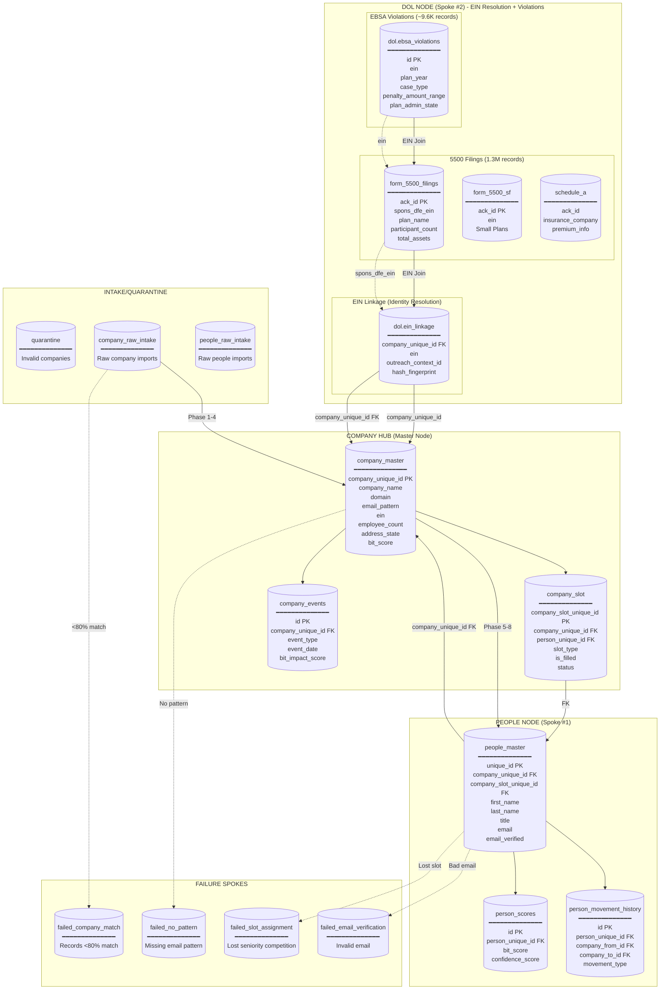
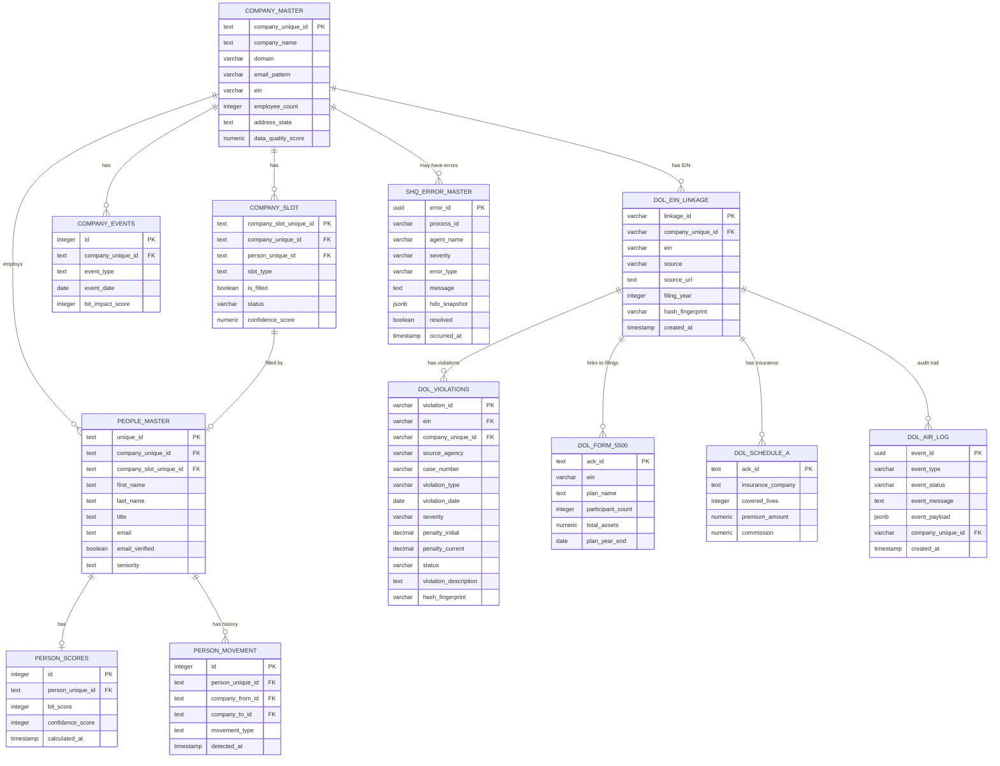

# Barton Outreach Core - Complete System ERD
## Hub-and-Spoke Architecture with All Tables and Pipelines

**Version:** 4.2.0
**Last Updated:** 2026-01-29
**Architecture:** CL Authority Registry + Outreach Operational Spine
**ADR:** ADR-011_CL_Authority_Registry_Outreach_Spine.md
**DOL Subhub:** EIN Resolution + Violation Discovery
**Join Doctrine:** All DOL/Government data joins on EIN
**Sovereign Cleanup:** 2026-01-21 (23,025 records archived)
**Cascade Cleanup:** 2026-01-29 (10,846 records removed, alignment: 42,833 = 42,833)

---

## Visual Architecture Overview

```
┌─────────────────────────────────────────────────────────────────────────────┐
│               CL = AUTHORITY REGISTRY (Identity Pointers Only)               │
├─────────────────────────────────────────────────────────────────────────────┤
│                                                                              │
│  cl.company_identity                                                         │
│  ────────────────────                                                        │
│  sovereign_company_id   PK, IMMUTABLE (minted by CL)         51,910 total   │
│  outreach_id            WRITE-ONCE (minted by Outreach)      42,833 claimed │
│  sales_process_id       WRITE-ONCE (minted by Sales)         —              │
│  client_id              WRITE-ONCE (minted by Client)        —              │
│                                                                              │
│  ╔═══════════════════════════════════════════════════════════════════════╗  │
│  ║ CL stores IDENTITY POINTERS only — never workflow state               ║  │
│  ╚═══════════════════════════════════════════════════════════════════════╝  │
│                                                                              │
└─────────────────────────────────────────────────────────────────────────────┘
                                        │
        ┌───────────────────────────────┼───────────────────────────────┐
        │                               │                               │
        ▼                               ▼                               ▼
┌───────────────┐               ┌───────────────┐               ┌───────────────┐
│   OUTREACH    │               │    SALES      │               │    CLIENT     │
│  (THIS REPO)  │               │   (FUTURE)    │               │   (FUTURE)    │
└───────┬───────┘               └───────────────┘               └───────────────┘
        │
        │ outreach_id minted here, written ONCE to CL
        ▼
┌─────────────────────────────────────────────────────────────────────────────┐
│              OUTREACH OPERATIONAL SPINE (Workflow State)                     │
├─────────────────────────────────────────────────────────────────────────────┤
│                                                                              │
│  outreach.outreach: 42,833 rows                                              │
│  ─────────────────────────────────────────────────────────────────────────── │
│  outreach_id            PK (minted here, registered in CL)                   │
│  sovereign_company_id   FK → cl.company_identity                             │
│  status                 WORKFLOW STATE (not in CL)                           │
│  created_at, updated_at OPERATIONAL TIMESTAMPS                               │
│                                                                              │
│  ╔═══════════════════════════════════════════════════════════════════════╗  │
│  ║ outreach.outreach = operational spine (workflow state lives here)     ║  │
│  ╚═══════════════════════════════════════════════════════════════════════╝  │
│                                                                              │
└─────────────────────────────────────────────────────────────────────────────┘
                                        │
                                        │ outreach_id (all sub-hubs FK to this)
                                        ▼
┌─────────────────────────────────────────────────────────────────────────────┐
│                         OUTREACH PROGRAM (4 SUBHUBS)                        │
├─────────────────────────────────────────────────────────────────────────────┤
│                                                                             │
│    ┌─────────────────────────────────────────────────────────────────────┐ │
│    │  SUBHUB 1: COMPANY TARGET (04.04.01)                    [ACTIVE]    │ │
│    │  ───────────────────────────────────────────────────────────────    │ │
│    │  Records: 42,833 | 91.4% with email_method | 5,539 errors           │ │
│    │  • Domain resolution                                                │ │
│    │  • Email pattern discovery                                          │ │
│    │  • company_target (FK: outreach_id)                                 │ │
│    │  • EMITS: verified_pattern, domain                                  │ │
│    └─────────────────────────────────────────────────────────────────────┘ │
│                                        │                                   │
│                                        ▼                                   │
│    ┌─────────────────────────────────────────────────────────────────────┐ │
│    │  SUBHUB 2: DOL FILINGS (04.04.03)                       [ACTIVE]    │ │
│    │  ───────────────────────────────────────────────────────────────    │ │
│    │  Records: 13,829 | 27% coverage | 37,319 errors                     │ │
│    │  • EIN resolution (deterministic)                                   │ │
│    │  • Form 5500 + Schedule A filings                                   │ │
│    │  • dol (FK: outreach_id)                                            │ │
│    │  • EMITS: ein, filing_signals, funding_type                         │ │
│    └─────────────────────────────────────────────────────────────────────┘ │
│                                        │                                   │
│                                        ▼                                   │
│    ┌─────────────────────────────────────────────────────────────────────┐ │
│    │  SUBHUB 3: PEOPLE INTELLIGENCE (04.04.02)               [ACTIVE]    │ │
│    │  ───────────────────────────────────────────────────────────────    │ │
│    │  outreach.people: 426 | people.company_slot: 153,444                │ │
│    │  CEO: 27.1% | CFO: 8.6% | HR: 13.7% filled                          │ │
│    │  • CONSUMER ONLY - Does NOT discover patterns or EINs               │ │
│    │  • Slot assignment (seniority-based)                                │ │
│    │  • Email verification (MillionVerifier)                             │ │
│    │  • CONSUMES: verified_pattern (CT), ein/signals (DOL)               │ │
│    │  • EMITS: slot_assignments, people_records                          │ │
│    └─────────────────────────────────────────────────────────────────────┘ │
│                                        │                                   │
│                                        ▼                                   │
│    ┌─────────────────────────────────────────────────────────────────────┐ │
│    │  SUBHUB 4: BLOG CONTENT (04.04.05)                      [ACTIVE]    │ │
│    │  ───────────────────────────────────────────────────────────────    │ │
│    │  Records: 42,833 | 100% coverage                                    │ │
│    │  • Content signals, news monitoring                                 │ │
│    │  • blog (FK: outreach_id)                                           │ │
│    │  • EMITS: content_signals, bit_impact_scores                        │ │
│    └─────────────────────────────────────────────────────────────────────┘ │
│                                        │                                   │
│                                        ▼                                   │
│    ┌─────────────────────────────────────────────────────────────────────┐ │
│    │  BIT ENGINE + OUTREACH EXECUTION                                    │ │
│    │  ───────────────────────────────────────────────────────────────    │ │
│    │  BIT Scores: 17,227                                                 │ │
│    │  • Aggregates signals from all 4 subhubs                            │ │
│    │  • Calculates BIT Score (0-100)                                     │ │
│    │  • Triggers outreach campaigns                                      │ │
│    └─────────────────────────────────────────────────────────────────────┘ │
│                                                                             │
│  ═══════════════════════════════════════════════════════════════════════   │
│  ARCHIVE TABLES (Sovereign Cleanup 2026-01-21)                             │
│  • outreach.outreach_archive: 23,025 rows                                   │
│  • outreach.company_target_archive                                          │
│  • outreach.people_archive                                                  │
│  • people.company_slot_archive                                              │
│  • people.people_master_archive                                             │
│  ═══════════════════════════════════════════════════════════════════════   │
│                                                                             │
└─────────────────────────────────────────────────────────────────────────────┘
```

---

## DOL Subhub Data Flow

```
┌─────────────────────────────────────────────────────────────────────────────┐
│                          DOL SUBHUB DATA FLOW                                │
└─────────────────────────────────────────────────────────────────────────────┘

Company Target (PASS, EIN resolved)
        │
        ▼
┌───────────────────────────────────────┐
│         DOL SUBHUB                     │
│                                        │
│  ┌──────────────────────────────────┐ │
│  │ 1. EIN Resolution                │ │
│  │    • Fuzzy filing discovery      │ │
│  │    • Deterministic EIN check     │ │
│  │    • Hash verification           │ │
│  │            ↓                     │ │
│  │    → dol.ein_linkage             │ │
│  └──────────────────────────────────┘ │
│                                        │
│  ┌──────────────────────────────────┐ │
│  │ 2. Violation Discovery           │ │
│  │    • Pull from OSHA, EBSA, WHD   │ │
│  │    • Match to ein_linkage        │ │
│  │    • Store facts                 │ │
│  │            ↓                     │ │
│  │    → dol.violations              │ │
│  └──────────────────────────────────┘ │
│                                        │
└───────────────────────────────────────┘
        │
        ▼
┌───────────────────────────────────────┐
│         OUTREACH VIEWS                 │
│  • v_companies_with_violations         │
│  • v_violation_summary                 │
│  • v_recent_violations                 │
│  • v_5500_renewal_month                │
└───────────────────────────────────────┘
        │
        ▼
┌───────────────────────────────────────┐
│     DOWNSTREAM OUTREACH               │
│  (Reads facts, triggers campaigns)    │
└───────────────────────────────────────┘
```

---

## EIN Join Architecture (Core Doctrine)

> **DOCTRINE: All DOL / Government data joins on EIN**

```
┌─────────────────────────────────────────────────────────────────────────────────┐
│                         EIN-BASED JOIN ARCHITECTURE                              │
│                    (Canonical Pattern for All DOL Data)                          │
├─────────────────────────────────────────────────────────────────────────────────┤
│                                                                                  │
│   ┌───────────────────┐                                                          │
│   │ dol.violations    │                                                          │
│   │                   │        ┌─────────────────────────────────────┐           │
│   │ violation_id      │        │ public.form_5500_filings            │           │
│   │ EIN ─────────────────────► │ sponsor_ein (EIN)                   │           │
│   │ violation_type    │        │ plan_name                           │           │
│   │ penalty_current   │        │ filing_year                         │           │
│   │                   │        │ total_participants                  │           │
│   └─────────┬─────────┘        │ net_assets                          │           │
│             │                  └──────────────────────┬──────────────┘           │
│             │                                         │                          │
│             │ EIN                                     │ EIN                      │
│             │                                         │                          │
│             ▼                                         ▼                          │
│   ┌─────────────────────────────────────────────────────────────────┐           │
│   │                    dol.ein_linkage                               │           │
│   │                                                                  │           │
│   │  EIN (canonical join key)                                        │           │
│   │  company_unique_id ──► marketing.company_master (Sovereign ID)   │           │
│   │  outreach_context_id ──► outreach.outreach_context               │           │
│   │                                                                  │           │
│   └─────────────────────────────────────────────────────────────────┘           │
│                                                                                  │
│   JOIN PATTERN:                                                                  │
│   ─────────────                                                                  │
│   Violations ──┬── EIN ──┬── 5500 Filings ──► company_unique_id                 │
│                │         │                                                       │
│                └─────────┴── ein_linkage ──► outreach_context_id                │
│                                                                                  │
│   SQL EXAMPLE:                                                                   │
│   ─────────────                                                                  │
│   SELECT v.*, f.plan_name, el.company_unique_id, el.outreach_context_id         │
│   FROM dol.violations v                                                          │
│   JOIN public.form_5500_filings f ON v.ein = f.sponsor_ein                       │
│   JOIN dol.ein_linkage el ON v.ein = el.ein;                                     │
│                                                                                  │
│   ╔═══════════════════════════════════════════════════════════════════════════╗ │
│   ║ RULE: Never join violations directly to company_master.                   ║ │
│   ║       Always go through EIN → ein_linkage → company_unique_id            ║ │
│   ╚═══════════════════════════════════════════════════════════════════════════╝ │
│                                                                                  │
└─────────────────────────────────────────────────────────────────────────────────┘
```

---

## Complete Hub-and-Spoke Mermaid Diagram



---

## Database Schema by Hub/Spoke

### 1. COMPANY HUB (marketing schema)

The **absolute central anchor** - all data gravitates here.

```
┌─────────────────────────────────────────────────────────────────────────────┐
│                           COMPANY HUB TABLES                                 │
├─────────────────────────────────────────────────────────────────────────────┤
│                                                                             │
│  ┌─────────────────────────────────────────────────────────────────────┐   │
│  │ company_master (453 rows) - PRIMARY HUB TABLE                       │   │
│  ├─────────────────────────────────────────────────────────────────────┤   │
│  │ company_unique_id    TEXT      PK   Barton ID: 04.04.01.XX.XXXXX.XXX│   │
│  │ company_name         TEXT      REQ  Normalized company name         │   │
│  │ website_url          TEXT      REQ  Primary website                 │   │
│  │ domain               VARCHAR   REQ  Validated domain (anchor field) │   │
│  │ email_pattern        VARCHAR   REQ  Pattern (anchor field)          │   │
│  │ ein                  VARCHAR        Federal EIN (links to DOL)      │   │
│  │ employee_count       INTEGER   REQ  Must be >= 50                   │   │
│  │ address_state        TEXT      REQ  PA, VA, MD, OH, WV, KY only     │   │
│  │ industry             TEXT           Industry classification          │   │
│  │ founded_year         INTEGER        Year founded (1700+)            │   │
│  │ linkedin_url         TEXT           Company LinkedIn page           │   │
│  │ data_quality_score   NUMERIC        Overall quality 0-100           │   │
│  │ email_pattern_source VARCHAR        hunter, manual, enrichment      │   │
│  │ created_at           TIMESTAMP      Record creation                 │   │
│  │ updated_at           TIMESTAMP      Last modification               │   │
│  │ validated_at         TIMESTAMP      When validated                  │   │
│  └─────────────────────────────────────────────────────────────────────┘   │
│                                    │                                        │
│                                    │ 1:N                                    │
│                                    ▼                                        │
│  ┌─────────────────────────────────────────────────────────────────────┐   │
│  │ company_slot (1,359 rows) - SLOT SUB-WHEEL                          │   │
│  ├─────────────────────────────────────────────────────────────────────┤   │
│  │ company_slot_unique_id  TEXT    PK   Barton ID: 04.04.05.XX.XXXXX   │   │
│  │ company_unique_id       TEXT    FK   → company_master               │   │
│  │ person_unique_id        TEXT    FK   → people_master (nullable)     │   │
│  │ slot_type               TEXT    REQ  CHRO, HR_MANAGER, BENEFITS...  │   │
│  │ is_filled               BOOLEAN      Is someone in slot?            │   │
│  │ status                  VARCHAR      open, filled, vacated          │   │
│  │ confidence_score        NUMERIC      Assignment confidence 0-100    │   │
│  │ filled_at               TIMESTAMP    When slot was filled           │   │
│  │ vacated_at              TIMESTAMP    When person left               │   │
│  │ enrichment_attempts     INTEGER      Enrichment attempt count       │   │
│  │ last_refreshed_at       TIMESTAMP    Last enrichment refresh        │   │
│  └─────────────────────────────────────────────────────────────────────┘   │
│                                                                             │
│  ┌─────────────────────────────────────────────────────────────────────┐   │
│  │ company_events (0 rows) - NEWS/BLOG SIGNALS                         │   │
│  ├─────────────────────────────────────────────────────────────────────┤   │
│  │ id                      INTEGER  PK  Auto-increment                 │   │
│  │ company_unique_id       TEXT     FK  → company_master               │   │
│  │ event_type              TEXT         funding, acquisition, layoff...│   │
│  │ event_date              DATE         When event occurred            │   │
│  │ source_url              TEXT         Source article                 │   │
│  │ summary                 TEXT         Event summary                  │   │
│  │ detected_at             TIMESTAMP    When detected                  │   │
│  │ impacts_bit             BOOLEAN      Affects BIT score?             │   │
│  │ bit_impact_score        INTEGER      Impact: -100 to +100           │   │
│  └─────────────────────────────────────────────────────────────────────┘   │
│                                                                             │
│  ┌─────────────────────────────────────────────────────────────────────┐   │
│  │ pipeline_events (2,185 rows) - AUDIT TRAIL                          │   │
│  ├─────────────────────────────────────────────────────────────────────┤   │
│  │ id, event_type, phase, correlation_id, company_id, person_id,       │   │
│  │ timestamp, metadata, duration_ms                                    │   │
│  └─────────────────────────────────────────────────────────────────────┘   │
│                                                                             │
└─────────────────────────────────────────────────────────────────────────────┘
```

### 2. PEOPLE NODE - Spoke #1 (people schema)

```
┌─────────────────────────────────────────────────────────────────────────────┐
│                          PEOPLE NODE TABLES                                  │
├─────────────────────────────────────────────────────────────────────────────┤
│                                                                             │
│  ┌─────────────────────────────────────────────────────────────────────┐   │
│  │ people_master (170 rows) - PEOPLE HUB TABLE                         │   │
│  ├─────────────────────────────────────────────────────────────────────┤   │
│  │ unique_id              TEXT      PK   Barton ID: 04.04.02.XX.XXXXX  │   │
│  │ company_unique_id      TEXT      FK   → company_master (REQUIRED)   │   │
│  │ company_slot_unique_id TEXT      FK   → company_slot (REQUIRED)     │   │
│  │ first_name             TEXT      REQ  First name                    │   │
│  │ last_name              TEXT      REQ  Last name                     │   │
│  │ full_name              TEXT           Display name                  │   │
│  │ title                  TEXT           Job title                     │   │
│  │ seniority              TEXT           CHRO > VP > Director > Mgr    │   │
│  │ department             TEXT           HR, Finance, etc.             │   │
│  │ email                  TEXT           Verified email address        │   │
│  │ email_verified         BOOLEAN        Verification status           │   │
│  │ email_verified_at      TIMESTAMP      When verified                 │   │
│  │ email_verification_src TEXT           millionverifier, manual       │   │
│  │ work_phone_e164        TEXT           Work phone (E.164)            │   │
│  │ linkedin_url           TEXT           LinkedIn profile              │   │
│  │ created_at             TIMESTAMP      Record creation               │   │
│  │ updated_at             TIMESTAMP      Last modification             │   │
│  └─────────────────────────────────────────────────────────────────────┘   │
│                                    │                                        │
│                                    │ 1:1                                    │
│                                    ▼                                        │
│  ┌─────────────────────────────────────────────────────────────────────┐   │
│  │ person_scores (0 rows) - BIT SCORES SUB-WHEEL                       │   │
│  ├─────────────────────────────────────────────────────────────────────┤   │
│  │ id                     INTEGER  PK   Auto-increment                 │   │
│  │ person_unique_id       TEXT     FK   → people_master (UNIQUE)       │   │
│  │ bit_score              INTEGER       BIT score 0-100                │   │
│  │ confidence_score       INTEGER       Data confidence 0-100          │   │
│  │ calculated_at          TIMESTAMP     When calculated                │   │
│  │ score_factors          JSONB         Breakdown of factors           │   │
│  └─────────────────────────────────────────────────────────────────────┘   │
│                                    │                                        │
│                                    │ 1:N                                    │
│                                    ▼                                        │
│  ┌─────────────────────────────────────────────────────────────────────┐   │
│  │ person_movement_history (0 rows) - TALENT FLOW SUB-WHEEL            │   │
│  ├─────────────────────────────────────────────────────────────────────┤   │
│  │ id                     INTEGER  PK   Auto-increment                 │   │
│  │ person_unique_id       TEXT     FK   → people_master                │   │
│  │ linkedin_url           TEXT          LinkedIn URL at detection      │   │
│  │ company_from_id        TEXT     FK   → company_master (source)      │   │
│  │ company_to_id          TEXT     FK   → company_master (dest)        │   │
│  │ title_from             TEXT          Previous title                 │   │
│  │ title_to               TEXT          New title                      │   │
│  │ movement_type          TEXT          company_change, title_change   │   │
│  │ detected_at            TIMESTAMP     Detection time                 │   │
│  │ raw_payload            JSONB         Raw enrichment data            │   │
│  └─────────────────────────────────────────────────────────────────────┘   │
│                                                                             │
│  ┌─────────────────────────────────────────────────────────────────────┐   │
│  │ people_resolution_queue (1,206 rows) - MANUAL REVIEW QUEUE          │   │
│  ├─────────────────────────────────────────────────────────────────────┤   │
│  │ id, person_data, resolution_status, hold_reason, created_at         │   │
│  └─────────────────────────────────────────────────────────────────────┘   │
│                                                                             │
└─────────────────────────────────────────────────────────────────────────────┘
```

### 3. DOL NODE - Spoke #2 (dol schema)

The DOL Subhub handles **EIN Resolution** and **Violation Discovery** (facts only).

```
┌─────────────────────────────────────────────────────────────────────────────┐
│                            DOL NODE TABLES                                   │
│                        (2.4M+ rows total)                                    │
├─────────────────────────────────────────────────────────────────────────────┤
│                                                                             │
│  ════════════════════════════════════════════════════════════════════════   │
│  █ DOL FILING TABLES (Source Data)                                          │
│  ════════════════════════════════════════════════════════════════════════   │
│                                                                             │
│  ┌─────────────────────────────────────────────────────────────────────┐   │
│  │ form_5500 (230,009 rows) - LARGE RETIREMENT PLANS                   │   │
│  ├─────────────────────────────────────────────────────────────────────┤   │
│  │ ack_id                 TEXT      PK   DOL acknowledgment ID         │   │
│  │ ein                    VARCHAR        Employer ID (links to company)│   │
│  │ plan_number            VARCHAR        Plan identifier               │   │
│  │ plan_name              TEXT           Plan name                     │   │
│  │ sponsor_dfe_name       TEXT           Sponsor/employer name         │   │
│  │ sponsor_dfe_ein        VARCHAR        Sponsor EIN                   │   │
│  │ spons_dfe_mail_us_city TEXT           City                          │   │
│  │ spons_dfe_mail_us_state TEXT          State                         │   │
│  │ tot_partcp_boy_cnt     INTEGER        Participant count (BOY)       │   │
│  │ tot_assets_boy_amt     NUMERIC        Total assets (BOY)            │   │
│  │ plan_eff_date          DATE           Plan effective date           │   │
│  │ form_plan_year_begin   DATE           Plan year begin               │   │
│  │ form_plan_year_end     DATE           Plan year end (renewal date)  │   │
│  │ type_pension_bnft_code VARCHAR        Pension benefit type code     │   │
│  │ type_welfare_bnft_code VARCHAR        Welfare benefit type code     │   │
│  └─────────────────────────────────────────────────────────────────────┘   │
│                                                                             │
│  ┌─────────────────────────────────────────────────────────────────────┐   │
│  │ form_5500_sf (759,569 rows) - SMALL RETIREMENT PLANS                │   │
│  ├─────────────────────────────────────────────────────────────────────┤   │
│  │ (Same structure as form_5500 - for plans <100 participants)         │   │
│  └─────────────────────────────────────────────────────────────────────┘   │
│                                                                             │
│  ┌─────────────────────────────────────────────────────────────────────┐   │
│  │ schedule_a (336,817 rows) - INSURANCE CONTRACT INFORMATION          │   │
│  ├─────────────────────────────────────────────────────────────────────┤   │
│  │ ack_id                 TEXT      PK   DOL acknowledgment ID         │   │
│  │ insurance_company_name TEXT           Insurance carrier name        │   │
│  │ prov_contract_num      VARCHAR        Contract number               │   │
│  │ covered_persons_cnt    INTEGER        Covered lives                 │   │
│  │ premium_amount         NUMERIC        Premium information           │   │
│  │ commission_amount      NUMERIC        Broker commission             │   │
│  └─────────────────────────────────────────────────────────────────────┘   │
│                                                                             │
│  ════════════════════════════════════════════════════════════════════════   │
│  █ EIN RESOLUTION TABLES (Company → EIN Linkage)                            │
│  ════════════════════════════════════════════════════════════════════════   │
│                                                                             │
│  ┌─────────────────────────────────────────────────────────────────────┐   │
│  │ dol.ein_linkage (APPEND-ONLY) - EIN ↔ COMPANY LINKAGE               │   │
│  ├─────────────────────────────────────────────────────────────────────┤   │
│  │ linkage_id             VARCHAR(50)  PK  Barton ID: 01.04.02.04.22XXX│   │
│  │ company_unique_id      VARCHAR(50)  FK  → company_master (IMMUTABLE)│   │
│  │ ein                    VARCHAR(10)  REQ EIN format: XX-XXXXXXX      │   │
│  │ source                 VARCHAR(50)  REQ DOL_FORM_5500, DOL_5500_EZ  │   │
│  │ source_url             TEXT         REQ URL to source filing        │   │
│  │ filing_year            INTEGER      REQ Year of filing (2015-2025)  │   │
│  │ hash_fingerprint       VARCHAR(64)  REQ SHA-256 for verification    │   │
│  │ outreach_context_id    VARCHAR(100)     Context from Company Target │   │
│  │ created_at             TIMESTAMPTZ      Record creation timestamp   │   │
│  │                                                                     │   │
│  │ CONSTRAINTS:                                                        │   │
│  │ • ein ~ '^\d{2}-\d{7}$' (EIN format)                               │   │
│  │ • filing_year BETWEEN 2015 AND 2025                                │   │
│  │ • TRIGGER: Prevents UPDATE/DELETE (append-only)                    │   │
│  └─────────────────────────────────────────────────────────────────────┘   │
│                                                                             │
│  ════════════════════════════════════════════════════════════════════════   │
│  █ VIOLATION TABLES (DOL Violator Facts)                                    │
│  ════════════════════════════════════════════════════════════════════════   │
│                                                                             │
│  ┌─────────────────────────────────────────────────────────────────────┐   │
│  │ dol.violations (APPEND-ONLY) - DOL VIOLATION FACTS                  │   │
│  ├─────────────────────────────────────────────────────────────────────┤   │
│  │ violation_id           VARCHAR(50)  PK  Barton ID: 01.04.02.04.5XXX │   │
│  │ ein                    VARCHAR(10)  REQ Links to ein_linkage        │   │
│  │ company_unique_id      VARCHAR(50)      From ein_linkage join       │   │
│  │ source_agency          VARCHAR(20)  REQ OSHA|EBSA|WHD|OFCCP|MSHA    │   │
│  │ case_number            VARCHAR(50)      Agency case number          │   │
│  │ violation_type         VARCHAR(100) REQ Type of violation           │   │
│  │ violation_date         DATE             When violation occurred     │   │
│  │ discovery_date         DATE         REQ When we discovered it       │   │
│  │ site_name              VARCHAR(255)     Site/establishment name     │   │
│  │ site_address           TEXT             Site address                │   │
│  │ site_city              VARCHAR(100)     City                        │   │
│  │ site_state             VARCHAR(2)       State                       │   │
│  │ site_zip               VARCHAR(10)      ZIP code                    │   │
│  │ severity               VARCHAR(20)      WILLFUL|SERIOUS|OTHER|REPEAT│   │
│  │ penalty_initial        DECIMAL(12,2)    Initial penalty amount      │   │
│  │ penalty_current        DECIMAL(12,2)    Current penalty amount      │   │
│  │ penalty_paid           DECIMAL(12,2)    Amount paid                 │   │
│  │ status                 VARCHAR(30)  REQ OPEN|CONTESTED|SETTLED|PAID │   │
│  │ citation_id            VARCHAR(100)     Citation identifier         │   │
│  │ citation_url           TEXT             URL to citation             │   │
│  │ violation_description  TEXT             Raw description from DOL    │   │
│  │ source_url             TEXT         REQ Source URL                  │   │
│  │ source_record_id       VARCHAR(100)     Source record identifier    │   │
│  │ hash_fingerprint       VARCHAR(64)  REQ SHA-256 for deduplication   │   │
│  │ outreach_context_id    VARCHAR(100)     Context ID                  │   │
│  │ created_at             TIMESTAMPTZ      Record creation             │   │
│  │                                                                     │   │
│  │ CONSTRAINTS:                                                        │   │
│  │ • source_agency IN (OSHA, EBSA, WHD, OFCCP, MSHA, OTHER)           │   │
│  │ • status IN (OPEN, CONTESTED, SETTLED, PAID, ABATED, DELETED)      │   │
│  │ • UNIQUE INDEX on (ein, source_agency, case_number)                │   │
│  └─────────────────────────────────────────────────────────────────────┘   │
│                                                                             │
│  ┌─────────────────────────────────────────────────────────────────────┐   │
│  │ dol.violation_categories (REFERENCE) - VIOLATION TYPES              │   │
│  ├─────────────────────────────────────────────────────────────────────┤   │
│  │ category_code          VARCHAR(20)  PK  e.g., OSHA_WILLFUL          │   │
│  │ category_name          VARCHAR(100) REQ Human-readable name         │   │
│  │ agency                 VARCHAR(20)  REQ OSHA|EBSA|WHD|OFCCP         │   │
│  │ description            TEXT             Category description        │   │
│  │ outreach_relevant      BOOLEAN          Use for outreach targeting? │   │
│  └─────────────────────────────────────────────────────────────────────┘   │
│                                                                             │
│  ════════════════════════════════════════════════════════════════════════   │
│  █ VIEWS (Read-Only Projections)                                            │
│  ════════════════════════════════════════════════════════════════════════   │
│                                                                             │
│  ┌─────────────────────────────────────────────────────────────────────┐   │
│  │ dol.v_companies_with_violations (VIEW) - OUTREACH TARGETING         │   │
│  ├─────────────────────────────────────────────────────────────────────┤   │
│  │ company_unique_id, ein, violation_id, source_agency, violation_type,│   │
│  │ violation_date, discovery_date, severity, penalty_initial,          │   │
│  │ penalty_current, status, site_state, citation_url,                  │   │
│  │ violation_description, ein_source, ein_filing_year                  │   │
│  │                                                                     │   │
│  │ PURPOSE: Companies with open/contested violations for outreach      │   │
│  │ JOINS: ein_linkage → violations (WHERE status IN OPEN, CONTESTED)   │   │
│  └─────────────────────────────────────────────────────────────────────┘   │
│                                                                             │
│  ┌─────────────────────────────────────────────────────────────────────┐   │
│  │ dol.v_violation_summary (VIEW) - AGGREGATE STATS                    │   │
│  ├─────────────────────────────────────────────────────────────────────┤   │
│  │ company_unique_id, ein, total_violations, open_violations,          │   │
│  │ agencies_with_violations, total_initial_penalties,                  │   │
│  │ total_current_penalties, earliest_violation, latest_violation,      │   │
│  │ last_discovery_date, violation_agencies[], severity_levels[]        │   │
│  │                                                                     │   │
│  │ PURPOSE: Aggregate violation stats by company                       │   │
│  └─────────────────────────────────────────────────────────────────────┘   │
│                                                                             │
│  ┌─────────────────────────────────────────────────────────────────────┐   │
│  │ dol.v_recent_violations (VIEW) - LAST 90 DAYS                       │   │
│  ├─────────────────────────────────────────────────────────────────────┤   │
│  │ (All violation columns) + company_unique_id, days_since_discovery   │   │
│  │                                                                     │   │
│  │ PURPOSE: Recent violations to prioritize for outreach               │   │
│  │ FILTER: discovery_date >= NOW() - 90 days                           │   │
│  └─────────────────────────────────────────────────────────────────────┘   │
│                                                                             │
│  ════════════════════════════════════════════════════════════════════════   │
│  █ ANALYTICS VIEWS (5500 Projections)                                       │
│  ════════════════════════════════════════════════════════════════════════   │
│                                                                             │
│  ┌─────────────────────────────────────────────────────────────────────┐   │
│  │ analytics.v_5500_renewal_month (VIEW) - RENEWAL MONTH SIGNALS       │   │
│  ├─────────────────────────────────────────────────────────────────────┤   │
│  │ company_unique_id, ein, filing_year, source_form, coverage_end_date,│   │
│  │ renewal_month (1-12), confidence (DECLARED|INFERRED|AMBIGUOUS),     │   │
│  │ source_record_id, created_at                                        │   │
│  │                                                                     │   │
│  │ PURPOSE: Project renewal month from 5500 filings                    │   │
│  │ NOTE: renewal_month is NOT contractual renewal date                 │   │
│  └─────────────────────────────────────────────────────────────────────┘   │
│                                                                             │
│  ┌─────────────────────────────────────────────────────────────────────┐   │
│  │ analytics.v_5500_insurance_facts (VIEW) - SCHEDULE A/EZ FACTS       │   │
│  ├─────────────────────────────────────────────────────────────────────┤   │
│  │ company_unique_id, ein, filing_year, source_form, insurer_name,     │   │
│  │ insurer_ein, policy_number, coverage_start_date, coverage_end_date, │   │
│  │ funding_type, commissions, source_record_id                         │   │
│  │                                                                     │   │
│  │ PURPOSE: Insurance contract facts from Schedule A/EZ                │   │
│  │ NOTE: No transformations, no scoring, raw filed facts               │   │
│  └─────────────────────────────────────────────────────────────────────┘   │
│                                                                             │
│  ── Link to Company Hub via EIN ──                                         │
│  company_master.ein = form_5500.sponsor_dfe_ein                            │
│  ein_linkage.company_unique_id = company_master.company_unique_id          │
│  violations.ein = ein_linkage.ein                                          │
│                                                                             │
└─────────────────────────────────────────────────────────────────────────────┘
```

### 4. SHQ NODE - Error & Operations (shq schema)

```
┌─────────────────────────────────────────────────────────────────────────────┐
│                            SHQ NODE TABLES                                   │
│                        (Operations & Triage)                                 │
├─────────────────────────────────────────────────────────────────────────────┤
│                                                                             │
│  ┌─────────────────────────────────────────────────────────────────────┐   │
│  │ shq.error_master - CANONICAL ERROR TABLE                            │   │
│  ├─────────────────────────────────────────────────────────────────────┤   │
│  │ error_id               UUID         PK   Auto-generated             │   │
│  │ process_id             VARCHAR(50)  REQ  Barton process ID          │   │
│  │ agent_name             VARCHAR(50)  REQ  DOL_EIN_SUBHUB, COMPANY_   │   │
│  │ severity               VARCHAR(20)  REQ  HARD_FAIL (always)         │   │
│  │ source_system          VARCHAR(50)  REQ  Source system name         │   │
│  │ message                TEXT         REQ  Error message              │   │
│  │ stack_trace            TEXT             Full stack/context          │   │
│  │ error_type             VARCHAR(50)      Error code enum             │   │
│  │ hdo_snapshot           JSONB            Payload at time of error    │   │
│  │ context                JSONB            Additional context          │   │
│  │ occurred_at            TIMESTAMPTZ REQ  When error occurred         │   │
│  │ unique_id              VARCHAR(50)      Related unique ID           │   │
│  │ escalation_level       INTEGER          0, 1, 2, 3                  │   │
│  │ occurrence_count       INTEGER          Number of times occurred    │   │
│  │ first_occurred_at      TIMESTAMPTZ      First occurrence            │   │
│  │ resolved               BOOLEAN          Is it resolved?             │   │
│  │ resolution_notes       TEXT             How it was resolved         │   │
│  │ resolved_by            VARCHAR(100)     Who resolved it             │   │
│  │ resolved_at            TIMESTAMPTZ      When resolved               │   │
│  │ resolution_method      VARCHAR(50)      manual, auto, enrichment    │   │
│  │ escalated_at           TIMESTAMPTZ      When escalated              │   │
│  │ escalation_reason      TEXT             Why escalated               │   │
│  │ created_at             TIMESTAMPTZ      Record creation             │   │
│  │                                                                     │   │
│  │ ERROR CODES (DOL Subhub):                                           │   │
│  │ • IDENTITY_GATE_FAILED - Missing identity anchors                  │   │
│  │ • MULTI_EIN_FOUND - Multiple EINs in filings                       │   │
│  │ • EIN_MISMATCH - EIN doesn't match across filings                  │   │
│  │ • FILING_TTL_EXCEEDED - Filing too old                             │   │
│  │ • SOURCE_UNAVAILABLE - DOL source offline                          │   │
│  │ • CROSS_CONTEXT_CONTAMINATION - Context bleeding                   │   │
│  │ • EIN_FORMAT_INVALID - Bad EIN format                              │   │
│  │ • HASH_VERIFICATION_FAILED - Document tampering                    │   │
│  │ • COMPANY_TARGET_NOT_PASS - Upstream not ready                     │   │
│  │ • DOL_FILING_NOT_CONFIRMED - Fuzzy found but deterministic failed  │   │
│  │ • EIN_NOT_RESOLVED - Company Target couldn't resolve EIN           │   │
│  └─────────────────────────────────────────────────────────────────────┘   │
│                                                                             │
│  ┌─────────────────────────────────────────────────────────────────────┐   │
│  │ dol.air_log - AIR EVENT LOG (Truth/Audit)                           │   │
│  ├─────────────────────────────────────────────────────────────────────┤   │
│  │ event_id               UUID         PK   Auto-generated             │   │
│  │ event_type             VARCHAR(50)  REQ  Event type enum            │   │
│  │ event_status           VARCHAR(20)  REQ  SUCCESS, FAIL, INFO        │   │
│  │ event_message          TEXT         REQ  Human-readable message     │   │
│  │ event_payload          JSONB            Detailed payload            │   │
│  │ company_unique_id      VARCHAR(50)      Related company             │   │
│  │ outreach_context_id    VARCHAR(100)     Context ID                  │   │
│  │ created_at             TIMESTAMPTZ      Event timestamp             │   │
│  │                                                                     │   │
│  │ AUDIT INVARIANT:                                                    │   │
│  │ Every FAIL HARD writes to BOTH air_log AND shq.error_master        │   │
│  │ air_log = authoritative truth                                       │   │
│  │ error_master = operations/triage                                    │   │
│  └─────────────────────────────────────────────────────────────────────┘   │
│                                                                             │
│  ┌─────────────────────────────────────────────────────────────────────┐   │
│  │ analytics.v_company_target_ein_enrichment_queue (VIEW)              │   │
│  ├─────────────────────────────────────────────────────────────────────┤   │
│  │ error_id, process_id, agent_name, severity, error_type, message,    │   │
│  │ occurred_at, company_details, handoff_target, remediation_required, │   │
│  │ fuzzy_candidates, fuzzy_method, threshold_used                      │   │
│  │                                                                     │   │
│  │ PURPOSE: Queue for EIN_NOT_RESOLVED errors needing enrichment       │   │
│  │ FILTER: process_id = Company Target, error_type = EIN_NOT_RESOLVED  │   │
│  └─────────────────────────────────────────────────────────────────────┘   │
│                                                                             │
└─────────────────────────────────────────────────────────────────────────────┘
```

### 5. INTAKE/QUARANTINE (intake schema)

```
┌─────────────────────────────────────────────────────────────────────────────┐
│                        INTAKE/QUARANTINE TABLES                              │
├─────────────────────────────────────────────────────────────────────────────┤
│                                                                             │
│  ┌─────────────────────────────────────────────────────────────────────┐   │
│  │ quarantine (114 rows) - INVALID/REJECTED COMPANIES                  │   │
│  ├─────────────────────────────────────────────────────────────────────┤   │
│  │ id, company_data, rejection_reason, quarantine_date, reviewed_by    │   │
│  └─────────────────────────────────────────────────────────────────────┘   │
│                                                                             │
│  ┌─────────────────────────────────────────────────────────────────────┐   │
│  │ company_raw_intake (563 rows) - RAW COMPANY IMPORTS                 │   │
│  ├─────────────────────────────────────────────────────────────────────┤   │
│  │ id, raw_company_name, raw_domain, raw_address, source, import_date  │   │
│  └─────────────────────────────────────────────────────────────────────┘   │
│                                                                             │
│  ┌─────────────────────────────────────────────────────────────────────┐   │
│  │ people_raw_intake (0 rows) - RAW PEOPLE IMPORTS                     │   │
│  ├─────────────────────────────────────────────────────────────────────┤   │
│  │ id, raw_name, raw_title, raw_company, source, import_date           │   │
│  └─────────────────────────────────────────────────────────────────────┘   │
│                                                                             │
└─────────────────────────────────────────────────────────────────────────────┘
```

---

## Pipeline Flow Diagram

```
┌─────────────────────────────────────────────────────────────────────────────┐
│                         COMPLETE PIPELINE FLOW                               │
└─────────────────────────────────────────────────────────────────────────────┘

                         RAW DATA INTAKE
                              │
                              ▼
┌─────────────────────────────────────────────────────────────────────────────┐
│                    COMPANY IDENTITY PIPELINE (Phases 1-4)                    │
│                         *** ALWAYS RUNS FIRST ***                            │
├─────────────────────────────────────────────────────────────────────────────┤
│                                                                             │
│  ┌─────────────┐    ┌─────────────┐    ┌─────────────┐    ┌─────────────┐  │
│  │  PHASE 1    │    │  PHASE 2    │    │  PHASE 3    │    │  PHASE 4    │  │
│  │  Company    │───▶│  Domain     │───▶│  Email      │───▶│  Pattern    │  │
│  │  Matching   │    │  Resolution │    │  Pattern    │    │  Verify     │  │
│  │             │    │             │    │  Waterfall  │    │             │  │
│  └──────┬──────┘    └──────┬──────┘    └──────┬──────┘    └──────┬──────┘  │
│         │                  │                  │                  │         │
│         ▼                  ▼                  ▼                  ▼         │
│    ┌─────────┐       ┌─────────┐       ┌─────────┐       ┌─────────┐      │
│    │ FAILURE │       │ FAILURE │       │ FAILURE │       │ OUTPUT  │      │
│    │ <80%    │       │ No      │       │ No      │       │company_ │      │
│    │ match   │       │ domain  │       │ pattern │       │ master  │      │
│    └─────────┘       └─────────┘       └─────────┘       └─────────┘      │
│                                                                             │
│  Phase 1b: Unmatched Hold Export (CSV staging for manual review)           │
│                                                                             │
└─────────────────────────────────────────────────────────────────────────────┘
                              │
                              │ company_id + domain + email_pattern
                              ▼
┌─────────────────────────────────────────────────────────────────────────────┐
│                      PEOPLE PIPELINE (Phases 5-8)                            │
│                  *** ONLY RUNS AFTER COMPANY ANCHOR ***                      │
├─────────────────────────────────────────────────────────────────────────────┤
│                                                                             │
│  ┌─────────────┐    ┌─────────────┐    ┌─────────────┐    ┌─────────────┐  │
│  │  PHASE 5    │    │  PHASE 6    │    │  PHASE 7    │    │  PHASE 8    │  │
│  │  Email      │───▶│  Slot       │───▶│  Enrichment │───▶│  Output     │  │
│  │  Generation │    │  Assignment │    │  Queue      │    │  Writer     │  │
│  │             │    │             │    │             │    │             │  │
│  └──────┬──────┘    └──────┬──────┘    └──────┬──────┘    └──────┬──────┘  │
│         │                  │                  │                  │         │
│         ▼                  ▼                  ▼                  ▼         │
│    ┌─────────┐       ┌─────────┐       ┌─────────┐       ┌─────────┐      │
│    │ No      │       │ Lost    │       │ Retry   │       │ people_ │      │
│    │ pattern │       │ slot    │       │ queue   │       │ master  │      │
│    │ failure │       │ failure │       │         │       │ output  │      │
│    └─────────┘       └─────────┘       └─────────┘       └─────────┘      │
│                                                                             │
└─────────────────────────────────────────────────────────────────────────────┘
                              │
                              │ All signals
                              ▼
┌─────────────────────────────────────────────────────────────────────────────┐
│                           BIT ENGINE                                         │
│              (Buyer Intent Tool - Score Calculation)                         │
├─────────────────────────────────────────────────────────────────────────────┤
│                                                                             │
│  INPUTS:                              OUTPUT:                               │
│  ├─ People signals (slot fills)       ├─ BIT Score (0-100)                 │
│  ├─ DOL signals (renewals)            ├─ Trigger flags                     │
│  ├─ Blog signals (events)             └─ Recommended action                │
│  └─ Talent signals (movements)                                              │
│                                                                             │
└─────────────────────────────────────────────────────────────────────────────┘
```

---

## Slot Type Hierarchy

```
┌─────────────────────────────────────────────────────────────────────────────┐
│                          SLOT TYPE HIERARCHY                                 │
│                    (Seniority-based assignment)                              │
├─────────────────────────────────────────────────────────────────────────────┤
│                                                                             │
│  COMPANY_ID                                                                 │
│      │                                                                      │
│      ├── SLOT: CHRO (Seniority: 100)                                       │
│      │   └── Chief HR Officer, VP HR, SVP HR                               │
│      │                                                                      │
│      ├── SLOT: HR_MANAGER (Seniority: 80)                                  │
│      │   └── HR Director, HR Manager, HR Lead                              │
│      │                                                                      │
│      ├── SLOT: BENEFITS_LEAD (Seniority: 60)                               │
│      │   └── Benefits Manager, Benefits Director, Total Rewards            │
│      │                                                                      │
│      ├── SLOT: PAYROLL_ADMIN (Seniority: 50)                               │
│      │   └── Payroll Manager, Payroll Director                             │
│      │                                                                      │
│      └── SLOT: HR_SUPPORT (Seniority: 30)                                  │
│          └── HR Coordinator, HR Specialist, HR Generalist, HRBP            │
│                                                                             │
│  RULE: One person per slot per company                                      │
│  CONFLICT: Higher seniority wins (must exceed by min_seniority_diff: 10)   │
│                                                                             │
└─────────────────────────────────────────────────────────────────────────────┘
```

---

## Entity Relationship Diagram (Mermaid)



---

## Complete Table Summary

### CL Authority Registry (Identity Pointers Only)

| Schema | Table | Rows | Purpose | Key Relationships |
|--------|-------|------|---------|-------------------|
| **cl** | company_identity | 51,910 | **AUTHORITY REGISTRY** | PK: sovereign_company_id |
| | | | Stores identity pointers: | outreach_id (WRITE-ONCE) |
| | | | - outreach_id: 42,833 claimed | sales_process_id (WRITE-ONCE) |
| | | | - sales_process_id: — | client_id (WRITE-ONCE) |
| | | | - client_id: — | |
| **cl** | company_identity_archive | 22,263 | Archived identities | Archive from cleanup |

**CL DOES NOT store workflow state. Identity pointers only.**

### Outreach Operational Spine (Workflow State)

| Schema | Table | Rows | Purpose | Key Relationships |
|--------|-------|------|---------|-------------------|
| **outreach** | outreach | 42,833 | **MASTER SPINE** - ALIGNED WITH CL | FK: sovereign_id → cl.company_identity |
| **outreach** | outreach_archive | 23,025 | Archived records | Sovereign cleanup 2026-01-21 |

### Sub-Hub Tables

| Schema | Table | Rows | Purpose | Key Relationships |
|--------|-------|------|---------|-------------------|
| **outreach** | company_target | 42,833 | Company targeting | FK: outreach_id |
| **outreach** | company_target_errors | 5,539 | CT errors | FK: outreach_id |
| **outreach** | dol | 13,829 | DOL filing facts (27% coverage) | FK: outreach_id |
| **outreach** | dol_errors | 37,319 | DOL errors | FK: outreach_id |
| **outreach** | people | 426 | Contact records | FK: outreach_id |
| **outreach** | people_errors | — | People errors | FK: outreach_id |
| **outreach** | blog | 42,833 | Blog content (100% coverage) | FK: outreach_id |
| **outreach** | blog_errors | — | Blog errors | FK: outreach_id |

### People Intelligence Tables

| Schema | Table | Rows | Purpose | Key Relationships |
|--------|-------|------|---------|-------------------|
| **people** | people_master | ~190K | Master people records | FK: company_unique_id |
| **people** | company_slot | 153,444 | Slot assignments | FK: outreach_id, person_unique_id |
| **people** | company_slot_archive | — | Archived slots | Sovereign cleanup |
| **people** | people_resolution_history | — | Resolution audit | FK: outreach_id |

### BIT Engine Tables

| Schema | Table | Rows | Purpose | Key Relationships |
|--------|-------|------|---------|-------------------|
| **outreach** | bit_scores | 17,227 | BIT scoring | FK: outreach_id |
| **outreach** | bit_signals | — | Scoring signals | FK: outreach_id |
| **outreach** | bit_input_history | — | Input audit | FK: outreach_id |

### DOL Source Tables

| Schema | Table | Rows | Purpose | Key Relationships |
|--------|-------|------|---------|-------------------|
| **dol** | form_5500 | 230,009 | Large plans (source) | Join: ein |
| **dol** | form_5500_sf | 759,569 | Small plans (source) | Join: ein |
| **dol** | schedule_a | 336,817 | Insurance info (source) | Join: ack_id |

### Sovereign Completion Views

| Schema | View | Purpose |
|--------|------|---------|
| **outreach** | vw_sovereign_completion | Hub completion aggregation |
| **outreach** | vw_marketing_eligibility | Base eligibility |
| **outreach** | vw_marketing_eligibility_with_overrides | **AUTHORITATIVE** |
| **outreach** | hub_registry | Hub definitions (6 hubs) |
| **outreach** | company_hub_status | Status per hub |
| **outreach** | manual_overrides | Kill switches |

---

**Total: 40+ tables/views, 2.4M+ rows across 7 schemas**

### Schema Summary

| Schema | Purpose | Key Tables |
|--------|---------|------------|
| `cl` | **EXTERNAL PARENT** | company_identity (SOVEREIGN) |
| `outreach` | Outreach Spine + Sub-Hubs | outreach, company_target, dol, people, blog |
| `people` | People Intelligence | people_master, company_slot |
| `dol` | DOL Source Data | form_5500, form_5500_sf, schedule_a |
| `marketing` | Legacy (deprecated) | company_master (pre-spine) |
| `shq` | Operations | error_master |
| `intake` | Raw Data | quarantine, company_raw_intake |

---

## The Golden Rule (CL Parent-Child v1.1)

```
┌─────────────────────────────────────────────────────────────────────────────┐
│                                                                             │
│   IF outreach_id IS NULL:                                                  │
│                                                                             │
│       STOP. DO NOT PROCEED.                                                │
│       → Mint outreach_id via outreach.outreach spine first.                │
│       → Spine requires sovereign_id from CL with identity_status = 'PASS'  │
│                                                                             │
│   NO sub-hub should EVER process a record that lacks a valid outreach_id.  │
│                                                                             │
│   ALIGNMENT RULE:                                                          │
│   outreach.outreach count = cl.company_identity (PASS) count               │
│   Current: 42,833 = 42,833 ✓ ALIGNED                                       │
│                                                                             │
└─────────────────────────────────────────────────────────────────────────────┘
```

---

## Barton ID Format Reference

| Entity | Schema | Format | Example |
|--------|--------|--------|---------|
| Company | 01 | `04.04.01.XX.XXXXX.XXX` | 04.04.01.04.30001.001 |
| Person | 02 | `04.04.02.XX.XXXXX.XXX` | 04.04.02.04.20001.001 |
| Slot | 05 | `04.04.05.XX.XXXXX.XXX` | 04.04.05.04.10001.001 |

---

*Generated: 2026-01-22 | Barton Outreach Core v4.0 | CL Parent-Child Doctrine v1.1*
*Sovereign Cleanup: 2026-01-21 | 23,025 records archived | CL-Outreach aligned at 42,833*
