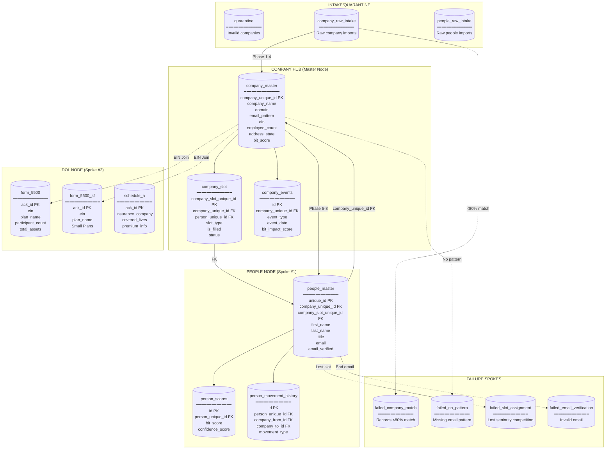
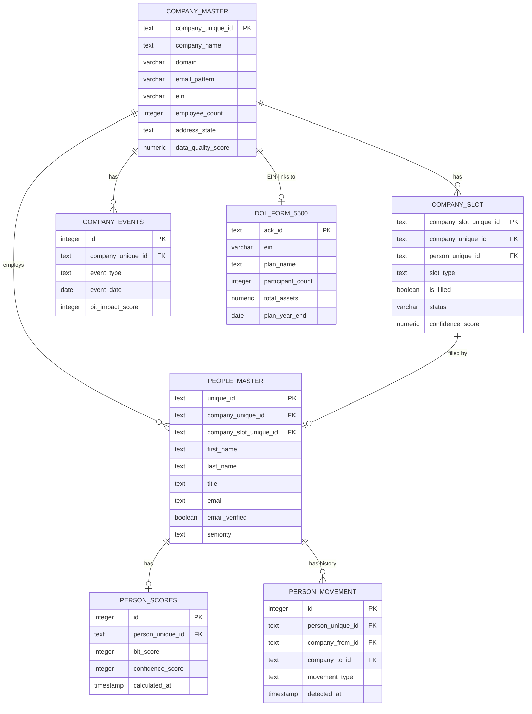

# Barton Outreach Core - Complete System ERD
## Hub-and-Spoke Architecture with All Tables and Pipelines

**Version:** 2.1.0
**Last Updated:** 2025-12-18
**Architecture:** Bicycle Wheel Doctrine v1.1

---

## Visual Architecture Overview

```
                                    MASTER HUB
                                        |
            +---------------------------+---------------------------+
            |                           |                           |
            v                           v                           v
    +---------------+           +---------------+           +---------------+
    |  PEOPLE NODE  |           |   DOL NODE    |           |  BLOG NODE    |
    |   (Spoke #1)  |           |  (Spoke #2)   |           |  (Spoke #3)   |
    |   [ACTIVE]    |           |   [ACTIVE]    |           |  [PLANNED]    |
    +-------+-------+           +-------+-------+           +---------------+
            |                           |
            v                           v
    +---------------+           +---------------+
    | Email Verify  |           | EIN Matcher   |
    |  (Sub-wheel)  |           | (Sub-wheel)   |
    +---------------+           +---------------+
            |                           |
            +---------------------------+
                           |
                           v
            +---------------------------+
            |      TALENT FLOW NODE     |
            |        (Spoke #4)         |
            |         [SHELL]           |
            +---------------------------+
                           |
            +---------------------------+
            |        BIT ENGINE         |
            |       (Spoke #5)          |
            |       [PLANNED]           |
            +---------------------------+
                           |
            +---------------------------+
            |      OUTREACH NODE        |
            |        (Spoke #6)         |
            |       [PLANNED]           |
            +---------------------------+
```

---

## Complete Hub-and-Spoke Mermaid Diagram



---

## Database Schema by Hub/Spoke

### 1. COMPANY HUB (marketing schema)

The **absolute central anchor** - all data gravitates here.

```
┌─────────────────────────────────────────────────────────────────────────────┐
│                           COMPANY HUB TABLES                                 │
├─────────────────────────────────────────────────────────────────────────────┤
│                                                                             │
│  ┌─────────────────────────────────────────────────────────────────────┐   │
│  │ company_master (453 rows) - PRIMARY HUB TABLE                       │   │
│  ├─────────────────────────────────────────────────────────────────────┤   │
│  │ company_unique_id    TEXT      PK   Barton ID: 04.04.01.XX.XXXXX.XXX│   │
│  │ company_name         TEXT      REQ  Normalized company name         │   │
│  │ website_url          TEXT      REQ  Primary website                 │   │
│  │ domain               VARCHAR   REQ  Validated domain (anchor field) │   │
│  │ email_pattern        VARCHAR   REQ  Pattern (anchor field)          │   │
│  │ ein                  VARCHAR        Federal EIN (links to DOL)      │   │
│  │ employee_count       INTEGER   REQ  Must be >= 50                   │   │
│  │ address_state        TEXT      REQ  PA, VA, MD, OH, WV, KY only     │   │
│  │ industry             TEXT           Industry classification          │   │
│  │ founded_year         INTEGER        Year founded (1700+)            │   │
│  │ linkedin_url         TEXT           Company LinkedIn page           │   │
│  │ data_quality_score   NUMERIC        Overall quality 0-100           │   │
│  │ email_pattern_source VARCHAR        hunter, manual, enrichment      │   │
│  │ created_at           TIMESTAMP      Record creation                 │   │
│  │ updated_at           TIMESTAMP      Last modification               │   │
│  │ validated_at         TIMESTAMP      When validated                  │   │
│  └─────────────────────────────────────────────────────────────────────┘   │
│                                    │                                        │
│                                    │ 1:N                                    │
│                                    ▼                                        │
│  ┌─────────────────────────────────────────────────────────────────────┐   │
│  │ company_slot (1,359 rows) - SLOT SUB-WHEEL                          │   │
│  ├─────────────────────────────────────────────────────────────────────┤   │
│  │ company_slot_unique_id  TEXT    PK   Barton ID: 04.04.05.XX.XXXXX   │   │
│  │ company_unique_id       TEXT    FK   → company_master               │   │
│  │ person_unique_id        TEXT    FK   → people_master (nullable)     │   │
│  │ slot_type               TEXT    REQ  CHRO, HR_MANAGER, BENEFITS...  │   │
│  │ is_filled               BOOLEAN      Is someone in slot?            │   │
│  │ status                  VARCHAR      open, filled, vacated          │   │
│  │ confidence_score        NUMERIC      Assignment confidence 0-100    │   │
│  │ filled_at               TIMESTAMP    When slot was filled           │   │
│  │ vacated_at              TIMESTAMP    When person left               │   │
│  │ enrichment_attempts     INTEGER      Enrichment attempt count       │   │
│  │ last_refreshed_at       TIMESTAMP    Last enrichment refresh        │   │
│  └─────────────────────────────────────────────────────────────────────┘   │
│                                                                             │
│  ┌─────────────────────────────────────────────────────────────────────┐   │
│  │ company_events (0 rows) - NEWS/BLOG SIGNALS                         │   │
│  ├─────────────────────────────────────────────────────────────────────┤   │
│  │ id                      INTEGER  PK  Auto-increment                 │   │
│  │ company_unique_id       TEXT     FK  → company_master               │   │
│  │ event_type              TEXT         funding, acquisition, layoff...│   │
│  │ event_date              DATE         When event occurred            │   │
│  │ source_url              TEXT         Source article                 │   │
│  │ summary                 TEXT         Event summary                  │   │
│  │ detected_at             TIMESTAMP    When detected                  │   │
│  │ impacts_bit             BOOLEAN      Affects BIT score?             │   │
│  │ bit_impact_score        INTEGER      Impact: -100 to +100           │   │
│  └─────────────────────────────────────────────────────────────────────┘   │
│                                                                             │
│  ┌─────────────────────────────────────────────────────────────────────┐   │
│  │ pipeline_events (2,185 rows) - AUDIT TRAIL                          │   │
│  ├─────────────────────────────────────────────────────────────────────┤   │
│  │ id, event_type, phase, correlation_id, company_id, person_id,       │   │
│  │ timestamp, metadata, duration_ms                                    │   │
│  └─────────────────────────────────────────────────────────────────────┘   │
│                                                                             │
└─────────────────────────────────────────────────────────────────────────────┘
```

### 2. PEOPLE NODE - Spoke #1 (people schema)

```
┌─────────────────────────────────────────────────────────────────────────────┐
│                          PEOPLE NODE TABLES                                  │
├─────────────────────────────────────────────────────────────────────────────┤
│                                                                             │
│  ┌─────────────────────────────────────────────────────────────────────┐   │
│  │ people_master (170 rows) - PEOPLE HUB TABLE                         │   │
│  ├─────────────────────────────────────────────────────────────────────┤   │
│  │ unique_id              TEXT      PK   Barton ID: 04.04.02.XX.XXXXX  │   │
│  │ company_unique_id      TEXT      FK   → company_master (REQUIRED)   │   │
│  │ company_slot_unique_id TEXT      FK   → company_slot (REQUIRED)     │   │
│  │ first_name             TEXT      REQ  First name                    │   │
│  │ last_name              TEXT      REQ  Last name                     │   │
│  │ full_name              TEXT           Display name                  │   │
│  │ title                  TEXT           Job title                     │   │
│  │ seniority              TEXT           CHRO > VP > Director > Mgr    │   │
│  │ department             TEXT           HR, Finance, etc.             │   │
│  │ email                  TEXT           Verified email address        │   │
│  │ email_verified         BOOLEAN        Verification status           │   │
│  │ email_verified_at      TIMESTAMP      When verified                 │   │
│  │ email_verification_src TEXT           millionverifier, manual       │   │
│  │ work_phone_e164        TEXT           Work phone (E.164)            │   │
│  │ linkedin_url           TEXT           LinkedIn profile              │   │
│  │ created_at             TIMESTAMP      Record creation               │   │
│  │ updated_at             TIMESTAMP      Last modification             │   │
│  └─────────────────────────────────────────────────────────────────────┘   │
│                                    │                                        │
│                                    │ 1:1                                    │
│                                    ▼                                        │
│  ┌─────────────────────────────────────────────────────────────────────┐   │
│  │ person_scores (0 rows) - BIT SCORES SUB-WHEEL                       │   │
│  ├─────────────────────────────────────────────────────────────────────┤   │
│  │ id                     INTEGER  PK   Auto-increment                 │   │
│  │ person_unique_id       TEXT     FK   → people_master (UNIQUE)       │   │
│  │ bit_score              INTEGER       BIT score 0-100                │   │
│  │ confidence_score       INTEGER       Data confidence 0-100          │   │
│  │ calculated_at          TIMESTAMP     When calculated                │   │
│  │ score_factors          JSONB         Breakdown of factors           │   │
│  └─────────────────────────────────────────────────────────────────────┘   │
│                                    │                                        │
│                                    │ 1:N                                    │
│                                    ▼                                        │
│  ┌─────────────────────────────────────────────────────────────────────┐   │
│  │ person_movement_history (0 rows) - TALENT FLOW SUB-WHEEL            │   │
│  ├─────────────────────────────────────────────────────────────────────┤   │
│  │ id                     INTEGER  PK   Auto-increment                 │   │
│  │ person_unique_id       TEXT     FK   → people_master                │   │
│  │ linkedin_url           TEXT          LinkedIn URL at detection      │   │
│  │ company_from_id        TEXT     FK   → company_master (source)      │   │
│  │ company_to_id          TEXT     FK   → company_master (dest)        │   │
│  │ title_from             TEXT          Previous title                 │   │
│  │ title_to               TEXT          New title                      │   │
│  │ movement_type          TEXT          company_change, title_change   │   │
│  │ detected_at            TIMESTAMP     Detection time                 │   │
│  │ raw_payload            JSONB         Raw enrichment data            │   │
│  └─────────────────────────────────────────────────────────────────────┘   │
│                                                                             │
│  ┌─────────────────────────────────────────────────────────────────────┐   │
│  │ people_resolution_queue (1,206 rows) - MANUAL REVIEW QUEUE          │   │
│  ├─────────────────────────────────────────────────────────────────────┤   │
│  │ id, person_data, resolution_status, hold_reason, created_at         │   │
│  └─────────────────────────────────────────────────────────────────────┘   │
│                                                                             │
└─────────────────────────────────────────────────────────────────────────────┘
```

### 3. DOL NODE - Spoke #2 (dol schema)

```
┌─────────────────────────────────────────────────────────────────────────────┐
│                            DOL NODE TABLES                                   │
│                        (2.4M+ rows total)                                    │
├─────────────────────────────────────────────────────────────────────────────┤
│                                                                             │
│  ┌─────────────────────────────────────────────────────────────────────┐   │
│  │ form_5500 (230,009 rows) - LARGE RETIREMENT PLANS                   │   │
│  ├─────────────────────────────────────────────────────────────────────┤   │
│  │ ack_id                 TEXT      PK   DOL acknowledgment ID         │   │
│  │ ein                    VARCHAR        Employer ID (links to company)│   │
│  │ plan_number            VARCHAR        Plan identifier               │   │
│  │ plan_name              TEXT           Plan name                     │   │
│  │ sponsor_dfe_name       TEXT           Sponsor/employer name         │   │
│  │ sponsor_dfe_ein        VARCHAR        Sponsor EIN                   │   │
│  │ spons_dfe_mail_us_city TEXT           City                          │   │
│  │ spons_dfe_mail_us_state TEXT          State                         │   │
│  │ tot_partcp_boy_cnt     INTEGER        Participant count (BOY)       │   │
│  │ tot_assets_boy_amt     NUMERIC        Total assets (BOY)            │   │
│  │ plan_eff_date          DATE           Plan effective date           │   │
│  │ form_plan_year_begin   DATE           Plan year begin               │   │
│  │ form_plan_year_end     DATE           Plan year end (renewal date)  │   │
│  │ type_pension_bnft_code VARCHAR        Pension benefit type code     │   │
│  │ type_welfare_bnft_code VARCHAR        Welfare benefit type code     │   │
│  └─────────────────────────────────────────────────────────────────────┘   │
│                                                                             │
│  ┌─────────────────────────────────────────────────────────────────────┐   │
│  │ form_5500_sf (759,569 rows) - SMALL RETIREMENT PLANS                │   │
│  ├─────────────────────────────────────────────────────────────────────┤   │
│  │ (Same structure as form_5500 - for plans <100 participants)         │   │
│  └─────────────────────────────────────────────────────────────────────┘   │
│                                                                             │
│  ┌─────────────────────────────────────────────────────────────────────┐   │
│  │ schedule_a (336,817 rows) - INSURANCE CONTRACT INFORMATION          │   │
│  ├─────────────────────────────────────────────────────────────────────┤   │
│  │ ack_id                 TEXT      PK   DOL acknowledgment ID         │   │
│  │ insurance_company_name TEXT           Insurance carrier name        │   │
│  │ prov_contract_num      VARCHAR        Contract number               │   │
│  │ covered_persons_cnt    INTEGER        Covered lives                 │   │
│  │ premium_amount         NUMERIC        Premium information           │   │
│  │ commission_amount      NUMERIC        Broker commission             │   │
│  └─────────────────────────────────────────────────────────────────────┘   │
│                                                                             │
│  ── Link to Company Hub via EIN ──                                         │
│  company_master.ein = form_5500.sponsor_dfe_ein                            │
│                                                                             │
└─────────────────────────────────────────────────────────────────────────────┘
```

### 4. INTAKE/QUARANTINE (intake schema)

```
┌─────────────────────────────────────────────────────────────────────────────┐
│                        INTAKE/QUARANTINE TABLES                              │
├─────────────────────────────────────────────────────────────────────────────┤
│                                                                             │
│  ┌─────────────────────────────────────────────────────────────────────┐   │
│  │ quarantine (114 rows) - INVALID/REJECTED COMPANIES                  │   │
│  ├─────────────────────────────────────────────────────────────────────┤   │
│  │ id, company_data, rejection_reason, quarantine_date, reviewed_by    │   │
│  └─────────────────────────────────────────────────────────────────────┘   │
│                                                                             │
│  ┌─────────────────────────────────────────────────────────────────────┐   │
│  │ company_raw_intake (563 rows) - RAW COMPANY IMPORTS                 │   │
│  ├─────────────────────────────────────────────────────────────────────┤   │
│  │ id, raw_company_name, raw_domain, raw_address, source, import_date  │   │
│  └─────────────────────────────────────────────────────────────────────┘   │
│                                                                             │
│  ┌─────────────────────────────────────────────────────────────────────┐   │
│  │ people_raw_intake (0 rows) - RAW PEOPLE IMPORTS                     │   │
│  ├─────────────────────────────────────────────────────────────────────┤   │
│  │ id, raw_name, raw_title, raw_company, source, import_date           │   │
│  └─────────────────────────────────────────────────────────────────────┘   │
│                                                                             │
└─────────────────────────────────────────────────────────────────────────────┘
```

---

## Pipeline Flow Diagram

```
┌─────────────────────────────────────────────────────────────────────────────┐
│                         COMPLETE PIPELINE FLOW                               │
└─────────────────────────────────────────────────────────────────────────────┘

                         RAW DATA INTAKE
                              │
                              ▼
┌─────────────────────────────────────────────────────────────────────────────┐
│                    COMPANY IDENTITY PIPELINE (Phases 1-4)                    │
│                         *** ALWAYS RUNS FIRST ***                            │
├─────────────────────────────────────────────────────────────────────────────┤
│                                                                             │
│  ┌─────────────┐    ┌─────────────┐    ┌─────────────┐    ┌─────────────┐  │
│  │  PHASE 1    │    │  PHASE 2    │    │  PHASE 3    │    │  PHASE 4    │  │
│  │  Company    │───▶│  Domain     │───▶│  Email      │───▶│  Pattern    │  │
│  │  Matching   │    │  Resolution │    │  Pattern    │    │  Verify     │  │
│  │             │    │             │    │  Waterfall  │    │             │  │
│  └──────┬──────┘    └──────┬──────┘    └──────┬──────┘    └──────┬──────┘  │
│         │                  │                  │                  │         │
│         ▼                  ▼                  ▼                  ▼         │
│    ┌─────────┐       ┌─────────┐       ┌─────────┐       ┌─────────┐      │
│    │ FAILURE │       │ FAILURE │       │ FAILURE │       │ OUTPUT  │      │
│    │ <80%    │       │ No      │       │ No      │       │company_ │      │
│    │ match   │       │ domain  │       │ pattern │       │ master  │      │
│    └─────────┘       └─────────┘       └─────────┘       └─────────┘      │
│                                                                             │
│  Phase 1b: Unmatched Hold Export (CSV staging for manual review)           │
│                                                                             │
└─────────────────────────────────────────────────────────────────────────────┘
                              │
                              │ company_id + domain + email_pattern
                              ▼
┌─────────────────────────────────────────────────────────────────────────────┐
│                      PEOPLE PIPELINE (Phases 5-8)                            │
│                  *** ONLY RUNS AFTER COMPANY ANCHOR ***                      │
├─────────────────────────────────────────────────────────────────────────────┤
│                                                                             │
│  ┌─────────────┐    ┌─────────────┐    ┌─────────────┐    ┌─────────────┐  │
│  │  PHASE 5    │    │  PHASE 6    │    │  PHASE 7    │    │  PHASE 8    │  │
│  │  Email      │───▶│  Slot       │───▶│  Enrichment │───▶│  Output     │  │
│  │  Generation │    │  Assignment │    │  Queue      │    │  Writer     │  │
│  │             │    │             │    │             │    │             │  │
│  └──────┬──────┘    └──────┬──────┘    └──────┬──────┘    └──────┬──────┘  │
│         │                  │                  │                  │         │
│         ▼                  ▼                  ▼                  ▼         │
│    ┌─────────┐       ┌─────────┐       ┌─────────┐       ┌─────────┐      │
│    │ No      │       │ Lost    │       │ Retry   │       │ people_ │      │
│    │ pattern │       │ slot    │       │ queue   │       │ master  │      │
│    │ failure │       │ failure │       │         │       │ output  │      │
│    └─────────┘       └─────────┘       └─────────┘       └─────────┘      │
│                                                                             │
└─────────────────────────────────────────────────────────────────────────────┘
                              │
                              │ All signals
                              ▼
┌─────────────────────────────────────────────────────────────────────────────┐
│                           BIT ENGINE                                         │
│              (Buyer Intent Tool - Score Calculation)                         │
├─────────────────────────────────────────────────────────────────────────────┤
│                                                                             │
│  INPUTS:                              OUTPUT:                               │
│  ├─ People signals (slot fills)       ├─ BIT Score (0-100)                 │
│  ├─ DOL signals (renewals)            ├─ Trigger flags                     │
│  ├─ Blog signals (events)             └─ Recommended action                │
│  └─ Talent signals (movements)                                              │
│                                                                             │
└─────────────────────────────────────────────────────────────────────────────┘
```

---

## Slot Type Hierarchy

```
┌─────────────────────────────────────────────────────────────────────────────┐
│                          SLOT TYPE HIERARCHY                                 │
│                    (Seniority-based assignment)                              │
├─────────────────────────────────────────────────────────────────────────────┤
│                                                                             │
│  COMPANY_ID                                                                 │
│      │                                                                      │
│      ├── SLOT: CHRO (Seniority: 100)                                       │
│      │   └── Chief HR Officer, VP HR, SVP HR                               │
│      │                                                                      │
│      ├── SLOT: HR_MANAGER (Seniority: 80)                                  │
│      │   └── HR Director, HR Manager, HR Lead                              │
│      │                                                                      │
│      ├── SLOT: BENEFITS_LEAD (Seniority: 60)                               │
│      │   └── Benefits Manager, Benefits Director, Total Rewards            │
│      │                                                                      │
│      ├── SLOT: PAYROLL_ADMIN (Seniority: 50)                               │
│      │   └── Payroll Manager, Payroll Director                             │
│      │                                                                      │
│      └── SLOT: HR_SUPPORT (Seniority: 30)                                  │
│          └── HR Coordinator, HR Specialist, HR Generalist, HRBP            │
│                                                                             │
│  RULE: One person per slot per company                                      │
│  CONFLICT: Higher seniority wins (must exceed by min_seniority_diff: 10)   │
│                                                                             │
└─────────────────────────────────────────────────────────────────────────────┘
```

---

## Entity Relationship Diagram (Mermaid)



---

## Complete Table Summary

| Schema | Table | Rows | Purpose | Key Relationships |
|--------|-------|------|---------|-------------------|
| **marketing** | company_master | 453 | **MASTER HUB** | PK: company_unique_id |
| **marketing** | company_slot | 1,359 | Slot assignments | FK: company_unique_id, person_unique_id |
| **marketing** | company_events | 0 | News/blog signals | FK: company_unique_id |
| **marketing** | pipeline_events | 2,185 | Audit trail | FK: company_id, person_id |
| **people** | people_master | 170 | People records | FK: company_unique_id, company_slot_unique_id |
| **people** | person_scores | 0 | BIT scores | FK: person_unique_id |
| **people** | person_movement_history | 0 | Job changes | FK: person_unique_id, company_from_id, company_to_id |
| **people** | people_resolution_queue | 1,206 | Manual review | FK: various |
| **dol** | form_5500 | 230,009 | Large plans | Join: ein → company_master.ein |
| **dol** | form_5500_sf | 759,569 | Small plans | Join: ein → company_master.ein |
| **dol** | schedule_a | 336,817 | Insurance info | Join: ack_id → form_5500.ack_id |
| **intake** | quarantine | 114 | Invalid records | - |
| **intake** | company_raw_intake | 563 | Raw imports | Pipeline input |
| **intake** | people_raw_intake | 0 | Raw imports | Pipeline input |

**Total: 31 tables, 2.4M+ rows across 5 schemas**

---

## The Golden Rule

```
┌─────────────────────────────────────────────────────────────────────────────┐
│                                                                             │
│   IF company_id IS NULL OR domain IS NULL OR email_pattern IS NULL:        │
│                                                                             │
│       STOP. DO NOT PROCEED.                                                │
│       → Route to Company Identity Pipeline first.                          │
│                                                                             │
│   NO spoke pipeline should EVER process a record that lacks                │
│   a valid company anchor.                                                  │
│                                                                             │
└─────────────────────────────────────────────────────────────────────────────┘
```

---

## Barton ID Format Reference

| Entity | Schema | Format | Example |
|--------|--------|--------|---------|
| Company | 01 | `04.04.01.XX.XXXXX.XXX` | 04.04.01.04.30001.001 |
| Person | 02 | `04.04.02.XX.XXXXX.XXX` | 04.04.02.04.20001.001 |
| Slot | 05 | `04.04.05.XX.XXXXX.XXX` | 04.04.05.04.10001.001 |

---

*Generated: 2025-12-18 | Barton Outreach Core v2.1 | Bicycle Wheel Doctrine v1.1*
