# Master ERD - Complete Database Architecture

**Status**: CANONICAL REFERENCE
**Version**: 1.0.0
**Last Updated**: 2026-01-28
**Authority**: Barton Doctrine v1.1

---

## How to Use This Document

**AI AGENTS**: Read this document FIRST before any database work. This is the single source of truth.

**HUMANS**: This document answers "where does X live?" and "how do I join X to Y?"

---

## §1 Schema Overview

| Schema | Purpose | Master ID | Connection to Outreach |
|--------|---------|-----------|------------------------|
| `outreach` | Outreach operational spine | `outreach_id` | **THIS IS THE SPINE** |
| `cl` | Company Lifecycle (Authority) | `sovereign_company_id` | `outreach.outreach.sovereign_company_id` |
| `company` | Legacy company master | `company_unique_id` | **DISCONNECTED** - domain match only |
| `dol` | DOL Form 5500 filings | `ein` | `outreach.dol.ein` |
| `people` | People/contacts master | `person_unique_id` | `people.company_slot.outreach_id` |
| `bit` | BIT scoring/intent | varies | `bit.phase_state.company_unique_id` |
| `funnel` | Legacy funnel system | `suspect_id` | `funnel.appointment_history` |
| `shq` | Audit/error logging | `audit_id` | Shared infrastructure |
| `sales` | **LANE A** - Reactivation | `appointment_uid` | **ISOLATED** |
| `partners` | **LANE B** - Partners | `fractional_cfo_id` | **ISOLATED** |

---

## §2 Master ERD - Full System

```mermaid
erDiagram

    %% ═══════════════════════════════════════════════════════════════
    %% AUTHORITY LAYER (CL)
    %% ═══════════════════════════════════════════════════════════════

    CL_COMPANY_IDENTITY {
        uuid sovereign_company_id PK
        uuid outreach_id FK "WRITE-ONCE"
        uuid sales_process_id FK "WRITE-ONCE"
        uuid client_id FK "WRITE-ONCE"
        text canonical_name
        timestamptz created_at
    }

    %% ═══════════════════════════════════════════════════════════════
    %% OUTREACH SPINE (Primary Pipeline) - 46,494 commercial companies
    %% Cleaned 2026-01-27: Removed 5,067 duplicates + 1,210 non-commercial
    %% ═══════════════════════════════════════════════════════════════

    OUTREACH_OUTREACH {
        uuid outreach_id PK
        uuid sovereign_company_id FK
        text domain "Normalized, unique"
        timestamptz created_at
        timestamptz updated_at
    }

    OUTREACH_EXCLUDED {
        uuid outreach_id PK
        text company_name
        text domain
        text exclusion_reason "TLD or Keyword match"
        timestamptz excluded_at
    }

    OUTREACH_COMPANY_TARGET {
        uuid target_id PK
        uuid outreach_id FK
        uuid company_unique_id FK
        text outreach_status
        numeric bit_score_snapshot
        text email_method
        timestamptz created_at
    }

    OUTREACH_DOL {
        uuid id PK
        uuid outreach_id FK
        text ein
        boolean filing_present
        text funding_type
        text broker_or_advisor
        text carrier
        timestamptz created_at
    }

    OUTREACH_BLOG {
        uuid id PK
        uuid outreach_id FK
        text source_url
        text context_summary
        timestamptz created_at
    }

    OUTREACH_PEOPLE {
        uuid person_id PK
        uuid outreach_id FK
        uuid target_id FK
        text email
        boolean email_verified
        text contact_status
        text lifecycle_state
        timestamptz created_at
    }

    OUTREACH_BIT_SCORES {
        uuid id PK
        uuid outreach_id FK
        numeric score
        text score_tier
        timestamptz computed_at
    }

    %% ═══════════════════════════════════════════════════════════════
    %% DOL SCHEMA (Form 5500 Data)
    %% ═══════════════════════════════════════════════════════════════

    DOL_FORM_5500 {
        uuid filing_id PK
        text ack_id UK
        text sponsor_dfe_ein
        text sponsor_dfe_name
        text spons_dfe_mail_us_state
        text spons_dfe_mail_us_city
        text spons_dfe_mail_us_zip
        integer tot_active_partcp_cnt
        text form_year
    }

    DOL_FORM_5500_SF {
        uuid filing_id PK
        text ack_id UK
        text sf_spons_ein
        text sf_sponsor_name
        text sf_spons_us_state
        text sf_spons_us_city
        integer sf_tot_partcp_boy_cnt
        text form_year
    }

    DOL_SCHEDULE_A {
        uuid schedule_id PK
        uuid filing_id FK
        text insurance_company_name
        text insurance_company_ein
        text form_year
    }

    DOL_EIN_URLS {
        text ein PK
        text company_name
        text domain
        text url
        text discovery_method
    }

    %% ═══════════════════════════════════════════════════════════════
    %% PEOPLE SCHEMA
    %% ═══════════════════════════════════════════════════════════════

    PEOPLE_PEOPLE_MASTER {
        uuid person_unique_id PK
        text email
        text linkedin_url
        text first_name
        text last_name
        timestamptz created_at
    }

    PEOPLE_COMPANY_SLOT {
        uuid slot_id PK
        uuid outreach_id FK
        text company_unique_id
        text slot_type
        uuid person_unique_id FK
        boolean is_filled
        timestamptz created_at
    }

    %% ═══════════════════════════════════════════════════════════════
    %% BIT SCHEMA (Scoring & Intent)
    %% ═══════════════════════════════════════════════════════════════

    BIT_MOVEMENT_EVENTS {
        uuid movement_id PK
        text company_unique_id
        text source_hub
        text movement_class
        text pressure_class
        text domain
        numeric magnitude
        timestamptz detected_at
        timestamptz valid_until
    }

    BIT_PROOF_LINES {
        text proof_id PK
        text company_unique_id
        integer band
        text pressure_class
        text human_readable
        timestamptz valid_until
    }

    BIT_PHASE_STATE {
        text company_unique_id PK
        integer current_band
        text phase_status
        boolean dol_active
        boolean people_active
        boolean blog_active
        timestamptz updated_at
    }

    BIT_AUTHORIZATION_LOG {
        uuid log_id PK
        text company_unique_id
        text requested_action
        boolean authorized
        integer actual_band
        timestamptz requested_at
    }

    %% ═══════════════════════════════════════════════════════════════
    %% COMPANY SCHEMA (LEGACY - DISCONNECTED)
    %% ═══════════════════════════════════════════════════════════════

    COMPANY_COMPANY_MASTER {
        text company_unique_id PK "04.04.01.xx format"
        text website_url
        text ein
        text company_name
        text linkedin_url
        timestamptz created_at
    }

    %% ═══════════════════════════════════════════════════════════════
    %% SHQ SCHEMA (Shared Infrastructure)
    %% ═══════════════════════════════════════════════════════════════

    SHQ_AUDIT_LOG {
        uuid audit_id PK
        text schema_name
        text table_name
        text operation
        text record_id
        jsonb old_values
        jsonb new_values
        timestamptz performed_at
    }

    SHQ_ERROR_LOG {
        uuid error_id PK
        text hub
        text sub_hub
        text process_id
        text error_code
        text error_message
        timestamptz created_at
    }

    %% ═══════════════════════════════════════════════════════════════
    %% LANE A: APPOINTMENT REACTIVATION (ISOLATED)
    %% ═══════════════════════════════════════════════════════════════

    SALES_APPOINTMENT_HISTORY {
        text appointment_uid PK
        uuid company_id FK "Optional"
        uuid people_id FK "Optional"
        uuid outreach_id FK "Optional"
        date meeting_date
        text meeting_type
        text meeting_outcome
        text stalled_reason
        text source
        timestamptz created_at
    }

    BIT_REACTIVATION_INTENT {
        uuid reactivation_bit_id PK
        text appointment_uid FK
        numeric bit_score
        text eligibility_status
        text recommended_channel
        timestamptz computed_at
    }

    %% ═══════════════════════════════════════════════════════════════
    %% LANE B: FRACTIONAL CFO PARTNERS (ISOLATED)
    %% ═══════════════════════════════════════════════════════════════

    PARTNERS_FRACTIONAL_CFO_MASTER {
        uuid fractional_cfo_id PK
        text firm_name
        text primary_contact_name
        text linkedin_url
        text email
        text geography
        text niche_focus
        text status
        timestamptz created_at
    }

    PARTNERS_PARTNER_APPOINTMENTS {
        text partner_appointment_uid PK
        uuid fractional_cfo_id FK
        date meeting_date
        text meeting_type
        text outcome
        text notes
        timestamptz created_at
    }

    BIT_PARTNER_INTENT {
        uuid partner_bit_id PK
        uuid fractional_cfo_id FK
        numeric leverage_score
        text status
        timestamptz computed_at
    }

    %% ═══════════════════════════════════════════════════════════════
    %% RELATIONSHIPS
    %% ═══════════════════════════════════════════════════════════════

    %% CL → Outreach Spine
    CL_COMPANY_IDENTITY ||--o| OUTREACH_OUTREACH : "outreach_id"

    %% Outreach Spine → Sub-Hubs
    OUTREACH_OUTREACH ||--|| OUTREACH_COMPANY_TARGET : "outreach_id"
    OUTREACH_OUTREACH ||--o| OUTREACH_DOL : "outreach_id"
    OUTREACH_OUTREACH ||--|| OUTREACH_BLOG : "outreach_id"
    OUTREACH_OUTREACH ||--o{ OUTREACH_PEOPLE : "outreach_id"
    OUTREACH_OUTREACH ||--o| OUTREACH_BIT_SCORES : "outreach_id"
    OUTREACH_OUTREACH ||--o{ PEOPLE_COMPANY_SLOT : "outreach_id"

    %% Outreach People → Target
    OUTREACH_COMPANY_TARGET ||--o{ OUTREACH_PEOPLE : "target_id"

    %% People Slot → People Master
    PEOPLE_PEOPLE_MASTER ||--o{ PEOPLE_COMPANY_SLOT : "person_unique_id"

    %% DOL Internal
    DOL_FORM_5500 ||--o{ DOL_SCHEDULE_A : "filing_id"

    %% BIT Internal
    BIT_PHASE_STATE ||--o{ BIT_MOVEMENT_EVENTS : "company_unique_id"
    BIT_PHASE_STATE ||--o{ BIT_PROOF_LINES : "company_unique_id"

    %% Lane A (Reactivation) - ISOLATED
    SALES_APPOINTMENT_HISTORY ||--|| BIT_REACTIVATION_INTENT : "appointment_uid"

    %% Lane B (Partners) - ISOLATED
    PARTNERS_FRACTIONAL_CFO_MASTER ||--o{ PARTNERS_PARTNER_APPOINTMENTS : "fractional_cfo_id"
    PARTNERS_FRACTIONAL_CFO_MASTER ||--|| BIT_PARTNER_INTENT : "fractional_cfo_id"
```



---

## §3 Join Paths (How to Connect Tables)

### §3.1 Primary Join Chain (Outreach Pipeline)

```
START: outreach.outreach (outreach_id)
  │
  ├── outreach.company_target    → JOIN ON outreach_id
  ├── outreach.dol               → JOIN ON outreach_id
  ├── outreach.blog              → JOIN ON outreach_id
  ├── outreach.people            → JOIN ON outreach_id
  ├── outreach.bit_scores        → JOIN ON outreach_id
  └── people.company_slot        → JOIN ON outreach_id
```

**SQL Example: Full company profile**
```sql
SELECT
    o.outreach_id,
    o.company_name,
    o.domain,
    ct.outreach_status,
    ct.email_method,
    d.ein,
    d.filing_present,
    d.funding_type,
    b.source_url,
    bs.score AS bit_score
FROM outreach.outreach o
LEFT JOIN outreach.company_target ct ON ct.outreach_id = o.outreach_id
LEFT JOIN outreach.dol d ON d.outreach_id = o.outreach_id
LEFT JOIN outreach.blog b ON b.outreach_id = o.outreach_id
LEFT JOIN outreach.bit_scores bs ON bs.outreach_id = o.outreach_id
WHERE o.outreach_id = $1;
```

### §3.2 DOL to Outreach

```
dol.form_5500 (sponsor_dfe_ein)
  │
  ├── outreach.dol              → JOIN ON ein = sponsor_dfe_ein
  └── dol.ein_urls              → JOIN ON ein
```

**SQL Example: Get DOL filing with outreach context**
```sql
SELECT
    f.sponsor_dfe_name,
    f.sponsor_dfe_ein,
    f.tot_active_partcp_cnt,
    o.outreach_id,
    o.company_name
FROM dol.form_5500 f
JOIN outreach.dol od ON od.ein = f.sponsor_dfe_ein
JOIN outreach.outreach o ON o.outreach_id = od.outreach_id
WHERE f.spons_dfe_mail_us_state = 'PA';
```

### §3.3 People to Companies

```
people.people_master (person_unique_id)
  │
  └── people.company_slot       → JOIN ON person_unique_id
        │
        └── outreach.outreach   → JOIN ON outreach_id
```

**SQL Example: Get person's company**
```sql
SELECT
    pm.first_name,
    pm.last_name,
    pm.email,
    cs.slot_type,
    o.company_name
FROM people.people_master pm
JOIN people.company_slot cs ON cs.person_unique_id = pm.person_unique_id
JOIN outreach.outreach o ON o.outreach_id = cs.outreach_id
WHERE pm.person_unique_id = $1;
```

### §3.4 BIT Phase State

```
bit.phase_state (company_unique_id)
  │
  ├── bit.movement_events       → JOIN ON company_unique_id
  ├── bit.proof_lines           → JOIN ON company_unique_id
  └── outreach.company_target   → JOIN ON company_unique_id::uuid
```

**SQL Example: Get company BIT state**
```sql
SELECT
    ps.company_unique_id,
    ps.current_band,
    ps.phase_status,
    ps.dol_active,
    ps.people_active,
    ct.outreach_status
FROM bit.phase_state ps
JOIN outreach.company_target ct ON ct.company_unique_id = ps.company_unique_id::uuid
WHERE ps.current_band >= 3;
```

---

## §4 ISOLATED LANES (No Connection to Outreach Spine)

### §4.1 Lane A: Appointment Reactivation

**Schema**: `sales.*`
**BIT Table**: `bit.reactivation_intent`
**View**: `bit.v_reactivation_ready`

```
sales.appointment_history (appointment_uid)
  │
  └── bit.reactivation_intent   → JOIN ON appointment_uid
```

**Optional FKs** (for analytics only):
- `company_id` → CAN link to company data
- `people_id` → CAN link to people data
- `outreach_id` → CAN link to outreach spine

**SQL Example: Get reactivation queue**
```sql
SELECT * FROM bit.v_reactivation_ready
WHERE eligibility_status = 'eligible'
ORDER BY bit_score DESC;
```

### §4.2 Lane B: Fractional CFO Partners

**Schema**: `partners.*`
**BIT Table**: `bit.partner_intent`
**View**: `bit.v_partner_outreach_ready`

```
partners.fractional_cfo_master (fractional_cfo_id)
  │
  ├── partners.partner_appointments → JOIN ON fractional_cfo_id
  └── bit.partner_intent            → JOIN ON fractional_cfo_id
```

**NO FKs to outreach pipeline. Completely isolated.**

**SQL Example: Get partner outreach queue**
```sql
SELECT * FROM bit.v_partner_outreach_ready
WHERE intent_status = 'active'
ORDER BY leverage_score DESC;
```

---

## §5 DISCONNECTED TABLE: company.company_master

⚠️ **WARNING**: This table uses a different ID format and does NOT connect via FK.

| Property | Value |
|----------|-------|
| ID Format | `04.04.01.xx.xxxxx.xxx` (TEXT, not UUID) |
| Connection Method | **Domain matching only** |
| Records | 74,641 |
| EIN Coverage | ~27% |

**How to match to outreach**:
```sql
-- Domain matching (normalize both sides)
SELECT
    cm.company_unique_id,
    cm.company_name,
    cm.ein,
    o.outreach_id,
    o.domain
FROM company.company_master cm
JOIN outreach.outreach o ON
    REPLACE(LOWER(cm.website_url), 'https://', '') =
    REPLACE(REPLACE(LOWER(o.domain), 'www.', ''), 'https://', '')
WHERE cm.ein IS NOT NULL;
```

---

## §6 Quick Reference Tables

### §6.1 Find Data by Type

| Data Type | Primary Location | Join Path |
|-----------|------------------|-----------|
| Company name | `outreach.outreach.company_name` | Direct |
| Domain/URL | `outreach.outreach.domain` | Direct |
| EIN | `outreach.dol.ein` | `outreach_id` |
| DOL filing details | `dol.form_5500` | `ein` → `outreach.dol` |
| Email pattern | `outreach.company_target.email_method` | `outreach_id` |
| Person email | `people.people_master.email` | `person_unique_id` → `company_slot` |
| BIT score | `outreach.bit_scores.score` | `outreach_id` |
| BIT band | `bit.phase_state.current_band` | `company_unique_id` |
| Renewal date | `dol.renewal_calendar.renewal_date` | `company_unique_id` |
| Reactivation candidate | `bit.v_reactivation_ready` | Direct (Lane A) |
| Partner candidate | `bit.v_partner_outreach_ready` | Direct (Lane B) |

### §6.2 Table Counts (As of 2026-01-28)

| Table | Records | Notes |
|-------|---------|-------|
| `outreach.outreach` | 51,148 | **THE SPINE** |
| `outreach.company_target` | 51,148 | 91% email_method |
| `outreach.dol` | 13,829 | 27% coverage |
| `outreach.blog` | 51,148 | 100% coverage |
| `outreach.people` | 426 | Active contacts |
| `outreach.bit_scores` | 17,227 | Scored companies |
| `dol.form_5500` | 230,482 | Large filers |
| `dol.form_5500_sf` | 760,652 | Small filers |
| `dol.ein_urls` | 119,409 | EIN→URL mapping |
| `people.people_master` | 26,299 | All people |
| `people.company_slot` | 153,444 | Slot assignments |
| `company.company_master` | 74,641 | **DISCONNECTED** |
| `sales.appointment_history` | 0 | Lane A (new) |
| `partners.fractional_cfo_master` | 0 | Lane B (new) |

---

## §7 Common Queries

### Get company with all sub-hub data
```sql
SELECT
    o.outreach_id,
    o.company_name,
    o.domain,
    ct.outreach_status,
    ct.email_method,
    ct.bit_score_snapshot,
    d.ein,
    d.filing_present,
    d.funding_type,
    d.broker_or_advisor,
    d.carrier,
    b.source_url,
    b.context_summary,
    bs.score AS current_bit_score,
    ps.current_band,
    ps.phase_status
FROM outreach.outreach o
LEFT JOIN outreach.company_target ct ON ct.outreach_id = o.outreach_id
LEFT JOIN outreach.dol d ON d.outreach_id = o.outreach_id
LEFT JOIN outreach.blog b ON b.outreach_id = o.outreach_id
LEFT JOIN outreach.bit_scores bs ON bs.outreach_id = o.outreach_id
LEFT JOIN bit.phase_state ps ON ps.company_unique_id = ct.company_unique_id::text
WHERE o.outreach_id = $1;
```

### Get all contacts for a company
```sql
SELECT
    pm.first_name,
    pm.last_name,
    pm.email,
    pm.linkedin_url,
    cs.slot_type,
    cs.is_filled,
    op.contact_status,
    op.lifecycle_state
FROM people.company_slot cs
JOIN people.people_master pm ON pm.person_unique_id = cs.person_unique_id
LEFT JOIN outreach.people op ON op.outreach_id = cs.outreach_id
WHERE cs.outreach_id = $1;
```

### Get DOL filing history for a company
```sql
SELECT
    f.form_year,
    f.sponsor_dfe_name,
    f.tot_active_partcp_cnt,
    f.plan_name,
    sa.insurance_company_name AS broker
FROM dol.form_5500 f
LEFT JOIN dol.schedule_a sa ON sa.filing_id = f.filing_id
JOIN outreach.dol od ON od.ein = f.sponsor_dfe_ein
WHERE od.outreach_id = $1
ORDER BY f.form_year DESC;
```

### Get reactivation candidates (Lane A)
```sql
SELECT
    ah.appointment_uid,
    ah.company_id,
    ah.people_id,
    ah.meeting_date,
    ah.meeting_type,
    ah.meeting_outcome,
    ah.stalled_reason,
    ri.bit_score,
    ri.recommended_channel,
    ri.eligibility_status,
    (CURRENT_DATE - ah.meeting_date) AS days_since_meeting
FROM sales.appointment_history ah
JOIN bit.reactivation_intent ri ON ri.appointment_uid = ah.appointment_uid
WHERE ri.eligibility_status = 'eligible'
ORDER BY ri.bit_score DESC;
```

### Get partner outreach queue (Lane B)
```sql
SELECT
    fcm.fractional_cfo_id,
    fcm.firm_name,
    fcm.primary_contact_name,
    fcm.linkedin_url,
    fcm.email,
    fcm.geography,
    fcm.niche_focus,
    fcm.status AS partner_status,
    pi.leverage_score,
    pi.recommended_next_action,
    pi.status AS intent_status
FROM partners.fractional_cfo_master fcm
JOIN bit.partner_intent pi ON pi.fractional_cfo_id = fcm.fractional_cfo_id
WHERE pi.status = 'active'
ORDER BY pi.leverage_score DESC;
```

---

## §8 Rules (HARD LAW)

### §8.1 DO

| Rule | Enforcement |
|------|-------------|
| Always join via `outreach_id` for outreach pipeline | FK constraint |
| Use `ein` to join DOL tables | Index on ein |
| Use `person_unique_id` for people joins | FK constraint |
| Use views for Lane A/B outreach queues | Pre-built views |

### §8.2 DO NOT

| Violation | Why |
|-----------|-----|
| Join `company.company_master` via FK | Different ID format |
| Create cross-lane FKs (sales ↔ partners) | Lane isolation |
| Join `sales.*` to `outreach.outreach` | Lane A is isolated |
| Join `partners.*` to any existing table | Lane B is isolated |
| Bypass views for marketing eligibility | Kill switch enforcement |

---

## §9 Document Control

| Field | Value |
|-------|-------|
| Created | 2026-01-28 |
| Last Modified | 2026-01-28 |
| Version | 1.0.0 |
| Status | CANONICAL REFERENCE |
| Authority | Barton Doctrine v1.1 |
| Change Protocol | ADR REQUIRED |

---

## §10 File References

| Document | Purpose |
|----------|---------|
| `docs/DATA_ARCHITECTURE.md` | Outreach spine architecture |
| `docs/DATA_REGISTRY.md` | Schema quick reference |
| `docs/architecture/DUAL_LANE_ARCHITECTURE.md` | Lane A/B isolation rules |
| `neon/migrations/` | All schema definitions |
| `doctrine/DO_NOT_MODIFY_REGISTRY.md` | Frozen components |
