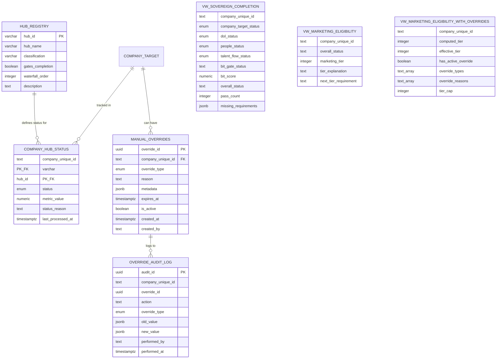

# Sovereign Completion - Entity Relationship Diagram

## Version: 1.0.0
## Last Updated: 2026-01-19
## Architecture: CL Parent-Child Doctrine v1.1

---

## Visual Architecture Overview

```
┌─────────────────────────────────────────────────────────────────────────────┐
│                     SOVEREIGN COMPLETION ARCHITECTURE                        │
├─────────────────────────────────────────────────────────────────────────────┤
│                                                                             │
│   ┌─────────────────────────────────────────────────────────────────────┐  │
│   │                     HUB REGISTRY (6 hubs)                            │  │
│   │  ┌──────────────┐ ┌──────────────┐ ┌──────────────┐ ┌─────────────┐ │  │
│   │  │company-target│ │ dol-filings  │ │   people     │ │ talent-flow │ │  │
│   │  │  REQUIRED    │ │  REQUIRED    │ │  REQUIRED    │ │  REQUIRED   │ │  │
│   │  │  order: 1    │ │  order: 2    │ │  order: 3    │ │  order: 4   │ │  │
│   │  └──────────────┘ └──────────────┘ └──────────────┘ └─────────────┘ │  │
│   │  ┌──────────────┐ ┌──────────────┐                                  │  │
│   │  │ blog-content │ │bit-enrichment│                                  │  │
│   │  │  OPTIONAL    │ │  OPTIONAL    │                                  │  │
│   │  │  order: 5    │ │  order: 6    │                                  │  │
│   │  └──────────────┘ └──────────────┘                                  │  │
│   └─────────────────────────────────────────────────────────────────────┘  │
│                                    │                                        │
│                                    │ hub_id                                 │
│                                    ▼                                        │
│   ┌─────────────────────────────────────────────────────────────────────┐  │
│   │              COMPANY HUB STATUS (135,684 rows)                       │  │
│   │  ┌─────────────────────────────────────────────────────────────────┐│  │
│   │  │ company_unique_id (TEXT) ──────────────────► company_target     ││  │
│   │  │ hub_id (VARCHAR) ──────────────────────────► hub_registry       ││  │
│   │  │ status (hub_status_enum) ── PASS | IN_PROGRESS | FAIL | BLOCKED ││  │
│   │  │ metric_value (NUMERIC) ── Hub-specific metric                   ││  │
│   │  │ status_reason (TEXT) ── Human-readable explanation              ││  │
│   │  │ last_processed_at (TIMESTAMPTZ)                                 ││  │
│   │  └─────────────────────────────────────────────────────────────────┘│  │
│   └─────────────────────────────────────────────────────────────────────┘  │
│                                    │                                        │
│                                    │ Aggregates                             │
│                                    ▼                                        │
│   ┌─────────────────────────────────────────────────────────────────────┐  │
│   │           vw_sovereign_completion (33,922 rows)                      │  │
│   │  ┌─────────────────────────────────────────────────────────────────┐│  │
│   │  │ company_unique_id                                               ││  │
│   │  │ company_target_status | dol_status | people_status | tf_status  ││  │
│   │  │ bit_gate_status | bit_score                                     ││  │
│   │  │ overall_status ── COMPLETE | IN_PROGRESS | BLOCKED              ││  │
│   │  │ pass_count | fail_count | blocked_count | in_progress_count     ││  │
│   │  │ missing_requirements (JSONB)                                    ││  │
│   │  └─────────────────────────────────────────────────────────────────┘│  │
│   └─────────────────────────────────────────────────────────────────────┘  │
│                                    │                                        │
│                                    │ Derives                                │
│                                    ▼                                        │
│   ┌─────────────────────────────────────────────────────────────────────┐  │
│   │           vw_marketing_eligibility (33,922 rows)                     │  │
│   │  ┌─────────────────────────────────────────────────────────────────┐│  │
│   │  │ company_unique_id                                               ││  │
│   │  │ marketing_tier ── -1 | 0 | 1 | 2 | 3                            ││  │
│   │  │ tier_explanation (TEXT)                                         ││  │
│   │  │ next_tier_requirement (TEXT)                                    ││  │
│   │  └─────────────────────────────────────────────────────────────────┘│  │
│   └─────────────────────────────────────────────────────────────────────┘  │
│                                    │                                        │
│                                    │ Applies overrides                      │
│                                    ▼                                        │
│   ┌─────────────────────────────────────────────────────────────────────┐  │
│   │    vw_marketing_eligibility_with_overrides (33,922 rows)             │  │
│   │    *** AUTHORITATIVE VIEW - USE THIS FOR MARKETING DECISIONS ***     │  │
│   │  ┌─────────────────────────────────────────────────────────────────┐│  │
│   │  │ company_unique_id                                               ││  │
│   │  │ computed_tier ── Original tier from vw_marketing_eligibility    ││  │
│   │  │ effective_tier ── After kill switch application                 ││  │
│   │  │ has_active_override (BOOLEAN)                                   ││  │
│   │  │ override_types (TEXT[]) | override_reasons (TEXT[])             ││  │
│   │  │ tier_cap (INTEGER) | effective_tier_explanation (TEXT)          ││  │
│   │  └─────────────────────────────────────────────────────────────────┘│  │
│   └─────────────────────────────────────────────────────────────────────┘  │
│                                                                             │
└─────────────────────────────────────────────────────────────────────────────┘
```

---

## Kill Switch Architecture

```
┌─────────────────────────────────────────────────────────────────────────────┐
│                         KILL SWITCH ARCHITECTURE                             │
├─────────────────────────────────────────────────────────────────────────────┤
│                                                                             │
│   ┌─────────────────────────────────────────────────────────────────────┐  │
│   │                    manual_overrides                                  │  │
│   │  ┌─────────────────────────────────────────────────────────────────┐│  │
│   │  │ override_id (UUID PK)                                           ││  │
│   │  │ company_unique_id (TEXT FK) ──────────────► company_target      ││  │
│   │  │ override_type (override_type_enum):                             ││  │
│   │  │   • marketing_disabled ── Complete blackout                     ││  │
│   │  │   • tier_cap ── Cap to specific tier                            ││  │
│   │  │   • hub_bypass ── Skip specific hub                             ││  │
│   │  │   • cooldown ── Temporary pause                                 ││  │
│   │  │   • legal_hold ── Legal/compliance freeze                       ││  │
│   │  │   • customer_requested ── Customer opt-out                      ││  │
│   │  │ reason (TEXT) ── Human-readable reason                          ││  │
│   │  │ metadata (JSONB) ── tier_cap value, hub_id, etc.                ││  │
│   │  │ expires_at (TIMESTAMPTZ) ── NULL = permanent                    ││  │
│   │  │ is_active (BOOLEAN) ── Soft delete flag                         ││  │
│   │  │ created_at, created_by                                          ││  │
│   │  │ deactivated_at, deactivated_by, deactivation_reason             ││  │
│   │  └─────────────────────────────────────────────────────────────────┘│  │
│   │                                                                      │  │
│   │  RLS: ENABLED                                                        │  │
│   │  Policy: manual_overrides_owner_policy (Marketing DB_owner)          │  │
│   └─────────────────────────────────────────────────────────────────────┘  │
│                                    │                                        │
│                                    │ Triggers audit                         │
│                                    ▼                                        │
│   ┌─────────────────────────────────────────────────────────────────────┐  │
│   │                 override_audit_log (APPEND-ONLY)                     │  │
│   │  ┌─────────────────────────────────────────────────────────────────┐│  │
│   │  │ audit_id (UUID PK)                                              ││  │
│   │  │ company_unique_id (TEXT)                                        ││  │
│   │  │ override_id (UUID)                                              ││  │
│   │  │ action (TEXT) ── CREATED | UPDATED | EXPIRED | DELETED          ││  │
│   │  │ override_type (override_type_enum)                              ││  │
│   │  │ old_value (JSONB) | new_value (JSONB)                           ││  │
│   │  │ performed_by (TEXT) | performed_at (TIMESTAMPTZ)                ││  │
│   │  └─────────────────────────────────────────────────────────────────┘│  │
│   │                                                                      │  │
│   │  RLS: ENABLED                                                        │  │
│   │  Policies:                                                           │  │
│   │    • override_audit_owner_policy (Marketing DB_owner - ALL)          │  │
│   │    • override_audit_read_policy (public - SELECT)                    │  │
│   └─────────────────────────────────────────────────────────────────────┘  │
│                                                                             │
└─────────────────────────────────────────────────────────────────────────────┘
```

---

## Marketing Tier Flow

```
┌─────────────────────────────────────────────────────────────────────────────┐
│                         MARKETING TIER COMPUTATION                           │
├─────────────────────────────────────────────────────────────────────────────┤
│                                                                             │
│   Hub Statuses                                                              │
│   ────────────                                                              │
│                                                                             │
│   company_target: PASS ─────┐                                               │
│   dol_filings: IN_PROGRESS ─┼──► vw_sovereign_completion                    │
│   people: IN_PROGRESS ──────┤      │                                        │
│   talent_flow: IN_PROGRESS ─┘      │ overall_status                         │
│                                    ▼                                        │
│                              ┌─────────────┐                                │
│                              │  BLOCKED?   │                                │
│                              └──────┬──────┘                                │
│                                     │                                       │
│                        ┌────────────┼────────────┐                          │
│                        │ YES        │            │ NO                       │
│                        ▼            │            ▼                          │
│                   Tier = -1         │     ┌─────────────┐                   │
│                   INELIGIBLE        │     │ ALL PASS +  │                   │
│                                     │     │ BIT >= 50?  │                   │
│                                     │     └──────┬──────┘                   │
│                                     │            │                          │
│                                     │  ┌─────────┼─────────┐                │
│                                     │  │ YES     │         │ NO             │
│                                     │  ▼         │         ▼                │
│                                     │ Tier = 3   │   ┌──────────────┐       │
│                                     │ AGGRESSIVE │   │ talent_flow  │       │
│                                     │            │   │    PASS?     │       │
│                                     │            │   └──────┬───────┘       │
│                                     │            │          │               │
│                                     │            │  ┌───────┼───────┐       │
│                                     │            │  │ YES   │       │ NO    │
│                                     │            │  ▼       │       ▼       │
│                                     │            │ Tier=2   │  ┌─────────┐  │
│                                     │            │ TRIGGER  │  │ people  │  │
│                                     │            │          │  │  PASS?  │  │
│                                     │            │          │  └────┬────┘  │
│                                     │            │          │       │       │
│                                     │            │   ┌──────┼───────┼──┐    │
│                                     │            │   │ YES  │       │NO│    │
│                                     │            │   ▼      │       ▼  │    │
│                                     │            │ Tier=1   │    Tier=0│    │
│                                     │            │ PERSONA  │    COLD  │    │
│                                     │            │          │          │    │
│                                     └────────────┴──────────┴──────────┘    │
│                                                                             │
│   Override Application                                                      │
│   ────────────────────                                                      │
│                                                                             │
│   computed_tier ──► Check manual_overrides ──► effective_tier               │
│                          │                                                  │
│                          ├── marketing_disabled? → -1                       │
│                          ├── legal_hold? → -1                               │
│                          ├── customer_requested? → -1                       │
│                          ├── cooldown? → -1                                 │
│                          ├── tier_cap? → min(computed, cap)                 │
│                          └── no override? → computed_tier                   │
│                                                                             │
└─────────────────────────────────────────────────────────────────────────────┘
```

---

## Mermaid ERD



---

## Table Summary

| Table/View | Schema | Rows | Purpose |
|------------|--------|------|---------|
| hub_registry | outreach | 6 | Hub definitions |
| company_hub_status | outreach | 135,684 | Company status per hub |
| manual_overrides | outreach | 0 | Kill switches |
| override_audit_log | outreach | 0 | Audit trail |
| vw_sovereign_completion | outreach | 33,922 | Hub aggregation |
| vw_marketing_eligibility | outreach | 33,922 | Tier computation |
| vw_marketing_eligibility_with_overrides | outreach | 33,922 | Authoritative eligibility |

---

## Enum Types

### hub_status_enum
| Value | Description |
|-------|-------------|
| PASS | Hub requirements met |
| IN_PROGRESS | Processing not complete |
| FAIL | Hub validation failed |
| BLOCKED | Blocked by upstream |

### override_type_enum
| Value | Description |
|-------|-------------|
| marketing_disabled | Complete marketing blackout |
| tier_cap | Cap to specific tier |
| hub_bypass | Skip specific hub |
| cooldown | Temporary pause |
| legal_hold | Legal/compliance freeze |
| customer_requested | Customer opt-out |

---

**Generated: 2026-01-19 | Barton Outreach Core v1.1.0 | CL Parent-Child Doctrine v1.1**
