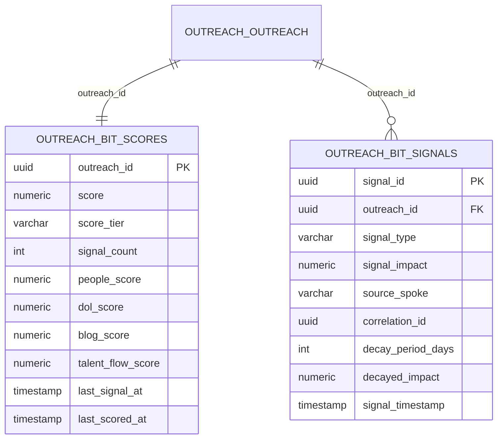

# ADR-014: BIT (Buyer Intent Tracker) Engine Architecture

## Status
**ACCEPTED**

## Date
2026-01-25

## Context

The Outreach program needed a scoring mechanism to prioritize companies for outreach based on detected buying intent signals. This system aggregates signals from multiple hubs and computes a unified intent score.

Key requirements:
1. Aggregate signals from all hubs (Company Target, DOL, People, Talent Flow, Blog)
2. Apply time-based decay to stale signals
3. Compute tier-based scores (COLD, WARM, HOT, BURNING)
4. Gate outreach execution based on score threshold

## Decision

Create a **BIT (Buyer Intent Tracker) Engine** that:

1. Collects signals from all hub spokes
2. Stores signals in `outreach.bit_signals`
3. Computes aggregate scores in `outreach.bit_scores`
4. Applies configurable decay curves
5. Exposes scores for outreach gating

### Score Tiers

| Tier | Score Range | Description | Outreach Action |
|------|-------------|-------------|-----------------|
| COLD | 0-24 | No significant intent | NO outreach |
| WARM | 25-49 | Some intent detected | Standard cadence |
| HOT | 50-74 | Strong intent signals | Accelerated cadence |
| BURNING | 75+ | Very high intent | Priority outreach |

### Signal Sources

| Hub | Signal Types | Impact Range |
|-----|--------------|--------------|
| Company Target | Pattern verified, domain resolved | +5 to +15 |
| DOL Filings | Filing matched, renewal upcoming | +10 to +25 |
| People Intelligence | Slot filled, contact verified | +5 to +15 |
| Talent Flow | Executive movement detected | +3 to +10 |
| Blog Content | Content engagement, news signal | +2 to +8 |

### Decay Model

Signals decay over time to prevent stale data from inflating scores:

```
decayed_impact = original_impact * (1 - (days_elapsed / decay_period))
```

Default decay periods:
- DOL signals: 365 days (regulatory cycles)
- People signals: 180 days (job stability)
- Talent Flow signals: 90 days (movement relevance)
- Blog signals: 30 days (content freshness)

### Schema



## Consequences

### Positive
- Unified scoring across all intent signals
- Decay prevents stale data from driving decisions
- Clear tier-based outreach gating
- Auditable signal history

### Negative
- Score computation adds latency
- Decay tuning requires ongoing calibration
- Complex aggregation logic

### Neutral
- Scores are company-level (not contact-level)
- Legacy `bit.*` schema maintained for backward compatibility

## Alternatives Considered

### Option A: Simple threshold per hub — REJECTED
- No unified view of intent
- Cannot weight signals appropriately

### Option B: ML-based scoring — REJECTED
- Overhead for initial implementation
- Insufficient training data
- Harder to explain/audit

### Option C: Weighted aggregation with decay — ACCEPTED
- Transparent calculation
- Auditable
- Tunable via configuration

## Configuration

| Parameter | Value | Description |
|-----------|-------|-------------|
| `WARM_THRESHOLD` | 25 | Minimum score for outreach |
| `HOT_THRESHOLD` | 50 | Accelerated outreach |
| `BURNING_THRESHOLD` | 75 | Priority outreach |
| `DEFAULT_DECAY_DAYS` | 90 | Default signal decay |
| `MAX_SCORE` | 100 | Score ceiling |

## Implementation

1. Signal collection via spoke contracts
2. Store in `outreach.bit_signals` with correlation_id
3. Compute aggregate in `outreach.bit_scores`
4. Expose via BIT Engine API
5. Gate outreach execution via threshold

### Key Tables

| Schema | Table | Purpose |
|--------|-------|---------|
| `outreach` | `bit_scores` | Aggregate scores per company |
| `outreach` | `bit_signals` | Individual signal events |
| `outreach` | `bit_errors` | BIT processing errors |
| `bit` | `bit_signal` | Legacy signal table |
| `bit` | `bit_company_score` | Legacy company scores |
| `bit` | `bit_contact_score` | Legacy contact scores |

## References

- Company Target BIT Integration: `hubs/company-target/imo/middle/bit_engine.py`
- Schema: `outreach.bit_scores`, `outreach.bit_signals`
- Outreach Gating: `hubs/outreach-execution/imo/middle/outreach_hub.py`

## Document Control

| Field | Value |
|-------|-------|
| Created | 2026-01-25 |
| Author | Claude Code |
| Status | ACCEPTED |
| CC Layer | CC-03 |
