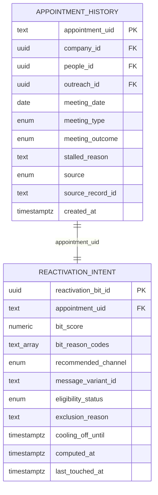
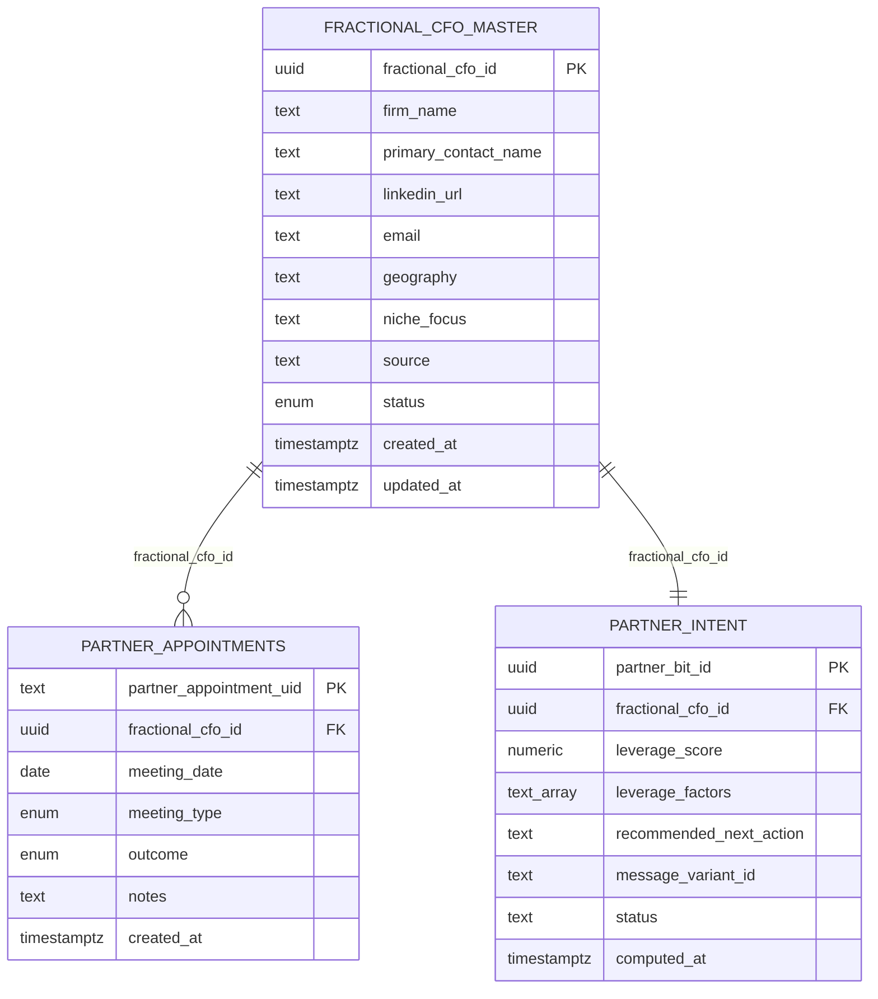
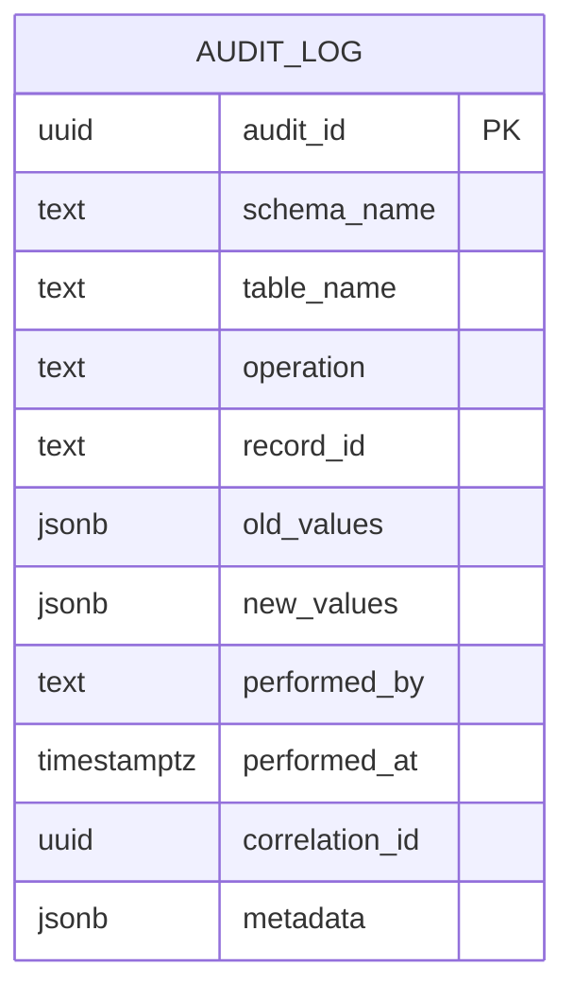

# Dual Lane Architecture: Reactivation + Partners

**Status**: ACTIVE
**Authority**: Barton Doctrine v1.1
**Version**: 1.0.0
**Created**: 2026-01-28
**Change Protocol**: ADR REQUIRED

---

## §1 Purpose

This document defines TWO ISOLATED LANES operating in parallel within the Barton Outreach system.

| Lane | Name | Purpose | Schema |
|------|------|---------|--------|
| **A** | Appointment Reactivation | Re-engage stalled/ghosted prospects | `sales.*` |
| **B** | Fractional CFO Partners | Build partner referral network | `partners.*` |

**CRITICAL**: These lanes MUST remain isolated. No cross-lane data flow. No shared state.

---

## §2 Lane A: Appointment Reactivation

### §2.1 IMO Model

```
┌─────────────────────────────────────────────────────────────────┐
│                    LANE A: REACTIVATION                         │
├─────────────────────────────────────────────────────────────────┤
│  INGRESS           │  MIDDLE              │  EGRESS             │
│  ─────────         │  ──────              │  ──────             │
│  Excel Import      │  sales.appointment_  │  bit.v_reactivation │
│  CRM Sync          │  history (FACT)      │  _ready (VIEW)      │
│  Calendar Sync     │        ↓             │                     │
│                    │  bit.reactivation_   │  LinkedIn Queue     │
│                    │  intent (SCORING)    │  Email Queue        │
└─────────────────────────────────────────────────────────────────┘
```

### §2.2 ERD (Mermaid Format)



### §2.3 Column Data Dictionary

| column_unique_id | description | data_type | format | constraints | source_of_truth | volatility | consumer |
|------------------|-------------|-----------|--------|-------------|-----------------|------------|----------|
| `sales.appointment_history.appointment_uid` | Deterministic PK: company_id\|people_id\|meeting_date | text | UUID\|UUID\|DATE | NOT NULL, PK | Computed | IMMUTABLE | BIT |
| `sales.appointment_history.company_id` | FK to company_master | uuid | UUID | Nullable | CRM/Manual | IMMUTABLE | Analytics |
| `sales.appointment_history.people_id` | FK to people_master | uuid | UUID | Nullable | CRM/Manual | IMMUTABLE | Analytics |
| `sales.appointment_history.meeting_date` | Date of the meeting | date | YYYY-MM-DD | NOT NULL | CRM/Calendar | IMMUTABLE | BIT |
| `sales.appointment_history.meeting_type` | Type of meeting | enum | discovery\|systems\|numbers\|other | NOT NULL | Manual | IMMUTABLE | BIT |
| `sales.appointment_history.meeting_outcome` | Meeting result | enum | progressed\|stalled\|ghosted\|lost | NOT NULL | Manual | IMMUTABLE | BIT |
| `sales.appointment_history.stalled_reason` | Why meeting stalled | text | Free text | Required if stalled | Manual | IMMUTABLE | BIT |
| `sales.appointment_history.source` | Data source | enum | calendar\|crm\|manual | NOT NULL | System | IMMUTABLE | Audit |
| `bit.reactivation_intent.bit_score` | Reactivation priority score | numeric(5,2) | 0-100 | 0-100 range | BIT Engine | COMPUTED | Outreach |
| `bit.reactivation_intent.eligibility_status` | Kill switch status | enum | eligible\|excluded\|cooling_off | NOT NULL | Manual/System | MUTABLE | Outreach |

### §2.4 Enums

| Enum | Schema | Values |
|------|--------|--------|
| `meeting_type_enum` | sales | discovery, systems, numbers, other |
| `meeting_outcome_enum` | sales | progressed, stalled, ghosted, lost |
| `appointment_source_enum` | sales | calendar, crm, manual |
| `reactivation_channel_enum` | bit | linkedin, email |
| `eligibility_status_enum` | bit | eligible, excluded, cooling_off |

---

## §3 Lane B: Fractional CFO Partners

### §3.1 IMO Model

```
┌─────────────────────────────────────────────────────────────────┐
│                    LANE B: PARTNERS                             │
├─────────────────────────────────────────────────────────────────┤
│  INGRESS           │  MIDDLE              │  EGRESS             │
│  ─────────         │  ──────              │  ──────             │
│  Excel Import      │  partners.fractional │  bit.v_partner_     │
│  LinkedIn Scrape   │  _cfo_master         │  outreach_ready     │
│                    │        ↓             │  (VIEW)             │
│                    │  partners.partner_   │                     │
│                    │  appointments (FACT) │  LinkedIn Queue     │
│                    │        ↓             │  Email Queue        │
│                    │  bit.partner_intent  │                     │
│                    │  (SCORING)           │                     │
└─────────────────────────────────────────────────────────────────┘
```

### §3.2 ERD (Mermaid Format)



### §3.3 Column Data Dictionary

| column_unique_id | description | data_type | format | constraints | source_of_truth | volatility | consumer |
|------------------|-------------|-----------|--------|-------------|-----------------|------------|----------|
| `partners.fractional_cfo_master.fractional_cfo_id` | Primary key UUID | uuid | UUID | PK, NOT NULL | System | IMMUTABLE | All |
| `partners.fractional_cfo_master.firm_name` | Partner firm name | text | Free text | NOT NULL | Manual | MUTABLE | Outreach |
| `partners.fractional_cfo_master.primary_contact_name` | Main contact name | text | Free text | NOT NULL | Manual | MUTABLE | Outreach |
| `partners.fractional_cfo_master.linkedin_url` | LinkedIn profile URL | text | URL | linkedin.com format | Manual | MUTABLE | Outreach |
| `partners.fractional_cfo_master.email` | Contact email | text | Email | Valid email format | Manual | MUTABLE | Outreach |
| `partners.fractional_cfo_master.geography` | Operating region | text | Free text | Nullable | Manual | MUTABLE | Targeting |
| `partners.fractional_cfo_master.niche_focus` | Industry focus | text | Free text | Nullable | Manual | MUTABLE | Targeting |
| `partners.fractional_cfo_master.status` | Partner lifecycle status | enum | prospect\|contacted\|engaged\|partner | NOT NULL | Manual | MUTABLE | Outreach |
| `partners.partner_appointments.partner_appointment_uid` | Deterministic PK | text | UUID\|DATE\|SEQ | PK, NOT NULL | Computed | IMMUTABLE | BIT |
| `partners.partner_appointments.meeting_type` | Type of partner meeting | enum | intro\|followup | NOT NULL | Manual | IMMUTABLE | BIT |
| `partners.partner_appointments.outcome` | Meeting outcome | enum | warm\|neutral\|cold | NOT NULL | Manual | IMMUTABLE | BIT |
| `bit.partner_intent.leverage_score` | Partner value score | numeric(5,2) | 0-100 | 0-100 range | BIT Engine | COMPUTED | Outreach |
| `bit.partner_intent.status` | Intent tracking status | text | pending\|active\|paused\|completed | NOT NULL | System | MUTABLE | Outreach |

### §3.4 Enums

| Enum | Schema | Values |
|------|--------|--------|
| `partner_status_enum` | partners | prospect, contacted, engaged, partner |
| `partner_meeting_type_enum` | partners | intro, followup |
| `partner_meeting_outcome_enum` | partners | warm, neutral, cold |

---

## §4 Isolation Rules (HARD LAW)

### §4.1 NEVER DO

| Violation | Example | Type |
|-----------|---------|------|
| Cross-lane FK | `partner_appointments.company_id → company_master` | ISOLATION_VIOLATION |
| Shared scoring | `bit.combined_intent` table | ISOLATION_VIOLATION |
| Cross-lane queries | `JOIN sales.* ON partners.*` | ISOLATION_VIOLATION |
| Combined views | `v_all_outreach_ready` | ISOLATION_VIOLATION |

### §4.2 ALWAYS DO

| Practice | Implementation |
|----------|----------------|
| Separate schemas | `sales.*` for Lane A, `partners.*` for Lane B |
| Separate BIT tables | `bit.reactivation_intent`, `bit.partner_intent` |
| Separate views | `bit.v_reactivation_ready`, `bit.v_partner_outreach_ready` |
| Separate ingest | `appointment_history_ingest.cjs`, `fractional_cfo_ingest.cjs` |

---

## §5 Shared Infrastructure

### §5.1 Audit Log ERD



### §5.2 Audit Log Rules

| Rule | Enforcement |
|------|-------------|
| Append-only | Trigger blocks UPDATE/DELETE |
| All inserts logged | Audit triggers on all tables |
| Both lanes use same log | Separated by schema_name column |

---

## §6 Doctrine Compliance Matrix

| Principle | Lane A | Lane B | Shared |
|-----------|--------|--------|--------|
| Immutable facts | `appointment_history` | `partner_appointments` | `audit_log` |
| Scoring in BIT only | `reactivation_intent` | `partner_intent` | — |
| Full auditability | Yes | Yes | `shq.audit_log` |
| Kill switch ready | `eligibility_status` | `intent.status` | — |
| No schema pollution | `sales.*` isolated | `partners.*` isolated | — |
| Write-once triggers | Yes | Yes | Yes |

---

## §7 File Registry

| File | Purpose | Lane |
|------|---------|------|
| `neon/migrations/2026-01-28-dual-lane-reactivation-partners.sql` | Schema migration | Both |
| `scripts/ingest/appointment_history_ingest.cjs` | Excel ingest | A |
| `scripts/ingest/fractional_cfo_ingest.cjs` | Excel ingest | B |
| `docs/ingest/APPOINTMENT_HISTORY_INGEST.md` | Column mapping | A |
| `docs/ingest/FRACTIONAL_CFO_PARTNER_INGEST.md` | Column mapping | B |
| `docs/ingest/README.md` | Quick reference | Both |

---

## §8 Quick Reference

### Lane A Commands

```bash
# Ingest appointments
doppler run -- node scripts/ingest/appointment_history_ingest.cjs data.xlsx

# Query ready queue
SELECT * FROM bit.v_reactivation_ready;

# Check audit
SELECT * FROM shq.audit_log WHERE schema_name = 'sales';
```

### Lane B Commands

```bash
# Ingest partners
doppler run -- node scripts/ingest/fractional_cfo_ingest.cjs partners data.xlsx

# Ingest meetings
doppler run -- node scripts/ingest/fractional_cfo_ingest.cjs appointments meetings.xlsx

# Query ready queue
SELECT * FROM bit.v_partner_outreach_ready;

# Check audit
SELECT * FROM shq.audit_log WHERE schema_name = 'partners';
```

---

## §9 Visual Summary

```
╔══════════════════════════════════════════════════════════════════╗
║                    TWO LANES, ZERO OVERLAP                        ║
╠══════════════════════════════════════════════════════════════════╣
║                                                                  ║
║   LANE A (Reactivation)      ║      LANE B (Partners)            ║
║   ─────────────────────      ║      ─────────────────            ║
║   sales.* schema             ║      partners.* schema            ║
║   bit.reactivation_intent    ║      bit.partner_intent           ║
║   v_reactivation_ready       ║      v_partner_outreach_ready     ║
║   Past prospects             ║      Referral network             ║
║   LinkedIn/Email             ║      LinkedIn/Email               ║
║                              ║                                   ║
║              ════════════════════════════════════                ║
║                      NO CROSS-LANE DATA                          ║
║              ════════════════════════════════════                ║
║                                                                  ║
╚══════════════════════════════════════════════════════════════════╝
```

---

## Document Control

| Field | Value |
|-------|-------|
| Created | 2026-01-28 |
| Last Modified | 2026-01-28 |
| Version | 1.0.0 |
| Status | ACTIVE |
| Authority | Barton Doctrine v1.1 |
| Change Protocol | ADR REQUIRED |
