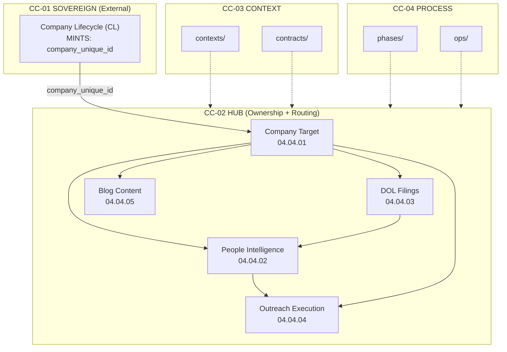
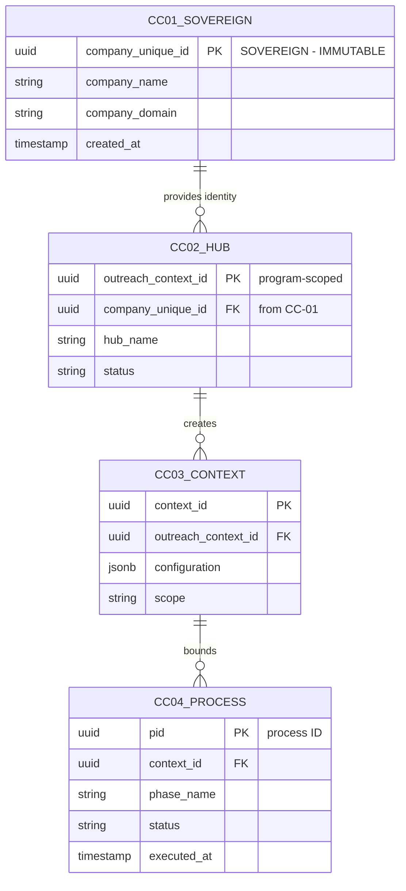
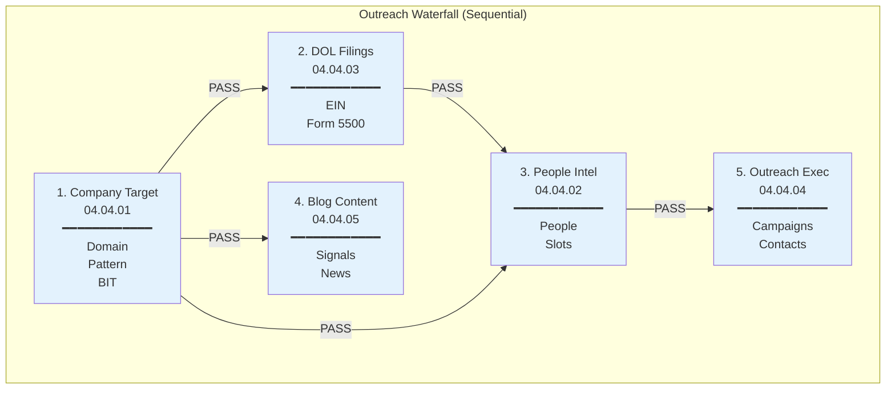
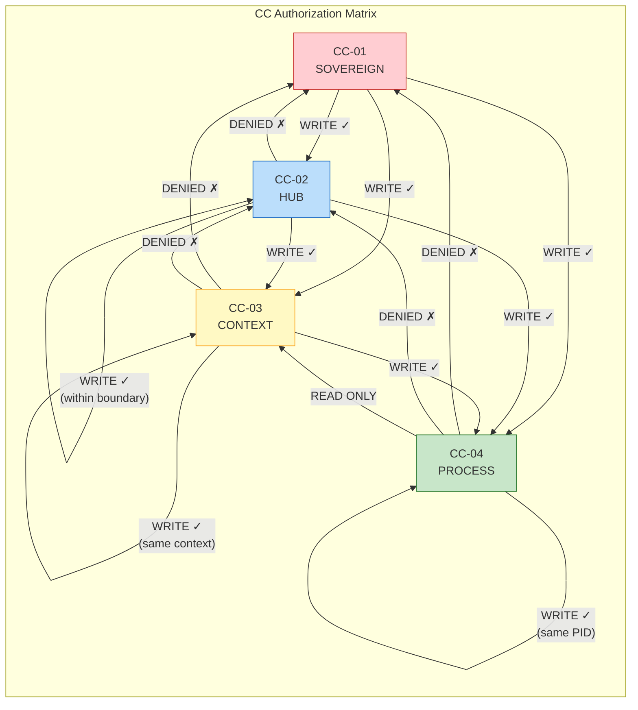
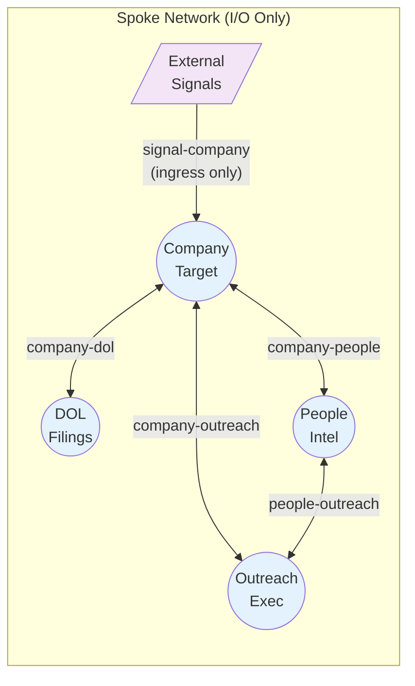

# CC System Diagram

**Doctrine Version**: v1.1.0
**Last Updated**: 2026-01-05

---

## Full System Diagram

---

## ERD-Style Layer Diagram

---

## Hub Waterfall Diagram

---

## Authorization Matrix Diagram

---

## Spoke Interface Diagram

---

## Legend

| Color | CC Layer | Description |
|-------|----------|-------------|
| Red | CC-01 | Sovereign (External) |
| Blue | CC-02 | Hub (Ownership) |
| Yellow | CC-03 | Context (Configuration) |
| Green | CC-04 | Process (Runtime) |
| Purple | Spoke | Interface (No CC Layer) |

---

## Files

- `cc_system_diagram.mmd` - Full Mermaid source
- `CC_SYSTEM_DIAGRAM.md` - This file (rendered diagrams)
