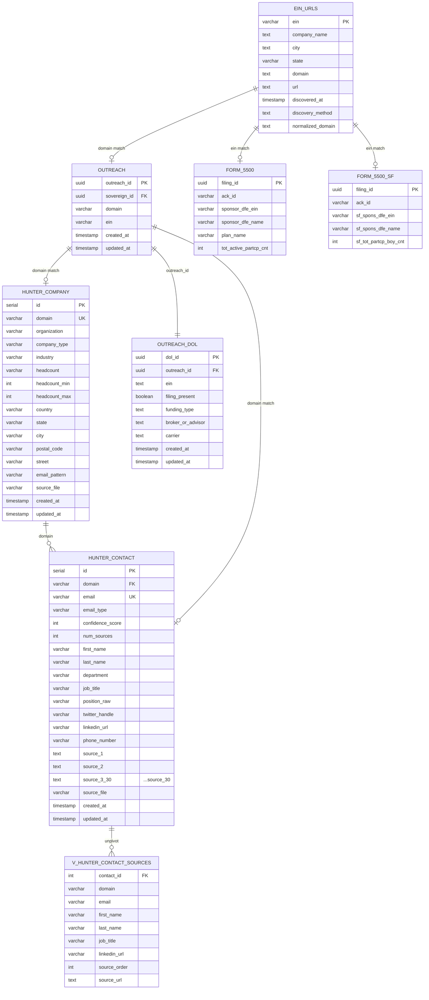

# Hunter.io + DOL Integration ERD

> **Last Updated**: 2026-02-13
> **Status**: PRODUCTION

---

## Entity Relationship Diagram (Mermaid)



---

## Table Summary

| Schema | Table | Records | Purpose |
|--------|-------|---------|---------|
| `enrichment` | `hunter_company` | 88,405 | Company metadata from Hunter |
| `enrichment` | `hunter_contact` | 583,433 | Contact data with 30 source URLs |
| `enrichment` | `v_hunter_contact_sources` | ~231,973 | Unpivoted source URLs |
| `dol` | `ein_urls` | 127,909 | EIN to domain mapping |
| `dol` | `form_5500` | 230,482 | Full DOL 5500 filings |
| `dol` | `form_5500_sf` | 760,839 | Short form 5500-SF filings |
| `outreach` | `outreach` | 95,837 | Outreach spine (95,004 cold + 833 fractional CFO) |
| `outreach` | `dol` | 74,529 | Outreach DOL sub-hub (79.2% coverage) |

---

## Data Flow

```
                          +------------------+
                          | Hunter.io API    |
                          +--------+---------+
                                   |
                    +--------------+--------------+
                    |                             |
                    v                             v
          +------------------+          +------------------+
          | hunter_company   |          | hunter_contact   |
          | (88,405)         |          | (583,433)        |
          +--------+---------+          +--------+---------+
                   |                             |
                   | domain                      | domain
                   v                             v
          +----------------------------------------+
          |           Domain Match                 |
          +----------------------------------------+
                             |
                             v
                   +------------------+
                   | outreach.outreach|
                   | (95,837)         |
                   +--------+---------+
                            |
                            | outreach_id
                            v
                   +------------------+
                   | outreach.dol     |
                   | (74,529)         |
                   +--------+---------+
                            |
                            | ein
                            v
          +----------------------------------------+
          |              EIN Match                 |
          +----------------------------------------+
                   |                      |
                   v                      v
          +------------------+   +------------------+
          | dol.form_5500    |   | dol.form_5500_sf |
          | (230,482)        |   | (760,839)        |
          +------------------+   +------------------+
```

---

## Join Paths

### Hunter to Outreach (via domain)

```sql
SELECT
    o.outreach_id,
    hc.domain,
    hc.email,
    hc.first_name,
    hc.last_name,
    hc.job_title
FROM outreach.outreach o
JOIN enrichment.hunter_company hco ON LOWER(o.domain) = LOWER(hco.domain)
JOIN enrichment.hunter_contact hc ON hco.domain = hc.domain;
```

### EIN URLs to Outreach (via domain)

```sql
SELECT
    o.outreach_id,
    eu.ein,
    eu.company_name,
    eu.domain
FROM outreach.outreach o
JOIN dol.ein_urls eu ON LOWER(o.domain) = LOWER(eu.domain);
```

### EIN URLs to DOL Filings (via EIN)

```sql
SELECT
    eu.ein,
    eu.domain,
    f.sponsor_dfe_name,
    f.tot_active_partcp_cnt
FROM dol.ein_urls eu
JOIN dol.form_5500 f ON eu.ein = f.sponsor_dfe_ein;
```

### Full Chain: Hunter -> Outreach -> DOL Filings

```sql
SELECT
    o.outreach_id,
    o.domain,
    od.ein,
    f.sponsor_dfe_name,
    f.tot_active_partcp_cnt,
    hc.email,
    hc.job_title
FROM outreach.outreach o
JOIN outreach.dol od ON o.outreach_id = od.outreach_id
JOIN dol.form_5500 f ON od.ein = f.sponsor_dfe_ein
LEFT JOIN enrichment.hunter_contact hc ON LOWER(o.domain) = LOWER(hc.domain);
```

---

## Key Metrics (2026-02-13 VERIFIED)

| Metric | Value |
|--------|-------|
| Hunter companies | 88,405 |
| Hunter contacts | 583,433 |
| Hunter source URLs | 231,973 |
| DOL EINs with domains | 127,909 |
| Outreach records | 95,837 |
| **DOL bridge linked** | **74,529 (79.2%)** |
| DOL with filing | 64,975 (87.2% of linked) |
| DOL with renewal month | 74,521 (99.9% of linked) |
| DOL with carrier | 10,233 (13.7% of linked) |
| DOL with broker | 6,995 (9.4% of linked) |
| Fuzzy bridge matches | 4,580 (included in 74,529) |
| New companies from Hunter DOL | 54,155 |

> See `docs/DATABASE_OVERVIEW_TEMPLATE.md` for full sub-hub coverage view.

---
