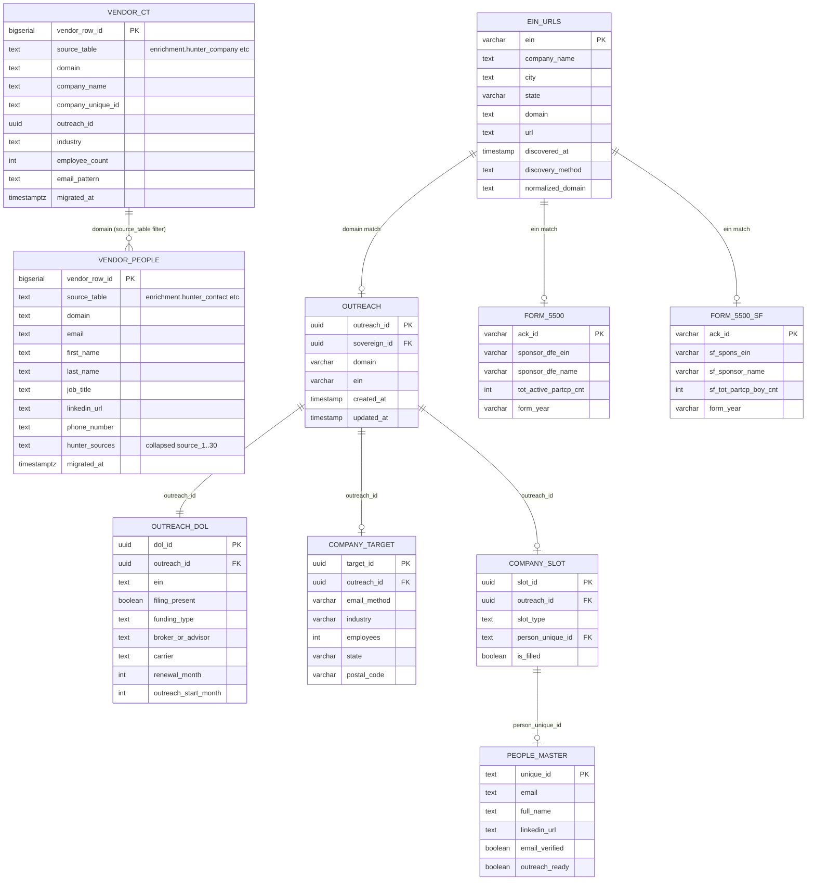

# Hunter.io + DOL Integration ERD

> **Last Updated**: 2026-02-20
> **Status**: PRODUCTION (Post-Phase 3 Legacy Collapse)

---

## Entity Relationship Diagram (Mermaid)



---

## Table Summary

| Schema | Table | Records | Purpose |
|--------|-------|---------|---------|
| `vendor` | `ct` | 225,904 | Consolidated company vendor data (Hunter, Clay, CSVs) |
| `vendor` | `people` | 843,744 | Consolidated people vendor data (Hunter contacts, Clay, scrapers) |
| `dol` | `ein_urls` | 127,909 | EIN to domain mapping |
| `dol` | `form_5500` | 432,582 | Full DOL 5500 filings (large plans) |
| `dol` | `form_5500_sf` | 1,535,999 | Short form 5500-SF filings (small plans) |
| `outreach` | `outreach` | 114,137 | Outreach spine |
| `outreach` | `dol` | 89,247 | Outreach DOL sub-hub |
| `outreach` | `company_target` | 114,137 | Company firmographics + targeting |
| `people` | `company_slot` | 340,815 | Slot assignments (CEO/CFO/HR) |
| `people` | `people_master` | 183,397 | Contact details |

---

## Data Flow

```
                          +------------------+
                          | Hunter.io API    |
                          +--------+---------+
                                   |
                    +--------------+--------------+
                    |                             |
                    v                             v
          +------------------+          +------------------+
          | vendor.ct        |          | vendor.people    |
          | (225,904 rows)   |          | (843,744 rows)   |
          | source_table =   |          | source_table =   |
          | hunter_company   |          | hunter_contact   |
          +--------+---------+          +--------+---------+
                   |                             |
                   | domain bridge               | promoted to
                   v                             v
          +------------------+          +------------------+
          | outreach.outreach|          | people.           |
          | (114,137)        |          | people_master     |
          +--------+---------+          | (183,397)         |
                   |                    +------------------+
                   | outreach_id
                   v
          +------------------+
          | outreach.dol     |
          | (89,247)         |
          +--------+---------+
                   |
                   | ein
                   v
          +----------------------------------------+
          |              EIN Match                 |
          +----------------------------------------+
                   |                      |
                   v                      v
          +------------------+   +------------------+
          | dol.form_5500    |   | dol.form_5500_sf |
          | (432,582)        |   | (1,535,999)      |
          +------------------+   +------------------+
```

---

## Join Paths

### Vendor Data to Outreach (via domain)

```sql
-- Get Hunter company data matched to outreach
SELECT
    o.outreach_id,
    v.domain,
    v.company_name,
    v.industry,
    v.email_pattern
FROM outreach.outreach o
JOIN vendor.ct v ON LOWER(o.domain) = LOWER(v.domain)
    AND v.source_table = 'enrichment.hunter_company';
```

### EIN URLs to Outreach (via domain)

```sql
SELECT
    o.outreach_id,
    eu.ein,
    eu.company_name,
    eu.domain
FROM outreach.outreach o
JOIN dol.ein_urls eu ON LOWER(o.domain) = LOWER(eu.domain);
```

### EIN URLs to DOL Filings (via EIN)

```sql
SELECT
    eu.ein,
    eu.domain,
    f.sponsor_dfe_name,
    f.tot_active_partcp_cnt
FROM dol.ein_urls eu
JOIN dol.form_5500 f ON eu.ein = f.sponsor_dfe_ein;
```

### Full Chain: Outreach -> DOL -> Filings + People

```sql
-- Operational query: use canonical tables (NOT vendor)
SELECT
    o.outreach_id,
    o.domain,
    od.ein,
    f.sponsor_dfe_name,
    f.tot_active_partcp_cnt,
    pm.email,
    pm.full_name,
    pm.title
FROM outreach.outreach o
JOIN outreach.dol od ON o.outreach_id = od.outreach_id
JOIN dol.form_5500 f ON od.ein = f.sponsor_dfe_ein
LEFT JOIN people.company_slot cs ON o.outreach_id = cs.outreach_id
    AND cs.slot_type = 'CEO' AND cs.is_filled = TRUE
LEFT JOIN people.people_master pm ON pm.unique_id = cs.person_unique_id;
```

---

## Key Metrics (2026-02-20)

| Metric | Value |
|--------|-------|
| Vendor company data (vendor.ct) | 225,904 |
| Vendor people data (vendor.people) | 843,744 |
| DOL EINs with domains | 127,909 |
| Outreach records | 114,137 |
| **DOL bridge linked** | **89,247** |
| DOL with filing | ~85,000 (est.) |
| DOL with renewal month | ~89,000 (est.) |
| DOL with carrier | ~10,233 |
| DOL with broker | ~6,995 |
| People master | 183,397 |
| Company slots | 340,815 (52% filled) |

> See `docs/migration/legacy-mapping.md` for full Phase 3 migration details.
> See `docs/OSAM.md` for vendor schema query routing.

---

## Migration Note (2026-02-20)

**Phase 3 Legacy Collapse** consolidated external vendor data:
- `enrichment.hunter_company` (88,554 rows) → `vendor.ct` (with `source_table = 'enrichment.hunter_company'`)
- `enrichment.hunter_contact` (583,828 rows) → `vendor.people` (with `source_table = 'enrichment.hunter_contact'`)
- `enrichment.hunter_company` and `enrichment.hunter_contact` tables still exist in the database but are considered legacy. Use `vendor.*` for new work.

**For operational queries**: Use canonical tables (`outreach.outreach`, `outreach.dol`, `people.people_master`), NOT vendor tables. Vendor tables are Tier-1 staging — raw, append-only, historical.
