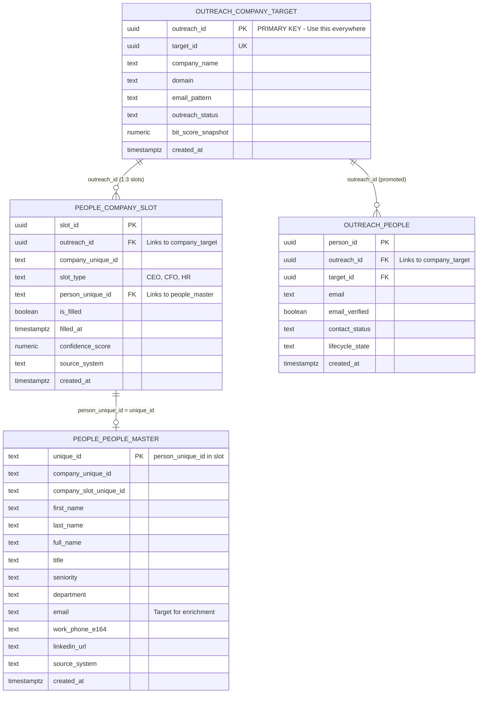

# People Data Flow ERD

**Version:** 1.1.0
**Last Updated:** 2026-02-13
**Status:** CANONICAL REFERENCE

---

## ⚠️ CRITICAL: Read This First

> **ALL People Sub-Hub operations MUST start from `outreach.company_target`**
> **This is the ONLY authoritative source for companies.**

---

## Entity Relationship Diagram



---

## Data Flow Diagram

```
┌─────────────────────────────────────────────────────────────────────────────┐
│                              CLAY (CL)                                       │
│                    External Data Source / Workflows                         │
└────────────────────────────────┬────────────────────────────────────────────┘
                                 │
                                 ▼
┌─────────────────────────────────────────────────────────────────────────────┐
│                     outreach.company_target                                  │
│                                                                              │
│   ┌─────────────────────────────────────────────────────────────────────┐   │
│   │  outreach_id (UUID) ← PRIMARY KEY - Use this for all joins         │   │
│   │  company_name, domain, email_pattern, outreach_status               │   │
│   │                                                                     │   │
│   │  COUNT: 94,129 companies (after 1,708 no-geography exclusions)      │   │
│   └─────────────────────────────────────────────────────────────────────┘   │
│                                                                              │
│   ⚠️  THIS IS THE AUTHORITATIVE COMPANY LIST                               │
│   ⚠️  ALL DOWNSTREAM TABLES JOIN ON outreach_id                            │
│                                                                              │
└────────────────────────────────┬────────────────────────────────────────────┘
                                 │
                    JOIN ON outreach_id
                                 │
                                 ▼
┌─────────────────────────────────────────────────────────────────────────────┐
│                       people.company_slot                                    │
│                                                                              │
│   ┌──────────────────┬──────────────────┬──────────────────┐               │
│   │      CEO         │       CFO        │        HR        │               │
│   ├──────────────────┼──────────────────┼──────────────────┤               │
│   │ 62,289 filled    │ 57,327 filled    │ 58,141 filled    │               │
│   │ 32,723 empty     │ 37,685 empty     │ 36,871 empty     │               │
│   │ 65.6% coverage   │ 60.3% coverage   │ 61.2% coverage   │               │
│   └──────────────────┴──────────────────┴──────────────────┘               │
│                                                                              │
│   JOIN KEY: outreach_id → company_target.outreach_id                        │
│   PERSON KEY: person_unique_id → people_master.unique_id                    │
│                                                                              │
└────────────────────────────────┬────────────────────────────────────────────┘
                                 │
              JOIN ON person_unique_id = unique_id
                                 │
                                 ▼
┌─────────────────────────────────────────────────────────────────────────────┐
│                      people.people_master                                    │
│                                                                              │
│   ┌─────────────────────────────────────────────────────────────────────┐   │
│   │  unique_id (TEXT) ← PRIMARY KEY                                     │   │
│   │  first_name, last_name, full_name, title, seniority                 │   │
│   │  email ← TARGET FOR ENRICHMENT                                      │   │
│   │  linkedin_url, work_phone_e164                                      │   │
│   │                                                                     │   │
│   │  Total records: 182,946                                              │   │
│   │  Matched to slots: 177,757 (62.4% fill rate)                        │   │
│   │  With email: 181,478                                                │   │
│   │  Email verified: 145,358 (outreach_ready: 122,094)                  │   │
│   └─────────────────────────────────────────────────────────────────────┘   │
│                                                                              │
└────────────────────────────────┬────────────────────────────────────────────┘
                                 │
                        PROMOTION PROCESS
                    (people ready for outreach)
                                 │
                                 ▼
┌─────────────────────────────────────────────────────────────────────────────┐
│                        outreach.people                                       │
│                                                                              │
│   ┌─────────────────────────────────────────────────────────────────────┐   │
│   │  person_id (UUID) ← PRIMARY KEY                                     │   │
│   │  outreach_id ← LINKS BACK TO company_target                         │   │
│   │  email, email_verified, contact_status, lifecycle_state             │   │
│   │                                                                     │   │
│   │  COUNT: 324 (⚠️ NEEDS PROMOTION FROM people_master)                 │   │
│   └─────────────────────────────────────────────────────────────────────┘   │
│                                                                              │
└─────────────────────────────────────────────────────────────────────────────┘
```

---

## SQL Query Reference

### ✅ CORRECT: Get all companies with their slot status

```sql
SELECT 
    ct.outreach_id,
    ct.company_name,
    ct.domain,
    ceo.is_filled AS has_ceo,
    cfo.is_filled AS has_cfo,
    hr.is_filled AS has_hr
FROM outreach.company_target ct
LEFT JOIN people.company_slot ceo 
    ON ct.outreach_id = ceo.outreach_id AND ceo.slot_type = 'CEO'
LEFT JOIN people.company_slot cfo 
    ON ct.outreach_id = cfo.outreach_id AND cfo.slot_type = 'CFO'
LEFT JOIN people.company_slot hr 
    ON ct.outreach_id = hr.outreach_id AND hr.slot_type = 'HR';
```

### ✅ CORRECT: Get people with email for outreach

```sql
SELECT 
    ct.outreach_id,
    ct.company_name,
    cs.slot_type,
    pm.first_name,
    pm.last_name,
    pm.email,
    pm.title
FROM outreach.company_target ct
JOIN people.company_slot cs ON ct.outreach_id = cs.outreach_id
JOIN people.people_master pm ON cs.person_unique_id = pm.unique_id
WHERE cs.is_filled = true 
  AND pm.email IS NOT NULL;
```

### ✅ CORRECT: Get enrichment gap (companies needing people)

```sql
SELECT ct.outreach_id, ct.company_name, ct.domain
FROM outreach.company_target ct
LEFT JOIN people.company_slot cs 
    ON ct.outreach_id = cs.outreach_id AND cs.is_filled = true
WHERE cs.slot_id IS NULL;
```

### ❌ WRONG: Do NOT use these tables as the source

```sql
-- WRONG: company.company_master is NOT the authoritative source
SELECT COUNT(*) FROM company.company_master;  -- Returns 74,641 (too many)

-- WRONG: Starting from people_master without company_target
SELECT * FROM people.people_master;  -- No company context

-- WRONG: Using outreach.outreach instead of company_target
SELECT * FROM outreach.outreach;  -- Different record count
```

---

## Key Metrics (2026-02-13 VERIFIED)

### Summary Statistics

| Metric | Value |
|--------|-------|
| Total Companies (Authoritative) | 94,129 (after 1,708 no-geography exclusions) |
| Total Slots | 285,012 (3 per company) |
| Slots Filled | 177,757 (62.4%) |
| People Records | 182,946 |
| People with Email | 181,478 |
| Email Verified (outreach_ready) | 122,094 |

### Slot Coverage

| Slot | Filled | Empty | Coverage |
|------|--------|-------|----------|
| CEO | 62,289 | 32,723 | 65.6% |
| CFO | 57,327 | 37,685 | 60.3% |
| HR | 58,141 | 36,871 | 61.2% |

### Email Verification

| Status | Count | % |
|--------|-------|---|
| VALID (outreach_ready=TRUE) | 43,330 | 71.7% |
| RISKY (catch-all) | 9,223 | 15.3% |
| INVALID (need re-enrichment) | 7,878 | 13.0% |
| Deliverable rate | — | 87.0% |

> See `docs/DATABASE_OVERVIEW_TEMPLATE.md` for full sub-hub coverage view.

---

## Change Log

| Date | Version | Change |
|------|---------|--------|
| 2026-02-13 | 1.1.0 | Updated all metrics to current verified counts, added email verification |
| 2026-02-02 | 1.0.0 | Initial creation with live metrics |
