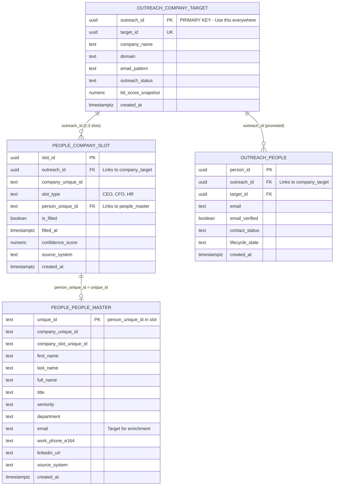

# People Data Flow ERD

**Version:** 1.0.0
**Last Updated:** 2026-02-02
**Status:** CANONICAL REFERENCE

---

## ⚠️ CRITICAL: Read This First

> **ALL People Sub-Hub operations MUST start from `outreach.company_target`**
> **This is the ONLY authoritative source for companies.**

---

## Entity Relationship Diagram



---

## Data Flow Diagram

```
┌─────────────────────────────────────────────────────────────────────────────┐
│                              CLAY (CL)                                       │
│                    External Data Source / Workflows                         │
└────────────────────────────────┬────────────────────────────────────────────┘
                                 │
                                 ▼
┌─────────────────────────────────────────────────────────────────────────────┐
│                     outreach.company_target                                  │
│                                                                              │
│   ┌─────────────────────────────────────────────────────────────────────┐   │
│   │  outreach_id (UUID) ← PRIMARY KEY - Use this for all joins         │   │
│   │  company_name, domain, email_pattern, outreach_status               │   │
│   │                                                                     │   │
│   │  COUNT: 95,004 companies                                            │   │
│   └─────────────────────────────────────────────────────────────────────┘   │
│                                                                              │
│   ⚠️  THIS IS THE AUTHORITATIVE COMPANY LIST                               │
│   ⚠️  ALL DOWNSTREAM TABLES JOIN ON outreach_id                            │
│                                                                              │
└────────────────────────────────┬────────────────────────────────────────────┘
                                 │
                    JOIN ON outreach_id
                                 │
                                 ▼
┌─────────────────────────────────────────────────────────────────────────────┐
│                       people.company_slot                                    │
│                                                                              │
│   ┌──────────────────┬──────────────────┬──────────────────┐               │
│   │      CEO         │       CFO        │        HR        │               │
│   ├──────────────────┼──────────────────┼──────────────────┤               │
│   │ 15,171 filled    │ 4,807 filled     │ 6,575 filled     │               │
│   │ 26,254 empty     │ 36,618 empty     │ 34,850 empty     │               │
│   │ 36.6% coverage   │ 11.6% coverage   │ 15.9% coverage   │               │
│   └──────────────────┴──────────────────┴──────────────────┘               │
│                                                                              │
│   JOIN KEY: outreach_id → company_target.outreach_id                        │
│   PERSON KEY: person_unique_id → people_master.unique_id                    │
│                                                                              │
└────────────────────────────────┬────────────────────────────────────────────┘
                                 │
              JOIN ON person_unique_id = unique_id
                                 │
                                 ▼
┌─────────────────────────────────────────────────────────────────────────────┐
│                      people.people_master                                    │
│                                                                              │
│   ┌─────────────────────────────────────────────────────────────────────┐   │
│   │  unique_id (TEXT) ← PRIMARY KEY                                     │   │
│   │  first_name, last_name, full_name, title, seniority                 │   │
│   │  email ← TARGET FOR ENRICHMENT                                      │   │
│   │  linkedin_url, work_phone_e164                                      │   │
│   │                                                                     │   │
│   │  Matched to slots: 26,443                                           │   │
│   │  With email: 21,751                                                 │   │
│   │  Need email: 4,692                                                  │   │
│   └─────────────────────────────────────────────────────────────────────┘   │
│                                                                              │
└────────────────────────────────┬────────────────────────────────────────────┘
                                 │
                        PROMOTION PROCESS
                    (people ready for outreach)
                                 │
                                 ▼
┌─────────────────────────────────────────────────────────────────────────────┐
│                        outreach.people                                       │
│                                                                              │
│   ┌─────────────────────────────────────────────────────────────────────┐   │
│   │  person_id (UUID) ← PRIMARY KEY                                     │   │
│   │  outreach_id ← LINKS BACK TO company_target                         │   │
│   │  email, email_verified, contact_status, lifecycle_state             │   │
│   │                                                                     │   │
│   │  COUNT: 324 (⚠️ NEEDS PROMOTION FROM people_master)                 │   │
│   └─────────────────────────────────────────────────────────────────────┘   │
│                                                                              │
└─────────────────────────────────────────────────────────────────────────────┘
```

---

## SQL Query Reference

### ✅ CORRECT: Get all companies with their slot status

```sql
SELECT 
    ct.outreach_id,
    ct.company_name,
    ct.domain,
    ceo.is_filled AS has_ceo,
    cfo.is_filled AS has_cfo,
    hr.is_filled AS has_hr
FROM outreach.company_target ct
LEFT JOIN people.company_slot ceo 
    ON ct.outreach_id = ceo.outreach_id AND ceo.slot_type = 'CEO'
LEFT JOIN people.company_slot cfo 
    ON ct.outreach_id = cfo.outreach_id AND cfo.slot_type = 'CFO'
LEFT JOIN people.company_slot hr 
    ON ct.outreach_id = hr.outreach_id AND hr.slot_type = 'HR';
```

### ✅ CORRECT: Get people with email for outreach

```sql
SELECT 
    ct.outreach_id,
    ct.company_name,
    cs.slot_type,
    pm.first_name,
    pm.last_name,
    pm.email,
    pm.title
FROM outreach.company_target ct
JOIN people.company_slot cs ON ct.outreach_id = cs.outreach_id
JOIN people.people_master pm ON cs.person_unique_id = pm.unique_id
WHERE cs.is_filled = true 
  AND pm.email IS NOT NULL;
```

### ✅ CORRECT: Get enrichment gap (companies needing people)

```sql
SELECT ct.outreach_id, ct.company_name, ct.domain
FROM outreach.company_target ct
LEFT JOIN people.company_slot cs 
    ON ct.outreach_id = cs.outreach_id AND cs.is_filled = true
WHERE cs.slot_id IS NULL;
```

### ❌ WRONG: Do NOT use these tables as the source

```sql
-- WRONG: company.company_master is NOT the authoritative source
SELECT COUNT(*) FROM company.company_master;  -- Returns 74,641 (too many)

-- WRONG: Starting from people_master without company_target
SELECT * FROM people.people_master;  -- No company context

-- WRONG: Using outreach.outreach instead of company_target
SELECT * FROM outreach.outreach;  -- Different record count
```

---

## Key Metrics (2026-02-02)

### Summary Statistics

| Metric | Value |
|--------|-------|
| Total Companies (Authoritative) | 95,004 |
| Companies with ≥1 Person | 18,353 (44.3%) |
| Companies with ≥1 Email | 15,401 (37.2%) |
| **Companies Needing People** | **23,072 (55.7%)** |
| People with Email | 21,751 |
| People Needing Email | 4,692 |

### Slot Coverage

| Slot | Filled | Empty | Coverage |
|------|--------|-------|----------|
| CEO | 15,171 | 26,254 | 36.6% |
| CFO | 4,807 | 36,618 | 11.6% |
| HR | 6,575 | 34,850 | 15.9% |

---

## Change Log

| Date | Version | Change |
|------|---------|--------|
| 2026-02-02 | 1.0.0 | Initial creation with live metrics |
