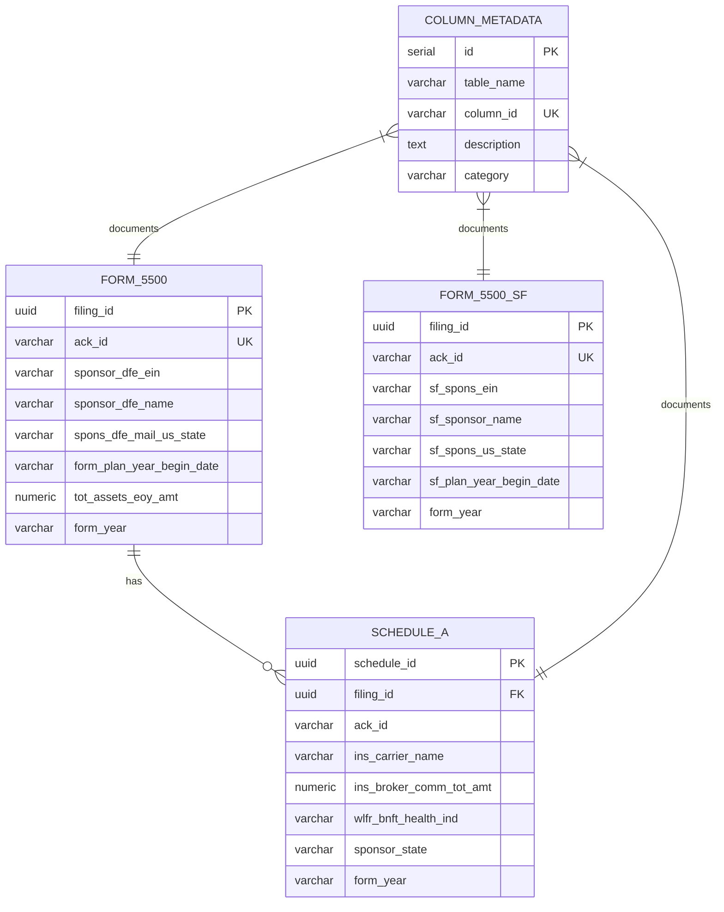

# DOL Schema Entity Relationship Diagram

## Visual ERD



## Table Summary

| Table | Rows | Columns | RLS | Read-Only |
|-------|------|---------|-----|-----------|
| form_5500 | 230,482 | 147 | Yes | Yes |
| form_5500_sf | 760,839 | 196 | Yes | Yes |
| schedule_a | 337,476 | 98 | Yes | Yes |
| column_metadata | 441 | 12 | No | No |

## Relationships

### form_5500 → schedule_a
- **Cardinality**: One-to-Many
- **Join Key**: `ack_id`
- **Note**: Schedule A attachments only exist for regular Form 5500, not 5500-SF

### column_metadata → All Tables
- **Cardinality**: Many-to-One (per table)
- **Purpose**: Documents all columns for AI/human consumption

## Key Columns by Table

### form_5500 (147 columns)
| Column | Type | Description |
|--------|------|-------------|
| filing_id | UUID | Primary key |
| ack_id | VARCHAR | DOL acknowledgment ID |
| sponsor_dfe_ein | VARCHAR | Employer ID |
| sponsor_dfe_name | VARCHAR | Company name |
| spons_dfe_mail_us_state | VARCHAR | State (2-letter) |
| form_plan_year_begin_date | VARCHAR | Renewal month |
| tot_assets_eoy_amt | NUMERIC | Total plan assets |

### form_5500_sf (196 columns)
| Column | Type | Description |
|--------|------|-------------|
| filing_id | UUID | Primary key |
| ack_id | VARCHAR | DOL acknowledgment ID |
| sf_spons_ein | VARCHAR | Employer ID |
| sf_sponsor_name | VARCHAR | Company name |
| sf_spons_us_state | VARCHAR | State (2-letter) |
| sf_plan_year_begin_date | VARCHAR | Renewal month |

### schedule_a (98 columns)
| Column | Type | Description |
|--------|------|-------------|
| schedule_id | UUID | Primary key |
| filing_id | UUID | FK to form_5500 |
| ins_carrier_name | VARCHAR | Insurance carrier |
| ins_carrier_ein | VARCHAR | Carrier EIN |
| ins_broker_comm_tot_amt | NUMERIC | Broker commissions |
| wlfr_bnft_health_ind | VARCHAR | Health benefits flag |
| sponsor_state | VARCHAR | State (derived) |

## Indexes

### State-Based Queries
```sql
-- form_5500
CREATE INDEX idx_f5500_state ON dol.form_5500(spons_dfe_mail_us_state);

-- form_5500_sf
CREATE INDEX idx_f5500sf_state ON dol.form_5500_sf(sf_spons_us_state);

-- schedule_a
CREATE INDEX idx_scha_state ON dol.schedule_a(sponsor_state);
```

### EIN Lookups
```sql
CREATE INDEX idx_f5500_ein ON dol.form_5500(sponsor_dfe_ein);
CREATE INDEX idx_f5500sf_ein ON dol.form_5500_sf(sf_spons_ein);
CREATE INDEX idx_scha_ein ON dol.schedule_a(sch_a_ein);
```

## Related

- [[DOL Sub-Hub Overview]]
- [[Column Metadata Guide]]
- Full ERD: `doctrine/diagrams/DOL_Schema_ERD.mmd`

#hub/dol #schema #erd
