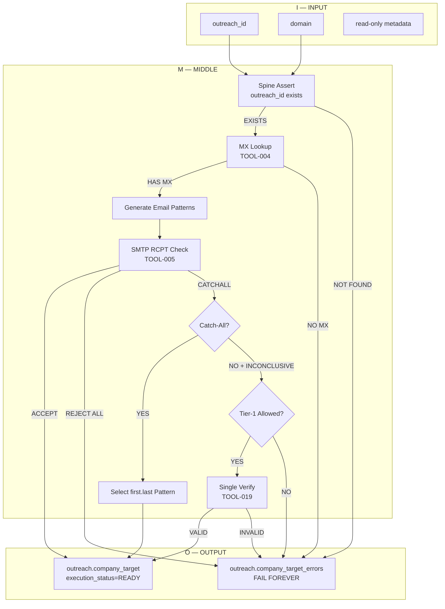

# PRD — Company Target (Execution Prep Sub-Hub) v3.0

**Version:** 3.0 (Spine-First Architecture)
**Refactor Date:** 2026-01-07
**Breaking Changes:** Removed identity ownership, spine-first enforcement

---

## CRITICAL: Outreach Spine Authority (HARD LAW)

```
╔═══════════════════════════════════════════════════════════════════════════════╗
║                      OUTREACH SPINE AUTHORITY                                  ║
║                                                                               ║
║   All Outreach subhubs operate on `outreach_id` ONLY.                        ║
║                                                                               ║
║   The `outreach_id` is minted exclusively via `outreach.mint_outreach_id()`, ║
║   which enforces a PASSed Company Lifecycle gate.                            ║
║                                                                               ║
║   Subhubs MUST NOT:                                                           ║
║   ├── Reference `sovereign_id` directly                                       ║
║   ├── Perform identity matching or verification                               ║
║   ├── Mint or infer any company identifiers                                   ║
║   └── Attempt to validate company existence                                   ║
║                                                                               ║
║   Identity binding occurs ONCE, in the Outreach Spine.                       ║
║   All downstream logic is EXECUTION-ONLY.                                     ║
║                                                                               ║
╚═══════════════════════════════════════════════════════════════════════════════╝
```

---

## Canonical Data Flow

```mermaid
flowchart LR
    CL[Company Lifecycle]
    SID[Sovereign ID<br/>(CL Only)]
    SPINE[Outreach Spine<br/>mint_outreach_id()]
    CT[Company Target<br/>(Execution Prep)]
    EM[Email Methodology]
    READY[Ready for Outreach Spokes]
    FAIL[Outreach Error Tables]

    CL --> SID
    SID -->|Gate PASS| SPINE
    SPINE -->|outreach_id| CT
    CT --> EM
    EM -->|Valid| READY
    EM -->|Invalid| FAIL
```

---

## Canonical Flow — CRO → Outreach Spine → Company Target

```mermaid
flowchart LR
    CRO[CRO / Company Lifecycle Owner]
    CL[Company Lifecycle]
    SID[Sovereign ID]
    SPINE[Outreach Spine<br/>outreach_id]
    CT[Company Target<br/>(Execution Prep IMO)]

    CRO --> CL
    CL --> SID
    SID -->|Gate PASS| SPINE
    SPINE -->|outreach_id only| CT
```

> **Identity authority ends at the Outreach Spine.**
> Company Target operates exclusively on `outreach_id` and is execution-only.

---

## Company Target Internal Logic (IMO — Authoritative)



> **This diagram is AUTHORITATIVE.**
> If the code diverges from this diagram, the code is WRONG.

---

## Sub-Hub Ownership Statement

```
╔═══════════════════════════════════════════════════════════════════════════════╗
║                     COMPANY TARGET OWNERSHIP (v3.0)                           ║
║                                                                               ║
║   This sub-hub OWNS:                                                          ║
║   ├── Domain resolution (if not provided by spine)                           ║
║   ├── Email pattern discovery via tiered waterfall                           ║
║   ├── Pattern verification                                                    ║
║   └── Execution-readiness classification                                      ║
║                                                                               ║
║   This sub-hub DOES NOT OWN:                                                  ║
║   ├── Company identity (owned by CL)                                          ║
║   ├── Identity minting (owned by Outreach Spine)                              ║
║   ├── Company matching or fuzzy logic (owned by CL)                           ║
║   ├── sovereign_id (NEVER referenced directly)                                ║
║   ├── BIT Engine (separate component)                                         ║
║   └── Outreach decisioning (downstream)                                       ║
║                                                                               ║
║   Company Target is the EXECUTION-READINESS sub-hub for Outreach.            ║
║   It prepares records for downstream spokes. It does NOT create identity.    ║
║                                                                               ║
╚═══════════════════════════════════════════════════════════════════════════════╝
```

---

## Out of Scope (HARD LAW)

The following are **explicitly NOT part of Company Target**. Any code or documentation suggesting otherwise is **WRONG**.

| Concept | Why Out of Scope | Owned By |
|---------|------------------|----------|
| **Company Matching** | Identity work, not execution prep | Company Lifecycle (CL) |
| **Fuzzy Logic** | Matching algorithm, not execution | Company Lifecycle (CL) |
| **Retries** | IMO is single-pass; FAIL is terminal | N/A — forbidden |
| **Enrichment** | Data augmentation is pre-IMO | Company Lifecycle (CL) |
| **CL Table Access** | Spine hides sovereign_id | Outreach Spine |
| **ID Minting** | Identity creation is upstream | Outreach Spine |
| **Hold Queues** | Quarantine is CL's job | Company Lifecycle (CL) |
| **Phase 1 / Phase 1b** | DEPRECATED — moved to CL | Company Lifecycle (CL) |

If you encounter these concepts in Company Target code:
1. The code is **violating doctrine**
2. File a bug, do not extend the violation
3. Reference `ADR-CT-IMO-001` for rationale

---

## 1. Overview

| Attribute | Value |
|-----------|-------|
| **System Name** | Barton Outreach Core |
| **Sub-Hub Name** | Company Target |
| **Sub-Hub Type** | Execution Prep (Sub-Hub of Outreach Spine) |
| **Owner** | [ASSIGN: Hub Owner] |
| **Version** | 3.0 (Spine-First Architecture) |
| **Doctrine ID** | 04.04.01 |
| **Primary Table** | `outreach.company_target` |
| **Error Table** | `outreach.company_target_errors` |
| **Upstream** | Outreach Spine (`outreach.outreach`) |

---

## 2. Purpose

Company Target is the **execution-readiness sub-hub** for Outreach. It is NOT an identity authority.

### What Company Target Actually Does

1. **Accept an `outreach_id`** that already passed CL gating (via Outreach Spine)
2. **Attach execution artifacts** to that ID:
   - Email methodology (pattern)
   - Domain validation state
   - Confidence / verification flags
3. **Classify the outreach record**:
   - Executable → downstream spokes (DOL, People, Blog)
   - Non-executable → `outreach.company_target_errors`
4. **NEVER create, infer, validate, or rescue identity**

### Owns

1. **Domain Resolution** — Validate domain if not provided by spine
2. **Email Pattern Discovery** — Tiered waterfall (Tier 0/1/2)
3. **Pattern Verification** — Verify discovered patterns
4. **Execution-Readiness Flag** — Mark record as ready for downstream

### Does NOT Own (HARD LAW)

1. **Company Identity** — Owned by CL (external)
2. **`sovereign_id`** — NEVER referenced (hidden by spine)
3. **Identity Minting** — Owned by Outreach Spine
4. **Company Matching** — Owned by CL
5. **Fuzzy Logic** — Owned by CL
6. **BIT Engine** — Separate component
7. **Outreach Decisioning** — Downstream

---

## 3. Owned Processes (Execution Prep Pipeline)

### Pipeline Overview (v3.0 — Spine-First)

```
┌─────────────────────────────────────────────────────────────────────────────┐
│              COMPANY TARGET PIPELINE (Phases 2-4 Only)                       │
│                    OWNED BY: Company Target Sub-Hub                          │
│                                                                              │
│   NOTE: Phase 1 (Matching) and Phase 1b (Hold Queue) are DEPRECATED.        │
│         Identity is handled by CL + Outreach Spine BEFORE this pipeline.    │
└─────────────────────────────────────────────────────────────────────────────┘

    INPUT: outreach_id from Outreach Spine (already CL-verified)
           ↓
    ┌──────────────────────────────────────────────────────────────┐
    │ ██ DEPRECATED: PHASE 1 — Company Matching ██                  │
    │ MOVED TO: Company Lifecycle (CL) — external system            │
    │ Company Target does NOT perform matching.                     │
    └──────────────────────────────────────────────────────────────┘

    ┌──────────────────────────────────────────────────────────────┐
    │ ██ DEPRECATED: PHASE 1b — Unmatched Hold Export ██            │
    │ MOVED TO: Company Lifecycle (CL) — external system            │
    │ Company Target does NOT manage hold queues for identity.      │
    └──────────────────────────────────────────────────────────────┘
           ↓
    ┌──────────────────────────────────────────────────────────────┐
    │ PHASE 2: Domain Resolution                                    │
    │ - Validate domain from spine record (or resolve if missing)  │
    │ - INPUT: outreach_id, domain (optional)                      │
    │ - OUTPUT: outreach_id + validated domain                     │
    └──────────────────────────────────────────────────────────────┘
           ↓
    ┌──────────────────────────────────────────────────────────────┐
    │ PHASE 3: Email Pattern Waterfall                              │
    │ - Discover email pattern via tiered providers                │
    │ - INPUT: outreach_id + domain                                │
    │ - OUTPUT: outreach_id + domain + email_pattern               │
    └──────────────────────────────────────────────────────────────┘
           ↓
    ┌──────────────────────────────────────────────────────────────┐
    │ PHASE 4: Pattern Verification                                 │
    │ - Verify pattern with known emails and SMTP                  │
    │ - INPUT: outreach_id + domain + email_pattern                │
    │ - OUTPUT: execution-ready record OR error                    │
    └──────────────────────────────────────────────────────────────┘
           ↓
    ┌──────────────────────────────────────────────────────────────┐
    │ OUTPUT ROUTING:                                               │
    │                                                               │
    │   PASS (method found) → outreach.company_target               │
    │                         Ready for downstream spokes           │
    │                                                               │
    │   FAIL (no method)   → outreach.company_target_errors         │
    │                         Blocks downstream, logged as error    │
    └──────────────────────────────────────────────────────────────┘
```

### Key Architectural Change (v3.0)

```
╔═══════════════════════════════════════════════════════════════════════════════╗
║                      PHASE 1/1b DEPRECATION NOTICE                            ║
║                                                                               ║
║   Phase 1 (Company Matching) and Phase 1b (Hold Queue) are REMOVED from      ║
║   Company Target ownership as of v3.0.                                        ║
║                                                                               ║
║   RATIONALE:                                                                  ║
║   ├── Company matching is IDENTITY work, owned by CL                         ║
║   ├── Fuzzy logic belongs in CL, not Outreach                                ║
║   ├── Company Target receives ONLY verified outreach_id                       ║
║   └── Gates are enforced in SQL (spine), not Python                          ║
║                                                                               ║
║   CODE IMPACT:                                                                ║
║   ├── DELETE: phase1_company_matching.py                                     ║
║   ├── DELETE: phase1b_unmatched_hold_export.py                               ║
║   ├── DELETE: utils/fuzzy.py                                                 ║
║   └── UPDATE: Pipeline entry point to accept outreach_id                     ║
║                                                                               ║
╚═══════════════════════════════════════════════════════════════════════════════╝
```

---

### Correlation ID Doctrine (HARD LAW)

```
╔═══════════════════════════════════════════════════════════════════════════════╗
║                       CORRELATION ID ENFORCEMENT                              ║
║                                                                               ║
║   DOCTRINE: correlation_id MUST be propagated unchanged across ALL phases    ║
║             and into the master error log (public.shq_error_log).            ║
║                                                                               ║
║   RULES:                                                                      ║
║   1. Every input to Phases 1-4 MUST include correlation_id                   ║
║   2. Every output from Phases 1-4 MUST include correlation_id                ║
║   3. Every BIT Engine signal MUST include correlation_id                     ║
║   4. Every error logged MUST include correlation_id                          ║
║   5. correlation_id MUST NOT be modified or regenerated mid-pipeline         ║
║                                                                               ║
║   FORMAT: UUID v4 (e.g., "550e8400-e29b-41d4-a716-446655440000")              ║
║   GENERATED BY: Initiating sub-hub or intake process                         ║
║                                                                               ║
╚═══════════════════════════════════════════════════════════════════════════════╝
```

---

### ~~Phase 1: Company Matching~~ (DEPRECATED v3.0)

```
╔═══════════════════════════════════════════════════════════════════════════════╗
║                           DEPRECATED — DO NOT USE                             ║
║                                                                               ║
║   Phase 1 (Company Matching) has been REMOVED from Company Target.           ║
║                                                                               ║
║   OWNER: Company Lifecycle (CL) — external system                            ║
║   REASON: Matching is identity work, not execution prep                       ║
║                                                                               ║
║   Company Target receives outreach_id from Outreach Spine.                   ║
║   Identity is already resolved before Company Target is invoked.             ║
║                                                                               ║
║   FILES TO DELETE:                                                            ║
║   ├── hubs/company-target/imo/middle/phases/phase1_company_matching.py       ║
║   └── hubs/company-target/imo/middle/utils/fuzzy.py                          ║
║                                                                               ║
╚═══════════════════════════════════════════════════════════════════════════════╝
```

---

### ~~Phase 1b: Unmatched Hold Export~~ (DEPRECATED v3.0)

```
╔═══════════════════════════════════════════════════════════════════════════════╗
║                           DEPRECATED — DO NOT USE                             ║
║                                                                               ║
║   Phase 1b (Unmatched Hold Export) has been REMOVED from Company Target.     ║
║                                                                               ║
║   OWNER: Company Lifecycle (CL) — external system                            ║
║   REASON: Hold queues for identity belong in CL, not Outreach                ║
║                                                                               ║
║   Company Target does NOT quarantine unmatched records.                      ║
║   If a record doesn't have an outreach_id, it never reaches Company Target.  ║
║                                                                               ║
║   FILES TO DELETE:                                                            ║
║   └── hubs/company-target/imo/middle/phases/phase1b_unmatched_hold_export.py ║
║                                                                               ║
╚═══════════════════════════════════════════════════════════════════════════════╝
```

---

### Phase 2: Domain Resolution

**Owner:** Company Target Sub-Hub
**Purpose:** Validate or resolve domain for execution prep. Domain may come from spine or need resolution.

#### Input Contract

| Field | Type | Required | Source |
|-------|------|----------|--------|
| `correlation_id` | UUID | **YES** | Propagate unchanged |
| `outreach_id` | UUID | **YES** | Outreach Spine |
| `domain` | string | NO | Spine record or needs resolution |

#### Process

1. Read domain from `outreach.outreach` record (via outreach_id)
2. If domain present: validate DNS + MX
3. If domain missing: attempt resolution from company name (via spine)
4. Detect parked domains
5. **FAIL if no valid domain found** → `outreach.company_target_errors`

#### Output Contract (Signal)

| Field | Type | Description |
|-------|------|-------------|
| `correlation_id` | UUID | **Propagated unchanged from input** |
| `outreach_id` | UUID | Outreach identity (NOT company_id) |
| `resolved_domain` | string | Validated domain |
| `domain_status` | enum | `valid`, `valid_no_mx`, `parked`, `unreachable`, `missing` |
| `has_mx` | bool | Has mail exchange records |

#### Failure Handling

| Failure | Routes To | Action |
|---------|-----------|--------|
| No domain resolved | `outreach.company_target_errors` | Block downstream |
| Domain unreachable | `outreach.company_target_errors` | Block downstream |
| Parked domain | `outreach.company_target_errors` | Block downstream |

---

### Phase 3: Email Pattern Waterfall

**Owner:** Company Target Sub-Hub
**Purpose:** Discover email pattern for the domain. This is the core value-add of Company Target.

#### Input Contract

| Field | Type | Required | Source |
|-------|------|----------|--------|
| `correlation_id` | UUID | **YES** | Propagate unchanged |
| `outreach_id` | UUID | **YES** | Outreach Spine |
| `domain` | string | **YES** | Phase 2 output |

#### Waterfall Tiers (SNAP_ON_TOOLBOX.yaml)

| Tier | Cost | Tools | Stop Condition |
|------|------|-------|----------------|
| 0 | FREE | TOOL-004 (MXLookup), TOOL-005 (SMTPCheck) | Pattern accepted |
| 1 | $0.001-0.01 | TOOL-017 (HunterEnricher) — GATED | Pattern found (confidence >= 0.7) |
| 2 | $0.05-0.10 | TOOL-019 (EmailVerifier) — GATED, SINGLE-SHOT | Pattern verified or FAIL |

> **BANNED**: Clearbit, Prospeo, Snov, Clay. See `SNAP_ON_TOOLBOX.yaml` for rationale.

#### Tier-2 Single-Shot Guard (HARD LAW)

```
╔═══════════════════════════════════════════════════════════════════════════════╗
║   Tier-2 providers are EXPENSIVE. Single-shot enforcement is REQUIRED.        ║
║   If Tier-2 fails, record goes to error table. NO RETRY.                      ║
╚═══════════════════════════════════════════════════════════════════════════════╝
```

#### Output Contract (Signal)

| Field | Type | Description |
|-------|------|-------------|
| `correlation_id` | UUID | **Propagated unchanged from input** |
| `outreach_id` | UUID | Outreach identity |
| `domain` | string | Company domain |
| `email_pattern` | string | Pattern (e.g., `{first}.{last}`) |
| `pattern_source` | enum | `tier_0`, `tier_1`, `tier_2`, `suggested` |
| `confidence` | float | 0.0 - 1.0 |
| `tier_used` | int | 0, 1, or 2 |
| `cost_credits` | float | API cost incurred |

#### Failure Handling

| Failure | Routes To | Action |
|---------|-----------|--------|
| All tiers exhausted | `outreach.company_target_errors` | Block downstream |
| API rate limited | Retry queue (Tier 0/1 only) | Backoff |
| Tier-2 failed | `outreach.company_target_errors` | NO RETRY |

---

### Phase 4: Pattern Verification

**Owner:** Company Target Sub-Hub
**Purpose:** Verify discovered patterns before marking record as execution-ready.

#### Input Contract

| Field | Type | Required | Source |
|-------|------|----------|--------|
| `correlation_id` | UUID | **YES** | Propagate unchanged |
| `outreach_id` | UUID | **YES** | Outreach Spine |
| `domain` | string | **YES** | Phase 2 output |
| `email_pattern` | string | **YES** | Phase 3 output |
| `sample_emails` | List[str] | NO | Historical data |

#### Verification Methods

| Method | Cost | Confidence Boost |
|--------|------|------------------|
| Sample Email Match | FREE | +0.3 |
| MX Record Check | FREE | +0.1 |
| SMTP Verification | $0.003/email | +0.2 |

#### Output Contract (Signal)

| Field | Type | Description |
|-------|------|-------------|
| `correlation_id` | UUID | **Propagated unchanged from input** |
| `outreach_id` | UUID | Outreach identity |
| `email_pattern` | string | Verified pattern |
| `verification_status` | enum | `verified`, `partial`, `failed` |
| `pattern_confidence` | float | 0.0 - 1.0 |
| `execution_ready` | bool | True if ready for downstream spokes |

#### Output Routing

| Status | Destination | Next Step |
|--------|-------------|-----------|
| `verified` | `outreach.company_target` | Ready for DOL, People, Blog |
| `partial` | `outreach.company_target` | Ready (with warning flag) |
| `failed` | `outreach.company_target_errors` | Blocked, logged |

---

## 4. BIT Engine (Signal Aggregation)

**Owner:** Separate Component (NOT Company Target)
**Purpose:** Aggregate signals from all sub-hubs and make outreach decisions.

> **NOTE:** BIT Engine is documented here for context, but it is NOT owned by Company Target.
> Company Target emits execution-readiness signals that BIT Engine consumes.

### BIT Engine Architecture

```
┌─────────────────────────────────────────────────────────────────────────────┐
│                              BIT ENGINE                                     │
│                         OWNED BY: Company Hub                               │
│                                                                             │
│   ┌─────────────────────────────────────────────────────────────────────┐  │
│   │                      SIGNAL AGGREGATION                              │  │
│   │                                                                      │  │
│   │   People Sub-Hub Signals:        DOL Sub-Hub Signals:               │  │
│   │   ├── SLOT_FILLED (+10)          ├── FORM_5500_FILED (+5)           │  │
│   │   ├── SLOT_VACATED (-5)          ├── LARGE_PLAN (+8)                │  │
│   │   ├── EMAIL_VERIFIED (+3)        └── BROKER_CHANGE (+7)             │  │
│   │   └── LINKEDIN_FOUND (+2)                                            │  │
│   │                                   Blog Sub-Hub Signals:              │  │
│   │   Talent Flow Signals:           ├── FUNDING_EVENT (+15)            │  │
│   │   ├── EXECUTIVE_JOINED (+10)     ├── ACQUISITION (+12)              │  │
│   │   ├── EXECUTIVE_LEFT (-5)        ├── LAYOFF (-3)                    │  │
│   │   └── TITLE_CHANGE (+3)          └── LEADERSHIP_CHANGE (+8)         │  │
│   └─────────────────────────────────────────────────────────────────────┘  │
│                                    │                                        │
│                                    ▼                                        │
│   ┌─────────────────────────────────────────────────────────────────────┐  │
│   │                      SCORE CALCULATION                               │  │
│   │                                                                      │  │
│   │   BIT_Score = Σ (signal_impact for all signals)                     │  │
│   │                                                                      │  │
│   │   Score Thresholds:                                                  │  │
│   │   ├── HOT (>= 75): Immediate outreach                               │  │
│   │   ├── WARM (50-74): Nurture sequence                                │  │
│   │   └── COLD (< 50): No outreach                                       │  │
│   └─────────────────────────────────────────────────────────────────────┘  │
│                                    │                                        │
│                                    ▼                                        │
│   ┌─────────────────────────────────────────────────────────────────────┐  │
│   │                      OUTREACH DECISION                               │  │
│   │                                                                      │  │
│   │   ONLY BIT ENGINE MAY DECIDE:                                       │  │
│   │   ├── WHO gets messaged                                             │  │
│   │   ├── WHEN they get messaged                                        │  │
│   │   └── WHAT campaign they enter                                       │  │
│   │                                                                      │  │
│   │   Output: OUTREACH_DECISION signal to Outreach Node                 │  │
│   └─────────────────────────────────────────────────────────────────────┘  │
└─────────────────────────────────────────────────────────────────────────────┘
```

### BIT Engine Input Contract

#### Signal Correlation ID Enforcement (HARD LAW)

```
╔═══════════════════════════════════════════════════════════════════════════════╗
║   DOCTRINE: Every signal to BIT Engine MUST include correlation_id.          ║
║             Signals without correlation_id MUST be rejected.                  ║
╚═══════════════════════════════════════════════════════════════════════════════╝
```

#### Required Signal Fields

| Field | Type | Required | Description |
|-------|------|----------|-------------|
| `correlation_id` | UUID | **YES** | Trace ID for full pipeline lineage |
| `signal_type` | enum | YES | Signal type (see table below) |
| `company_id` | string | YES | Company anchor |
| `source_spoke` | string | YES | Originating sub-hub |
| `emitted_at` | datetime | YES | Signal emission timestamp |
| `metadata` | Dict | NO | Additional signal context |

#### Signal Impact Values

| Signal | Source | Impact |
|--------|--------|--------|
| `SLOT_FILLED` | People Sub-Hub | +10.0 |
| `SLOT_VACATED` | People Sub-Hub | -5.0 |
| `EMAIL_VERIFIED` | People Sub-Hub | +3.0 |
| `LINKEDIN_FOUND` | People Sub-Hub | +2.0 |
| `EXECUTIVE_JOINED` | People Sub-Hub (Talent Flow) | +10.0 |
| `EXECUTIVE_LEFT` | People Sub-Hub (Talent Flow) | -5.0 |
| `FORM_5500_FILED` | DOL Sub-Hub | +5.0 |
| `LARGE_PLAN` | DOL Sub-Hub | +8.0 |
| `BROKER_CHANGE` | DOL Sub-Hub | +7.0 |
| `FUNDING_EVENT` | Blog/News Sub-Hub | +15.0 |
| `ACQUISITION` | Blog/News Sub-Hub | +12.0 |
| `LAYOFF` | Blog/News Sub-Hub | -3.0 |

### BIT Engine Output Contract

| Field | Type | Description |
|-------|------|-------------|
| `correlation_id` | UUID | **Propagated from input signal** |
| `company_id` | string | Company ID |
| `bit_score` | float | Calculated score |
| `category` | enum | `hot`, `warm`, `cold` |
| `outreach_eligible` | bool | True if score >= 50 |
| `campaign_id` | string | Assigned campaign (if eligible) |
| `decision_timestamp` | datetime | When decision was made |

---

## 5. Sub-Hub Registry

| Sub-Hub | Status | Signals Emitted | Parent |
|---------|--------|-----------------|--------|
| **People Sub-Hub** | ACTIVE | `SLOT_FILLED`, `SLOT_VACATED`, `EMAIL_VERIFIED`, `LINKEDIN_FOUND`, `EXECUTIVE_JOINED`, `EXECUTIVE_LEFT` | Company Hub |
| **DOL Sub-Hub** | ACTIVE | `FORM_5500_FILED`, `LARGE_PLAN`, `BROKER_CHANGE` | Company Hub |
| **Blog/News Sub-Hub** | PLANNED | `FUNDING_EVENT`, `ACQUISITION`, `LAYOFF`, `LEADERSHIP_CHANGE` | Company Hub |

---

## 6. Signal Contract Enforcement

### Hard Rules

1. **BIT Engine consumes SIGNALS ONLY** — Never reads raw sub-hub tables
2. **All inter-hub communication is event-based** — No direct database queries across hubs
3. **Sub-hubs may REQUEST company identity creation** — But NEVER create it themselves
4. **Sub-hubs EMIT signals, never DECISIONS** — Only Company Hub (BIT) decides outreach

### Signal Flow Diagram

```
┌─────────────┐     ┌─────────────┐     ┌─────────────┐
│   People    │     │     DOL     │     │  Blog/News  │
│  Sub-Hub    │     │  Sub-Hub    │     │  Sub-Hub    │
└──────┬──────┘     └──────┬──────┘     └──────┬──────┘
       │                   │                   │
       │ SLOT_FILLED       │ FORM_5500_FILED   │ FUNDING_EVENT
       │ EMAIL_VERIFIED    │ LARGE_PLAN        │ ACQUISITION
       │ EXEC_JOINED       │ BROKER_CHANGE     │ LEADERSHIP_CHG
       │                   │                   │
       └───────────────────┼───────────────────┘
                           │
                           ▼
              ╔════════════════════════════╗
              ║       COMPANY HUB          ║
              ║                            ║
              ║   ┌────────────────────┐   ║
              ║   │    BIT ENGINE      │   ║
              ║   │  (Signal → Score)  │   ║
              ║   └─────────┬──────────┘   ║
              ║             │              ║
              ║             ▼              ║
              ║   OUTREACH_DECISION        ║
              ╚════════════╪═══════════════╝
                           │
                           ▼
                  ┌────────────────┐
                  │  Outreach Node │
                  │  (Execution)   │
                  └────────────────┘
```

---

## 7. Guard Rails (v3.0)

| Guard Rail | Type | Threshold | Action |
|------------|------|-----------|--------|
| Spine-First | Validation | `outreach_id = NULL` | REJECT (CT-I-NOT-FOUND) |
| Domain Gate | Validation | `domain = NULL` | REJECT (CT-I-NO-DOMAIN) |
| MX Gate | Validation | No MX records | REJECT (CT-M-NO-MX) |
| Pattern Confidence | Validation | confidence < 0.5 | REJECT (CT-M-NO-PATTERN) |
| Catch-All Detection | Classification | accepts all RCPT | Reduce confidence to 0.5 |
| API Rate Limit | Rate Limit | Per SNAP_ON_TOOLBOX.yaml | Backoff per tool spec |
| Single-Pass Enforcement | Validation | Already processed | Exit (idempotent) |
| BIT Score Threshold | Validation | score < 50 | No outreach |

> **DEPRECATED Guard Rails**: Fuzzy Match Floor, Collision Detection, City Guardrail — moved to CL.

---

## 8. Kill Switch

| Attribute | Value |
|-----------|-------|
| **Endpoint** | `POST /api/company-hub/kill` |
| **Environment Variable** | `COMPANY_HUB_ENABLED=false` |
| **Activation Criteria** | Error rate > 10% in 5 min, API cost > $100, DB failure |
| **Emergency Contact** | [ASSIGN: On-Call Engineer] |
| **Scope** | Halts Phases 1-4 + BIT Engine |

---

## 9. Error Log Integration (HARD LAW)

### Master Error Log Schema

All errors from Phases 1-4 and BIT Engine MUST be logged to `public.shq_error_log` with correlation_id.

```
╔═══════════════════════════════════════════════════════════════════════════════╗
║                       ERROR LOGGING ENFORCEMENT                               ║
║                                                                               ║
║   DOCTRINE: Every error MUST include correlation_id for trace lineage.       ║
║             Errors without correlation_id are INVALID and will be rejected.  ║
║                                                                               ║
║   TARGET TABLE: public.shq_error_log                                         ║
║   RETENTION: 90 days (auto-purge after)                                      ║
║                                                                               ║
╚═══════════════════════════════════════════════════════════════════════════════╝
```

#### Required Error Log Fields

| Field | Type | Required | Description |
|-------|------|----------|-------------|
| `error_id` | UUID | YES | Auto-generated |
| `correlation_id` | UUID | **YES** | Pipeline trace ID |
| `error_code` | string | YES | Standardized error code |
| `error_message` | string | YES | Human-readable message |
| `severity` | enum | YES | `info`, `warning`, `error`, `critical` |
| `component` | string | YES | `phase_1`, `phase_1b`, `phase_2`, `phase_3`, `phase_4`, `bit_engine` |
| `company_id` | string | NO | If available |
| `stack_trace` | text | NO | For debugging |
| `created_at` | datetime | YES | Auto-generated |

#### Error Code Standards (v3.0 — IMO Model)

| Code | IMO Stage | Description | Terminal |
|------|-----------|-------------|----------|
| `CT-I-NOT-FOUND` | I (Input) | `outreach_id` not found in spine | YES |
| `CT-I-NO-DOMAIN` | I (Input) | No domain in spine record | YES |
| `CT-I-ALREADY-PROCESSED` | I (Input) | Record already PASS or FAIL | EXIT (idempotent) |
| `CT-M-NO-MX` | M (Middle) | No MX records for domain | YES |
| `CT-M-NO-PATTERN` | M (Middle) | All patterns rejected by SMTP | YES |
| `CT-M-SMTP-FAIL` | M (Middle) | SMTP connection/validation failure | YES |
| `CT-M-VERIFY-FAIL` | M (Middle) | Tier-2 verification failed | YES |

> **DEPRECATED Error Codes**: CH-P1-*, CH-P1B-*, CT-P2-*, CT-P3-*, CT-P4-*, CT-SPINE-* — replaced by IMO model.

---

## 10. Observability

### Logs

- `pipeline_engine/output/audit_log.json`
- `public.shq_error_log` (database) — **MUST include correlation_id**

### Metrics (v3.0)

| Metric | Description |
|--------|-------------|
| ~~`company_hub.phase1_match_rate`~~ | ~~% of inputs matched~~ **(DEPRECATED)** |
| ~~`company_hub.phase1b_hold_queue_size`~~ | ~~Current hold queue depth~~ **(DEPRECATED)** |
| ~~`company_hub.phase1b_ttl_expired`~~ | ~~Records purged due to TTL~~ **(DEPRECATED)** |
| `company_target.records_processed` | Records received from spine |
| `company_target.domain_resolution_rate` | % of records with valid domain |
| `company_target.phase3_pattern_found_rate` | % of domains with patterns |
| `company_target.execution_ready_rate` | % of records ready for downstream |
| `company_target.error_rate` | % routed to error table |
| `company_target.tier2_usage` | Tier-2 API calls (cost tracking) |

### Alerts (v3.0)

| Alert | Condition |
|-------|-----------|
| High Error Rate | Error rate > 10% |
| ~~Low Match Rate~~ | ~~Phase 1 match rate < 50%~~ **(DEPRECATED)** |
| API Cost Spike | Cost > $50 in 1 hour |
| Low Pattern Discovery | Pattern found rate < 60% |
| Domain Resolution Failures | Domain failures > 20% |
| ~~Hold Queue Backlog~~ | ~~> 1000 records in hold queue~~ **(DEPRECATED)** |

---

## 11. Failure Modes

| Failure | Severity | Remediation |
|---------|----------|-------------|
| Database connection lost | CRITICAL | Halt hub, alert |
| All API providers down | HIGH | Use suggested patterns |
| BIT Engine backlog | MEDIUM | Scale processing |
| Pattern confidence low | LOW | Accept partial |
| Hold queue TTL mass expiry | HIGH | Alert data steward, review batch |
| Signal missing correlation_id | MEDIUM | Reject signal, log error |

---

## 12. Promotion Gates

| Gate | Requirement |
|------|-------------|
| G1 | All unit tests pass |
| G2 | Phase 1-4 integration tests pass |
| G3 | BIT Engine signal processing test pass |
| G4 | Kill switch tested |
| G5 | Rollback procedure verified |
| G6 | Correlation ID propagation verified across all phases |
| G7 | Hold queue TTL escalation tested |
| G8 | Error log integration verified (correlation_id present) |

---

## 13. Approval

| Role | Name | Date |
|------|------|------|
| Hub Owner | | |
| Tech Lead | | |
| Reviewer | | |

---

## 14. Code Remediation Summary (v3.0)

This section specifies the code changes required to align with the spine-first architecture.

### Files to DELETE

| File | Reason |
|------|--------|
| `hubs/company-target/imo/middle/phases/phase1_company_matching.py` | Matching is CL's job |
| `hubs/company-target/imo/middle/phases/phase1b_unmatched_hold_export.py` | Hold queues belong in CL |
| `hubs/company-target/imo/middle/utils/fuzzy.py` | Fuzzy logic belongs in CL |

### Files to UPDATE

| File | Change Required |
|------|-----------------|
| `hubs/company-target/imo/middle/company_pipeline.py` | Remove `add_company()`, accept `outreach_id` as entry |
| `hubs/company-target/imo/middle/utils/cl_gate.py` | Remove or refactor — CT should not reference CL directly |
| `hubs/company-target/imo/output/neon_writer.py` | Write to `outreach.company_target`, not `marketing.company_master` |
| `hubs/company-target/__init__.py` | Update exports to remove Phase 1/1b |

### Database Changes

| Change | Status |
|--------|--------|
| `outreach.outreach` spine table | ✅ EXISTS |
| `outreach.company_target.outreach_id` FK | ✅ EXISTS |
| `outreach.company_target_errors` | ✅ EXISTS |
| `outreach.mint_outreach_id()` function | ✅ EXISTS |

### Code Invariants (HARD LAW)

```
╔═══════════════════════════════════════════════════════════════════════════════╗
║   1. Company Target NEVER references sovereign_id                             ║
║   2. Company Target NEVER mints company identifiers                           ║
║   3. Company Target ALWAYS receives outreach_id from Outreach Spine           ║
║   4. Company Target ALWAYS writes to outreach.company_target                  ║
║   5. Company Target NEVER writes to marketing.company_master                  ║
║   6. Failed records go to outreach.company_target_errors — NO RETRY           ║
╚═══════════════════════════════════════════════════════════════════════════════╝
```

---

## 15. Execution Metrics (Required)

The following metrics MUST be tracked for Company Target IMO:

| Metric | Description | Target |
|--------|-------------|--------|
| **IMO Pass Rate** | % of records reaching READY status | > 70% |
| **IMO Fail Rate** | % of records routed to errors table | < 30% |
| **NO-MX Percentage** | % of failures due to missing MX records | < 10% |
| **Catch-All Percentage** | % of PASSes with catch-all domains | Observational |
| **Mean IMO Runtime (ms)** | Average time to complete IMO pass | < 5000ms |

These metrics are **observational only**. They do not alter execution logic.

### Failure Distribution Tracking

| Error Code | Expected Range |
|------------|----------------|
| `CT-I-NOT-FOUND` | < 1% (data quality issue) |
| `CT-I-NO-DOMAIN` | < 5% (upstream data gap) |
| `CT-M-NO-MX` | 5-15% (invalid domains) |
| `CT-M-NO-PATTERN` | 10-20% (undiscoverable formats) |
| `CT-M-SMTP-FAIL` | < 5% (transient network) |

---

## 16. Signals Available to IMO (Non-Expanding)

Company Target **consumes a footprint; it does not grow one.**

### Outreach Context View

The cumulative outreach footprint is exposed via:

```sql
outreach.v_context_current
```

This view is **SELECT-only**. Subhubs may read it but MUST NOT write to it.

See: `ops/infra/migrations/2026-01-08-outreach-context-view.sql`

### What IMO May Read (Pre-Loaded Context)

| Signal | Source | Usage |
|--------|--------|-------|
| `domain` | Spine (copied from CL) | MX lookup, pattern generation |
| `linkedin_company_url` | Spine (copied from CL) | Logging only — does NOT make email executable |
| `website_url` | Spine (copied from CL) | Logging only |

### What IMO May NOT Do

| Forbidden Action | Why |
|------------------|-----|
| Fetch new URLs | Grows footprint during execution |
| Verify LinkedIn existence | Identity work (CL's job) |
| Enrich missing data | Progressive enrichment = retry by stealth |
| Fall back on alternate signals | MX fail + LinkedIn exists = still FAIL |

### The Rule (HARD LAW)

```
╔═══════════════════════════════════════════════════════════════════════════════╗
║   IMO reads a SNAPSHOT. It does not fetch, expand, or enrich.                ║
║                                                                               ║
║   If the snapshot is incomplete → FAIL.                                       ║
║   If MX fails and LinkedIn exists → still FAIL.                              ║
║   If domain is missing → FAIL (CT-I-NO-DOMAIN).                              ║
║                                                                               ║
║   Footprint growth happens UPSTREAM (CL) or ALONGSIDE (spine metadata).      ║
║   Never DURING the IMO.                                                       ║
╚═══════════════════════════════════════════════════════════════════════════════╝
```

---

## 17. Change Control (FROZEN)

```
╔═══════════════════════════════════════════════════════════════════════════════╗
║                    COMPANY TARGET IS FROZEN                                   ║
║                                                                               ║
║   Any modification requires:                                                  ║
║   1. New ADR (Architecture Decision Record)                                   ║
║   2. PRD version bump                                                         ║
║   3. CI guard updates                                                         ║
║   4. Ops runbook update                                                       ║
║                                                                               ║
║   NO EXCEPTIONS.                                                              ║
║                                                                               ║
║   This includes:                                                              ║
║   - Adding new error codes                                                    ║
║   - Changing tool usage                                                       ║
║   - Modifying IMO stages                                                      ║
║   - Adding retry logic (PERMANENTLY FORBIDDEN)                                ║
║   - Adding fuzzy matching (PERMANENTLY FORBIDDEN)                             ║
║                                                                               ║
╚═══════════════════════════════════════════════════════════════════════════════╝
```

### Ops Runbook

See: `ops/runbooks/RUNBOOK_COMPANY_TARGET_IMO.md`

### CI Guards

| Guard | File | Purpose |
|-------|------|---------|
| IMO Guard | `.github/workflows/company_target_imo_guard.yml` | Block code violations |
| Docs Guard | `.github/workflows/company_target_docs_guard.yml` | Block doc staleness |

---

*Document Version: 3.0*
*Template: PRD_SUBHUB.md*
*Doctrine: Barton Doctrine v1.1 (Spine-First Architecture)*
*Last Updated: 2026-01-07*
*Status: FROZEN*
