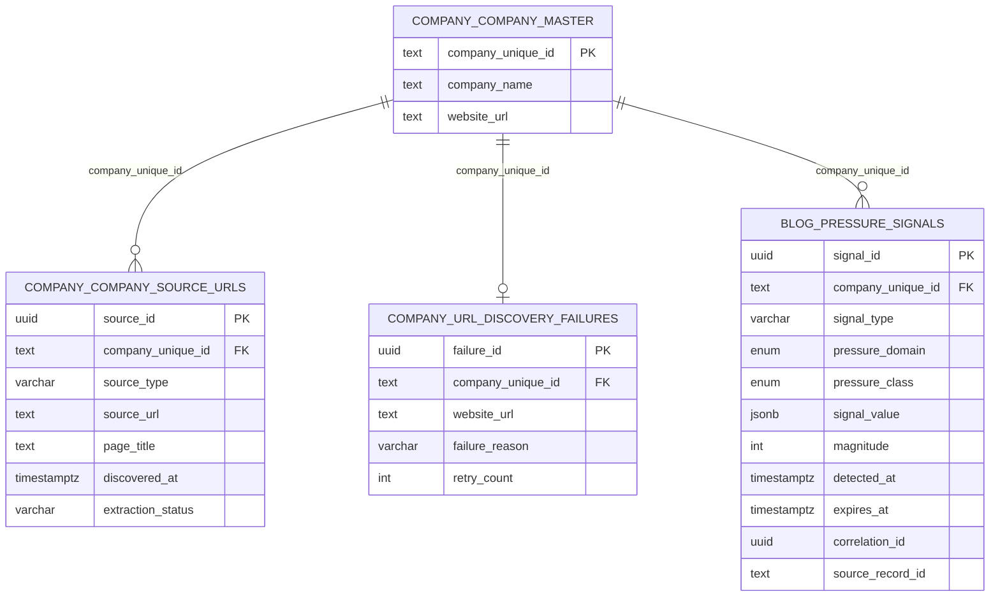

# Blog Content Hub — Database Schema

> **AUTHORITY**: Neon PostgreSQL (Production)
> **VERIFIED**: 2026-02-02 via READ-ONLY connection
> **HUB ID**: 04.04.05
> **STATUS**: NEON VERIFIED

---

## Primary Tables

| Schema | Table | Purpose |
|--------|-------|---------|
| `outreach` | `blog` | Outreach-scoped blog content signals |
| `outreach` | `blog_archive` | Archived blog records |
| `outreach` | `blog_errors` | Blog pipeline errors |
| `outreach` | `blog_ingress_control` | Pipeline gate switches |
| `outreach` | `blog_source_history` | Source tracking |
| `company` | `company_source_urls` | Discovered URLs |
| `company` | `url_discovery_failures` | Discovery failure tracking |

---

## Tables

### outreach.blog (8 columns)

Content signals for outreach intelligence.

| Column | Type | Nullable | Default | Description |
|--------|------|----------|---------|-------------|
| `blog_id` | uuid | NOT NULL | gen_random_uuid() | Primary key |
| `outreach_id` | uuid | NOT NULL | - | FK to outreach.outreach |
| `context_summary` | text | NULL | - | AI-generated summary |
| `source_type` | text | NULL | - | Signal type |
| `source_url` | text | NULL | - | Source link |
| `context_timestamp` | timestamptz | NULL | - | Signal timestamp |
| `created_at` | timestamptz | NULL | now() | Record creation time |
| `source_type_enum` | enum | NULL | - | Enum version |

**Coverage** (as of v1.0): 42,192 records (100% of outreach spine)

---

### blog.pressure_signals (BIT v2.0)

**AI-Ready Data Metadata (per Canonical Architecture Doctrine §12):**

| Field | Value |
|-------|-------|
| `table_unique_id` | `TBL-BLOG-PRESSURE-001` |
| `owning_hub_unique_id` | `HUB-BLOG-001` |
| `owning_subhub_unique_id` | `SUBHUB-BLOG-001` |
| `description` | NARRATIVE_VOLATILITY domain signals for BIT authorization. Lowest trust level - amplifier only, Blog alone = max Band 1. |
| `source_of_truth` | Blog Hub processing (news mentions, funding announcements, content signals) |
| `row_identity_strategy` | UUID primary key (signal_id) |

| Column | Type | Nullable | Default | Description |
|--------|------|----------|---------|-------------|
| `signal_id` | uuid | NOT NULL | gen_random_uuid() | Primary key - unique signal identifier |
| `company_unique_id` | text | NOT NULL | - | Company reference |
| `signal_type` | varchar(50) | NOT NULL | - | Signal classification (funding_announcement, news_mention, growth_indicator) |
| `pressure_domain` | enum | NOT NULL | 'NARRATIVE_VOLATILITY' | Domain constraint (always NARRATIVE_VOLATILITY for Blog) |
| `pressure_class` | enum | NULL | - | Pressure classification |
| `signal_value` | jsonb | NOT NULL | '{}' | Domain-specific payload with evidence |
| `magnitude` | integer | NOT NULL | 0 | Impact score (0-100) |
| `detected_at` | timestamptz | NOT NULL | now() | When signal was detected |
| `expires_at` | timestamptz | NOT NULL | - | Validity window end |
| `correlation_id` | uuid | NULL | - | PID binding / trace ID |
| `source_record_id` | text | NULL | - | Traceability (e.g., news_id) |
| `created_at` | timestamptz | NOT NULL | now() | Record creation time |

**Column Metadata (per §12.3):**

| Column | column_unique_id | semantic_role | format |
|--------|------------------|---------------|--------|
| `signal_id` | COL-BLOG-PS-001 | identifier | UUID |
| `company_unique_id` | COL-BLOG-PS-002 | foreign_key | TEXT |
| `signal_type` | COL-BLOG-PS-003 | attribute | ENUM |
| `pressure_domain` | COL-BLOG-PS-004 | attribute | ENUM |
| `pressure_class` | COL-BLOG-PS-005 | attribute | ENUM |
| `signal_value` | COL-BLOG-PS-006 | attribute | JSON |
| `magnitude` | COL-BLOG-PS-007 | metric | INTEGER |
| `detected_at` | COL-BLOG-PS-008 | attribute | ISO-8601 |
| `expires_at` | COL-BLOG-PS-009 | attribute | ISO-8601 |
| `correlation_id` | COL-BLOG-PS-010 | identifier | UUID |
| `source_record_id` | COL-BLOG-PS-011 | foreign_key | TEXT |
| `created_at` | COL-BLOG-PS-012 | attribute | ISO-8601 |

**Trust Cap:** Blog alone = max Band 1 (WATCH). Never sufficient for contact authorization.

**Authority:** ADR-017
**Migration:** `neon/migrations/2026-01-26-bit-v2-phase1-distributed-signals.sql`

---

### company.company_source_urls

Stores discovered URLs linked to companies for future extraction.

| Column | Type | Nullable | Description |
|--------|------|----------|-------------|
| source_id | UUID | NO | Primary key |
| company_unique_id | TEXT | NO | FK to company_master |
| source_type | VARCHAR(50) | NO | Page type (leadership_page, about_page, etc.) |
| source_url | TEXT | NO | Full URL |
| page_title | TEXT | YES | Extracted page title |
| discovered_at | TIMESTAMPTZ | NO | When URL was discovered |
| discovered_from | VARCHAR(100) | YES | Discovery method (crawl, manual, rss) |
| last_checked_at | TIMESTAMPTZ | YES | Last accessibility check |
| http_status | INTEGER | YES | Last HTTP status code |
| is_accessible | BOOLEAN | YES | Current accessibility |
| content_checksum | TEXT | YES | Content hash for change detection |
| last_content_change_at | TIMESTAMPTZ | YES | When content last changed |
| extraction_status | VARCHAR(50) | YES | pending/extracted/failed |
| extracted_at | TIMESTAMPTZ | YES | When content was extracted |
| created_at | TIMESTAMPTZ | YES | Record creation time |
| updated_at | TIMESTAMPTZ | YES | Record update time |

**Constraints:**
- PRIMARY KEY: source_id
- UNIQUE: (company_unique_id, source_url)
- INDEX: company_unique_id
- INDEX: source_type

---

### company.url_discovery_failures

Tracks companies where URL discovery failed for retry.

| Column | Type | Nullable | Description |
|--------|------|----------|-------------|
| failure_id | UUID | NO | Primary key |
| company_unique_id | TEXT | NO | FK to company_master |
| website_url | TEXT | YES | Company website URL |
| failure_reason | VARCHAR(100) | NO | Reason code |
| retry_count | INTEGER | YES | Number of retry attempts |
| last_attempt_at | TIMESTAMPTZ | YES | Last discovery attempt |
| next_retry_at | TIMESTAMPTZ | YES | Scheduled retry time |
| resolved_at | TIMESTAMPTZ | YES | When issue was resolved |
| created_at | TIMESTAMPTZ | YES | Record creation time |

**Constraints:**
- PRIMARY KEY: failure_id
- UNIQUE: company_unique_id

---

## Source Types

| Type | Description | Extraction Use |
|------|-------------|----------------|
| leadership_page | Executive team pages | CEO, CFO, CTO extraction |
| about_page | Company overview | Context, history |
| team_page | Full team listings | All staff discovery |
| press_page | News, press releases | Timing signals |
| careers_page | Job listings | Expansion signals |
| contact_page | Contact information | Address verification |

---

## Failure Reasons

| Reason | Description |
|--------|-------------|
| no_pages_discovered | Base URL accessible but no sub-pages found |
| base_url_timeout | Company website did not respond |
| base_url_error | HTTP error on base URL |
| invalid_domain | Domain does not resolve |

---

## Statistics (2026-01-18)

| Metric | Value |
|--------|-------|
| Total URLs | 97,124 |
| Companies with URLs | 30,771 |
| Failed Companies | 42,348 |
| Avg URLs/Company | 3.2 |

### By Source Type

| Type | Count |
|------|-------|
| contact_page | 25,213 |
| about_page | 24,099 |
| careers_page | 16,262 |
| press_page | 14,377 |
| leadership_page | 9,214 |
| team_page | 7,959 |

---

## ERD



---

---

## Cascade Cleanup Documentation

**Reference**: `docs/reports/OUTREACH_CASCADE_CLEANUP_REPORT_2026-01-29.md`

### Table Ownership

| Table | Purpose | Cascade Order |
|-------|---------|---------------|
| `outreach.blog` | Outreach-scoped blog data | DELETE after bit_scores |
| `blog.pressure_signals` | BIT v2.0 signals | Expire naturally via `expires_at` |
| `company.company_source_urls` | Discovered URLs | NOT deleted (reference data) |

### Cascade Deletion Order

When CL marks a company INELIGIBLE and Outreach runs cascade cleanup:

```
1. outreach.send_log          (FK: person_id, target_id)
2. outreach.sequences         (FK: campaign_id)
3. outreach.campaigns         (standalone)
4. outreach.manual_overrides  (FK: outreach_id)
5. outreach.bit_signals       (FK: outreach_id)
6. outreach.bit_scores        (FK: outreach_id)
7. outreach.blog              (FK: outreach_id) ← THIS HUB
8. people.people_master       (FK: company_slot)
9. people.company_slot        (FK: outreach_id)
10. outreach.people           (FK: outreach_id)
11. outreach.dol              (FK: outreach_id)
12. outreach.company_target   (FK: outreach_id)
13. outreach.outreach         (SPINE - deleted last)
```

### Archive-Before-Delete Pattern

```sql
-- Delete from outreach.blog (typically has full coverage)
DELETE FROM outreach.blog
WHERE outreach_id IN (SELECT outreach_id FROM orphan_list);
```

### What Is NOT Deleted

The following Blog reference tables are **NEVER** deleted during cascade cleanup:
- `blog.pressure_signals` — Expire naturally via `expires_at`
- `company.company_source_urls` — Discovered URLs (may be reused)
- `company.url_discovery_failures` — Failure tracking

### Post-Cleanup State (2026-01-30)

| Table | Records | Notes |
|-------|---------|-------|
| outreach.blog | 41,425 | 98.2% coverage of outreach spine |
| blog.pressure_signals | — | Expire via `expires_at` |
| company.company_source_urls | 97,124 | Unchanged (reference data) |

### Cleanup Trigger

This hub's `outreach.blog` data is cleaned when:
1. CL marks company as `INELIGIBLE` (eligibility_status)
2. CL moves company to `cl.company_identity_excluded`
3. Outreach cascade cleanup runs via `OUTREACH_CASCADE_CLEANUP.prompt.md`

### Pressure Signal Expiration

`blog.pressure_signals` are NOT cascade-deleted. They expire naturally:
- Each signal has `expires_at` timestamp
- BIT v2.0 union view filters: `WHERE expires_at > NOW()`
- Orphaned signals become invisible automatically

---

**Last Updated**: 2026-01-30
