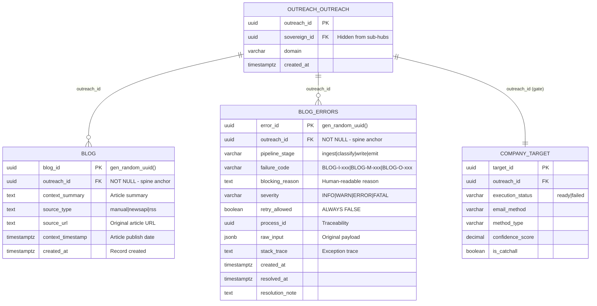

# Blog Content Sub-Hub - Entity Relationship Diagram

**Version:** 1.1.0
**Generated:** 2026-01-08
**Doctrine:** Barton IMO v1.1 (Spine-First Architecture)
**Waterfall Position:** 4th (LAST - after People Intelligence)
**Status:** PRODUCTION LOCKED

---

## Overview

The Blog Content Sub-Hub provides **timing signals** from news, funding events, and content sources.
It is **signal-only** - cannot mint companies, trigger enrichment, or spend money.
All operations key off `outreach_id` from the spine.

**Scope Lock:** Records *where* a company publishes, not *how large* the audience is.

---

## Core Doctrine Rules

```
+===============================================================================+
|                        BLOG CONTENT DOCTRINE v1.1                             |
|                                                                               |
|   1. LAST in waterfall - requires CT PASS                                     |
|   2. Signal-only: BIT modulation, NO enrichment triggers                      |
|   3. NO company minting - receives outreach_id from spine                     |
|   4. NO paid tools - free signal processing only                              |
|   5. 8 locked event types with fixed BIT impacts                              |
|   6. Company-level only: NO social metrics                                    |
|   7. Errors are first-class outputs: NO silent failures                       |
|                                                                               |
+===============================================================================+
```

---

## ERD Diagram (Mermaid)



---

## Table Definitions

### outreach.blog (Main Table)

| Column | Type | Constraints | Description |
|--------|------|-------------|-------------|
| `blog_id` | UUID | PK, DEFAULT gen_random_uuid() | Primary key |
| `outreach_id` | UUID | FK NOT NULL | Spine anchor |
| `context_summary` | TEXT | | Article summary/context |
| `source_type` | TEXT | | manual, newsapi, rss, sec_edgar |
| `source_url` | TEXT | | Original article URL |
| `context_timestamp` | TIMESTAMPTZ | | Article publish date |
| `created_at` | TIMESTAMPTZ | DEFAULT NOW() | Record created |

### outreach.blog_errors (Error Table)

| Column | Type | Constraints | Description |
|--------|------|-------------|-------------|
| `error_id` | UUID | PK, DEFAULT gen_random_uuid() | Primary key |
| `outreach_id` | UUID | FK NOT NULL | Spine anchor |
| `pipeline_stage` | VARCHAR(50) | NOT NULL | ingest, parse, classify, write, emit |
| `failure_code` | VARCHAR(20) | NOT NULL | BLOG-I-xxx, BLOG-M-xxx, BLOG-O-xxx |
| `blocking_reason` | TEXT | NOT NULL | Human-readable reason |
| `severity` | VARCHAR(20) | NOT NULL DEFAULT 'ERROR' | INFO, WARN, ERROR, FATAL |
| `retry_allowed` | BOOLEAN | NOT NULL DEFAULT FALSE | ALWAYS FALSE (terminal) |
| `process_id` | UUID | | Process traceability |
| `raw_input` | JSONB | | Original payload |
| `stack_trace` | TEXT | | Exception trace |
| `created_at` | TIMESTAMPTZ | NOT NULL DEFAULT NOW() | Error recorded |
| `resolved_at` | TIMESTAMPTZ | | When resolved |
| `resolution_note` | TEXT | | Resolution details |

---

## Pipeline Stages (IMO)

```
+------------------+     +------------------+     +------------------+
|   INPUT (I)      | --> |   MIDDLE (M)     | --> |   OUTPUT (O)     |
+------------------+     +------------------+     +------------------+
| - Validate ID    |     | - Classify event |     | - Write to blog  |
| - Check spine    |     | - Build signal   |     | - OR write error |
| - Check CT gate  |     | - Keyword match  |     |                  |
| - Idempotency    |     |                  |     |                  |
+------------------+     +------------------+     +------------------+
      |                        |                        |
      v                        v                        v
  BLOG-I-xxx              BLOG-M-xxx              BLOG-O-xxx
```

---

## Error Codes (v1.1)

| Code | Stage | Description | Severity |
|------|-------|-------------|----------|
| BLOG-I-NO-OUTREACH | ingest | No outreach_id provided | ERROR |
| BLOG-I-NOT-FOUND | ingest | outreach_id not in spine | ERROR |
| BLOG-I-NO-DOMAIN | ingest | No domain in spine | ERROR |
| BLOG-I-UPSTREAM-FAIL | ingest | CT not PASS (ready) | ERROR |
| BLOG-I-ALREADY-PROCESSED | ingest | Idempotent skip (not persisted) | INFO |
| BLOG-M-NO-CONTENT | classify | No content to process | WARN |
| BLOG-M-CLASSIFY-FAIL | classify | Classification failed | ERROR |
| BLOG-M-NO-EVENT | classify | No actionable event | WARN |
| BLOG-O-WRITE-FAIL | write | Neon write failed | FATAL |

---

## Event Types (Locked)

| Event Type | BIT Impact | Description |
|------------|------------|-------------|
| FUNDING_EVENT | +15.0 | Funding round, Series A/B/C, investment |
| ACQUISITION | +12.0 | M&A activity, acquisition announcement |
| LEADERSHIP_CHANGE | +8.0 | CEO/CFO/CTO appointment or departure |
| EXPANSION | +7.0 | New office, market entry, relocation |
| PRODUCT_LAUNCH | +5.0 | New product/service announcement |
| PARTNERSHIP | +5.0 | Strategic partnership, collaboration |
| LAYOFF | -3.0 | Workforce reduction, downsizing |
| NEGATIVE_NEWS | -5.0 | Lawsuit, scandal, regulatory action |
| UNKNOWN | 0.0 | No event detected |

---

## Scope Lock (Forbidden Fields)

The following fields are **permanently forbidden**:

| Category | Forbidden Fields |
|----------|-----------------|
| Audience | followers, follower_count, following, subscribers |
| Engagement | likes, views, comments, shares, retweets, impressions |
| Computed | engagement_rate, engagement_score, reach, sentiment |
| Analytics | post_frequency, avg_engagement, virality_score |

---

## Guards (Enforced)

| Guard | Assertion | CI Check |
|-------|-----------|----------|
| Spine | `ENFORCE_OUTREACH_SPINE_ONLY = True` | Guard 5 |
| Scope | `DISALLOW_SOCIAL_METRICS = True` | Guard 11-12 |
| Errors | `ENFORCE_ERROR_PERSISTENCE = True` | Guard 13-15 |

---

## Data Flow

```
                    UPSTREAM (READ-ONLY)
    +------------------------------------------------+
    |                                                |
    |  outreach.outreach (spine)                     |
    |       |                                        |
    |       +-- outreach.company_target (CT PASS)    |
    |                                                |
    +------------------------------------------------+
                          |
                          | outreach_id + domain
                          v
    +------------------------------------------------+
    |            BLOG CONTENT IMO                    |
    |                                                |
    |  [I] Input: Validate + Gate Check              |
    |       |                                        |
    |  [M] Middle: Classify Event                    |
    |       |                                        |
    |  [O] Output: Write Result                      |
    |                                                |
    +------------------------------------------------+
                          |
              +-----------+-----------+
              |                       |
              v                       v
    +------------------+    +------------------+
    | outreach.blog    |    | outreach.blog    |
    | (PASS records)   |    | _errors          |
    |                  |    | (FAIL records)   |
    | - blog_id        |    | - error_id       |
    | - outreach_id    |    | - outreach_id    |
    | - context_summary|    | - failure_code   |
    | - source_type    |    | - process_id     |
    | - source_url     |    | - stack_trace    |
    +------------------+    +------------------+
```

---

## Implementation Status

| Component | Status | File |
|-----------|--------|------|
| IMO Gate | DONE | `blog_imo.py` |
| Neon Writer | DONE | Integrated in `blog_imo.py` |
| CI Guard | DONE | `blog_imo_guard.yml` (15 guards) |
| Spine Guard | DONE | `ENFORCE_OUTREACH_SPINE_ONLY` |
| Scope Guard | DONE | `DISALLOW_SOCIAL_METRICS` |
| Error Guard | DONE | `ENFORCE_ERROR_PERSISTENCE` |
| Checklist | DONE | All items checked |
| Production Verification | DONE | PRODUCTION_VERIFICATION.md |
| Error Verification | DONE | ERROR_HANDLING_VERIFICATION.md |

---

**Last Updated:** 2026-01-08
**Status:** PRODUCTION LOCKED
**Doctrine Version:** Spine-First Architecture v1.1
