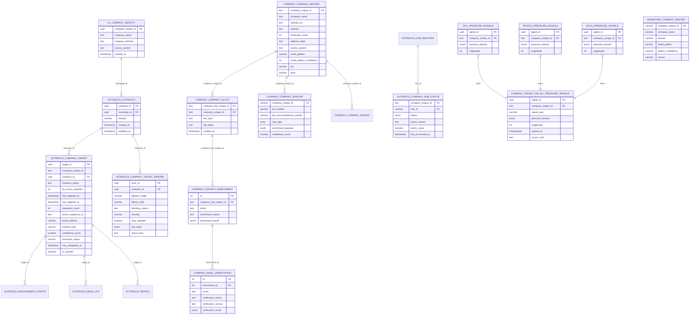

# Company Target Hub - Schema Documentation

> **AUTHORITY**: Neon PostgreSQL (Production)
> **VERIFIED**: 2026-01-25 via READ-ONLY connection
> **HUB ID**: 04.04.01
> **STATUS**: NEON VERIFIED

---

## Schema Overview

The Company Target hub manages company identity resolution, domain verification, and email pattern discovery. It serves as the internal anchor for all downstream hubs in the Outreach program.

## Primary Tables

| Schema | Table | Purpose |
|--------|-------|---------|
| `outreach` | `company_target` | Primary target tracking and status |
| `outreach` | `company_target_archive` | Archived target records |
| `outreach` | `company_target_errors` | Pipeline error tracking |
| `outreach` | `company_hub_status` | Hub gate status by company |
| `company` | `company_master` | Master company records |
| `company` | `company_slots` | Executive position tracking |
| `company` | `company_sidecar` | Enrichment metadata |
| `company` | `email_verification` | Email verification results |
| `marketing` | `company_master` | Marketing-layer company data |
| `company_target` | `vw_all_pressure_signals` | **BIT v2.0** Union view of all pressure signals |
| `company_target` | `vw_company_authorization` | **BIT v2.0** Company authorization status view |

## BIT v2.0 Functions

| Schema | Function | Purpose |
|--------|----------|---------|
| `company_target` | `compute_authorization_band(TEXT)` | **BIT v2.0** Computes authorization band for a company |

---

## Entity Relationship Diagram



---

## Table Details

### outreach.company_target

Primary target tracking table for companies in the outreach pipeline.

| Column | Type | Nullable | Default | Description |
|--------|------|----------|---------|-------------|
| `target_id` | uuid | NOT NULL | gen_random_uuid() | Primary key |
| `company_unique_id` | text | NULL | - | Reference to company identity |
| `outreach_id` | uuid | NULL | - | FK to outreach.outreach |
| `outreach_status` | text | NOT NULL | 'queued' | Current pipeline status |
| `bit_score_snapshot` | integer | NULL | - | BIT score at targeting time |
| `first_targeted_at` | timestamptz | NULL | - | First targeting timestamp |
| `last_targeted_at` | timestamptz | NULL | - | Last targeting timestamp |
| `sequence_count` | integer | NOT NULL | 0 | Number of sequences run |
| `active_sequence_id` | text | NULL | - | Current active sequence |
| `email_method` | varchar | NULL | - | Email discovery method used |
| `method_type` | varchar | NULL | - | Type of method (pattern/guess/etc) |
| `confidence_score` | numeric | NULL | - | Pattern confidence |
| `execution_status` | varchar | NULL | 'pending' | IMO execution status |
| `imo_completed_at` | timestamptz | NULL | - | IMO completion timestamp |
| `is_catchall` | boolean | NULL | false | Domain is catch-all |
| `created_at` | timestamptz | NOT NULL | now() | Record creation time |
| `updated_at` | timestamptz | NOT NULL | now() | Last update time |

### outreach.company_target_errors

Error tracking for company target pipeline failures.

| Column | Type | Nullable | Default | Description |
|--------|------|----------|---------|-------------|
| `error_id` | uuid | NOT NULL | gen_random_uuid() | Primary key |
| `outreach_id` | uuid | NOT NULL | - | FK to outreach.outreach |
| `pipeline_stage` | varchar | NOT NULL | - | Stage where error occurred |
| `failure_code` | varchar | NOT NULL | - | Standardized error code |
| `blocking_reason` | text | NOT NULL | - | Human-readable reason |
| `severity` | varchar | NOT NULL | 'blocking' | Error severity level |
| `retry_allowed` | boolean | NOT NULL | false | Can be retried |
| `raw_input` | jsonb | NULL | - | Original input data |
| `stack_trace` | text | NULL | - | Stack trace if available |
| `imo_stage` | varchar | NULL | - | IMO stage reference |
| `requeue_attempts` | integer | NULL | 0 | Retry attempt count |
| `created_at` | timestamptz | NOT NULL | now() | Error creation time |
| `resolved_at` | timestamptz | NULL | - | Resolution timestamp |
| `resolution_note` | text | NULL | - | Resolution notes |

### company.company_master

Master company records with full business details.

| Column | Type | Nullable | Default | Description |
|--------|------|----------|---------|-------------|
| `company_unique_id` | text | NOT NULL | - | Primary key |
| `company_name` | text | NOT NULL | - | Company legal name |
| `website_url` | text | NULL | - | Company website |
| `industry` | text | NULL | - | Industry classification |
| `employee_count` | integer | NOT NULL | - | Employee count |
| `address_state` | text | NOT NULL | - | State/region |
| `source_system` | text | NOT NULL | - | Source of record |
| `email_pattern` | varchar | NULL | - | Discovered email pattern |
| `email_pattern_confidence` | integer | NULL | - | Pattern confidence (0-100) |
| `email_pattern_source` | varchar | NULL | - | How pattern was discovered |
| `ein` | varchar | NULL | - | Employer ID Number |
| `duns` | varchar | NULL | - | D&B DUNS number |
| `created_at` | timestamptz | NULL | now() | Record creation time |
| `updated_at` | timestamptz | NULL | now() | Last update time |

---

## Foreign Key Relationships

| Source Table | Source Column | Target Table | Target Column |
|--------------|---------------|--------------|---------------|
| outreach.company_target | outreach_id | outreach.outreach | outreach_id |
| outreach.company_target_errors | outreach_id | outreach.outreach | outreach_id |
| outreach.company_hub_status | hub_id | outreach.hub_registry | hub_id |
| company.company_slots | company_unique_id | company.company_master | company_unique_id |
| company.company_sidecar | company_unique_id | company.company_master | company_unique_id |
| company.company_events | company_unique_id | company.company_master | company_unique_id |
| company.contact_enrichment | company_slot_unique_id | company.company_slots | company_slot_unique_id |
| company.email_verification | enrichment_id | company.contact_enrichment | id |

---

## Pipeline Phase Ownership

| Phase | Description | Primary Tables |
|-------|-------------|----------------|
| Phase 1 | Company Matching | company_master, company_target |
| Phase 1b | Unmatched Hold Export | company_target_errors |
| Phase 2 | Domain Resolution | company_master, company_sidecar |
| Phase 3 | Email Pattern Waterfall | email_verification, company_target |
| Phase 4 | Pattern Verification | email_verification, company_target |

---

## Key Indexes (Inferred)

- `company_target.outreach_id` - FK lookup
- `company_target.company_unique_id` - Company lookup
- `company_target.outreach_status` - Status filtering
- `company_master.company_unique_id` - Primary key
- `company_master.email_pattern` - Pattern lookup

---

## BIT v2.0 Distributed Signals Architecture

**Authority:** ADR-017
**Migration:** `neon/migrations/2026-01-26-bit-v2-phase1-distributed-signals.sql`

### Architecture Principle

```
Each sub-hub OWNS its own signal table.
Company Target OWNS a read-only view that unions all signal tables.
BIT is a COMPUTATION inside Company Target that reads the view.
```

### company_target.vw_all_pressure_signals (Union View)

**AI-Ready Data Metadata (per Canonical Architecture Doctrine §12):**

| Field | Value |
|-------|-------|
| `table_unique_id` | `VIEW-CT-SIGNALS-001` |
| `owning_hub_unique_id` | `HUB-CT-001` |
| `owning_subhub_unique_id` | `SUBHUB-CT-001` |
| `description` | Union view of all active pressure signals from DOL, People, and Blog hubs. BIT computation reads from this view. |
| `source_of_truth` | Union of dol.pressure_signals, people.pressure_signals, blog.pressure_signals |
| `row_identity_strategy` | signal_id from source tables |

| Column | Type | Source | Description |
|--------|------|--------|-------------|
| `signal_id` | uuid | All | Primary key from source table |
| `company_unique_id` | text | All | Company reference |
| `signal_type` | varchar(50) | All | Signal classification |
| `pressure_domain` | enum | All | STRUCTURAL_PRESSURE, DECISION_SURFACE, NARRATIVE_VOLATILITY |
| `pressure_class` | enum | All | Pressure classification |
| `signal_value` | jsonb | All | Domain-specific payload |
| `magnitude` | integer | All | Impact score (0-100) |
| `detected_at` | timestamptz | All | When signal was detected |
| `expires_at` | timestamptz | All | Validity window end |
| `correlation_id` | uuid | All | PID binding / trace ID |
| `source_record_id` | text | All | Traceability reference |
| `created_at` | timestamptz | All | Record creation time |
| `source_hub` | text | Computed | Hub that emitted signal ('dol', 'people', 'blog') |

**Filter:** Only non-expired signals (`expires_at > NOW()`)

### company_target.compute_authorization_band(TEXT)

**AI-Ready Function Metadata:**

| Field | Value |
|-------|-------|
| `function_unique_id` | `FUNC-CT-BAND-001` |
| `owning_hub_unique_id` | `HUB-CT-001` |
| `description` | Computes BIT authorization band for a company based on active pressure signals |
| `signature` | `compute_authorization_band(p_company_id TEXT) RETURNS TABLE` |
| `signature_status` | FROZEN (logic can evolve, signature cannot change) |

**Input:**

| Parameter | Type | Description |
|-----------|------|-------------|
| `p_company_id` | TEXT | Company unique ID |

**Output:**

| Column | Type | Description |
|--------|------|-------------|
| `company_unique_id` | TEXT | Company ID |
| `authorization_band` | INTEGER | Band 0-5 |
| `band_name` | TEXT | SILENT, WATCH, EXPLORATORY, TARGETED, ENGAGED, DIRECT |
| `dol_active` | BOOLEAN | DOL domain has active signals |
| `people_active` | BOOLEAN | People domain has active signals |
| `blog_active` | BOOLEAN | Blog domain has active signals |
| `aligned_domains` | INTEGER | Count of aligned domains (0-3) |
| `primary_pressure` | TEXT | Primary pressure class |
| `total_magnitude` | INTEGER | Weighted total magnitude |
| `band_capped_by` | TEXT | Reason if band was capped (BLOG_ALONE_CAP, NO_DOL_CAP) |

**Domain Trust Rules (FROZEN):**

| Rule | Behavior |
|------|----------|
| Blog alone | Max Band 1 (WATCH) |
| No DOL present | Max Band 2 (EXPLORATORY) |

**Band Definitions (FROZEN):**

| Band | Range | Name | Meaning |
|------|-------|------|---------|
| 0 | 0-9 | SILENT | No action permitted |
| 1 | 10-24 | WATCH | Internal flag only |
| 2 | 25-39 | EXPLORATORY | Educational content only |
| 3 | 40-59 | TARGETED | Persona email, proof required |
| 4 | 60-79 | ENGAGED | Phone allowed, multi-source proof |
| 5 | 80+ | DIRECT | Full contact, full-chain proof |

### company_target.vw_company_authorization (Convenience View)

Convenience view that calls `compute_authorization_band()` for all companies.

| Column | Type | Description |
|--------|------|-------------|
| `company_unique_id` | TEXT | Company ID |
| `company_name` | TEXT | Company name from company_master |
| `authorization_band` | INTEGER | Band 0-5 |
| `band_name` | TEXT | Band name |
| `dol_active` | BOOLEAN | DOL domain active |
| `people_active` | BOOLEAN | People domain active |
| `blog_active` | BOOLEAN | Blog domain active |
| `aligned_domains` | INTEGER | Aligned domain count |
| `primary_pressure` | TEXT | Primary pressure class |
| `total_magnitude` | INTEGER | Weighted magnitude |
| `band_capped_by` | TEXT | Cap reason if applicable |

---

---

## Cascade Cleanup Documentation

**Reference**: `docs/reports/OUTREACH_CASCADE_CLEANUP_REPORT_2026-01-29.md`

### Table Ownership

| Table | Purpose | Cascade Order |
|-------|---------|---------------|
| `outreach.company_target` | Primary target tracking | DELETE 2nd-to-last (before spine) |
| `outreach.company_target_archive` | Archived records | Receives orphaned records |
| `outreach.company_target_errors` | Error tracking | DELETE with company_target |

### Cascade Deletion Order

When CL marks a company INELIGIBLE and Outreach runs cascade cleanup:

```
1. outreach.send_log          (FK: person_id, target_id)
2. outreach.sequences         (FK: campaign_id)
3. outreach.campaigns         (standalone)
4. outreach.manual_overrides  (FK: outreach_id)
5. outreach.bit_signals       (FK: outreach_id)
6. outreach.bit_scores        (FK: outreach_id)
7. outreach.blog              (FK: outreach_id)
8. people.people_master       (FK: company_slot)
9. people.company_slot        (FK: outreach_id) ← PEOPLE HUB
10. outreach.people           (FK: outreach_id)
11. outreach.dol              (FK: outreach_id) ← DOL HUB
12. outreach.company_target   (FK: outreach_id) ← THIS HUB
13. outreach.outreach         (SPINE - deleted last)
```

### Archive-Before-Delete Pattern

Before deleting `outreach.company_target` records:

```sql
-- 1. Archive to company_target_archive
INSERT INTO outreach.company_target_archive
SELECT *, 'CL_INELIGIBLE_CASCADE' as archive_reason, NOW() as archived_at
FROM outreach.company_target
WHERE outreach_id IN (SELECT outreach_id FROM orphan_list);

-- 2. Delete from company_target
DELETE FROM outreach.company_target
WHERE outreach_id IN (SELECT outreach_id FROM orphan_list);
```

### Post-Cleanup State (2026-01-29)

| Table | Records | Notes |
|-------|---------|-------|
| outreach.company_target | 42,833 | Aligned with spine |
| outreach.company_target_archive | — | Contains orphaned records |

### Cleanup Trigger

This hub's data is cleaned when:
1. CL marks company as `INELIGIBLE` (eligibility_status)
2. CL moves company to `cl.company_identity_excluded`
3. Outreach cascade cleanup runs via `OUTREACH_CASCADE_CLEANUP.prompt.md`

---

*Generated from Neon PostgreSQL via READ-ONLY connection*
*Last verified: 2026-01-29*
