# DOL Filings Hub - Schema Documentation

> **AUTHORITY**: Neon PostgreSQL (Production)
> **VERIFIED**: 2026-01-25 via READ-ONLY connection
> **HUB ID**: 04.04.03
> **STATUS**: NEON VERIFIED

---

## Schema Overview

The DOL Filings hub manages Department of Labor Form 5500 FOIA data across **26 filing tables** spanning **3 years** (2023, 2024, 2025). It provides EIN resolution, filing signals, service provider compensation data, DFE participation, and financial information to downstream hubs.

### Coverage Summary

| Metric | Value |
|--------|-------|
| Filing Tables | 26 |
| Years Loaded | 2023, 2024, 2025 |
| Total Rows | 10,970,626 |
| Column Comments | 1,081 (100% coverage) |
| Column Metadata Catalog | 1,081 entries |
| form_year Indexes | 23 |
| Composite (ack_id, form_year) Indexes | 18 |
| EIN Indexes | 8 |

## Primary Tables

### Core Filing Tables

| Schema | Table | Purpose | Rows (approx) |
|--------|-------|---------|----------------|
| `dol` | `form_5500` | Full Form 5500 filings | 432,582 |
| `dol` | `form_5500_sf` | Short Form 5500-SF filings | 1,535,999 |
| `dol` | `form_5500_sf_part7` | 5500-SF Part 7 compliance | 10,613 |

### Schedule A: Insurance Contracts

| Schema | Table | Purpose | Rows (approx) |
|--------|-------|---------|----------------|
| `dol` | `schedule_a` | Insurance contracts & broker commissions | 625,520 |
| `dol` | `schedule_a_part1` | Schedule A Part 1 detail | 380,509 |

### Schedule C: Service Provider Compensation (9 tables)

| Schema | Table | Purpose |
|--------|-------|---------|
| `dol` | `schedule_c` | Schedule C header | 
| `dol` | `schedule_c_part1_item1` | Direct compensation |
| `dol` | `schedule_c_part1_item2` | Indirect compensation |
| `dol` | `schedule_c_part1_item3` | Terminated service providers |
| `dol` | `schedule_c_part1_item4` | Service provider failures to provide info |
| `dol` | `schedule_c_part2` | Other service provider compensation |
| `dol` | `schedule_c_part1_item1_ele` | P1I1 compensation elements |
| `dol` | `schedule_c_part1_item2_ele` | P1I2 compensation elements |
| `dol` | `schedule_c_part1_item4_ele` | P1I4 failure elements |

### Schedule D: DFE Participation (4 tables)

| Schema | Table | Purpose |
|--------|-------|---------|
| `dol` | `schedule_d` | Schedule D header |
| `dol` | `schedule_d_part1` | DFE investment details |
| `dol` | `schedule_d_part2` | DFE filing details |
| `dol` | `schedule_dcg` | D/C/G cross-reference |

### Schedule G: Financial Transactions (4 tables)

| Schema | Table | Purpose |
|--------|-------|---------|
| `dol` | `schedule_g` | Schedule G header |
| `dol` | `schedule_g_part1` | Large loans/fixed income defaults |
| `dol` | `schedule_g_part2` | Fixed income obligations |
| `dol` | `schedule_g_part3` | Non-exempt transactions |

### Schedule H: Large Plan Financial (2 tables)

| Schema | Table | Purpose |
|--------|-------|---------|
| `dol` | `schedule_h` | Schedule H header (large plan financials) |
| `dol` | `schedule_h_part1` | Schedule H Part 1 detail |

### Schedule I: Small Plan Financial (2 tables)

| Schema | Table | Purpose |
|--------|-------|---------|
| `dol` | `schedule_i` | Schedule I header (small plan financials) |
| `dol` | `schedule_i_part1` | Schedule I Part 1 detail |

### Support & Derived Tables

| Schema | Table | Purpose |
|--------|-------|---------|
| `dol` | `renewal_calendar` | Upcoming renewal tracking |
| `dol` | `ein_urls` | EIN to URL mappings (domain discovery) |
| `dol` | `column_metadata` | Field documentation catalog (1,081 entries) |
| `dol` | `pressure_signals` | **BIT v2.0** STRUCTURAL_PRESSURE signals |
| `outreach` | `dol` | Outreach-scoped DOL data |
| `outreach` | `dol_audit_log` | DOL processing audit trail |
| `outreach` | `dol_errors` | DOL pipeline errors |

---

## Entity Relationship Diagram

> **See**: `docs/diagrams/erd/DOL_SUBHUB.mmd` for the full 26-table Mermaid ERD

```mermaid
erDiagram
    OUTREACH_OUTREACH ||--o{ OUTREACH_DOL : "outreach_id"
    OUTREACH_OUTREACH ||--o{ OUTREACH_DOL_ERRORS : "outreach_id"

    DOL_FORM_5500 ||--o{ DOL_FORM_5500_SF : "ack_id"
    DOL_FORM_5500 ||--o{ DOL_SCHEDULE_A : "ack_id"
    DOL_FORM_5500 ||--o{ DOL_SCHEDULE_C : "ack_id (9 sub-tables)"
    DOL_FORM_5500 ||--o{ DOL_SCHEDULE_D : "ack_id (4 sub-tables)"
    DOL_FORM_5500 ||--o{ DOL_SCHEDULE_G : "ack_id (4 sub-tables)"
    DOL_FORM_5500 ||--o{ DOL_SCHEDULE_H : "ack_id (2 tables)"
    DOL_FORM_5500 ||--o{ DOL_SCHEDULE_I : "ack_id (2 tables)"
    DOL_FORM_5500 ||--o{ DOL_RENEWAL_CALENDAR : "filing_id"
    DOL_FORM_5500 ||--o| DOL_EIN_URLS : "sponsor_dfe_ein"
    DOL_RENEWAL_CALENDAR ||--o{ DOL_PRESSURE_SIGNALS : "source_record_id"

    DOL_EIN_URLS {
        varchar ein PK
        text company_name
        text city
        varchar state
        text domain
        text url
        timestamptz discovered_at
        text discovery_method
    }

    DOL_PRESSURE_SIGNALS {
        uuid signal_id PK
        text company_unique_id FK
        varchar signal_type
        enum pressure_domain
        enum pressure_class
        jsonb signal_value
        int magnitude
        timestamptz detected_at
        timestamptz expires_at
        uuid correlation_id
        text source_record_id
    }

    OUTREACH_OUTREACH {
        uuid outreach_id PK
        uuid sovereign_id FK
        varchar domain
        timestamp created_at
    }

    DOL_FORM_5500 {
        bigint id PK
        varchar ack_id UK
        varchar sponsor_dfe_ein
        varchar sponsor_dfe_name
        varchar plan_name
        varchar form_year
        varchar filing_status
    }

    DOL_FORM_5500_SF {
        bigint id PK
        varchar ack_id UK
        varchar sf_spons_ein
        varchar sf_plan_name
        varchar form_year
    }

    DOL_SCHEDULE_A {
        bigint id PK
        varchar ack_id FK
        varchar ins_carrier_name
        varchar ins_carrier_ein
        varchar form_year
    }

    DOL_SCHEDULE_C {
        bigint id PK
        varchar ack_id FK
        varchar sponsor_dfe_ein
        varchar form_year
    }

    DOL_SCHEDULE_D {
        bigint id PK
        varchar ack_id FK
        varchar sponsor_dfe_ein
        varchar form_year
    }

    DOL_SCHEDULE_G {
        bigint id PK
        varchar ack_id FK
        varchar sponsor_dfe_ein
        varchar form_year
    }

    DOL_SCHEDULE_H {
        bigint id PK
        varchar ack_id FK
        varchar sponsor_dfe_ein
        varchar form_year
    }

    DOL_SCHEDULE_I {
        bigint id PK
        varchar ack_id FK
        varchar sponsor_dfe_ein
        varchar form_year
    }

    DOL_COLUMN_METADATA {
        int id PK
        varchar table_name
        varchar column_name
        varchar column_id
        text description
        varchar category
        varchar data_type
        boolean is_pii
        boolean is_searchable
    }

    OUTREACH_DOL {
        uuid dol_id PK
        uuid outreach_id FK
        text ein
        boolean filing_present
        text funding_type
        text broker_or_advisor
        text carrier
    }

    OUTREACH_DOL_AUDIT_LOG {
        int log_id PK
        text company_id
        text state
        boolean attempted
        text outcome
        text ein
        text fail_reason
        text run_id
    }

    OUTREACH_DOL_ERRORS {
        uuid error_id PK
        uuid outreach_id FK
        varchar pipeline_stage
        varchar failure_code
        text blocking_reason
        varchar severity
        boolean retry_allowed
        jsonb raw_input
    }
```



---

## Table Details

### dol.form_5500

Full Form 5500 filings from the Department of Labor.

| Column | Type | Nullable | Default | Description |
|--------|------|----------|---------|-------------|
| `filing_id` | uuid | NOT NULL | gen_random_uuid() | Primary key |
| `ack_id` | varchar | NOT NULL | - | DOL acknowledgment ID |
| `company_unique_id` | text | NULL | - | Matched company reference |
| `sponsor_dfe_ein` | varchar | NOT NULL | - | Plan sponsor EIN |
| `sponsor_dfe_name` | varchar | NOT NULL | - | Plan sponsor name |
| `spons_dfe_dba_name` | varchar | NULL | - | DBA name if different |
| `plan_name` | varchar | NULL | - | Name of the plan |
| `plan_number` | varchar | NULL | - | Plan number |
| `spons_dfe_mail_us_city` | varchar | NULL | - | Sponsor city |
| `spons_dfe_mail_us_state` | varchar | NULL | - | Sponsor state |
| `spons_dfe_mail_us_zip` | varchar | NULL | - | Sponsor ZIP |
| `tot_active_partcp_cnt` | integer | NULL | - | Total active participants |
| `sch_a_attached_ind` | varchar | NULL | - | Has Schedule A attached |
| `num_sch_a_attached_cnt` | integer | NULL | - | Number of Schedule A forms |
| `admin_name` | varchar | NULL | - | Plan administrator name |
| `admin_ein` | varchar | NULL | - | Administrator EIN |
| `form_year` | varchar | NULL | - | Filing year |
| `filing_status` | varchar | NULL | - | Filing status |
| `date_received` | varchar | NULL | - | Date received by DOL |
| `created_at` | timestamptz | NOT NULL | now() | Record creation time |
| `updated_at` | timestamptz | NOT NULL | now() | Last update time |

### dol.schedule_a

Schedule A insurance contract information.

| Column | Type | Nullable | Default | Description |
|--------|------|----------|---------|-------------|
| `schedule_id` | uuid | NOT NULL | gen_random_uuid() | Primary key |
| `filing_id` | uuid | NULL | - | FK to form_5500 |
| `company_unique_id` | text | NULL | - | Matched company reference |
| `sponsor_state` | varchar | NULL | - | Sponsor state |
| `sponsor_name` | varchar | NULL | - | Sponsor name |
| `ins_carrier_name` | varchar | NULL | - | Insurance carrier name |
| `ins_carrier_ein` | varchar | NULL | - | Carrier EIN |
| `ins_carrier_naic_code` | varchar | NULL | - | NAIC code |
| `ins_contract_num` | varchar | NULL | - | Contract number |
| `ins_prsn_covered_eoy_cnt` | numeric | NULL | - | Persons covered EOY |
| `ins_policy_from_date` | varchar | NULL | - | Policy start date |
| `ins_policy_to_date` | varchar | NULL | - | Policy end date |
| `ins_broker_comm_tot_amt` | numeric | NULL | - | Broker commissions |
| `ins_broker_fees_tot_amt` | numeric | NULL | - | Broker fees |
| `wlfr_bnft_health_ind` | varchar | NULL | - | Health benefit indicator |
| `wlfr_bnft_dental_ind` | varchar | NULL | - | Dental benefit indicator |
| `wlfr_bnft_vision_ind` | varchar | NULL | - | Vision benefit indicator |
| `wlfr_bnft_life_insur_ind` | varchar | NULL | - | Life insurance indicator |
| `form_year` | varchar | NULL | - | Filing year |
| `created_at` | timestamptz | NULL | now() | Record creation time |

### dol.renewal_calendar

Upcoming benefit renewal tracking.

| Column | Type | Nullable | Default | Description |
|--------|------|----------|---------|-------------|
| `renewal_id` | uuid | NOT NULL | gen_random_uuid() | Primary key |
| `company_unique_id` | text | NOT NULL | - | Company reference |
| `schedule_id` | uuid | NULL | - | FK to schedule_a |
| `filing_id` | uuid | NULL | - | FK to form_5500 |
| `renewal_month` | integer | NULL | - | Renewal month (1-12) |
| `renewal_year` | integer | NULL | - | Renewal year |
| `renewal_date` | date | NULL | - | Exact renewal date |
| `plan_name` | varchar | NULL | - | Plan name |
| `carrier_name` | varchar | NULL | - | Carrier name |
| `is_upcoming` | boolean | NOT NULL | true | Is in future |
| `days_until_renewal` | integer | NULL | - | Days until renewal |
| `created_at` | timestamptz | NOT NULL | now() | Record creation time |
| `updated_at` | timestamptz | NOT NULL | now() | Last update time |

### dol.ein_urls

EIN to URL mappings discovered via FREE domain construction.

**AI-Ready Data Metadata (per Canonical Architecture Doctrine §12):**

| Field | Value |
|-------|-------|
| `table_unique_id` | `TBL-DOL-EIN-URLS-001` |
| `owning_hub_unique_id` | `HUB-DOL-001` |
| `owning_subhub_unique_id` | `SUBHUB-DOL-001` |
| `description` | EIN to URL mappings for DOL Form 5500 sponsors discovered via domain construction. FREE Tier 0 data source - no API costs. |
| `source_of_truth` | Domain construction scripts (scripts/domain_construction_by_state.py) |
| `row_identity_strategy` | VARCHAR primary key (ein) |

| Column | Type | Nullable | Default | Description |
|--------|------|----------|---------|-------------|
| `ein` | varchar(9) | NOT NULL | - | Primary key - EIN from DOL Form 5500 filing |
| `company_name` | text | NOT NULL | - | Plan sponsor name from DOL filing |
| `city` | text | NULL | - | Sponsor city from DOL filing |
| `state` | varchar(2) | NULL | - | Sponsor state code (2-letter) |
| `domain` | text | NULL | - | Discovered domain (e.g., company.com) |
| `url` | text | NULL | - | Full URL with https:// protocol |
| `discovered_at` | timestamptz | NOT NULL | now() | When URL was discovered |
| `discovery_method` | text | NOT NULL | 'domain_construction' | Discovery method: domain_construction, clay, manual |

**Column Metadata (per §12.3):**

| Column | column_unique_id | semantic_role | format | description |
|--------|------------------|---------------|--------|-------------|
| `ein` | COL-DOL-EU-001 | identifier | VARCHAR(9) | Federal Employer Identification Number (9 digits) |
| `company_name` | COL-DOL-EU-002 | attribute | TEXT | Legal sponsor name from DOL filing |
| `city` | COL-DOL-EU-003 | attribute | TEXT | Sponsor city for geographic context |
| `state` | COL-DOL-EU-004 | attribute | VARCHAR(2) | Two-letter state code (US postal) |
| `domain` | COL-DOL-EU-005 | attribute | TEXT | Root domain without protocol (e.g., company.com) |
| `url` | COL-DOL-EU-006 | attribute | TEXT | Complete URL with https:// protocol |
| `discovered_at` | COL-DOL-EU-007 | attribute | ISO-8601 | Timestamp when mapping was created |
| `discovery_method` | COL-DOL-EU-008 | attribute | TEXT | Provenance tracking (domain_construction, clay, manual) |

**Data Coverage:**

| State | Records | Notes |
|-------|---------|-------|
| OH | 27,568 | Highest coverage |
| PA | 26,208 | |
| VA | 16,599 | |
| NC | 15,863 | |
| MD | 14,876 | |
| KY | 8,099 | |
| OK | 4,991 | |
| DE | 2,993 | |
| **TOTAL** | **119,409** | 100% FREE (no API costs) |

**Purpose:**
- FREE alternative to paid enrichment APIs
- Enables EIN→URL matching for DOL companies
- Supports outreach.company_target domain resolution
- Reduces dependency on Clay/ZoomInfo/Clearbit

**Authority:** Domain construction scripts (Tier 0 - FREE)
**Created:** 2026-01-25
**Source:** `scripts/load_dol_urls.py`

### dol.pressure_signals (BIT v2.0)

**AI-Ready Data Metadata (per Canonical Architecture Doctrine §12):**

| Field | Value |
|-------|-------|
| `table_unique_id` | `TBL-DOL-PRESSURE-001` |
| `owning_hub_unique_id` | `HUB-DOL-001` |
| `owning_subhub_unique_id` | `SUBHUB-DOL-001` |
| `description` | STRUCTURAL_PRESSURE domain signals for BIT authorization. Highest trust level - required for Band 3+ authorization. |
| `source_of_truth` | DOL Hub processing (renewal calendar, cost analysis, broker changes) |
| `row_identity_strategy` | UUID primary key (signal_id) |

| Column | Type | Nullable | Default | Description |
|--------|------|----------|---------|-------------|
| `signal_id` | uuid | NOT NULL | gen_random_uuid() | Primary key - unique signal identifier |
| `company_unique_id` | text | NOT NULL | - | Company reference |
| `signal_type` | varchar(50) | NOT NULL | - | Signal classification (renewal_proximity, cost_increase, broker_change) |
| `pressure_domain` | enum | NOT NULL | 'STRUCTURAL_PRESSURE' | Domain constraint (always STRUCTURAL_PRESSURE for DOL) |
| `pressure_class` | enum | NULL | - | Pressure classification (COST_PRESSURE, DEADLINE_PROXIMITY, etc) |
| `signal_value` | jsonb | NOT NULL | '{}' | Domain-specific payload with evidence |
| `magnitude` | integer | NOT NULL | 0 | Impact score (0-100) |
| `detected_at` | timestamptz | NOT NULL | now() | When signal was detected |
| `expires_at` | timestamptz | NOT NULL | - | Validity window end |
| `correlation_id` | uuid | NULL | - | PID binding / trace ID |
| `source_record_id` | text | NULL | - | Traceability (e.g., ack_id, renewal_id) |
| `created_at` | timestamptz | NOT NULL | now() | Record creation time |

**Column Metadata (per §12.3):**

| Column | column_unique_id | semantic_role | format |
|--------|------------------|---------------|--------|
| `signal_id` | COL-DOL-PS-001 | identifier | UUID |
| `company_unique_id` | COL-DOL-PS-002 | foreign_key | TEXT |
| `signal_type` | COL-DOL-PS-003 | attribute | ENUM |
| `pressure_domain` | COL-DOL-PS-004 | attribute | ENUM |
| `pressure_class` | COL-DOL-PS-005 | attribute | ENUM |
| `signal_value` | COL-DOL-PS-006 | attribute | JSON |
| `magnitude` | COL-DOL-PS-007 | metric | INTEGER |
| `detected_at` | COL-DOL-PS-008 | attribute | ISO-8601 |
| `expires_at` | COL-DOL-PS-009 | attribute | ISO-8601 |
| `correlation_id` | COL-DOL-PS-010 | identifier | UUID |
| `source_record_id` | COL-DOL-PS-011 | foreign_key | TEXT |
| `created_at` | COL-DOL-PS-012 | attribute | ISO-8601 |

**Authority:** ADR-017
**Migration:** `neon/migrations/2026-01-26-bit-v2-phase1-distributed-signals.sql`

### dol.backfill_renewal_signals() (BIT v2.0 Phase 1.5)

Idempotent backfill function for DOL renewal signals.

**Function Metadata:**

| Field | Value |
|-------|-------|
| `function_unique_id` | `FUNC-DOL-BACKFILL-001` |
| `owning_hub_unique_id` | `HUB-DOL-001` |
| `description` | Processes dol.renewal_calendar rows into dol.pressure_signals |
| `signature` | `backfill_renewal_signals() RETURNS TABLE (processed INT, skipped INT, errors INT)` |

**Magnitude Calculation:**

| days_until_renewal | magnitude |
|--------------------|-----------|
| <= 30 | 70 |
| <= 60 | 55 |
| <= 90 | 45 |
| <= 120 | 35 |
| > 120 | 25 |

**Idempotent:** Safe to run multiple times - skips already processed records via `source_record_id`.

**Authority:** ADR-017
**Migration:** `neon/migrations/2026-01-26-bit-v2-phase1.5-backfill-and-movements.sql`

---

### outreach.dol

Outreach-scoped DOL summary data.

| Column | Type | Nullable | Default | Description |
|--------|------|----------|---------|-------------|
| `dol_id` | uuid | NOT NULL | gen_random_uuid() | Primary key |
| `outreach_id` | uuid | NOT NULL | - | FK to outreach.outreach |
| `ein` | text | NULL | - | Matched EIN |
| `filing_present` | boolean | NULL | - | Has DOL filing |
| `funding_type` | text | NULL | - | Plan funding type |
| `broker_or_advisor` | text | NULL | - | Broker/advisor info |
| `carrier` | text | NULL | - | Insurance carrier |
| `created_at` | timestamptz | NULL | now() | Record creation time |
| `updated_at` | timestamptz | NULL | now() | Last update time |

---

## Foreign Key Relationships

### Core Filing Relationships (via ACK_ID)

| Source Table | Join Column | Target Table | Relationship |
|--------------|-------------|--------------|--------------|
| dol.form_5500_sf | ack_id | dol.form_5500 | Short form variant |
| dol.form_5500_sf_part7 | ack_id | dol.form_5500_sf | SF Part 7 data |
| dol.schedule_a | ack_id | dol.form_5500 | Insurance contracts |
| dol.schedule_a_part1 | ack_id | dol.form_5500 | Sch A Part 1 |
| dol.schedule_c | ack_id | dol.form_5500 | Service provider comp |
| dol.schedule_c_part1_item1 | ack_id | dol.schedule_c | Direct compensation |
| dol.schedule_c_part1_item2 | ack_id | dol.schedule_c | Indirect compensation |
| dol.schedule_c_part1_item3 | ack_id | dol.schedule_c | Terminated providers |
| dol.schedule_c_part1_item4 | ack_id | dol.schedule_c | Provider failures |
| dol.schedule_c_part2 | ack_id | dol.schedule_c | Other comp |
| dol.schedule_c_part1_item1_ele | ack_id | dol.form_5500 | P1I1 elements |
| dol.schedule_c_part1_item2_ele | ack_id | dol.form_5500 | P1I2 elements |
| dol.schedule_c_part1_item4_ele | ack_id | dol.form_5500 | P1I4 elements |
| dol.schedule_d | ack_id | dol.form_5500 | DFE participation |
| dol.schedule_d_part1 | ack_id | dol.schedule_d | DFE investments |
| dol.schedule_d_part2 | ack_id | dol.schedule_d | DFE filings |
| dol.schedule_dcg | ack_id | dol.form_5500 | D/C/G cross-ref |
| dol.schedule_g | ack_id | dol.form_5500 | Financial transactions |
| dol.schedule_g_part1 | ack_id | dol.schedule_g | Large loans |
| dol.schedule_g_part2 | ack_id | dol.schedule_g | Fixed income |
| dol.schedule_g_part3 | ack_id | dol.schedule_g | Non-exempt transactions |
| dol.schedule_h | ack_id | dol.form_5500 | Large plan financials |
| dol.schedule_h_part1 | ack_id | dol.schedule_h | H Part 1 detail |
| dol.schedule_i | ack_id | dol.form_5500 | Small plan financials |
| dol.schedule_i_part1 | ack_id | dol.schedule_i | I Part 1 detail |

### Support Table Relationships

| Source Table | Source Column | Target Table | Target Column |
|--------------|---------------|--------------|---------------|
| dol.renewal_calendar | filing_id | dol.form_5500 | filing_id |
| dol.ein_urls | ein | dol.form_5500 | sponsor_dfe_ein |
| outreach.dol | outreach_id | outreach.outreach | outreach_id |
| outreach.dol_errors | outreach_id | outreach.outreach | outreach_id |

---

## Key DOL Fields for Outreach

### EIN Matching
- `sponsor_dfe_ein` - Primary EIN for company matching
- `admin_ein` - Secondary EIN (administrator)
- `ins_carrier_ein` - Carrier EIN for enrichment

### URL Discovery (FREE)
- `dol.ein_urls` - 119,409 EIN→URL mappings discovered via domain construction
- NO API costs - Tier 0 free data source
- Use before Clay/ZoomInfo/Clearbit to minimize enrichment spend

### Renewal Intelligence
- `ins_policy_to_date` - Policy expiration date
- `renewal_month` / `renewal_year` - Calculated renewal window
- `days_until_renewal` - Time-sensitive targeting

### Benefit Types
- `wlfr_bnft_health_ind` - Health coverage
- `wlfr_bnft_dental_ind` - Dental coverage
- `wlfr_bnft_vision_ind` - Vision coverage
- `wlfr_bnft_life_insur_ind` - Life insurance

---

## Data Import Sources

| Year | Tables Loaded | Total Rows | Source |
|------|--------------|------------|--------|
| 2023 | 24 | ~6,012,077 | DOL FOIA ZIPs (C:\Users\CUSTOM PC\Desktop\DOl List) |
| 2024 | 26 | 4,951,258 | DOL FOIA ZIPs (C:\Users\CUSTOM PC\Desktop\Dol 2024) |
| 2025 | 26 | 7,291 | DOL FOIA ZIPs (C:\Users\CUSTOM PC\Desktop\Dol 2025) |
| **Grand Total** | **26 unique** | **10,970,626** | |

### Key Filing Tables by Year

| Table | 2023 | 2024 | 2025 | Total |
|-------|------|------|------|-------|
| form_5500 | 230,482 | 201,575 | 525 | 432,582 |
| form_5500_sf | 760,839 | 772,588 | 2,572 | 1,535,999 |
| schedule_a | 337,476 | 287,585 | 459 | 625,520 |
| schedule_a_part1 | — | 380,007 | 502 | 380,509 |
| form_5500_sf_part7 | — | 10,291 | 322 | 10,613 |

### Import Script

**Script**: `hubs/dol-filings/imo/middle/importers/import_dol_year.py`
**Usage**: `doppler run -- python import_dol_year.py --year YYYY --load`
**Flags**: `--load` (import), `--verify` (check counts), `--create-new-tables` (DDL)

### Metadata Migration

**Script**: `hubs/dol-filings/imo/middle/importers/migrate_add_metadata.py`
**Applied**: 26 table comments, 1,081 column comments, 23 form_year indexes, 18 composite indexes, 8 EIN indexes, 1,081 catalog entries

### Join Key

**ACK_ID** is the universal join key linking ALL schedule tables to `dol.form_5500`. Every schedule table has `ack_id` and `form_year` columns with a composite index for efficient cross-year queries.

---

---

## Cascade Cleanup Documentation

**Reference**: `docs/reports/OUTREACH_CASCADE_CLEANUP_REPORT_2026-01-29.md`

### Table Ownership

| Table | Purpose | Cascade Order |
|-------|---------|---------------|
| `outreach.dol` | Outreach-scoped DOL data | DELETE before company_target |
| `dol.form_5500` | Raw DOL filings | NOT deleted (reference data) |
| `dol.schedule_a` | Insurance contracts | NOT deleted (reference data) |
| `dol.renewal_calendar` | Renewal tracking | NOT deleted (reference data) |
| `dol.ein_urls` | EIN→URL mappings | NOT deleted (reference data) |

### Cascade Deletion Order

When CL marks a company INELIGIBLE and Outreach runs cascade cleanup:

```
1. outreach.send_log          (FK: person_id, target_id)
2. outreach.sequences         (FK: campaign_id)
3. outreach.campaigns         (standalone)
4. outreach.manual_overrides  (FK: outreach_id)
5. outreach.bit_signals       (FK: outreach_id)
6. outreach.bit_scores        (FK: outreach_id)
7. outreach.blog              (FK: outreach_id)
8. people.people_master       (FK: company_slot)
9. people.company_slot        (FK: outreach_id)
10. outreach.people           (FK: outreach_id)
11. outreach.dol              (FK: outreach_id) ← THIS HUB
12. outreach.company_target   (FK: outreach_id)
13. outreach.outreach         (SPINE - deleted last)
```

### Archive-Before-Delete Pattern

Before deleting `outreach.dol` records:

```sql
-- 1. Archive (if archive table exists)
-- Note: outreach.dol typically has minimal records

-- 2. Delete from outreach.dol
DELETE FROM outreach.dol
WHERE outreach_id IN (SELECT outreach_id FROM orphan_list);
```

### What Is NOT Deleted

The following DOL reference tables are **NEVER** deleted during cascade cleanup:
- `dol.form_5500` — Government filing data (immutable)
- `dol.form_5500_sf` — Short form filings (immutable)
- `dol.form_5500_sf_part7` — SF Part 7 data (immutable)
- `dol.schedule_a` — Insurance contract data (immutable)
- `dol.schedule_a_part1` — Schedule A Part 1 (immutable)
- `dol.schedule_c` + 8 sub-tables — Service provider compensation (immutable)
- `dol.schedule_d` + 3 sub-tables — DFE participation (immutable)
- `dol.schedule_dcg` — D/C/G cross-reference (immutable)
- `dol.schedule_g` + 3 sub-tables — Financial transactions (immutable)
- `dol.schedule_h` + 1 sub-table — Large plan financials (immutable)
- `dol.schedule_i` + 1 sub-table — Small plan financials (immutable)
- `dol.renewal_calendar` — Derived renewal data (may be refreshed)
- `dol.ein_urls` — EIN→URL mappings (FREE tier data)
- `dol.pressure_signals` — May expire naturally via `expires_at`

> **Total: 26 filing tables + 3 support tables = 29 DOL tables (all immutable reference data)**

### Post-Cleanup State (2026-02-10)

| Table | Records | Notes |
|-------|---------|-------|
| outreach.dol | ~13,000 | 27% coverage of outreach spine |
| dol.form_5500 | 432,582 | Unchanged (reference data, 3 years) |
| dol.form_5500_sf | 1,535,999 | Unchanged (reference data, 3 years) |
| dol.schedule_a | 625,520 | Unchanged (reference data, 3 years) |
| dol.ein_urls | 119,409 | Unchanged (FREE tier) |
| **All 26 filing tables** | **10,970,626** | **Immutable FOIA reference data** |

### Cleanup Trigger

This hub's `outreach.dol` data is cleaned when:
1. CL marks company as `INELIGIBLE` (eligibility_status)
2. CL moves company to `cl.company_identity_excluded`
3. Outreach cascade cleanup runs via `OUTREACH_CASCADE_CLEANUP.prompt.md`

### EIN Matching After Cleanup

After cascade cleanup, companies may lose their DOL match. To re-match:
1. Query `dol.ein_urls` for domain matches
2. Query `dol.form_5500` for EIN resolution
3. Re-populate `outreach.dol` via DOL hub processing

---

*Generated from Neon PostgreSQL via READ-ONLY connection*
*Last verified: 2026-02-10*
*26 filing tables, 10,970,626 rows, 1,081 column comments (100% coverage)*
