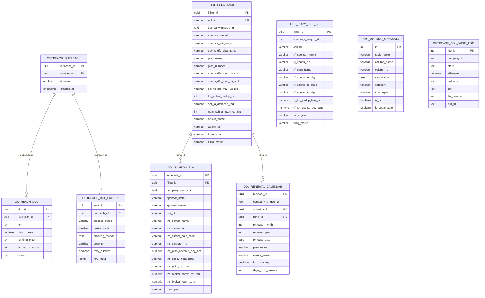

# DOL Filings Hub - Schema Documentation

> **AUTHORITY**: Neon PostgreSQL (Production)
> **VERIFIED**: 2026-01-25 via READ-ONLY connection
> **HUB ID**: 04.04.03
> **STATUS**: NEON VERIFIED

---

## Schema Overview

The DOL Filings hub manages Department of Labor Form 5500 data, Schedule A insurance information, and renewal calendar tracking. It provides EIN resolution and filing signals to downstream hubs.

## Primary Tables

| Schema | Table | Purpose |
|--------|-------|---------|
| `dol` | `form_5500` | Full Form 5500 filings |
| `dol` | `form_5500_sf` | Short Form 5500-SF filings |
| `dol` | `schedule_a` | Schedule A insurance contracts |
| `dol` | `renewal_calendar` | Upcoming renewal tracking |
| `dol` | `column_metadata` | Field documentation |
| `outreach` | `dol` | Outreach-scoped DOL data |
| `outreach` | `dol_audit_log` | DOL processing audit trail |
| `outreach` | `dol_errors` | DOL pipeline errors |

---

## Entity Relationship Diagram

---

## Table Details

### dol.form_5500

Full Form 5500 filings from the Department of Labor.

| Column | Type | Nullable | Default | Description |
|--------|------|----------|---------|-------------|
| `filing_id` | uuid | NOT NULL | gen_random_uuid() | Primary key |
| `ack_id` | varchar | NOT NULL | - | DOL acknowledgment ID |
| `company_unique_id` | text | NULL | - | Matched company reference |
| `sponsor_dfe_ein` | varchar | NOT NULL | - | Plan sponsor EIN |
| `sponsor_dfe_name` | varchar | NOT NULL | - | Plan sponsor name |
| `spons_dfe_dba_name` | varchar | NULL | - | DBA name if different |
| `plan_name` | varchar | NULL | - | Name of the plan |
| `plan_number` | varchar | NULL | - | Plan number |
| `spons_dfe_mail_us_city` | varchar | NULL | - | Sponsor city |
| `spons_dfe_mail_us_state` | varchar | NULL | - | Sponsor state |
| `spons_dfe_mail_us_zip` | varchar | NULL | - | Sponsor ZIP |
| `tot_active_partcp_cnt` | integer | NULL | - | Total active participants |
| `sch_a_attached_ind` | varchar | NULL | - | Has Schedule A attached |
| `num_sch_a_attached_cnt` | integer | NULL | - | Number of Schedule A forms |
| `admin_name` | varchar | NULL | - | Plan administrator name |
| `admin_ein` | varchar | NULL | - | Administrator EIN |
| `form_year` | varchar | NULL | - | Filing year |
| `filing_status` | varchar | NULL | - | Filing status |
| `date_received` | varchar | NULL | - | Date received by DOL |
| `created_at` | timestamptz | NOT NULL | now() | Record creation time |
| `updated_at` | timestamptz | NOT NULL | now() | Last update time |

### dol.schedule_a

Schedule A insurance contract information.

| Column | Type | Nullable | Default | Description |
|--------|------|----------|---------|-------------|
| `schedule_id` | uuid | NOT NULL | gen_random_uuid() | Primary key |
| `filing_id` | uuid | NULL | - | FK to form_5500 |
| `company_unique_id` | text | NULL | - | Matched company reference |
| `sponsor_state` | varchar | NULL | - | Sponsor state |
| `sponsor_name` | varchar | NULL | - | Sponsor name |
| `ins_carrier_name` | varchar | NULL | - | Insurance carrier name |
| `ins_carrier_ein` | varchar | NULL | - | Carrier EIN |
| `ins_carrier_naic_code` | varchar | NULL | - | NAIC code |
| `ins_contract_num` | varchar | NULL | - | Contract number |
| `ins_prsn_covered_eoy_cnt` | numeric | NULL | - | Persons covered EOY |
| `ins_policy_from_date` | varchar | NULL | - | Policy start date |
| `ins_policy_to_date` | varchar | NULL | - | Policy end date |
| `ins_broker_comm_tot_amt` | numeric | NULL | - | Broker commissions |
| `ins_broker_fees_tot_amt` | numeric | NULL | - | Broker fees |
| `wlfr_bnft_health_ind` | varchar | NULL | - | Health benefit indicator |
| `wlfr_bnft_dental_ind` | varchar | NULL | - | Dental benefit indicator |
| `wlfr_bnft_vision_ind` | varchar | NULL | - | Vision benefit indicator |
| `wlfr_bnft_life_insur_ind` | varchar | NULL | - | Life insurance indicator |
| `form_year` | varchar | NULL | - | Filing year |
| `created_at` | timestamptz | NULL | now() | Record creation time |

### dol.renewal_calendar

Upcoming benefit renewal tracking.

| Column | Type | Nullable | Default | Description |
|--------|------|----------|---------|-------------|
| `renewal_id` | uuid | NOT NULL | gen_random_uuid() | Primary key |
| `company_unique_id` | text | NOT NULL | - | Company reference |
| `schedule_id` | uuid | NULL | - | FK to schedule_a |
| `filing_id` | uuid | NULL | - | FK to form_5500 |
| `renewal_month` | integer | NULL | - | Renewal month (1-12) |
| `renewal_year` | integer | NULL | - | Renewal year |
| `renewal_date` | date | NULL | - | Exact renewal date |
| `plan_name` | varchar | NULL | - | Plan name |
| `carrier_name` | varchar | NULL | - | Carrier name |
| `is_upcoming` | boolean | NOT NULL | true | Is in future |
| `days_until_renewal` | integer | NULL | - | Days until renewal |
| `created_at` | timestamptz | NOT NULL | now() | Record creation time |
| `updated_at` | timestamptz | NOT NULL | now() | Last update time |

### outreach.dol

Outreach-scoped DOL summary data.

| Column | Type | Nullable | Default | Description |
|--------|------|----------|---------|-------------|
| `dol_id` | uuid | NOT NULL | gen_random_uuid() | Primary key |
| `outreach_id` | uuid | NOT NULL | - | FK to outreach.outreach |
| `ein` | text | NULL | - | Matched EIN |
| `filing_present` | boolean | NULL | - | Has DOL filing |
| `funding_type` | text | NULL | - | Plan funding type |
| `broker_or_advisor` | text | NULL | - | Broker/advisor info |
| `carrier` | text | NULL | - | Insurance carrier |
| `created_at` | timestamptz | NULL | now() | Record creation time |
| `updated_at` | timestamptz | NULL | now() | Last update time |

---

## Foreign Key Relationships

| Source Table | Source Column | Target Table | Target Column |
|--------------|---------------|--------------|---------------|
| dol.renewal_calendar | filing_id | dol.form_5500 | filing_id |
| dol.schedule_a | filing_id | dol.form_5500 | filing_id |
| outreach.dol | outreach_id | outreach.outreach | outreach_id |
| outreach.dol_errors | outreach_id | outreach.outreach | outreach_id |

---

## Key DOL Fields for Outreach

### EIN Matching
- `sponsor_dfe_ein` - Primary EIN for company matching
- `admin_ein` - Secondary EIN (administrator)
- `ins_carrier_ein` - Carrier EIN for enrichment

### Renewal Intelligence
- `ins_policy_to_date` - Policy expiration date
- `renewal_month` / `renewal_year` - Calculated renewal window
- `days_until_renewal` - Time-sensitive targeting

### Benefit Types
- `wlfr_bnft_health_ind` - Health coverage
- `wlfr_bnft_dental_ind` - Dental coverage
- `wlfr_bnft_vision_ind` - Vision coverage
- `wlfr_bnft_life_insur_ind` - Life insurance

---

## Data Import Sources

| Year | Form Type | Table | Status |
|------|-----------|-------|--------|
| 2023 | 5500 | dol.form_5500 | Active |
| 2023 | 5500-SF | dol.form_5500_sf | Active |
| 2023 | Schedule A | dol.schedule_a | Active |

---

*Generated from Neon PostgreSQL via READ-ONLY connection*
*Last verified: 2026-01-25*
