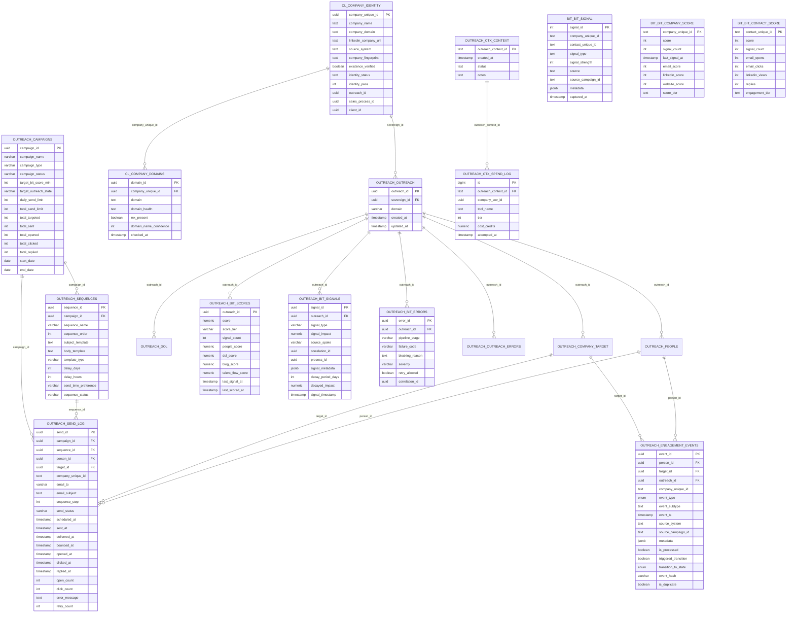

# Outreach Execution Hub - Schema Documentation

> **AUTHORITY**: Neon PostgreSQL (Production)
> **VERIFIED**: 2026-01-25 via READ-ONLY connection
> **HUB ID**: 04.04.04
> **STATUS**: NEON VERIFIED

---

## Schema Overview

The Outreach Execution hub manages campaign orchestration, email sequences, send logging, and engagement tracking. It also owns the BIT (Buyer Intent Tracker) scoring system and coordinates all outreach program context.

## Primary Tables

| Schema | Table | Purpose |
|--------|-------|---------|
| `outreach` | `outreach` | Root outreach context records |
| `outreach` | `outreach_excluded` | **EXCLUSION TABLE** - All non-commercial/invalid records |
| `outreach` | `outreach_archive` | Archived outreach records |
| `outreach` | `outreach_orphan_archive` | Orphaned records with invalid sovereign_id |
| `outreach` | `outreach_errors` | Outreach pipeline errors |
| `outreach` | `campaigns` | Campaign definitions |
| `outreach` | `sequences` | Email sequence templates |
| `outreach` | `send_log` | Email send tracking |
| `outreach` | `engagement_events` | All engagement events |
| `outreach` | `bit_scores` | BIT scores by outreach |
| `outreach` | `bit_signals` | BIT signal events |
| `outreach` | `bit_errors` | BIT processing errors |
| `outreach` | `hub_registry` | Hub definitions |
| `outreach_ctx` | `context` | Outreach context registry |
| `outreach_ctx` | `spend_log` | Provider spend tracking |
| `cl` | `company_identity` | Company Lifecycle identity |
| `cl` | `company_domains` | CL domain records |
| `bit` | `bit_signal` | Legacy BIT signals |
| `bit` | `bit_company_score` | Legacy company scores |
| `bit` | `bit_contact_score` | Legacy contact scores |

---

## Entity Relationship Diagram



---

## Table Details

### outreach.outreach

Root outreach context binding company identity to outreach program.

| Column | Type | Nullable | Default | Description |
|--------|------|----------|---------|-------------|
| `outreach_id` | uuid | NOT NULL | gen_random_uuid() | Primary key |
| `sovereign_id` | uuid | NOT NULL | - | FK to cl.company_identity |
| `domain` | varchar | NULL | - | Company domain |
| `created_at` | timestamptz | NOT NULL | now() | Record creation time |
| `updated_at` | timestamptz | NOT NULL | now() | Last update time |

### outreach.outreach_excluded (EXCLUSION TABLE)

**THE SINGULAR EXCLUSION TABLE** - All records that should NOT be in the active outreach spine.

This table consolidates ALL exclusions from:
- Non-commercial entities (churches, schools, hospitals, government)
- CL PENDING records (not yet PASS)
- CL FAIL records
- Invalid sovereign_ids (NOT_IN_CL)
- Data quality issues (duplicate domains, bad mappings)

| Column | Type | Nullable | Default | Description |
|--------|------|----------|---------|-------------|
| `outreach_id` | uuid | NOT NULL | - | Primary key (was in outreach.outreach) |
| `company_name` | text | NULL | - | Company name from CL |
| `domain` | text | NULL | - | Company domain |
| `exclusion_reason` | text | NULL | - | Why excluded (see categories below) |
| `sovereign_id` | uuid | NULL | - | Original sovereign_id reference |
| `cl_status` | text | NULL | - | CL identity_status at time of exclusion |
| `excluded_by` | text | NULL | - | What process excluded this record |
| `excluded_at` | timestamptz | NULL | now() | When excluded |
| `created_at` | timestamptz | NULL | - | Original creation time |
| `updated_at` | timestamptz | NULL | - | Original update time |

**Exclusion Reason Categories:**

| Reason | Description |
|--------|-------------|
| `CL_NOT_PASS: identity_status=PENDING` | CL record exists but not yet verified |
| `CL_FAIL: identity_status=FAIL` | CL explicitly marked as FAIL |
| `NOT_IN_CL: sovereign_id does not exist` | Invalid sovereign_id reference |
| `NON_COMMERCIAL_TLD: .gov` | Government entity |
| `NON_COMMERCIAL_TLD: .edu` | Educational institution |
| `NON_COMMERCIAL_TLD: .org` | Non-profit organization |
| `NON_COMMERCIAL_TLD: .church` | Religious organization |
| `NON_COMMERCIAL_KEYWORD: church` | Church keyword in name |
| `NON_COMMERCIAL_KEYWORD: school` | School keyword in name |
| `NON_COMMERCIAL_KEYWORD: hospital` | Healthcare facility |
| `DUPLICATE_DOMAIN` | Domain already exists in outreach.outreach |
| `DATA_QUALITY` | Data quality issue (bad mapping, etc.) |

**Query to check exclusion distribution:**

```sql
SELECT exclusion_reason, COUNT(*)
FROM outreach.outreach_excluded
GROUP BY exclusion_reason
ORDER BY COUNT(*) DESC;
```

### outreach.campaigns

Campaign definitions for outreach sequences.

| Column | Type | Nullable | Default | Description |
|--------|------|----------|---------|-------------|
| `campaign_id` | uuid | NOT NULL | gen_random_uuid() | Primary key |
| `campaign_name` | varchar | NOT NULL | - | Campaign name |
| `campaign_type` | varchar | NOT NULL | 'cold' | Type (cold, warm, nurture) |
| `campaign_status` | varchar | NOT NULL | 'draft' | Status (draft, active, paused, completed) |
| `target_bit_score_min` | integer | NULL | 25 | Minimum BIT score to target |
| `target_outreach_state` | varchar | NULL | - | Target lifecycle state |
| `daily_send_limit` | integer | NULL | 100 | Max sends per day |
| `total_send_limit` | integer | NULL | - | Max total sends |
| `total_targeted` | integer | NOT NULL | 0 | Count targeted |
| `total_sent` | integer | NOT NULL | 0 | Count sent |
| `total_opened` | integer | NOT NULL | 0 | Count opened |
| `total_clicked` | integer | NOT NULL | 0 | Count clicked |
| `total_replied` | integer | NOT NULL | 0 | Count replied |
| `start_date` | date | NULL | - | Campaign start |
| `end_date` | date | NULL | - | Campaign end |
| `created_at` | timestamptz | NOT NULL | now() | Record creation time |
| `updated_at` | timestamptz | NOT NULL | now() | Last update time |

### outreach.sequences

Email sequence templates within campaigns.

| Column | Type | Nullable | Default | Description |
|--------|------|----------|---------|-------------|
| `sequence_id` | uuid | NOT NULL | gen_random_uuid() | Primary key |
| `campaign_id` | uuid | NULL | - | FK to campaigns |
| `sequence_name` | varchar | NOT NULL | - | Sequence name |
| `sequence_order` | integer | NOT NULL | 1 | Order in campaign |
| `subject_template` | text | NULL | - | Email subject template |
| `body_template` | text | NULL | - | Email body template |
| `template_type` | varchar | NULL | 'email' | Type (email, linkedin, etc) |
| `delay_days` | integer | NOT NULL | 0 | Days delay from previous |
| `delay_hours` | integer | NOT NULL | 0 | Hours delay from previous |
| `send_time_preference` | varchar | NULL | 'business_hours' | Preferred send time |
| `sequence_status` | varchar | NOT NULL | 'active' | Status |
| `created_at` | timestamptz | NOT NULL | now() | Record creation time |
| `updated_at` | timestamptz | NOT NULL | now() | Last update time |

### outreach.send_log

Individual email send tracking.

| Column | Type | Nullable | Default | Description |
|--------|------|----------|---------|-------------|
| `send_id` | uuid | NOT NULL | gen_random_uuid() | Primary key |
| `campaign_id` | uuid | NULL | - | FK to campaigns |
| `sequence_id` | uuid | NULL | - | FK to sequences |
| `person_id` | uuid | NULL | - | FK to people |
| `target_id` | uuid | NULL | - | FK to company_target |
| `company_unique_id` | text | NULL | - | Company reference |
| `email_to` | varchar | NOT NULL | - | Recipient email |
| `email_subject` | text | NULL | - | Email subject |
| `sequence_step` | integer | NOT NULL | 1 | Step in sequence |
| `send_status` | varchar | NOT NULL | 'pending' | Status |
| `scheduled_at` | timestamptz | NULL | - | Scheduled time |
| `sent_at` | timestamptz | NULL | - | Actual send time |
| `delivered_at` | timestamptz | NULL | - | Delivery time |
| `bounced_at` | timestamptz | NULL | - | Bounce time |
| `opened_at` | timestamptz | NULL | - | First open time |
| `clicked_at` | timestamptz | NULL | - | First click time |
| `replied_at` | timestamptz | NULL | - | Reply time |
| `open_count` | integer | NOT NULL | 0 | Total opens |
| `click_count` | integer | NOT NULL | 0 | Total clicks |
| `error_message` | text | NULL | - | Error if failed |
| `retry_count` | integer | NOT NULL | 0 | Retry attempts |
| `created_at` | timestamptz | NOT NULL | now() | Record creation time |
| `updated_at` | timestamptz | NOT NULL | now() | Last update time |

### outreach.bit_scores

BIT (Buyer Intent Tracker) scores by outreach.

| Column | Type | Nullable | Default | Description |
|--------|------|----------|---------|-------------|
| `outreach_id` | uuid | NOT NULL | - | PK, FK to outreach.outreach |
| `score` | numeric | NOT NULL | 0 | Total BIT score |
| `score_tier` | varchar | NOT NULL | 'COLD' | Score tier (COLD, WARM, HOT, BURNING) |
| `signal_count` | integer | NOT NULL | 0 | Total signals received |
| `people_score` | numeric | NOT NULL | 0 | Score from people signals |
| `dol_score` | numeric | NOT NULL | 0 | Score from DOL signals |
| `blog_score` | numeric | NOT NULL | 0 | Score from blog signals |
| `talent_flow_score` | numeric | NOT NULL | 0 | Score from talent flow signals |
| `last_signal_at` | timestamptz | NULL | - | Last signal timestamp |
| `last_scored_at` | timestamptz | NULL | - | Last scoring timestamp |
| `created_at` | timestamptz | NOT NULL | now() | Record creation time |
| `updated_at` | timestamptz | NOT NULL | now() | Last update time |

### outreach.bit_signals

Individual BIT signal events.

| Column | Type | Nullable | Default | Description |
|--------|------|----------|---------|-------------|
| `signal_id` | uuid | NOT NULL | gen_random_uuid() | Primary key |
| `outreach_id` | uuid | NOT NULL | - | FK to outreach.outreach |
| `signal_type` | varchar | NOT NULL | - | Signal type |
| `signal_impact` | numeric | NOT NULL | - | Impact on score |
| `source_spoke` | varchar | NOT NULL | - | Source spoke (people, dol, blog) |
| `correlation_id` | uuid | NOT NULL | - | Correlation ID for tracing |
| `process_id` | uuid | NULL | - | Process ID |
| `signal_metadata` | jsonb | NULL | - | Additional metadata |
| `decay_period_days` | integer | NOT NULL | 90 | Days until decay |
| `decayed_impact` | numeric | NULL | - | Current decayed impact |
| `signal_timestamp` | timestamptz | NOT NULL | now() | Signal timestamp |
| `processed_at` | timestamptz | NULL | - | Processing timestamp |
| `created_at` | timestamptz | NOT NULL | now() | Record creation time |

---

## Foreign Key Relationships

| Source Table | Source Column | Target Table | Target Column |
|--------------|---------------|--------------|---------------|
| cl.company_domains | company_unique_id | cl.company_identity | company_unique_id |
| outreach.bit_errors | outreach_id | outreach.outreach | outreach_id |
| outreach.bit_scores | outreach_id | outreach.outreach | outreach_id |
| outreach.bit_signals | outreach_id | outreach.outreach | outreach_id |
| outreach.company_target | outreach_id | outreach.outreach | outreach_id |
| outreach.dol | outreach_id | outreach.outreach | outreach_id |
| outreach.engagement_events | person_id | outreach.people | person_id |
| outreach.engagement_events | target_id | outreach.company_target | target_id |
| outreach.engagement_events | outreach_id | outreach.outreach | outreach_id |
| outreach.people | outreach_id | outreach.outreach | outreach_id |
| outreach.people | target_id | outreach.company_target | target_id |
| outreach.send_log | campaign_id | outreach.campaigns | campaign_id |
| outreach.send_log | sequence_id | outreach.sequences | sequence_id |
| outreach.send_log | person_id | outreach.people | person_id |
| outreach.send_log | target_id | outreach.company_target | target_id |
| outreach.sequences | campaign_id | outreach.campaigns | campaign_id |
| outreach_ctx.spend_log | outreach_context_id | outreach_ctx.context | outreach_context_id |

---

## BIT Score Tiers

| Tier | Score Range | Description |
|------|-------------|-------------|
| COLD | 0-24 | No significant intent signals |
| WARM | 25-49 | Some intent signals detected |
| HOT | 50-74 | Strong intent signals |
| BURNING | 75+ | Very high intent, prioritize outreach |

---

## Engagement Event Types

| Event Type | Description |
|------------|-------------|
| `email_open` | Email was opened |
| `email_click` | Link in email clicked |
| `email_reply` | Recipient replied |
| `email_bounce` | Email bounced |
| `linkedin_view` | LinkedIn profile viewed |
| `website_visit` | Website visit detected |
| `form_submit` | Form submission |

---

---

## Cascade Cleanup Documentation

**Reference**: `docs/reports/OUTREACH_CASCADE_CLEANUP_REPORT_2026-01-29.md`

### Table Ownership (SPINE OWNER)

This hub owns the **operational spine** (`outreach.outreach`). All other sub-hubs FK to this table.

| Table | Purpose | Cascade Order |
|-------|---------|---------------|
| `outreach.outreach` | **SPINE** - Root records | DELETE LAST |
| `outreach.outreach_archive` | Archived spine records | Receives orphaned records |
| `outreach.outreach_orphan_archive` | Unfixable orphans | Receives orphans with invalid sovereign_id |
| `outreach.campaigns` | Campaign definitions | DELETE early |
| `outreach.sequences` | Email sequences | DELETE after send_log |
| `outreach.send_log` | Send tracking | DELETE FIRST |
| `outreach.bit_scores` | BIT scores | DELETE after bit_signals |
| `outreach.bit_signals` | BIT signal events | DELETE early |
| `outreach.manual_overrides` | Kill switch overrides | DELETE early |

### Cascade Deletion Order (AUTHORITATIVE)

This hub defines the deletion order for all sub-hubs:

```
1. outreach.send_log          (FK: person_id, target_id, campaign_id, sequence_id)
2. outreach.sequences         (FK: campaign_id)
3. outreach.campaigns         (standalone)
4. outreach.manual_overrides  (FK: outreach_id)
5. outreach.bit_signals       (FK: outreach_id)
6. outreach.bit_scores        (FK: outreach_id)
7. outreach.blog              (FK: outreach_id) → Blog Hub
8. people.people_master       (FK: company_slot) → People Hub
9. people.company_slot        (FK: outreach_id) → People Hub
10. outreach.people           (FK: outreach_id) → People Hub
11. outreach.dol              (FK: outreach_id) → DOL Hub
12. outreach.company_target   (FK: outreach_id) → Company Target Hub
13. outreach.outreach         (SPINE - deleted LAST)
```

### Archive-Before-Delete Pattern

Before deleting spine records:

```sql
-- 1. Archive to outreach_archive
INSERT INTO outreach.outreach_archive
SELECT *, 'CL_INELIGIBLE_CASCADE' as archive_reason, NOW() as archived_at
FROM outreach.outreach
WHERE outreach_id IN (SELECT outreach_id FROM orphan_list);

-- 2. For orphans with invalid sovereign_id, use outreach_orphan_archive
INSERT INTO outreach.outreach_orphan_archive
SELECT outreach_id, sovereign_id, created_at, updated_at, domain,
       'INVALID_SOVEREIGN_ID' as archive_reason, NOW() as archived_at
FROM outreach.outreach o
WHERE NOT EXISTS (SELECT 1 FROM cl.company_identity ci WHERE ci.outreach_id = o.outreach_id)
  AND NOT EXISTS (SELECT 1 FROM cl.company_identity ci2 WHERE ci2.sovereign_company_id = o.sovereign_id);

-- 3. Delete spine last
DELETE FROM outreach.outreach
WHERE outreach_id IN (SELECT outreach_id FROM orphan_list);
```

### Post-Cleanup State (2026-01-29)

| Table | Records | Notes |
|-------|---------|-------|
| outreach.outreach | **42,833** | ALIGNED with CL |
| outreach.outreach_archive | — | Contains excluded records |
| outreach.outreach_orphan_archive | 2,709 | Unfixable orphans |
| outreach.bit_scores | ~17,000 | BIT-scored records |
| outreach.campaigns | — | Campaign definitions |
| outreach.send_log | — | Send history |

### Alignment Verification Query

Run this to verify CL-Outreach alignment:

```sql
SELECT
    'cl.company_identity' as source,
    COUNT(*) as with_outreach_id
FROM cl.company_identity
WHERE outreach_id IS NOT NULL
UNION ALL
SELECT
    'outreach.outreach' as source,
    COUNT(*) as count
FROM outreach.outreach;

-- Expected: Both counts should match (42,833 = 42,833)
```

### Cleanup Trigger

This hub's data (and all sub-hub data) is cleaned when:
1. CL marks company as `INELIGIBLE` (eligibility_status)
2. CL moves company to `cl.company_identity_excluded`
3. Outreach cascade cleanup runs via `OUTREACH_CASCADE_CLEANUP.prompt.md`

### Golden Rule (LOCKED)

```
IF outreach_id IS NULL:
    STOP. DO NOT PROCEED.
    1. Mint outreach_id in outreach.outreach (operational spine)
    2. Write outreach_id ONCE to cl.company_identity (authority registry)
    3. If CL write fails (already claimed) → HARD FAIL

ALIGNMENT RULE:
outreach.outreach count = cl.company_identity (outreach_id NOT NULL) count
Current: 42,833 = 42,833 ✓ ALIGNED
```

---

*Generated from Neon PostgreSQL via READ-ONLY connection*
*Last verified: 2026-01-29*
