# People Intelligence Hub - Schema Documentation

> **AUTHORITY**: Neon PostgreSQL (Production)
> **VERIFIED**: 2026-01-25 via READ-ONLY connection
> **HUB ID**: 04.04.02
> **STATUS**: NEON VERIFIED

---

## Schema Overview

The People Intelligence hub manages executive/contact data, slot assignments, email verification, and person movement tracking. It is a CONSUMER hub - it does NOT discover email patterns or EINs, but consumes them from Company Target and DOL Filings hubs.

## Primary Tables

| Schema | Table | Purpose |
|--------|-------|---------|
| `people` | `people_master` | Master person records |
| `people` | `people_master_archive` | Archived person records |
| `people` | `people_candidate` | Candidate pipeline staging |
| `people` | `people_sidecar` | Person enrichment metadata |
| `people` | `people_errors` | Pipeline error tracking |
| `people` | `company_slot` | Slot assignments by company |
| `people` | `company_slot_archive` | Archived slot assignments |
| `people` | `slot_assignment_history` | Slot change audit trail |
| `people` | `slot_ingress_control` | Pipeline gate switches |
| `people` | `person_movement_history` | Job movement tracking |
| `marketing` | `people_master` | Marketing-layer person data |
| `outreach` | `people` | Outreach-scoped person records |
| `outreach` | `people_archive` | Archived outreach persons |
| `outreach` | `people_errors` | Outreach pipeline errors |

---

## Entity Relationship Diagram

```mermaid
erDiagram
    OUTREACH_OUTREACH ||--o{ OUTREACH_PEOPLE : "outreach_id"
    OUTREACH_OUTREACH ||--o{ OUTREACH_PEOPLE_ERRORS : "outreach_id"
    OUTREACH_COMPANY_TARGET ||--o{ OUTREACH_PEOPLE : "target_id"
    OUTREACH_PEOPLE ||--o{ OUTREACH_ENGAGEMENT_EVENTS : "person_id"
    OUTREACH_PEOPLE ||--o{ OUTREACH_SEND_LOG : "person_id"

    PEOPLE_PEOPLE_MASTER ||--o{ PEOPLE_PEOPLE_SIDECAR : "unique_id"
    PEOPLE_PEOPLE_MASTER ||--o{ PEOPLE_PERSON_MOVEMENT_HISTORY : "unique_id"
    PEOPLE_PEOPLE_MASTER ||--o{ PEOPLE_PERSON_SCORES : "unique_id"

    MARKETING_COMPANY_MASTER ||--o{ MARKETING_PEOPLE_MASTER : "company_unique_id"

    OUTREACH_OUTREACH {
        uuid outreach_id PK
        uuid sovereign_id FK
        varchar domain
        timestamp created_at
    }

    OUTREACH_COMPANY_TARGET {
        uuid target_id PK
        text company_unique_id
        uuid outreach_id FK
        text outreach_status
    }

    OUTREACH_PEOPLE {
        uuid person_id PK
        uuid target_id FK
        uuid outreach_id FK
        text company_unique_id
        text slot_type
        text email
        boolean email_verified
        timestamp email_verified_at
        text contact_status
        enum lifecycle_state
        enum funnel_membership
        int email_open_count
        int email_click_count
        int email_reply_count
        int current_bit_score
        timestamp last_event_ts
    }

    OUTREACH_PEOPLE_ERRORS {
        uuid error_id PK
        uuid outreach_id FK
        varchar pipeline_stage
        varchar failure_code
        text blocking_reason
        varchar severity
        boolean retry_allowed
    }

    PEOPLE_PEOPLE_MASTER {
        text unique_id PK
        text company_unique_id
        text company_slot_unique_id
        text first_name
        text last_name
        text full_name
        text title
        text seniority
        text department
        text email
        text work_phone_e164
        text linkedin_url
        text source_system
        boolean email_verified
        varchar validation_status
        timestamp last_verified_at
    }

    PEOPLE_PEOPLE_CANDIDATE {
        uuid candidate_id PK
        uuid outreach_id FK
        varchar slot_type
        text person_name
        text person_title
        text person_email
        text linkedin_url
        numeric confidence_score
        varchar source
        varchar status
        text rejection_reason
        timestamp expires_at
    }

    PEOPLE_PEOPLE_SIDECAR {
        varchar person_unique_id PK
        text clay_insight_summary
        array clay_segments
        jsonb social_profiles
        jsonb enrichment_payload
        timestamp last_enriched_at
        text enrichment_source
        numeric confidence_score
    }

    PEOPLE_PEOPLE_ERRORS {
        uuid error_id PK
        uuid outreach_id FK
        uuid slot_id
        uuid person_id
        text error_stage
        text error_type
        text error_code
        text error_message
        jsonb source_hints_used
        jsonb raw_payload
        text retry_strategy
    }

    PEOPLE_COMPANY_SLOT {
        uuid slot_id PK
        uuid outreach_id FK
        text company_unique_id
        text slot_type
        text person_unique_id
        boolean is_filled
        timestamp filled_at
        numeric confidence_score
        text source_system
    }

    PEOPLE_SLOT_ASSIGNMENT_HISTORY {
        bigint history_id PK
        text event_type
        text company_slot_unique_id
        text company_unique_id
        text slot_type
        text person_unique_id
        numeric confidence_score
        text displaced_by_person_id
        text displacement_reason
        text source_system
        int tenure_days
        jsonb event_metadata
    }

    PEOPLE_SLOT_INGRESS_CONTROL {
        uuid switch_id PK
        varchar switch_name UK
        boolean is_enabled
        text description
        varchar enabled_by
        timestamp enabled_at
    }

    PEOPLE_PERSON_MOVEMENT_HISTORY {
        int id PK
        text person_unique_id FK
        text linkedin_url
        text company_from_id
        text company_to_id
        text title_from
        text title_to
        text movement_type
        timestamp detected_at
        jsonb raw_payload
    }

    MARKETING_PEOPLE_MASTER {
        varchar unique_id PK
        varchar company_unique_id FK
        varchar full_name
        varchar first_name
        varchar last_name
        varchar email
        boolean email_verified
        numeric email_confidence
        varchar linkedin_url
        varchar title
        varchar title_seniority
    }
```

---

## Table Details

### people.people_master

Master person/contact records.

| Column | Type | Nullable | Default | Description |
|--------|------|----------|---------|-------------|
| `unique_id` | text | NOT NULL | - | Primary key |
| `company_unique_id` | text | NOT NULL | - | Company reference |
| `company_slot_unique_id` | text | NOT NULL | - | Assigned slot reference |
| `first_name` | text | NOT NULL | - | First name |
| `last_name` | text | NOT NULL | - | Last name |
| `full_name` | text | NULL | - | Full display name |
| `title` | text | NULL | - | Job title |
| `seniority` | text | NULL | - | Seniority level |
| `department` | text | NULL | - | Department |
| `email` | text | NULL | - | Email address |
| `work_phone_e164` | text | NULL | - | Work phone (E.164 format) |
| `linkedin_url` | text | NULL | - | LinkedIn profile URL |
| `source_system` | text | NOT NULL | - | Source of record |
| `email_verified` | boolean | NULL | false | Email verification status |
| `email_verification_source` | text | NULL | - | Verification service used |
| `email_verified_at` | timestamptz | NULL | - | Verification timestamp |
| `validation_status` | varchar | NULL | - | Current validation status |
| `last_verified_at` | timestamp | NOT NULL | now() | Last verification check |
| `created_at` | timestamptz | NULL | now() | Record creation time |
| `updated_at` | timestamptz | NULL | now() | Last update time |

### people.company_slot

Slot assignments tracking which person fills which role at a company.

| Column | Type | Nullable | Default | Description |
|--------|------|----------|---------|-------------|
| `slot_id` | uuid | NOT NULL | gen_random_uuid() | Primary key |
| `outreach_id` | uuid | NOT NULL | - | FK to outreach.outreach |
| `company_unique_id` | text | NOT NULL | - | Company reference |
| `slot_type` | text | NOT NULL | - | Slot type (CEO, CFO, HR, etc) |
| `person_unique_id` | text | NULL | - | Assigned person reference |
| `is_filled` | boolean | NULL | false | Slot is currently filled |
| `filled_at` | timestamptz | NULL | - | When slot was filled |
| `confidence_score` | numeric | NULL | - | Assignment confidence |
| `source_system` | text | NULL | - | Source of assignment |
| `created_at` | timestamptz | NULL | now() | Record creation time |
| `updated_at` | timestamptz | NULL | now() | Last update time |

### people.slot_assignment_history

Audit trail for all slot changes (assignments, displacements, vacates).

| Column | Type | Nullable | Default | Description |
|--------|------|----------|---------|-------------|
| `history_id` | bigint | NOT NULL | sequence | Primary key |
| `event_type` | text | NOT NULL | - | Event type (ASSIGN, DISPLACE, VACATE) |
| `company_slot_unique_id` | text | NOT NULL | - | Slot reference |
| `company_unique_id` | text | NOT NULL | - | Company reference |
| `slot_type` | text | NOT NULL | - | Slot type |
| `person_unique_id` | text | NULL | - | Person reference |
| `confidence_score` | numeric | NULL | - | Assignment confidence |
| `displaced_by_person_id` | text | NULL | - | Who displaced this person |
| `displacement_reason` | text | NULL | - | Reason for displacement |
| `source_system` | text | NOT NULL | 'people_pipeline' | Source of event |
| `tenure_days` | integer | NULL | - | Days in slot before change |
| `event_metadata` | jsonb | NOT NULL | '{}' | Additional event data |
| `event_ts` | timestamptz | NOT NULL | now() | Event timestamp |
| `created_at` | timestamptz | NOT NULL | now() | Record creation time |

### people.person_movement_history

Job movement tracking for talent flow signals.

| Column | Type | Nullable | Default | Description |
|--------|------|----------|---------|-------------|
| `id` | integer | NOT NULL | sequence | Primary key |
| `person_unique_id` | text | NOT NULL | - | FK to people_master |
| `linkedin_url` | text | NULL | - | LinkedIn profile URL |
| `company_from_id` | text | NOT NULL | - | Previous company |
| `company_to_id` | text | NULL | - | New company (null if departed) |
| `title_from` | text | NOT NULL | - | Previous title |
| `title_to` | text | NULL | - | New title |
| `movement_type` | text | NOT NULL | - | Type (promotion, departure, lateral) |
| `detected_at` | timestamp | NOT NULL | now() | When movement was detected |
| `raw_payload` | jsonb | NULL | - | Raw detection data |
| `created_at` | timestamp | NULL | now() | Record creation time |

### outreach.people

Outreach-scoped person records with engagement tracking.

| Column | Type | Nullable | Default | Description |
|--------|------|----------|---------|-------------|
| `person_id` | uuid | NOT NULL | gen_random_uuid() | Primary key |
| `target_id` | uuid | NOT NULL | - | FK to company_target |
| `outreach_id` | uuid | NULL | - | FK to outreach.outreach |
| `company_unique_id` | text | NOT NULL | - | Company reference |
| `slot_type` | text | NULL | - | Slot type |
| `email` | text | NOT NULL | - | Contact email |
| `email_verified` | boolean | NOT NULL | false | Verification status |
| `email_verified_at` | timestamptz | NULL | - | Verification timestamp |
| `contact_status` | text | NOT NULL | 'active' | Contact status |
| `lifecycle_state` | enum | NOT NULL | 'SUSPECT' | Lifecycle state |
| `funnel_membership` | enum | NOT NULL | 'COLD_UNIVERSE' | Funnel position |
| `email_open_count` | integer | NOT NULL | 0 | Total opens |
| `email_click_count` | integer | NOT NULL | 0 | Total clicks |
| `email_reply_count` | integer | NOT NULL | 0 | Total replies |
| `current_bit_score` | integer | NOT NULL | 0 | Current BIT score |
| `last_event_ts` | timestamptz | NULL | - | Last engagement event |
| `last_state_change_ts` | timestamptz | NULL | - | Last state change |
| `source` | text | NULL | - | Source of record |
| `created_at` | timestamptz | NOT NULL | now() | Record creation time |
| `updated_at` | timestamptz | NOT NULL | now() | Last update time |

---

## Foreign Key Relationships

| Source Table | Source Column | Target Table | Target Column |
|--------------|---------------|--------------|---------------|
| people.people_sidecar | person_unique_id | people.people_master | unique_id |
| people.person_movement_history | person_unique_id | people.people_master | unique_id |
| people.person_scores | person_unique_id | people.people_master | unique_id |
| marketing.people_master | company_unique_id | marketing.company_master | company_unique_id |
| outreach.people | outreach_id | outreach.outreach | outreach_id |
| outreach.people | target_id | outreach.company_target | target_id |
| outreach.people_errors | outreach_id | outreach.outreach | outreach_id |
| outreach.engagement_events | person_id | outreach.people | person_id |
| outreach.send_log | person_id | outreach.people | person_id |

---

## Pipeline Phase Ownership

| Phase | Description | Primary Tables |
|-------|-------------|----------------|
| Phase 5 | Email Generation | people_master, people_candidate |
| Phase 6 | Slot Assignment | company_slot, slot_assignment_history |
| Phase 7 | Enrichment Queue | people_sidecar, people_errors |
| Phase 8 | Output Writer | outreach.people, people_master |

---

## Slot Types

| Slot Type | Description |
|-----------|-------------|
| `CEO` | Chief Executive Officer |
| `CFO` | Chief Financial Officer |
| `HR` | Human Resources Head |
| `CTO` | Chief Technology Officer |
| `CMO` | Chief Marketing Officer |
| `COO` | Chief Operating Officer |

---

## Movement Types

| Type | Description |
|------|-------------|
| `promotion` | Title advancement within company |
| `lateral` | Same-level move to different company |
| `departure` | Left company (no destination known) |
| `hire` | New hire at company |

---

*Generated from Neon PostgreSQL via READ-ONLY connection*
*Last verified: 2026-01-25*
