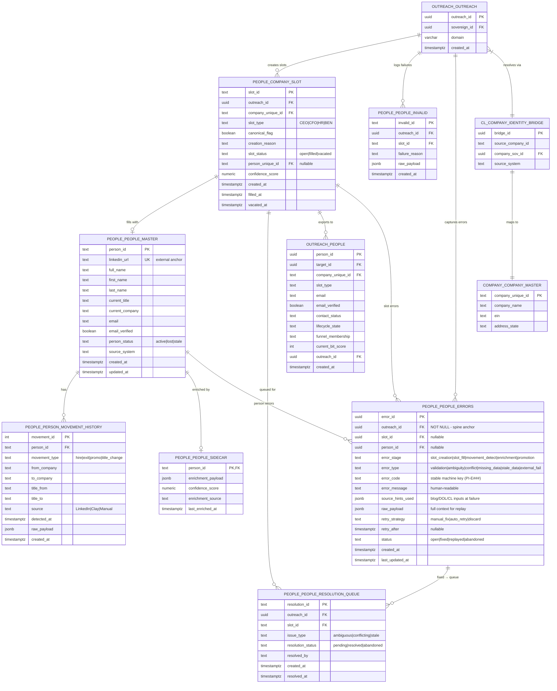

# People Intelligence Sub-Hub — Entity Relationship Diagram

**Version:** 1.0.0
**Generated:** 2026-01-08
**Doctrine:** Barton IMO v1.1
**Waterfall Position:** 4th (after Blog Content, before Outreach Execution)

---

## Overview

The People Intelligence Sub-Hub manages **slot creation and person binding** for outreach-ready companies.
All operations key off `outreach_id` — People never mints company or outreach IDs.

---

## Core Doctrine Rules

```
╔═══════════════════════════════════════════════════════════════════════════════╗
║                     PEOPLE INTELLIGENCE DOCTRINE                              ║
║                                                                               ║
║   1. Slots are created when Outreach ID enters People — not before            ║
║   2. 3 canonical slots ALWAYS: CEO, CFO, HR                                   ║
║   3. Benefits Manager (BEN) is CONDITIONAL, logged, non-canonical             ║
║   4. People binds to slots; slots never float                                 ║
║   5. Movement history is APPEND-ONLY (audit safe)                             ║
║   6. No People table writes upstream — signals only                           ║
║   7. LinkedIn URL is the external identity anchor                             ║
║                                                                               ║
╚═══════════════════════════════════════════════════════════════════════════════╝
```

---

## ERD Diagram (Mermaid)



---

## ASCII ERD (For Non-Mermaid Renderers)

```
┌─────────────────────────────────────────────────────────────────────────────────────────────┐
│                           PEOPLE INTELLIGENCE DATA MODEL                                    │
│                                                                                             │
│  ┌────────────────────────────────────────────────────────────────────────────────────────┐ │
│  │                           UPSTREAM ANCHORS (READ-ONLY)                                 │ │
│  │                                                                                        │ │
│  │  ┌───────────────────┐     ┌──────────────────────────┐     ┌───────────────────────┐ │ │
│  │  │ outreach.outreach │     │ cl.company_identity_     │     │ company.company_      │ │ │
│  │  │                   │     │      bridge              │     │      master           │ │ │
│  │  │ • outreach_id (PK)├────►│ • company_sov_id         ├────►│ • company_unique_id   │ │ │
│  │  │ • sovereign_id    │     │ • source_company_id      │     │ • company_name        │ │ │
│  │  │ • domain          │     │ • source_system          │     │ • ein                 │ │ │
│  │  └─────────┬─────────┘     └──────────────────────────┘     └───────────────────────┘ │ │
│  │            │                                                                          │ │
│  └────────────┼──────────────────────────────────────────────────────────────────────────┘ │
│               │                                                                             │
│               │ outreach_id enters People Intelligence                                      │
│               │                                                                             │
│               ▼                                                                             │
│  ┌────────────────────────────────────────────────────────────────────────────────────────┐ │
│  │                         PEOPLE INTELLIGENCE OWNED TABLES                               │ │
│  │                                                                                        │ │
│  │  ┌─────────────────────────────────────────────────────────────────────────────────┐   │ │
│  │  │                      people.company_slot (1,359 rows)                           │   │ │
│  │  │                                                                                 │   │ │
│  │  │  • slot_id (PK)              TEXT NOT NULL                                     │   │ │
│  │  │  • outreach_id (FK)          UUID NOT NULL ◄─── PRIMARY ANCHOR                 │   │ │
│  │  │  • company_unique_id (FK)    TEXT NOT NULL                                     │   │ │
│  │  │  • slot_type                 TEXT NOT NULL (CEO|CFO|HR|BEN)                    │   │ │
│  │  │  • canonical_flag            BOOLEAN (true for CEO,CFO,HR)                     │   │ │
│  │  │  • creation_reason           TEXT (size, DOL, blog_hint)                       │   │ │
│  │  │  • slot_status               TEXT (open|filled|vacated)                        │   │ │
│  │  │  • person_unique_id (FK)     TEXT NULL ───────────────────────────────────┐    │   │ │
│  │  │  • confidence_score          NUMERIC                                      │    │   │ │
│  │  │  • created_at                TIMESTAMPTZ                                  │    │   │ │
│  │  │  • filled_at                 TIMESTAMPTZ NULL                             │    │   │ │
│  │  └───────────────────────────────────────────────────────────────────────────┼────┘   │ │
│  │                                                                              │        │ │
│  │                                                                              ▼        │ │
│  │  ┌─────────────────────────────────────────────────────────────────────────────────┐   │ │
│  │  │                     people.people_master (170 rows)                             │   │ │
│  │  │                                                                                 │   │ │
│  │  │  • person_id (PK)            TEXT NOT NULL                                     │   │ │
│  │  │  • linkedin_url (UNIQUE)     TEXT ◄─── EXTERNAL IDENTITY ANCHOR                │   │ │
│  │  │  • full_name                 TEXT                                              │   │ │
│  │  │  • first_name                TEXT                                              │   │ │
│  │  │  • last_name                 TEXT                                              │   │ │
│  │  │  • current_title             TEXT                                              │   │ │
│  │  │  • current_company           TEXT                                              │   │ │
│  │  │  • email                     TEXT                                              │   │ │
│  │  │  • email_verified            BOOLEAN                                           │   │ │
│  │  │  • person_status             TEXT (active|lost|stale)                          │   │ │
│  │  │  • source_system             TEXT                                              │   │ │
│  │  └───────────────────────────────────────────────────────────────────┬─────────────┘   │ │
│  │                                                                      │                 │ │
│  │                                        ┌─────────────────────────────┴───────────┐     │ │
│  │                                        │                                         │     │ │
│  │                                        ▼                                         ▼     │ │
│  │  ┌─────────────────────────────────────────────────┐   ┌─────────────────────────────┐ │ │
│  │  │      people.person_movement_history (0 rows)    │   │   people.people_sidecar     │ │ │
│  │  │                                                 │   │         (0 rows)            │ │ │
│  │  │  • movement_id (PK)   INT                      │   │                             │ │ │
│  │  │  • person_id (FK)     TEXT                     │   │  • person_id (PK/FK) TEXT   │ │ │
│  │  │  • movement_type      TEXT (hire|exit|promo)   │   │  • enrichment_payload JSONB │ │ │
│  │  │  • from_company       TEXT                     │   │  • confidence_score NUMERIC │ │ │
│  │  │  • to_company         TEXT                     │   │  • last_enriched_at TSTZ    │ │ │
│  │  │  • detected_at        TIMESTAMPTZ              │   │                             │ │ │
│  │  │  • source             TEXT                     │   └─────────────────────────────┘ │ │
│  │  │  • raw_payload        JSONB                    │                                   │ │
│  │  │  • created_at         TIMESTAMPTZ              │   ⚠️ APPEND-ONLY (audit safe)    │ │
│  │  └─────────────────────────────────────────────────┘                                   │ │
│  │                                                                                        │ │
│  │  ┌─────────────────────────────────────────────────────────────────────────────────┐   │ │
│  │  │                   people.people_resolution_queue                                │   │ │
│  │  │                                                                                 │   │ │
│  │  │  • resolution_id (PK)        TEXT                                              │   │ │
│  │  │  • outreach_id (FK)          UUID                                              │   │ │
│  │  │  • slot_id (FK)              TEXT                                              │   │ │
│  │  │  • issue_type                TEXT (ambiguous|conflicting|stale)                │   │ │
│  │  │  • resolution_status         TEXT (pending|resolved|abandoned)                 │   │ │
│  │  │  • created_at                TIMESTAMPTZ                                       │   │ │
│  │  └─────────────────────────────────────────────────────────────────────────────────┘   │ │
│  │                                                                                        │ │
│  │  ┌─────────────────────────────────────────────────────────────────────────────────┐   │ │
│  │  │                      people.people_invalid                                      │   │ │
│  │  │                                                                                 │   │ │
│  │  │  • invalid_id (PK)           TEXT                                              │   │ │
│  │  │  • outreach_id (FK)          UUID                                              │   │ │
│  │  │  • slot_id (FK)              TEXT NULL                                         │   │ │
│  │  │  • failure_reason            TEXT                                              │   │ │
│  │  │  • raw_payload               JSONB                                             │   │ │
│  │  │  • created_at                TIMESTAMPTZ                                       │   │ │
│  │  └─────────────────────────────────────────────────────────────────────────────────┘   │ │
│  │                                                                                        │ │
│  │  ┌─────────────────────────────────────────────────────────────────────────────────┐   │ │
│  │  │              people.people_errors (CANONICAL ERROR TABLE)                       │   │ │
│  │  │                                                                                 │   │ │
│  │  │  • error_id (PK)             UUID DEFAULT gen_random_uuid()                    │   │ │
│  │  │  • outreach_id (FK)          UUID NOT NULL ◄─── SPINE ANCHOR                   │   │ │
│  │  │  • slot_id (FK)              UUID NULL                                         │   │ │
│  │  │  • person_id (FK)            UUID NULL                                         │   │ │
│  │  │  • error_stage               TEXT NOT NULL (slot_creation|slot_fill|...)       │   │ │
│  │  │  • error_type                TEXT NOT NULL (validation|ambiguity|conflict|...) │   │ │
│  │  │  • error_code                TEXT NOT NULL ◄─── STABLE MACHINE KEY             │   │ │
│  │  │  • error_message             TEXT NOT NULL (human-readable)                    │   │ │
│  │  │  • source_hints_used         JSONB (blog/DOL/CL inputs at failure)             │   │ │
│  │  │  • raw_payload               JSONB NOT NULL (full context for replay)          │   │ │
│  │  │  • retry_strategy            TEXT NOT NULL (manual_fix|auto_retry|discard)     │   │ │
│  │  │  • retry_after               TIMESTAMPTZ NULL                                  │   │ │
│  │  │  • status                    TEXT NOT NULL (open|fixed|replayed|abandoned)     │   │ │
│  │  │  • created_at                TIMESTAMPTZ NOT NULL                              │   │ │
│  │  │  • last_updated_at           TIMESTAMPTZ NOT NULL                              │   │ │
│  │  │                                                                                 │   │ │
│  │  │  ⚠️ APPEND-ONLY — Status-driven lifecycle only, NO DELETES                     │   │ │
│  │  └─────────────────────────────────────────────────────────────────────────────────┘   │ │
│  │                                                                                        │ │
│  └────────────────────────────────────────────────────────────────────────────────────────┘ │
│                                                                                             │
│               │ PASS: Export to outreach.people                                             │
│               ▼                                                                             │
│  ┌────────────────────────────────────────────────────────────────────────────────────────┐ │
│  │                         OUTPUT TABLE (outreach.people)                                 │ │
│  │                                                                                        │ │
│  │  • person_id (PK)         UUID                                                        │ │
│  │  • outreach_id (FK)       UUID                                                        │ │
│  │  • company_unique_id      TEXT                                                        │ │
│  │  • slot_type              TEXT                                                        │ │
│  │  • email                  TEXT                                                        │ │
│  │  • email_verified         BOOLEAN                                                     │ │
│  │  • contact_status         TEXT                                                        │ │
│  │  • lifecycle_state        ENUM                                                        │ │
│  │  • current_bit_score      INT                                                         │ │
│  │  • created_at             TIMESTAMPTZ                                                 │ │
│  │                                                                                        │ │
│  └────────────────────────────────────────────────────────────────────────────────────────┘ │
│                                                                                             │
│  ┌────────────────────────────────────────────────────────────────────────────────────────┐ │
│  │                      READ-ONLY DEPENDENCIES (NO WRITES)                               │ │
│  │                                                                                        │ │
│  │  • blog.blog_context        - Influences slot prioritization                          │ │
│  │  • dol.ein_linkage          - EIN context for slot decisions                          │ │
│  │  • dol.form_5500            - Filing size hints (participant count)                   │ │
│  │  • company_target.profile   - Email patterns                                          │ │
│  │                                                                                        │ │
│  │  ⚠️ These NEVER bind people. They only influence slot prioritization.                 │ │
│  │                                                                                        │ │
│  └────────────────────────────────────────────────────────────────────────────────────────┘ │
└─────────────────────────────────────────────────────────────────────────────────────────────┘
```

---

## Slot Type Definitions

| Slot Type | Code | Canonical | Creation Logic |
|-----------|------|-----------|----------------|
| Chief Executive Officer | `CEO` | ✅ YES | Always created |
| Chief Financial Officer | `CFO` | ✅ YES | Always created |
| Human Resources | `HR` | ✅ YES | Always created |
| Benefits Manager | `BEN` | ❌ NO | Conditional: DOL signal, size > 100, or explicit blog hint |

### Canonical Slot Rule

```python
CANONICAL_SLOTS = ['CEO', 'CFO', 'HR']  # Always created
CONDITIONAL_SLOTS = ['BEN']             # Created only with justification

def create_slots_for_outreach(outreach_id: str, context: dict) -> List[Slot]:
    slots = []
    
    # Always create canonical slots
    for slot_type in CANONICAL_SLOTS:
        slots.append(Slot(
            outreach_id=outreach_id,
            slot_type=slot_type,
            canonical_flag=True,
            creation_reason='canonical'
        ))
    
    # Conditional: Benefits Manager
    if should_create_benefits_slot(context):
        slots.append(Slot(
            outreach_id=outreach_id,
            slot_type='BEN',
            canonical_flag=False,
            creation_reason=context.get('ben_reason', 'dol_signal')
        ))
    
    return slots
```

---

## Table Summary

| Schema | Table | Rows | Purpose |
|--------|-------|------|---------|
| `people` | `company_slot` | 1,359 | Slot definitions per outreach_id |
| `people` | `people_master` | 170 | Core person records |
| `people` | `person_movement_history` | 0 | Talent flow tracking (append-only) |
| `people` | `people_sidecar` | 0 | Extended enrichment data |
| `people` | `people_resolution_queue` | ? | Pending slot resolutions |
| `people` | `people_invalid` | ? | Failed person processing |
| `people` | `people_errors` | 0 | **Canonical error capture (append-only)** |
| `outreach` | `people` | 0 | Outreach-ready contacts (output) |

---

## Join Paths

### Inbound (from Outreach Spine)

```
outreach.outreach.outreach_id
    │
    └──► people.company_slot.outreach_id
              │
              └──► people.people_master.person_id (via slot fill)
```

### Outbound (to Outreach Execution)

```
people.company_slot (filled slots)
    │
    └──► outreach.people (export for execution)
```

---

## Explicit Prohibitions

| Action | Status | Reason |
|--------|--------|--------|
| Mint company_id | ❌ FORBIDDEN | CL owns identity |
| Mint outreach_id | ❌ FORBIDDEN | Orchestration owns |
| Write to CL tables | ❌ FORBIDDEN | Read-only access |
| Write to company_target | ❌ FORBIDDEN | Upstream hub |
| Write to DOL tables | ❌ FORBIDDEN | Different hub |
| Modify movement_history | ❌ FORBIDDEN | Append-only |
| Delete slots | ❌ FORBIDDEN | Vacate only |

---

## Error & Recovery Doctrine

```
╔═══════════════════════════════════════════════════════════════════════════════╗
║                    ERROR & RECOVERY SYSTEM                                    ║
║                                                                               ║
║   1. Errors are FIRST-CLASS CITIZENS, not dead ends                          ║
║   2. Never retry inline — errors exit the worker immediately                 ║
║   3. Fixes are DATA EDITS, not code edits                                    ║
║   4. Replay uses the SAME outreach_id + slot_id                              ║
║   5. Original error row marked 'replayed' — never overwritten                ║
║   6. New failures generate NEW error rows (append-only)                      ║
║   7. No silent failures. EVER.                                               ║
║                                                                               ║
╚═══════════════════════════════════════════════════════════════════════════════╝
```

### Error Stages

| Stage | Code | Trigger |
|-------|------|---------|
| Slot Creation | `slot_creation` | Slot creation rules violated |
| Slot Fill | `slot_fill` | Multiple people compete for same slot |
| Movement Detect | `movement_detect` | Movement detected but cannot classify |
| Enrichment | `enrichment` | External tool failure (timeout, block, cost) |
| Promotion | `promotion` | Export to outreach.people fails |

### Error Types

| Type | Code | Description |
|------|------|-------------|
| Validation | `validation` | Data fails validation rules |
| Ambiguity | `ambiguity` | Insufficient confidence gap between candidates |
| Conflict | `conflict` | Blog/DOL hints contradict LinkedIn truth |
| Missing Data | `missing_data` | Required data unavailable |
| Stale Data | `stale_data` | Data expired or outdated |
| External Fail | `external_fail` | Third-party API failure |

### Recovery Flow

```
people.people_errors (status = 'fixed')
        │
        ▼
people.people_resolution_queue (created from fixed errors)
        │
        ▼
People Intelligence Worker (replay with rate + cost guards)
        │
        └──► Original error marked 'replayed'
        └──► New failures → NEW error rows
```

### Kill Switches

| Flag | Effect When Disabled |
|------|---------------------|
| `PEOPLE_SLOT_AUTOFILL_ENABLED` | Error + halt (not skip) |
| `PEOPLE_MOVEMENT_DETECT_ENABLED` | Error + halt (not skip) |
| `PEOPLE_AUTO_REPLAY_ENABLED` | Error + halt (not skip) |

---

## Waterfall Position

| Position | Hub | Status |
|----------|-----|--------|
| 1 | Company Target | ✅ Complete |
| 2 | DOL Filings | ✅ Complete |
| 3 | Blog Content | ⏳ Pending |
| **4** | **People Intelligence** | 🔧 Current |
| 5 | Outreach Execution | ⏳ Pending |

---

**Last Updated:** 2026-01-08
**Author:** People Intelligence Team
**Doctrine Version:** Barton IMO v1.1
