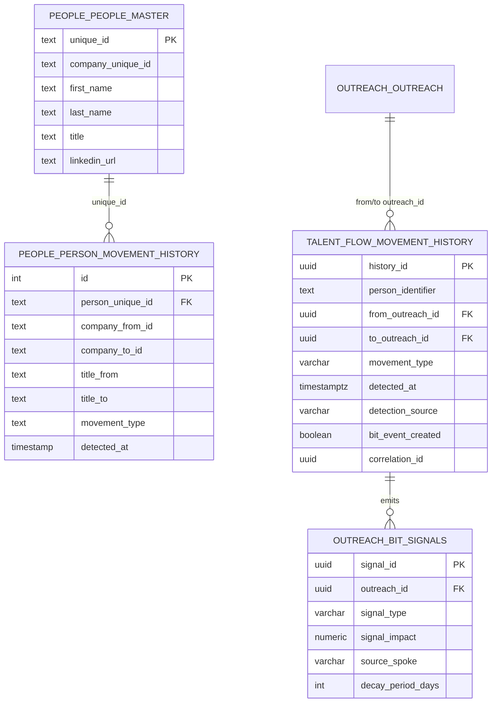

# PRD — Talent Flow Sub-Hub

## Conformance

| Field | Value |
|-------|-------|
| **Doctrine Version** | 1.1.0 |
| **CTB Version** | 1.0.0 |
| **CC Layer** | CC-03 (Context within CC-02 Hub) |

---

## 1. Sovereign Reference (CC-01)

| Field | Value |
|-------|-------|
| **Sovereign ID** | barton-enterprises |
| **Sovereign Boundary** | Marketing intelligence and executive enrichment operations |

---

## 2. Hub Identity (CC-02)

| Field | Value |
|-------|-------|
| **Parent Hub** | outreach-core |
| **Parent Hub ID** | outreach-core-001 |
| **Hub Name** | Talent Flow |
| **Hub ID** | HUB-TF-001 |
| **Doctrine ID** | 04.04.06 |
| **Owner** | Outreach Team |
| **Version** | 0.1.0 |

---

## 3. Process Identity (CC-04)

| Field | Value |
|-------|-------|
| **PID Pattern** | `HUB-TF-001-${TIMESTAMP}-${RANDOM_HEX}` |
| **Session Pattern** | `HUB-TF-001-session-${SESSION_ID}` |
| **Context Binding** | outreach_context_id |

---

## 4. Purpose

Track executive transitions, departures, and job market signals that indicate buying intent.
Operates in **SENSOR-ONLY** mode — detects movements but NEVER triggers enrichment.
Emits signals to BIT engine to influence company prioritization.

---

## 5. Waterfall Position

**Position**: 5th in canonical waterfall (after People Intelligence, before Blog Content)

```
1. CL ──────────► PASS ──┐  (EXTERNAL)
                         │ company_unique_id
                         ▼
2. COMPANY TARGET ► PASS ──┐
                           │ verified_pattern, domain
                           ▼
3. DOL FILINGS ───► PASS ──┐
                           │ ein, filing_signals
                           ▼
4. PEOPLE ────────► PASS ──┐
                           │ slot_assignments, person records
                           ▼
5. TALENT FLOW ───► PASS ──┐  ◄── YOU ARE HERE
                           │ movement_signals
                           ▼
6. BLOG ──────────► PASS
```

### Upstream Dependencies

| Upstream | Required Signal | Gate |
|----------|-----------------|------|
| People Intelligence | person records | MUST have PASS |
| People Intelligence | linkedin_url (optional) | Used for tracking |

### Downstream Consumers

| Downstream | Signals Emitted | Binding |
|------------|-----------------|---------|
| BIT Engine | movement_signals | outreach_context_id |
| Company Target | BIT score updates | company_unique_id |
| Outreach Execution | intent signals | outreach_context_id |

### Waterfall Rules (LOCKED)

- People Intelligence must PASS before this hub executes
- This hub emits signals but does NOT gate downstream
- No retry/rescue from downstream hubs
- Failures stay local — sensor continues on next detection

---

## 6. External Dependencies & Program Scope

### CL is EXTERNAL to Outreach

| Boundary | System | Ownership |
|----------|--------|-----------|
| **External** | Company Lifecycle (CL) | Mints company_unique_id, shared across all programs |
| **Program** | Outreach Orchestration | Mints outreach_context_id, program-scoped |
| **Sub-Hub** | Talent Flow (this hub) | Movement detection, sensor-only |

### Key Doctrine

- **CL is external** — Outreach CONSUMES company_unique_id, does NOT invoke CL
- **Sensor-Only** — This hub DETECTS movements, NEVER enriches
- **Run identity** — All operations bound by outreach_context_id from Orchestration
- **Zero Cost** — No paid API calls, no enrichment triggers

### Sensor-Only Compliance (CRITICAL)

This hub is a **SENSOR**, not a **PRODUCER** or **ENRICHER**:

| Action | Allowed |
|--------|---------|
| Detect job title changes | YES |
| Detect company transitions | YES |
| Emit BIT signals | YES |
| Compute hub status | YES |
| Trigger paid API calls | **NO** |
| Enrich person data | **NO** |
| Create new person records | **NO** |
| Modify upstream data | **NO** |

### Explicit Prohibitions

- [ ] Does NOT invoke Company Lifecycle (CL is external)
- [ ] Does NOT mint company_unique_id (CL does)
- [ ] Does NOT call paid APIs (sensor-only mode)
- [ ] Does NOT enrich person records (People Intelligence does)
- [ ] Does NOT create new person records (People Intelligence does)
- [ ] Does NOT modify company records (Company Target does)

---

## 7. Lifecycle Gate

| Minimum Lifecycle State | Gate Condition |
|-------------------------|----------------|
| NONE | No lifecycle gate (sensor-only) |
| Additional | People Intelligence must PASS |

---

## 8. Inputs

| Input | Source | Required |
|-------|--------|----------|
| company_unique_id | Company Lifecycle (external) | YES |
| person records | People Intelligence | YES |
| linkedin_url | People Intelligence | NO (optional) |
| outreach_context_id | Outreach Orchestration | YES |

---

## 9. Pipeline

```
Validate upstream People Intelligence PASS
 ↓
Monitor LinkedIn profile changes (passive)
 ↓
Detect job title changes
 ↓
Detect company transitions
 ↓
Validate movement (confidence >= 0.70)
 ↓
Deduplicate by hash
 ↓
Emit signal to BIT engine
 ↓
Update hub status (PASS if fresh movements)
```

---

## 10. Cost Rules

| Rule | Enforcement |
|------|-------------|
| Zero API Cost | SENSOR-ONLY mode enforced |
| No Enrichment | Movement detection only |
| No Retry Loops | Single detection per event |
| No Paid Tools | All operations are observation-only |

---

## 11. Tools

| Tool | Tier | Cost Class | Purpose |
|------|------|------------|---------|
| LinkedIn Monitor | 0 | Free | Profile change detection |
| News Crawler | 0 | Free | Press release monitoring |
| Manual Import | 0 | Free | CSV movement import |

---

## 12. Constraints

- [ ] No movements without company_unique_id
- [ ] No movements without person_identifier
- [ ] Zero paid API calls (sensor-only)
- [ ] Movement confidence >= 0.70 required
- [ ] Freshness window = 60 days
- [ ] Requires People Intelligence PASS

---

## 13. Core Metric

**MOVEMENT_DETECTION_RATE** — Percentage of tracked persons with detected movements

| Threshold | Value |
|-----------|-------|
| Healthy | >= 70% |
| Minimum SLA | >= 40% |

---

## 14. Signal Validity and Downstream Effects

### Execution Position

**Fifth in canonical order** — After People Intelligence.

### Required Upstream PASS Conditions

| Upstream | Condition |
|----------|-----------|
| People Intelligence | PASS with slot_assignments |

### Signals Consumed (Origin-Bound)

| Signal | Origin | Validity |
|--------|--------|----------|
| company_unique_id | CL (via People Hub) | Run-bound to outreach_context_id |
| person_unique_id | People Intelligence | Run-bound to outreach_context_id |
| linkedin_url | People Intelligence | Run-bound to outreach_context_id |

### Signals Emitted

| Signal | Consumers | Validity |
|--------|-----------|----------|
| movement_event | BIT Engine | Run-bound to outreach_context_id |
| MOVEMENT_DETECTION_RATE | Monitoring | Run-bound to outreach_context_id |

### Downstream Effects

| If This Hub | Then |
|-------------|------|
| Detects movement | BIT score updated |
| No movements | BIT score unchanged |
| PASS | Blog Content may execute |

### Explicit Prohibitions

- [ ] May NOT consume Blog Content signals (downstream)
- [ ] May NOT fix People Intelligence errors
- [ ] May NOT re-enrich person data
- [ ] May NOT refresh signals from prior contexts
- [ ] May NOT use stale movements from prior context

---

## 15. Tables Owned

### Primary Tables (Write)

| Schema | Table | Purpose | Key Columns |
|--------|-------|---------|-------------|
| `talent_flow` | `movement_history` | Core movement records | history_id, person_identifier, movement_type |
| `people` | `person_movement_history` | Person-level movements | id, person_unique_id, movement_type |

### Signal Tables (Write)

| Schema | Table | Purpose | Owner |
|--------|-------|---------|-------|
| `outreach` | `bit_signals` | Movement signals for BIT | Shared with BIT Engine |

### Read-Only Tables (From Other Hubs)

| Schema | Table | Purpose | Owner |
|--------|-------|---------|-------|
| `people` | `people_master` | Person records | People Intelligence |
| `outreach` | `company_target` | Company anchor | Company Target |
| `cl` | `company_identity` | Sovereign company ID | CL Parent |

---

## 16. ERD — Talent Flow Tables



### Movement Type Values

| Movement Type | BIT Impact | Description |
|---------------|------------|-------------|
| `joined` | +10 | Executive joined from another company |
| `left` | +5 | Executive departed (may signal instability) |
| `title_change` | +3 | Title changed within same company |

### Status Values

| Status | Description |
|--------|-------------|
| `PASS` | Fresh movements detected within 60 days |
| `IN_PROGRESS` | No fresh movements, monitoring continues |
| `BLOCKED` | Upstream People Intelligence is BLOCKED |

---

## 17. Configuration (LOCKED)

| Parameter | Value | Description |
|-----------|-------|-------------|
| `FRESHNESS_DAYS` | 60 | Signals expire after 60 days |
| `MIN_MOVEMENTS` | 1 | Minimum movements for PASS |
| `CONFIDENCE_THRESHOLD` | 0.70 | Minimum confidence score |
| `BIT_DECAY_DAYS` | 90 | Signal decay period for BIT |

---

## 18. Detection Sources

| Source | Type | Description |
|--------|------|-------------|
| `linkedin_monitor` | Passive | LinkedIn profile change detection |
| `news_crawler` | Passive | News/press release monitoring |
| `data_provider` | Import | Third-party data feed |
| `manual_import` | Manual | CSV import of movements |

---

## 19. PASS Criteria (DETERMINISTIC)

**No fuzzy logic. No guessing. No human judgment.**

### PASS Requirements (ALL must be true)

1. `company_unique_id` exists and is valid
2. Upstream People Intelligence hub is NOT `BLOCKED`
3. At least `MIN_MOVEMENTS` (1) valid movement signals
4. At least one signal within `FRESHNESS_DAYS` (60)
5. Movement `confidence` >= `CONFIDENCE_THRESHOLD` (0.70)

### Status Transitions

| From | To | Condition |
|------|-----|-----------|
| IN_PROGRESS | PASS | Fresh movement detected |
| PASS | IN_PROGRESS | All signals expired (freshness decay) |
| * | BLOCKED | Upstream People Intelligence BLOCKED |

---

## Approval

| Role | Name | Date |
|------|------|------|
| Owner | | |
| Reviewer | | |

---

**Last Updated**: 2026-01-25
**Hub**: Talent Flow (04.04.06)
**Doctrine**: External CL + Outreach Program v1.0
**Status**: SCAFFOLD
