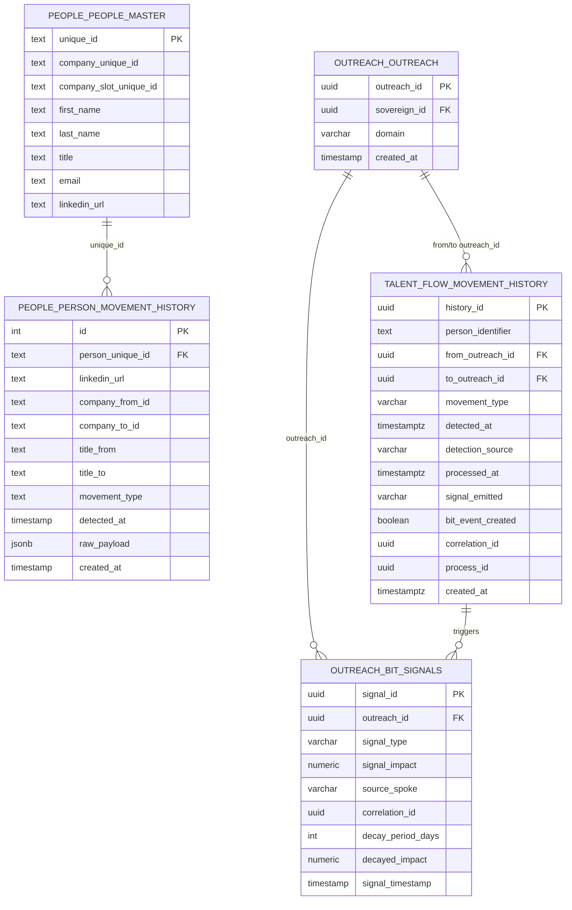

# Talent Flow Hub - Schema Documentation

> **AUTHORITY**: Neon PostgreSQL (Production)
> **VERIFIED**: 2026-01-25 via READ-ONLY connection
> **HUB ID**: 04.04.06
> **STATUS**: NEON VERIFIED

---

## Schema Overview

The Talent Flow hub tracks executive transitions, departures, and job market signals that indicate buying intent. It operates in SENSOR-ONLY mode - detecting movements but never triggering enrichment. All signals reference valid company_unique_id from upstream.

## Primary Tables

| Schema | Table | Purpose |
|--------|-------|---------|
| `talent_flow` | `movement_history` | Core movement tracking |
| `people` | `person_movement_history` | Person-level movement records |
| `outreach` | `bit_signals` | Movement signals for BIT scoring |

---

## Entity Relationship Diagram



---

## Table Details

### talent_flow.movement_history

Core movement tracking table for talent flow signals.

| Column | Type | Nullable | Default | Description |
|--------|------|----------|---------|-------------|
| `history_id` | uuid | NOT NULL | - | Primary key |
| `person_identifier` | text | NOT NULL | - | Person reference (LinkedIn URL or ID) |
| `from_outreach_id` | uuid | NULL | - | Source company outreach ID |
| `to_outreach_id` | uuid | NULL | - | Destination company outreach ID |
| `movement_type` | varchar | NULL | - | Type (joined, left, title_change) |
| `detected_at` | timestamptz | NULL | - | When movement was detected |
| `detection_source` | varchar | NULL | - | How it was detected |
| `processed_at` | timestamptz | NULL | - | When signal was processed |
| `signal_emitted` | varchar | NULL | - | Signal type emitted |
| `bit_event_created` | boolean | NULL | - | BIT event was created |
| `correlation_id` | uuid | NULL | - | Correlation ID for tracing |
| `process_id` | uuid | NULL | - | Process ID |
| `created_at` | timestamptz | NULL | - | Record creation time |

### people.person_movement_history

Person-level movement history with detailed tracking.

| Column | Type | Nullable | Default | Description |
|--------|------|----------|---------|-------------|
| `id` | integer | NOT NULL | sequence | Primary key |
| `person_unique_id` | text | NOT NULL | - | FK to people_master |
| `linkedin_url` | text | NULL | - | LinkedIn profile URL |
| `company_from_id` | text | NOT NULL | - | Previous company ID |
| `company_to_id` | text | NULL | - | New company ID (null if departed) |
| `title_from` | text | NOT NULL | - | Previous title |
| `title_to` | text | NULL | - | New title |
| `movement_type` | text | NOT NULL | - | Type (promotion, departure, lateral) |
| `detected_at` | timestamp | NOT NULL | now() | Detection timestamp |
| `raw_payload` | jsonb | NULL | - | Raw detection data |
| `created_at` | timestamp | NULL | now() | Record creation time |

---

## Foreign Key Relationships

| Source Table | Source Column | Target Table | Target Column |
|--------------|---------------|--------------|---------------|
| people.person_movement_history | person_unique_id | people.people_master | unique_id |

---

## Movement Types

| Type | Description | Signal Value |
|------|-------------|--------------|
| `joined` | Executive joined from another company | +10 BIT |
| `left` | Executive departed (may signal instability) | +5 BIT |
| `title_change` | Title changed (promotion/demotion) | +3 BIT |
| `promotion` | Title advancement within company | +5 BIT |
| `lateral` | Same-level move to different company | +8 BIT |
| `departure` | Left company (no destination known) | +5 BIT |

---

## PASS Criteria

The hub computes PASS status based on:

1. **Freshness Window**: Movement signals within 60 days
2. **Minimum Movements**: At least 1 valid movement signal
3. **Confidence Threshold**: Signal confidence >= 0.70
4. **Upstream Dependency**: People Intelligence hub must not be BLOCKED

## Status Transitions

| From | To | Condition |
|------|-----|-----------|
| IN_PROGRESS | PASS | Valid movement detected within freshness window |
| PASS | IN_PROGRESS | All signals expire (freshness decay) |
| * | BLOCKED | Upstream People Intelligence is BLOCKED |

---

## Signal Integration

### BIT Engine Integration

Movement signals feed into BIT (Buyer Intent Tracker) scoring:

```
movement_event → talent_flow.movement_history → outreach.bit_signals
```

### Signal Schema

```json
{
  "signal_type": "TALENT_MOVEMENT",
  "signal_impact": 10,
  "source_spoke": "talent-flow",
  "decay_period_days": 90,
  "signal_metadata": {
    "movement_type": "joined",
    "person_identifier": "linkedin.com/in/xyz",
    "from_company": "Company A",
    "to_company": "Company B"
  }
}
```

---

## Detection Sources

| Source | Description |
|--------|-------------|
| `linkedin_monitor` | LinkedIn profile change detection |
| `manual_import` | Manual CSV import of movements |
| `news_crawler` | News/press release monitoring |
| `data_provider` | Third-party data provider feed |

---

*Generated from Neon PostgreSQL via READ-ONLY connection*
*Last verified: 2026-01-25*
