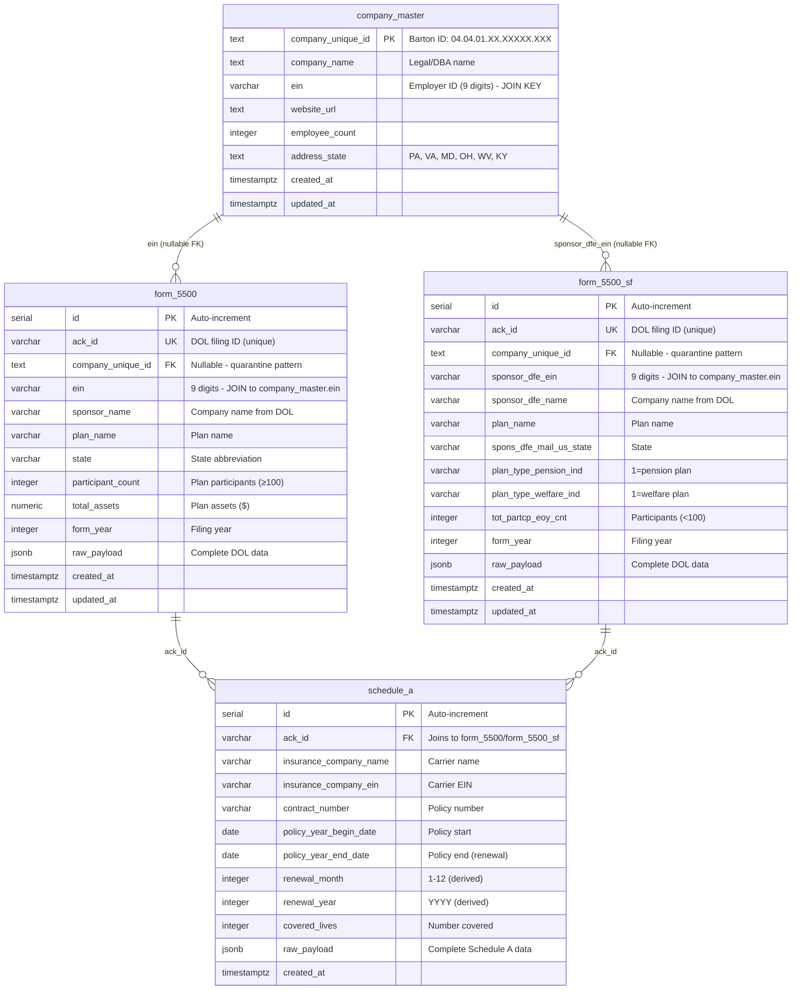

# DOL Federal Data Spoke - Entity Relationship Diagram

**Version:** 2.0.0
**Last Updated:** 2025-11-27
**Coverage:** 2.7M+ plans, 150K+ unique EINs

---

## Hub-and-Spoke Architecture



---

## Data Flow Diagram

```
┌─────────────────────────────────────────────────────────────────┐
│                     DOL FOIA DATASETS                            │
│                  (US Department of Labor)                        │
└─────────────────────────────────────────────────────────────────┘
                              │
                              │ Annual Download
                              ▼
        ┌─────────────────────────────────────────────┐
        │  F_5500_2023_latest.csv (700K+ records)     │
        │  F_5500_SF_2023_latest.csv (2M+ records)    │
        │  F_SCH_A_2023_latest.csv (1.5M+ records)    │
        └─────────────────────────────────────────────┘
                              │
                              │ Import Scripts
                              ▼
        ┌─────────────────────────────────────────────┐
        │         STAGING TABLES (Neon)                │
        │  - form_5500_staging                         │
        │  - form_5500_sf_staging                      │
        └─────────────────────────────────────────────┘
                              │
                              │ process_5500_staging()
                              │ process_5500_sf_staging()
                              ▼
        ┌─────────────────────────────────────────────┐
        │         PRODUCTION TABLES (Neon)             │
        │  ┌──────────────────────────────────┐       │
        │  │   form_5500 (700K+ records)      │       │
        │  │   - ein → match_5500_to_company()│       │
        │  │   - company_unique_id (nullable) │       │
        │  └──────────────────────────────────┘       │
        │                  ↓                           │
        │  ┌──────────────────────────────────┐       │
        │  │ form_5500_sf (2M+ records)       │       │
        │  │ - sponsor_dfe_ein → fuzzy match  │       │
        │  │ - company_unique_id (nullable)   │       │
        │  └──────────────────────────────────┘       │
        │                  ↓                           │
        │  ┌──────────────────────────────────┐       │
        │  │  schedule_a (1.5M+ records)      │       │
        │  │  - ack_id → joins to both forms  │       │
        │  │  - renewal_month for timing      │       │
        │  └──────────────────────────────────┘       │
        └─────────────────────────────────────────────┘
                              │
                              │ EIN Matching
                              ▼
        ┌─────────────────────────────────────────────┐
        │       COMPANY MASTER (HUB)                   │
        │  ┌──────────────────────────────────┐       │
        │  │  company_master                  │       │
        │  │  - company_unique_id (PK)        │       │
        │  │  - ein (9 digits)                │       │
        │  │  - company_name                  │       │
        │  └──────────────────────────────────┘       │
        └─────────────────────────────────────────────┘
```

---

## Join Patterns

### Pattern 1: Enrich Company with DOL Data

```sql
-- Get all DOL plan data for a company
SELECT
    cm.company_unique_id,
    cm.company_name,
    cm.ein,
    f5.plan_name as large_plan,
    f5.participant_count,
    f5.total_assets,
    fsf.plan_name as small_plan,
    fsf.tot_partcp_eoy_cnt,
    fsf.plan_type_pension_ind,
    fsf.plan_type_welfare_ind
FROM marketing.company_master cm
LEFT JOIN marketing.form_5500 f5
    ON f5.ein = cm.ein
LEFT JOIN marketing.form_5500_sf fsf
    ON fsf.sponsor_dfe_ein = cm.ein
WHERE cm.company_unique_id = '04.04.01.XX.XXXXX.XXX';
```

### Pattern 2: All Plans (Union)

```sql
-- Get all plans regardless of size
SELECT
    '5500' as form_type,
    ein,
    sponsor_name,
    state,
    participant_count,
    company_unique_id
FROM marketing.form_5500
UNION ALL
SELECT
    '5500-SF' as form_type,
    sponsor_dfe_ein as ein,
    sponsor_dfe_name as sponsor_name,
    spons_dfe_mail_us_state as state,
    tot_partcp_eoy_cnt as participant_count,
    company_unique_id
FROM marketing.form_5500_sf;
```

### Pattern 3: Insurance Data (Schedule A)

```sql
-- Get insurance carrier info for a company
SELECT
    cm.company_unique_id,
    cm.company_name,
    f5.plan_name,
    sa.insurance_company_name,
    sa.contract_number,
    sa.renewal_month,
    sa.renewal_year,
    sa.covered_lives
FROM marketing.company_master cm
JOIN marketing.form_5500 f5 ON f5.ein = cm.ein
JOIN marketing.schedule_a sa ON sa.ack_id = f5.ack_id
WHERE sa.renewal_month IS NOT NULL;
```

### Pattern 4: Renewal Timing Analysis

```sql
-- Companies with renewals in next 3 months
SELECT
    cm.company_unique_id,
    cm.company_name,
    sa.insurance_company_name,
    sa.renewal_month,
    sa.policy_year_end_date
FROM marketing.schedule_a sa
JOIN marketing.form_5500 f5 ON sa.ack_id = f5.ack_id
JOIN marketing.company_master cm ON cm.ein = f5.ein
WHERE sa.renewal_month IN (
    EXTRACT(MONTH FROM CURRENT_DATE),
    EXTRACT(MONTH FROM CURRENT_DATE + INTERVAL '1 month'),
    EXTRACT(MONTH FROM CURRENT_DATE + INTERVAL '2 months')
)
AND sa.renewal_year = EXTRACT(YEAR FROM CURRENT_DATE)
ORDER BY sa.policy_year_end_date;
```

---

## Indexes Summary

### form_5500 (5 indexes)
- `idx_form_5500_ein` - EIN lookup
- `idx_form_5500_company_id` - Company FK joins
- `idx_form_5500_sponsor_name_lower` - Fuzzy name matching
- `idx_form_5500_state` - State filtering
- `idx_form_5500_raw_payload` - JSONB queries (GIN)

### form_5500_sf (5 indexes)
- `idx_form_5500_sf_ein` - EIN lookup
- `idx_form_5500_sf_company_id` - Company FK joins
- `idx_form_5500_sf_sponsor_name_lower` - Fuzzy name matching
- `idx_form_5500_sf_plan_type_pension` - Pension plan filter (partial)
- `idx_form_5500_sf_plan_type_welfare` - Welfare plan filter (partial)

### schedule_a (3 indexes)
- `idx_schedule_a_ack_id` - Join to form_5500/form_5500_sf
- `idx_schedule_a_insurance_ein` - Insurance carrier lookup
- `idx_schedule_a_renewal_month` - Renewal timing queries

**Total: 13 indexes**

---

## Key Constraints

### Unique Constraints
- `form_5500.ack_id` - One filing per ACK_ID
- `form_5500_sf.ack_id` - One filing per ACK_ID

### CHECK Constraints
- `form_5500.ein` - Must be 9 digits: `^[0-9]{9}$`
- `form_5500_sf.sponsor_dfe_ein` - Must be 9 digits: `^[0-9]{9}$`

### Foreign Keys (Nullable - Quarantine Pattern)
- `form_5500.company_unique_id` → `company_master.company_unique_id`
  - ON DELETE SET NULL
  - Allows unmatched DOL sponsors to exist in quarantine

- `form_5500_sf.company_unique_id` → `company_master.company_unique_id`
  - ON DELETE SET NULL
  - Allows unmatched small plan sponsors to exist in quarantine

---

## Data Quality Metrics

| Metric | Target | Description |
|--------|--------|-------------|
| **form_5500 Match Rate** | 50-70% | % of filings matched to company_master |
| **form_5500_sf Match Rate** | 40-60% | % of small plans matched (lower due to size) |
| **Duplicate ACK_IDs** | 0 | Enforced by unique constraint |
| **Invalid EINs** | 0 | Enforced by CHECK constraint |
| **Schedule A Coverage** | 60%+ | % of plans with insurance data |
| **Renewal Data Completeness** | 80%+ | % of Schedule A with renewal_month |

---

## Spoke Architecture Benefits

### Hub-and-Spoke Pattern
- **Hub:** `company_master` (single source of truth for companies)
- **Spoke:** DOL Federal Data (3 tables: form_5500, form_5500_sf, schedule_a)
- **Join Key:** EIN (Employer Identification Number)

### Advantages
✅ **Quarantine Pattern:** Nullable FKs allow unmatched records to exist
✅ **Scalability:** Add more spokes without touching hub
✅ **Data Quality:** Fuzzy matching improves over time
✅ **Performance:** Indexes optimize joins
✅ **Flexibility:** UNION queries combine large + small plans
✅ **Auditability:** raw_payload preserves complete DOL data

### Future Spokes
- IRS Form 990 (nonprofit financial data)
- SEC Edgar (public company filings)
- USPTO Patents (innovation signals)
- OSHA Violations (safety compliance)
- EPA Violations (environmental compliance)

---

## Import Workflow

**See:** [FORM_5500_COMPLETE_GUIDE.md](../ctb/sys/enrichment/FORM_5500_COMPLETE_GUIDE.md)

**Quick Start:**
1. Download DOL datasets → `data/`
2. Create tables: `node ctb/sys/enrichment/create_5500_sf_table.js`
3. Prepare CSVs: `python ctb/sys/enrichment/import_5500_sf.py`
4. Load to staging: `psql \COPY ...`
5. Process staging: `CALL process_5500_sf_staging()`
6. Verify: Check match rates and data quality

---

**Last Updated:** 2025-11-27
**Schema Version:** 2.0.0
**Status:** Production Ready
