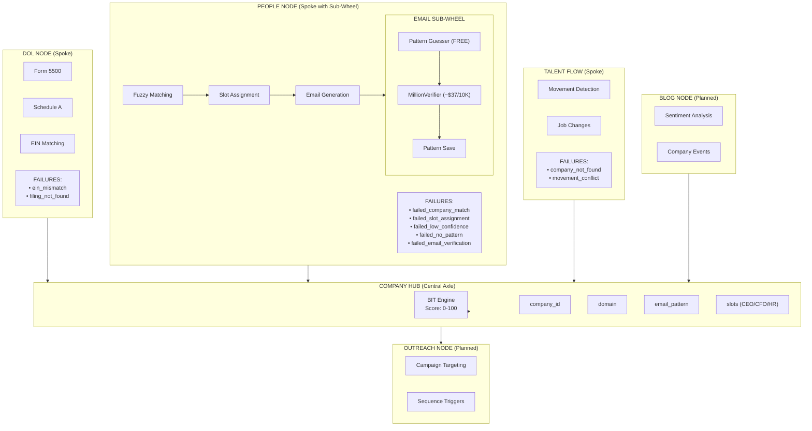

# Hub-and-Spoke Bicycle Wheel Architecture

## Barton Outreach Core - Fractal Wheel Model

```
                                    ┌─────────────────────────────────────────────────────────────────────────────────────────┐
                                    │                                                                                         │
                                    │                            BARTON OUTREACH BICYCLE WHEEL                                │
                                    │                                                                                         │
                                    └─────────────────────────────────────────────────────────────────────────────────────────┘


                                                           ╔═══════════════════╗
                                                      ╱    ║   BLOG NODE       ║    ╲
                                                    ╱      ║   [PLANNED]       ║      ╲
                                                  ╱        ╚═══════════════════╝        ╲
                                                ╱                   │                     ╲
                       ╔═══════════════════════════════╗            │            ╔═══════════════════════════════╗
                       ║        DOL NODE               ║            │            ║        TALENT FLOW            ║
                       ║   ┌─────────────────────┐     ║            │            ║   ┌─────────────────────┐     ║
                       ║   │  Form 5500          │     ║            │            ║   │  Movement Detection │     ║
                       ║   │  Schedule A         │     ║            │            ║   │  Job Changes        │     ║
                       ║   │  EIN Matching       │     ║            │            ║   │  Promotions         │     ║
                       ║   └─────────────────────┘     ║            │            ║   └─────────────────────┘     ║
                       ║                               ║            │            ║                               ║
                       ║   [FAILURES]                  ║            │            ║   [FAILURES]                  ║
                       ║   • ein_mismatch              ║            │            ║   • company_not_found         ║
                       ║   • filing_not_found          ║            │            ║   • movement_conflict         ║
                       ╚═══════════════════════════════╝            │            ╚═══════════════════════════════╝
                                      ╲                              │                              ╱
                                        ╲                            │                            ╱
                                          ╲                          │                          ╱
                                            ╲                        │                        ╱
                                              ╲                      │                      ╱
                                                ╲                    │                    ╱
                                                  ╲                  │                  ╱
                                                    ╲                │                ╱
                                                      ╲              │              ╱
        ╔══════════════════════════════════════════════════════════════════════════════════════════════════════════════╗
        ║                                                                                                              ║
        ║                                            ╔═════════════════════════════╗                                   ║
        ║                                            ║                             ║                                   ║
        ║                                            ║      COMPANY HUB            ║                                   ║
        ║                                            ║      (CENTRAL AXLE)         ║                                   ║
        ║                                            ║                             ║                                   ║
        ║                                            ║  ┌───────────────────────┐  ║                                   ║
        ║                                            ║  │        BIT            │  ║                                   ║
        ║                                            ║  │   (Buyer Intent)      │  ║                                   ║
        ║                                            ║  │                       │  ║                                   ║
        ║                                            ║  │   Score: 0-100        │  ║                                   ║
        ║                                            ║  │   Signals Converge    │  ║                                   ║
        ║                                            ║  └───────────────────────┘  ║                                   ║
        ║                                            ║                             ║                                   ║
        ║                                            ║  • company_id               ║                                   ║
        ║                                            ║  • domain                   ║                                   ║
        ║                                            ║  • email_pattern            ║                                   ║
        ║                                            ║  • slots (CEO/CFO/HR)       ║                                   ║
        ║                                            ║                             ║                                   ║
        ║                                            ╚═════════════════════════════╝                                   ║
        ║                                                                                                              ║
        ╚══════════════════════════════════════════════════════════════════════════════════════════════════════════════╝
                                                      ╱              │              ╲
                                                    ╱                │                ╲
                                                  ╱                  │                  ╲
                                                ╱                    │                    ╲
                                              ╱                      │                      ╲
                                            ╱                        │                        ╲
                                          ╱                          │                          ╲
                                        ╱                            │                            ╲
                                      ╱                              │                              ╲
                       ╔═══════════════════════════════╗            │            ╔═══════════════════════════════╗
                       ║        PEOPLE NODE            ║            │            ║        OUTREACH NODE          ║
                       ║   (SPOKE WITH SUB-WHEEL)      ║            │            ║        [PLANNED]              ║
                       ║                               ║            │            ║                               ║
                       ║   ┌─────────────────────┐     ║            │            ║   • Campaign Targeting        ║
                       ║   │  Fuzzy Matching     │─────╫────────────┼────────────╫─→ • Sequence Triggers         ║
                       ║   │  Slot Assignment    │     ║            │            ║   • Engagement Tracking       ║
                       ║   │  Email Generation   │     ║            │            ║                               ║
                       ║   │  Email Verification │     ║            │            ╚═══════════════════════════════╝
                       ║   └─────────────────────┘     ║            │
                       ║                               ║            │
                       ║   ┌─────────────────────┐     ║            │
                       ║   │   EMAIL SUB-WHEEL   │     ║            ▼
                       ║   │   ┌───────────────┐ │     ║    ╔═══════════════════╗
                       ║   │   │Pattern Guesser│ │     ║    ║   BIT ENGINE      ║
                       ║   │   │MillionVerify  │ │     ║    ║   [PLANNED]       ║
                       ║   │   │Pattern Save   │ │     ║    ╚═══════════════════╝
                       ║   │   └───────────────┘ │     ║
                       ║   └─────────────────────┘     ║
                       ║                               ║
                       ║   [FAILURES - SUB-SPOKES]     ║
                       ║   • failed_company_match      ║
                       ║   • failed_slot_assignment    ║
                       ║   • failed_low_confidence     ║
                       ║   • failed_no_pattern         ║
                       ║   • failed_email_verification ║
                       ╚═══════════════════════════════╝
```

---

## Detailed People Node Sub-Wheel (Fractal Expansion)

```
                                          ┌─────────────────────────────────┐
                                          │     failed_company_match        │
                                          │     • <80% fuzzy score          │
                                          │     • Resolution: Confirm/Remap │
                                          └─────────────────────────────────┘
                                                         ╲
                                                           ╲
        ┌─────────────────────────────────┐                  ╲
        │    failed_low_confidence        │                    ╲
        │    • 70-79% fuzzy score         │                      ╲
        │    • Resolution: Manual review  │                        ╲
        └─────────────────────────────────┘                          ╲
                      ╲                                                 ╲
                        ╲                                                 ╲
                          ╲                                                 ╲
                            ╲           ╔═══════════════════════════════════════════════════════════╗
                              ╲         ║                                                           ║
                                ╲       ║                    PEOPLE NODE                            ║
                                  ╲     ║                    (SUB-WHEEL)                            ║
                                    ╲   ║                                                           ║
                                      ╲ ║   ┌───────────────────────────────────────────────────┐   ║
                                        ║   │                                                   │   ║
        ╔═════════════════════════════╗ ║   │              SLOT ASSIGNMENT                     │   ║ ╔═════════════════════════════╗
        ║                             ║ ║   │                 (AXLE)                           │   ║ ║                             ║
        ║    FUZZY MATCHING           ║─╫───│                                                   │───╫─║    EMAIL GENERATION         ║
        ║    ┌─────────────────────┐  ║ ║   │   • CHRO > VP > Director > Manager > HRBP       │   ║ ║  ┌─────────────────────┐    ║
        ║    │ RapidFuzz scoring   │  ║ ║   │   • Seniority competition                       │   ║ ║  │ Pattern lookup      │    ║
        ║    │ City guardrail      │  ║ ║   │   • One person per slot per company             │   ║ ║  │ first.last@domain   │    ║
        ║    │ 80% threshold       │  ║ ║   │                                                   │   ║ ║  │ Apply to name       │    ║
        ║    └─────────────────────┘  ║ ║   └───────────────────────────────────────────────────┘   ║ ║  └─────────────────────┘    ║
        ║                             ║ ║                                                           ║ ║                             ║
        ╚═════════════════════════════╝ ║                         │                                 ║ ╚═════════════════════════════╝
                                      ╱ ║                         │                                 ║ ╱
                                    ╱   ║                         │                                 ╱
                                  ╱     ║                         ▼                               ╱
                                ╱       ║         ╔═══════════════════════════════════╗         ╱
                              ╱         ║         ║                                   ║       ╱
                            ╱           ║         ║      EMAIL VERIFICATION           ║     ╱
                          ╱             ║         ║         (SUB-SUB-WHEEL)           ║   ╱
                        ╱               ║         ║                                   ║ ╱
                      ╱                 ║         ║   ┌───────────────────────────┐   ║
        ┌───────────────────────────────╫─────────║   │   MILLIONVERIFIER         │   ║
        │   failed_slot_assignment      ║         ║   │      (AXLE)               │   ║
        │   • Lost to higher seniority  ║         ║   │                           │   ║─────────────────────────────┐
        │   • Winner info stored        ║         ║   │   • ok/valid = USE        │   ║                             │
        └───────────────────────────────┘         ║   │   • catch_all = 75% conf  │   ║    ┌─────────────────────────────────┐
                                                  ║   │   • invalid = FAIL        │   ║    │   failed_email_verification     │
                                                  ║   └───────────────────────────┘   ║    │   • MV returned invalid         │
                                                  ║                                   ║    │   • Try alternate pattern        │
                                                  ║   ┌─────────────────────────────┐ ║    └─────────────────────────────────┘
                                                  ║   │ PATTERN GUESSER (FREE)     │ ║
                                                  ║   │ • first.last (40%)         │ ║
                                                  ║   │ • flast (25%)              │ ║
                                                  ║   │ • f.last (10%)             │ ║
                                                  ║   │ • firstl (8%)              │ ║
                                                  ║   └─────────────────────────────┘ ║
                                                  ║                                   ║
                                                  ╚═══════════════════════════════════╝
                                                                  │
                                                                  │
                                          ┌─────────────────────────────────┐
                                          │     failed_no_pattern           │
                                          │     • Company has no domain     │
                                          │     • Resolution: Add manually  │
                                          └─────────────────────────────────┘
```

---

## Data Flow: Spokes Feeding Central Hub

```
                                    ┌─────────────────────────────────────────────────────────┐
                                    │                   SIGNAL CONVERGENCE                    │
                                    │              (All Spokes Feed BIT Engine)               │
                                    └─────────────────────────────────────────────────────────┘


        DOL NODE                                                                      TALENT FLOW
     ┌────────────┐                                                                  ┌────────────┐
     │ Renewal    │                                                                  │ Movement   │
     │ Timing     │ ─────────╲                                              ╱─────── │ Detected   │
     │ (60 days)  │            ╲                                          ╱          │ (New hire) │
     └────────────┘              ╲                                      ╱            └────────────┘
                                   ╲                                  ╱
                                     ╲                              ╱
                                       ╲                          ╱
     PEOPLE NODE                         ╲      ┌────────┐      ╱                         BLOG NODE
     ┌────────────┐                        ╲    │        │    ╱                        ┌────────────┐
     │ Slot       │                          ╲  │  BIT   │  ╱                          │ Funding    │
     │ Changed    │ ─────────────────────────→  │ SCORE  │ ←───────────────────────────│ Round      │
     │ (New CHRO) │                          ╱  │ 0-100  │  ╲                          │ Detected   │
     └────────────┘                        ╱    │        │    ╲                        └────────────┘
                                         ╱      └────────┘      ╲
                                       ╱                          ╲
                                     ╱                              ╲
                                   ╱                                  ╲
                                 ╱                                      ╲
     EMAIL VERIFIED            ╱                                          ╲              DOL CHANGE
     ┌────────────┐          ╱                                              ╲          ┌────────────┐
     │ Contact    │ ────────╱                                                ╲──────── │ Plan Size  │
     │ Verified   │                                                                    │ Increased  │
     │ (Ready!)   │                                                                    │ (+500 ppl) │
     └────────────┘                                                                    └────────────┘


                                                    │
                                                    │
                                                    ▼

                                    ┌─────────────────────────────────────────────────────────┐
                                    │                      BIT TRIGGERS                       │
                                    │                                                         │
                                    │   Score > 70  →  READY_FOR_OUTREACH                    │
                                    │   Score 50-70 →  NEEDS_NURTURE                         │
                                    │   Score < 50  →  MONITOR_ONLY                          │
                                    └─────────────────────────────────────────────────────────┘
```

---

## Failure Spokes Registry

Every hub and sub-hub has failure spokes attached. These are the "broken spokes" that need repair:

```
┌───────────────────────────────────────────────────────────────────────────────────────────────────────┐
│                                    FAILURE SPOKES REGISTRY                                            │
│                                    (Broken Spokes Need Repair)                                        │
├───────────────────────────────────────────────────────────────────────────────────────────────────────┤
│                                                                                                       │
│   COMPANY HUB                                                                                         │
│   ├── [x] domain_missing         → Route to Tier 0 enrichment (Firecrawl)                           │
│   ├── [x] pattern_missing        → Route to Pattern Discovery Pipeline                               │
│   └── [x] identity_conflict      → Manual review queue                                               │
│                                                                                                       │
│   PEOPLE NODE                                                                                         │
│   ├── [x] failed_company_match   → Fuzzy score <80% → Manual confirm/reject/remap                   │
│   ├── [x] failed_low_confidence  → Fuzzy score 70-79% → Manual confirm/reject                       │
│   ├── [x] failed_slot_assignment → Lost seniority competition → Track for future vacancy            │
│   ├── [x] failed_no_pattern      → Company has no pattern → Manual email entry                      │
│   └── [x] failed_email_verif     → MV returned invalid → Try alternate patterns                     │
│                                                                                                       │
│   DOL NODE                                                                                            │
│   ├── [ ] ein_mismatch           → EIN doesn't match company_master                                 │
│   ├── [ ] filing_not_found       → No Form 5500 on record                                           │
│   └── [ ] schedule_a_missing     → Welfare plan but no Schedule A                                   │
│                                                                                                       │
│   TALENT FLOW NODE                                                                                    │
│   ├── [ ] company_not_found      → New company not in hub → Create company first                    │
│   ├── [ ] movement_conflict      → Conflicting movement signals                                     │
│   └── [ ] stale_movement         → Movement >90 days old                                            │
│                                                                                                       │
│   BIT ENGINE                                                                                          │
│   ├── [ ] insufficient_signals   → Not enough data points for scoring                               │
│   ├── [ ] conflicting_signals    → Positive + negative signals cancel                               │
│   └── [ ] stale_score            → Score >30 days old needs refresh                                 │
│                                                                                                       │
└───────────────────────────────────────────────────────────────────────────────────────────────────────┘

Legend: [x] = Implemented with database table    [ ] = Planned
```

---

## Pipeline Flow as Wheel Rotation

```
                    ┌─────────────────────────────────────────────────────────────────┐
                    │                 WHEEL ROTATION = PIPELINE FLOW                  │
                    │            (Data flows clockwise through the system)            │
                    └─────────────────────────────────────────────────────────────────┘


                                         1. INTAKE
                                            │
                                            ▼
                                    ┌───────────────┐
                                    │   CSV Input   │
                                    │   720 people  │
                                    └───────┬───────┘
                                            │
                           ╱────────────────┴────────────────╲
                         ╱                                     ╲
                       ╱                                         ╲
                     ▼                                             ▼
            ┌─────────────────┐                           ┌─────────────────┐
            │ 2. FUZZY MATCH  │                           │ FAILURES →      │
            │    to Company   │                           │ failed_company  │
            │    Hub (94.9%)  │                           │ _match (32)     │
            └────────┬────────┘                           └─────────────────┘
                     │
                     ▼
            ┌─────────────────┐                           ┌─────────────────┐
            │ 3. SLOT ASSIGN  │                           │ FAILURES →      │
            │    Seniority    │──────────────────────────→│ failed_slot     │
            │    (64.0%)      │                           │ _assignment(222)│
            └────────┬────────┘                           └─────────────────┘
                     │
                     ▼
            ┌─────────────────┐                           ┌─────────────────┐
            │ 4. EMAIL GEN    │                           │ FAILURES →      │
            │    Pattern      │──────────────────────────→│ failed_no       │
            │    Lookup       │                           │ _pattern (6)    │
            └────────┬────────┘                           └─────────────────┘
                     │
                     ▼
            ┌─────────────────┐                           ┌─────────────────┐
            │ 5. VERIFY       │                           │ FAILURES →      │
            │    Million      │──────────────────────────→│ failed_email    │
            │    Verifier     │                           │ _verif (310)    │
            └────────┬────────┘                           └─────────────────┘
                     │
                     ▼
            ┌─────────────────┐
            │ 6. EXPORT       │
            │    to Neon      │
            │    (145 = 20%)  │
            └────────┬────────┘
                     │
                     ▼
            ┌─────────────────┐
            │   COMPANY HUB   │
            │   people_master │
            │   company_slot  │
            │   is_filled=T   │
            └─────────────────┘

```

---

## Mermaid Diagram (Alternative Rendering)



---

*Last Updated: 2024-12-11*
*Architecture Version: 1.1 - Bicycle Wheel Fractal Model*
