# PLE Schema - Entity Relationship Diagram

## Complete Hub-and-Spoke ERD

```mermaid
erDiagram
    %% ═══════════════════════════════════════════════════════════════
    %% COMPANY INTELLIGENCE HUB (AXLE) - 04.04.01
    %% ═══════════════════════════════════════════════════════════════

    COMPANY_MASTER ||--o{ COMPANY_SLOT : "has slots"
    COMPANY_MASTER ||--o{ COMPANY_EVENTS : "has events"
    COMPANY_MASTER ||--o{ PEOPLE_MASTER : "employs"
    COMPANY_MASTER ||--o| FORM_5500 : "EIN links"
    COMPANY_MASTER ||--o{ PIPELINE_EVENTS : "audit trail"

    COMPANY_MASTER {
        text company_unique_id PK "Barton ID: 04.04.01.XX.XXXXX.XXX"
        text company_name "Normalized company name"
        varchar domain "Validated domain (REQUIRED)"
        varchar email_pattern "Email pattern (REQUIRED)"
        varchar ein "Federal EIN (links to DOL)"
        integer employee_count "Must be >= 50"
        text address_state "PA, VA, MD, OH, WV, KY"
        text industry "Industry classification"
        numeric data_quality_score "Overall quality 0-100"
        varchar email_pattern_source "hunter, manual, enrichment"
        timestamp created_at "Record creation"
        timestamp updated_at "Last modification"
    }

    COMPANY_SLOT {
        text company_slot_unique_id PK "Barton ID: 04.04.05.XX.XXXXX"
        text company_unique_id FK "Links to company_master"
        text person_unique_id FK "Links to people_master (nullable)"
        text slot_type "CHRO, HR_MANAGER, BENEFITS_LEAD..."
        boolean is_filled "Is slot occupied?"
        varchar status "open, filled, vacated"
        numeric confidence_score "Assignment confidence 0-100"
        timestamp filled_at "When slot was filled"
        timestamp vacated_at "When person left"
        integer enrichment_attempts "Enrichment attempt count"
    }

    COMPANY_EVENTS {
        integer id PK "Auto-increment"
        text company_unique_id FK "Links to company_master"
        text event_type "funding, acquisition, layoff..."
        date event_date "When event occurred"
        text source_url "Source article"
        boolean impacts_bit "Affects BIT score?"
        integer bit_impact_score "Impact: -100 to +100"
        timestamp detected_at "When detected"
    }

    PIPELINE_EVENTS {
        integer id PK "Auto-increment"
        text event_type "phase_start, phase_complete..."
        integer phase "Pipeline phase 1-8"
        text correlation_id "Request tracing"
        text company_id FK "Links to company_master"
        text person_id FK "Links to people_master"
        timestamp timestamp "Event time"
        jsonb metadata "Event details"
        integer duration_ms "Processing time"
    }

    %% ═══════════════════════════════════════════════════════════════
    %% PEOPLE INTELLIGENCE HUB - 04.04.02
    %% ═══════════════════════════════════════════════════════════════

    COMPANY_SLOT ||--o| PEOPLE_MASTER : "filled by"
    PEOPLE_MASTER ||--o| PERSON_SCORES : "has score"
    PEOPLE_MASTER ||--o{ PERSON_MOVEMENT : "has history"

    PEOPLE_MASTER {
        text unique_id PK "Barton ID: 04.04.02.XX.XXXXX"
        text company_unique_id FK "Links to company_master (REQUIRED)"
        text company_slot_unique_id FK "Links to company_slot (REQUIRED)"
        text first_name "First name"
        text last_name "Last name"
        text full_name "Display name"
        text title "Job title"
        text seniority "CHRO > VP > Director > Manager"
        text department "HR, Finance, etc."
        text email "Verified email address"
        boolean email_verified "Verification status"
        timestamp email_verified_at "When verified"
        text email_verification_src "millionverifier, manual"
        text work_phone_e164 "Work phone (E.164)"
        text linkedin_url "LinkedIn profile"
        timestamp created_at "Record creation"
        timestamp updated_at "Last modification"
    }

    PERSON_SCORES {
        integer id PK "Auto-increment"
        text person_unique_id FK "Links to people_master (UNIQUE)"
        integer bit_score "BIT score 0-100"
        integer confidence_score "Data confidence 0-100"
        timestamp calculated_at "When calculated"
        jsonb score_factors "Breakdown of factors"
    }

    PERSON_MOVEMENT {
        integer id PK "Auto-increment"
        text person_unique_id FK "Links to people_master"
        text linkedin_url "LinkedIn URL at detection"
        text company_from_id FK "Source company"
        text company_to_id FK "Destination company"
        text title_from "Previous title"
        text title_to "New title"
        text movement_type "company_change, title_change"
        timestamp detected_at "Detection time"
        jsonb raw_payload "Raw enrichment data"
    }

    %% ═══════════════════════════════════════════════════════════════
    %% DOL FILINGS HUB - 04.04.03
    %% 26 filing tables, 10,970,626 rows across 2023/2024/2025
    %% ACK_ID is the universal join key linking all schedules to form_5500
    %% 100% column comment coverage (1,081 columns)
    %% ═══════════════════════════════════════════════════════════════

    FORM_5500 ||--o{ FORM_5500_SF : "short form variant"
    FORM_5500 ||--o{ SCHEDULE_A : "has schedule A"
    FORM_5500 ||--o{ SCHEDULE_C : "has schedule C (9 sub-tables)"
    FORM_5500 ||--o{ SCHEDULE_D : "has schedule D (4 sub-tables)"
    FORM_5500 ||--o{ SCHEDULE_G : "has schedule G (4 sub-tables)"
    FORM_5500 ||--o{ SCHEDULE_H : "has schedule H (2 tables)"
    FORM_5500 ||--o{ SCHEDULE_I : "has schedule I (2 tables)"

    FORM_5500 {
        bigint id PK "Surrogate PK"
        varchar ack_id UK "DOL acknowledgment ID (universal join key)"
        varchar sponsor_dfe_ein "Federal EIN (links to company)"
        varchar plan_number "Plan identifier"
        text plan_name "Plan name"
        text sponsor_dfe_name "Sponsor/employer name"
        text spons_dfe_mail_us_state "State"
        integer tot_active_partcp_cnt "Participant count"
        varchar form_year "Filing year (2023/2024/2025)"
        varchar filing_status "Filing status"
    }

    FORM_5500_SF {
        bigint id PK "Surrogate PK"
        varchar ack_id UK "DOL acknowledgment ID"
        varchar sf_spons_ein "Sponsor EIN"
        varchar sf_plan_name "Plan name"
        numeric sf_tot_partcp_boy_cnt "Participant count BOY"
        numeric sf_tot_assets_eoy_amt "Total assets EOY"
        varchar form_year "Filing year"
    }

    SCHEDULE_A {
        bigint id PK "Surrogate PK"
        varchar ack_id FK "Links to form_5500"
        varchar ins_carrier_name "Insurance carrier"
        varchar ins_carrier_ein "Carrier EIN"
        numeric ins_prsn_covered_eoy_cnt "Covered persons"
        numeric ins_broker_comm_tot_amt "Broker commissions"
        varchar form_year "Filing year"
    }

    SCHEDULE_C {
        bigint id PK "Header (9 sub-tables: part1_item1-4, part2, 3 ele tables)"
        varchar ack_id FK "Links to form_5500"
        varchar sponsor_dfe_ein "Sponsor EIN"
        varchar form_year "Filing year"
    }

    SCHEDULE_D {
        bigint id PK "Header (3 sub-tables: part1, part2, dcg)"
        varchar ack_id FK "Links to form_5500"
        varchar sponsor_dfe_ein "Sponsor EIN"
        varchar form_year "Filing year"
    }

    SCHEDULE_G {
        bigint id PK "Header (3 sub-tables: part1-3)"
        varchar ack_id FK "Links to form_5500"
        varchar sponsor_dfe_ein "Sponsor EIN"
        varchar form_year "Filing year"
    }

    SCHEDULE_H {
        bigint id PK "Header (1 sub-table: part1)"
        varchar ack_id FK "Links to form_5500"
        varchar sponsor_dfe_ein "Sponsor EIN"
        varchar form_year "Filing year"
    }

    SCHEDULE_I {
        bigint id PK "Header (1 sub-table: part1)"
        varchar ack_id FK "Links to form_5500"
        varchar sponsor_dfe_ein "Sponsor EIN"
        varchar form_year "Filing year"
    }

    %% ═══════════════════════════════════════════════════════════════
    %% INTAKE/QUARANTINE
    %% ═══════════════════════════════════════════════════════════════

    COMPANY_RAW_INTAKE {
        integer id PK "Auto-increment"
        text raw_company_name "Raw company name"
        text raw_domain "Raw domain"
        text raw_address "Raw address"
        text source "Import source"
        timestamp import_date "When imported"
    }

    PEOPLE_RAW_INTAKE {
        integer id PK "Auto-increment"
        text raw_name "Raw name"
        text raw_title "Raw title"
        text raw_company "Raw company"
        text source "Import source"
        timestamp import_date "When imported"
    }

    QUARANTINE {
        integer id PK "Auto-increment"
        jsonb company_data "Invalid company data"
        text rejection_reason "Why rejected"
        timestamp quarantine_date "When quarantined"
        text reviewed_by "Reviewer"
    }

    %% ═══════════════════════════════════════════════════════════════
    %% FAILURE TABLES
    %% ═══════════════════════════════════════════════════════════════

    FAILED_COMPANY_MATCH {
        integer id PK
        jsonb record_data "Records less than 80pct match"
        text failure_reason "Match score too low"
        timestamp failed_at "When failed"
    }

    FAILED_EMAIL_VERIFICATION {
        integer id PK
        text person_unique_id FK
        text email "Invalid email"
        text failure_reason "Verification failure reason"
        timestamp failed_at "When failed"
    }
```



## Hub Ownership Summary

| Hub | Doctrine ID | Tables Owned |
|-----|-------------|--------------|
| **Company Intelligence** (AXLE) | 04.04.01 | company_master, company_slot, company_events, pipeline_events |
| **People Intelligence** | 04.04.02 | people_master, person_scores, person_movement |
| **DOL Filings** | 04.04.03 | form_5500, form_5500_sf, form_5500_sf_part7, schedule_a, schedule_a_part1, schedule_c (+ 8 sub-tables), schedule_d (+ 3 sub-tables), schedule_g (+ 3 sub-tables), schedule_h (+ 1 sub-table), schedule_i (+ 1 sub-table) — **26 tables total** |
| **Outreach Execution** | 04.04.04 | campaigns, sequences, send_log, engagement_events |

## Key Relationships

1. **company_master.company_unique_id** is the anchor for ALL data
2. **company_slot** bridges Company Hub and People Hub
3. **EIN** links company_master to DOL filings
4. **ACK_ID** is the universal join key linking all 26 DOL schedule tables to form_5500
5. **form_year** partitions all DOL tables (2023, 2024, 2025)
6. **person_unique_id** links people to scores and movement history

## Pipeline Flow

```
INTAKE → Phase 1-4 (Company) → Phase 5-8 (People) → BIT Engine → Outreach
```

---

*Generated: 2026-02-10 | Barton Outreach Core | Hub & Spoke Architecture v1.0*
*DOL Filing Tables: 26 | Total DOL Rows: 10,970,626 | Years: 2023, 2024, 2025*
