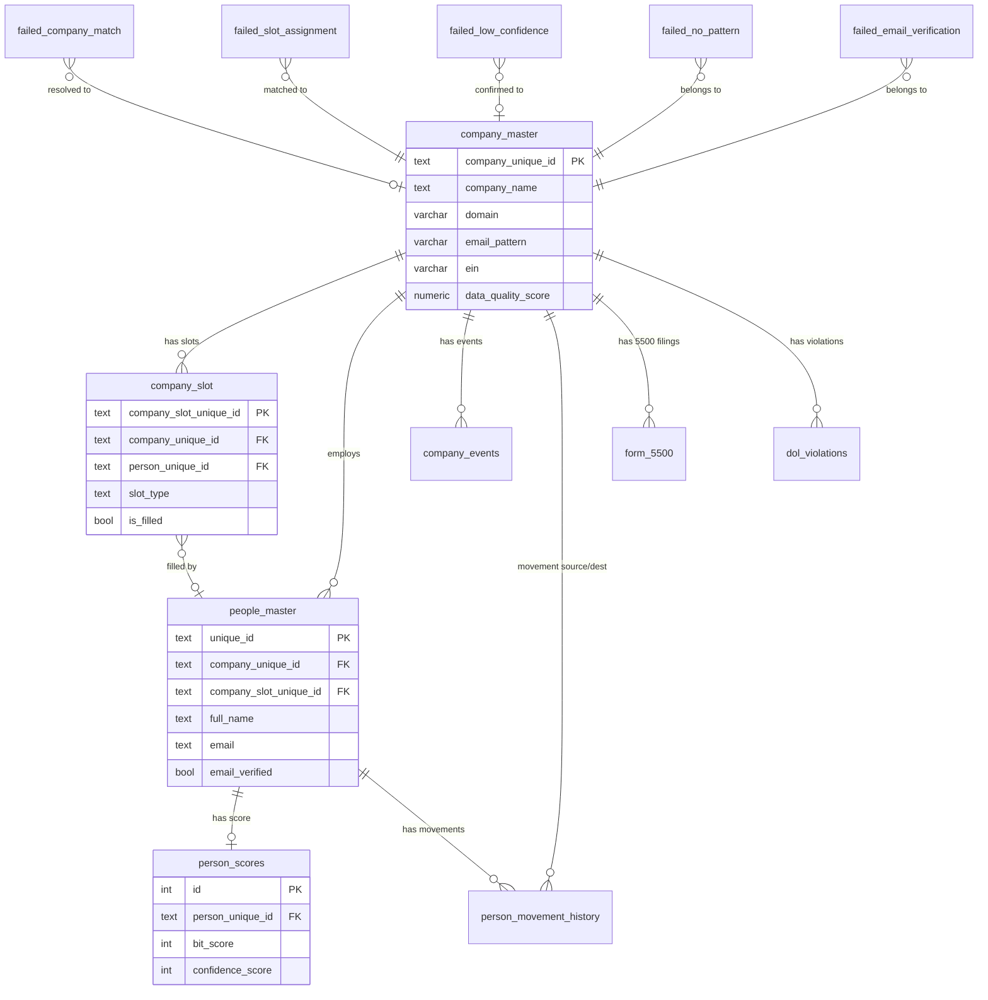

# PLE Schema ERD - Bicycle Wheel Architecture

> **"Think in wheels. Code in wheels. Diagram in wheels."**
> — Bicycle Wheel Doctrine

---

## The Master Wheel: Company Hub

```
┌─────────────────────────────────────────────────────────────────────────────────────────────────────────────────┐
│                                                                                                                 │
│                                    PLE DATABASE - BICYCLE WHEEL ERD                                             │
│                                    "Everything anchors to the Company Hub"                                      │
│                                                                                                                 │
└─────────────────────────────────────────────────────────────────────────────────────────────────────────────────┘


                                              DOL NODE (SPOKE)
                                         ╔═══════════════════════╗
                                         ║      form_5500        ║
                                         ║      dol_violations   ║
                                         ╚═══════════╤═══════════╝
                                                     │
                                                     │ EIN match
                                                     │
            BLOG NODE (SPOKE)                        │                        TALENT FLOW (SPOKE)
           ╔═══════════════════╗                     │                       ╔═══════════════════╗
           ║  company_events   ║                     │                       ║ person_movement   ║
           ║  [funding, IPO,   ║                     │                       ║ _history          ║
           ║   layoffs, etc]   ║                     │                       ║                   ║
           ╚═════════╤═════════╝                     │                       ╚═════════╤═════════╝
                     │                               │                                 │
                     │ company_unique_id             │                                 │ company_from/to_id
                     │                               │                                 │
                     ╲                               │                               ╱
                       ╲                             │                             ╱
                         ╲                           │                           ╱
                           ╲                         │                         ╱
                             ╲                       │                       ╱
                               ╲                     │                     ╱
        ╔════════════════════════════════════════════════════════════════════════════════════════════╗
        ║                                                                                            ║
        ║                              ╔══════════════════════════════════════╗                      ║
        ║                              ║                                      ║                      ║
        ║                              ║         COMPANY HUB                  ║                      ║
        ║                              ║         (CENTRAL AXLE)               ║                      ║
        ║                              ║                                      ║                      ║
        ║                              ║   ┌──────────────────────────────┐   ║                      ║
        ║                              ║   │         BIT ENGINE           │   ║                      ║
        ║                              ║   │      (Core Metric)           │   ║                      ║
        ║                              ║   │                              │   ║                      ║
        ║                              ║   │   All signals converge here  │   ║                      ║
        ║                              ║   │   Score: 0-100               │   ║                      ║
        ║                              ║   └──────────────────────────────┘   ║                      ║
        ║                              ║                                      ║                      ║
        ║                              ║   company_master                     ║                      ║
        ║                              ║   ├── company_unique_id (PK)         ║                      ║
        ║                              ║   ├── company_name                   ║                      ║
        ║                              ║   ├── domain ←───────────────────────╫── REQUIRED          ║
        ║                              ║   ├── email_pattern ←────────────────╫── REQUIRED          ║
        ║                              ║   ├── ein                            ║                      ║
        ║                              ║   └── slots[] ────────────┐          ║                      ║
        ║                              ║                           │          ║                      ║
        ║                              ╚══════════════════════════════════════╝                      ║
        ║                                              │                                             ║
        ║                                              │                                             ║
        ╚══════════════════════════════════════════════╪═════════════════════════════════════════════╝
                               ╱                       │                       ╲
                             ╱                         │                         ╲
                           ╱                           │                           ╲
                         ╱                             │                             ╲
                       ╱                               │                               ╲
                     ╱                                 │                                 ╲
                   ╱                                   │                                   ╲
                 ╱                                     │                                     ╲
               ╱                                       │                                       ╲
  ╔═══════════════════════════╗         ╔══════════════════════════════╗         ╔═══════════════════════════╗
  ║     SLOTS SUB-WHEEL       ║         ║      PEOPLE NODE             ║         ║    OUTREACH NODE          ║
  ║                           ║         ║      (SPOKE)                 ║         ║    [PLANNED]              ║
  ║     company_slot          ║◄────────║                              ║         ║                           ║
  ║     ├── slot_type         ║         ║      people_master           ║────────►║  Campaigns, Sequences     ║
  ║     │   (CEO/CFO/HR)      ║         ║      ├── unique_id (PK)      ║         ║  Engagement tracking      ║
  ║     ├── is_filled         ║◄───────►║      ├── full_name           ║         ║                           ║
  ║     └── person_unique_id  ║         ║      ├── email (verified)    ║         ╚═══════════════════════════╝
  ║                           ║         ║      ├── title               ║
  ╚═══════════════════════════╝         ║      ├── seniority           ║
                                        ║      └── linkedin_url        ║
                                        ║                              ║
                                        ║      person_scores           ║
                                        ║      ├── bit_score           ║
                                        ║      └── confidence_score    ║
                                        ║                              ║
                                        ╚══════════════╤═══════════════╝
                                                       │
                                                       │
                                        ┌──────────────┴──────────────┐
                                        │                             │
                                        │    EMAIL VERIFICATION       │
                                        │       (SUB-WHEEL)           │
                                        │                             │
                                        │  ┌───────────────────────┐  │
                                        │  │   MILLIONVERIFIER     │  │
                                        │  │      (Hub/Axle)       │  │
                                        │  └───────────────────────┘  │
                                        │           │                 │
                                        │     ┌─────┴─────┐           │
                                        │     │           │           │
                                        │  pattern    bulk            │
                                        │  _guesser   _verifier       │
                                        │  (FREE)     ($37/10K)       │
                                        │                             │
                                        └─────────────────────────────┘
```

---

## Failure Spokes (Broken Spokes Need Repair)

Every wheel has failure spokes - these are NOT exceptions, they are first-class citizens:

```
                                    ┌─────────────────────────────────────────────────────────────────┐
                                    │                     FAILURE SPOKES                              │
                                    │               (Attached to Every Hub & Sub-Hub)                 │
                                    └─────────────────────────────────────────────────────────────────┘


                                                    COMPANY HUB
                                                         │
                         ┌───────────────────────────────┼───────────────────────────────┐
                         │                               │                               │
                         ▼                               ▼                               ▼
              ┌─────────────────────┐        ┌─────────────────────┐        ┌─────────────────────┐
              │ domain_missing      │        │ pattern_missing     │        │ identity_conflict   │
              │ [Failure Spoke]     │        │ [Failure Spoke]     │        │ [Failure Spoke]     │
              │                     │        │                     │        │                     │
              │ Route to: Tier 0    │        │ Route to: Pattern   │        │ Route to: Manual    │
              │ Enrichment          │        │ Discovery Pipeline  │        │ Review Queue        │
              └─────────────────────┘        └─────────────────────┘        └─────────────────────┘


                                                    PEOPLE NODE
                                                         │
             ┌───────────────┬───────────────┬───────────┼───────────────┬───────────────┐
             │               │               │           │               │               │
             ▼               ▼               ▼           ▼               ▼               ▼
    ┌─────────────┐ ┌─────────────┐ ┌─────────────┐ ┌─────────────┐ ┌─────────────┐
    │failed_      │ │failed_slot_ │ │failed_low_  │ │failed_no_   │ │failed_email_│
    │company_     │ │assignment   │ │confidence   │ │pattern      │ │verification │
    │match        │ │             │ │             │ │             │ │             │
    │             │ │             │ │             │ │             │ │             │
    │ <80% fuzzy  │ │ Lost to     │ │ 70-79%      │ │ No domain/  │ │ MV returned │
    │ score       │ │ seniority   │ │ fuzzy       │ │ pattern     │ │ invalid     │
    └──────┬──────┘ └──────┬──────┘ └──────┬──────┘ └──────┬──────┘ └──────┬──────┘
           │               │               │               │               │
           ▼               ▼               ▼               ▼               ▼
    ┌─────────────┐ ┌─────────────┐ ┌─────────────┐ ┌─────────────┐ ┌─────────────┐
    │Resolution:  │ │Resolution:  │ │Resolution:  │ │Resolution:  │ │Resolution:  │
    │• Confirm    │ │• Manual     │ │• Confirm    │ │• Add pattern│ │• Try alt    │
    │• Reject     │ │  override   │ │• Reject     │ │• Manual     │ │  patterns   │
    │• Remap      │ │• Wait       │ │• Remap      │ │  email      │ │• Manual     │
    └─────────────┘ └─────────────┘ └─────────────┘ └─────────────┘ └─────────────┘
```

---

## Wheel-by-Wheel Table Definitions

### COMPANY HUB (Central Axle)

The master wheel. Everything anchors here.

```
╔══════════════════════════════════════════════════════════════════════════════════════════════╗
║                                     COMPANY_MASTER                                           ║
║                                     (The Axle)                                               ║
╠══════════════════════════════════════════════════════════════════════════════════════════════╣
║                                                                                              ║
║  PRIMARY KEY: company_unique_id (Barton ID: 04.04.01.XX.XXXXX.XXX)                          ║
║                                                                                              ║
║  ┌─────────────────────────────────────────────────────────────────────────────────────┐    ║
║  │ ANCHOR FIELDS (Required for spokes to function)                                      │    ║
║  ├─────────────────────────────────────────────────────────────────────────────────────┤    ║
║  │ company_unique_id    │ text      │ PK    │ 04.04.01.XX.XXXXX.XXX                    │    ║
║  │ company_name         │ text      │       │ Normalized company name                   │    ║
║  │ domain               │ varchar   │ REQ   │ Validated domain (e.g., company.com)     │    ║
║  │ email_pattern        │ varchar   │ REQ   │ Pattern: {f}{last}@, first.last@, etc.   │    ║
║  │ ein                  │ varchar   │       │ Employer ID Number (9 digits)            │    ║
║  └─────────────────────────────────────────────────────────────────────────────────────┘    ║
║                                                                                              ║
║  ┌─────────────────────────────────────────────────────────────────────────────────────┐    ║
║  │ CORE METRIC (BIT lives inside the hub)                                               │    ║
║  ├─────────────────────────────────────────────────────────────────────────────────────┤    ║
║  │ data_quality_score   │ numeric   │       │ Overall data quality 0-100               │    ║
║  │ email_pattern_conf   │ int       │       │ Pattern confidence 0-100                 │    ║
║  └─────────────────────────────────────────────────────────────────────────────────────┘    ║
║                                                                                              ║
║  ┌─────────────────────────────────────────────────────────────────────────────────────┐    ║
║  │ IDENTITY FIELDS                                                                      │    ║
║  ├─────────────────────────────────────────────────────────────────────────────────────┤    ║
║  │ website_url          │ text      │       │ Primary website                          │    ║
║  │ industry             │ text      │       │ Industry classification                  │    ║
║  │ employee_count       │ int       │ >=50  │ Must be 50+ employees                    │    ║
║  │ address_street       │ text      │       │ Street address                           │    ║
║  │ address_city         │ text      │       │ City (guardrail for fuzzy matching)      │    ║
║  │ address_state        │ text      │ ENUM  │ PA, VA, MD, OH, WV, KY only             │    ║
║  │ address_zip          │ text      │       │ ZIP code                                 │    ║
║  │ founded_year         │ int       │ 1700+ │ Year founded                             │    ║
║  │ sic_codes            │ text      │       │ SIC industry codes                       │    ║
║  │ duns                 │ varchar   │       │ Dun & Bradstreet Number                  │    ║
║  │ cage_code            │ varchar   │       │ Government Entity Code                   │    ║
║  └─────────────────────────────────────────────────────────────────────────────────────┘    ║
║                                                                                              ║
║  ┌─────────────────────────────────────────────────────────────────────────────────────┐    ║
║  │ SOCIAL LINKS                                                                         │    ║
║  ├─────────────────────────────────────────────────────────────────────────────────────┤    ║
║  │ linkedin_url         │ text      │       │ Company LinkedIn page                    │    ║
║  │ facebook_url         │ text      │       │ Company Facebook page                    │    ║
║  │ twitter_url          │ text      │       │ Company Twitter/X page                   │    ║
║  └─────────────────────────────────────────────────────────────────────────────────────┘    ║
║                                                                                              ║
║  ┌─────────────────────────────────────────────────────────────────────────────────────┐    ║
║  │ AUDIT FIELDS                                                                         │    ║
║  ├─────────────────────────────────────────────────────────────────────────────────────┤    ║
║  │ source_system        │ text      │       │ Where data came from                     │    ║
║  │ created_at           │ timestamp │       │ Record creation                          │    ║
║  │ updated_at           │ timestamp │       │ Last modification                        │    ║
║  │ validated_at         │ timestamp │       │ When validated                           │    ║
║  │ validated_by         │ text      │       │ Who validated                            │    ║
║  │ email_pattern_source │ varchar   │       │ hunter, manual, enrichment               │    ║
║  └─────────────────────────────────────────────────────────────────────────────────────┘    ║
║                                                                                              ║
╚══════════════════════════════════════════════════════════════════════════════════════════════╝
```

### SLOTS SUB-WHEEL (Attached to Company Hub)

```
╔══════════════════════════════════════════════════════════════════════════════════════════════╗
║                                     COMPANY_SLOT                                             ║
║                                     (Sub-Wheel of Company Hub)                               ║
╠══════════════════════════════════════════════════════════════════════════════════════════════╣
║                                                                                              ║
║  PRIMARY KEY: company_slot_unique_id (Barton ID: 04.04.05.XX.XXXXX.XXX)                     ║
║  FOREIGN KEY: company_unique_id → company_master                                            ║
║  FOREIGN KEY: person_unique_id → people_master (nullable)                                   ║
║                                                                                              ║
║  UNIQUE CONSTRAINT: (company_unique_id, slot_type) - One slot per role per company         ║
║                                                                                              ║
║  ┌─────────────────────────────────────────────────────────────────────────────────────┐    ║
║  │ SLOT IDENTITY                                                                        │    ║
║  ├─────────────────────────────────────────────────────────────────────────────────────┤    ║
║  │ company_slot_unique_id │ text     │ PK    │ 04.04.05.XX.XXXXX.XXX                   │    ║
║  │ company_unique_id      │ text     │ FK    │ Links to company_master                 │    ║
║  │ slot_type              │ text     │ ENUM  │ CEO, CFO, HR (expandable)              │    ║
║  └─────────────────────────────────────────────────────────────────────────────────────┘    ║
║                                                                                              ║
║  ┌─────────────────────────────────────────────────────────────────────────────────────┐    ║
║  │ SLOT STATE                                                                           │    ║
║  ├─────────────────────────────────────────────────────────────────────────────────────┤    ║
║  │ person_unique_id       │ text     │ FK    │ Who fills this slot (nullable)          │    ║
║  │ is_filled              │ bool     │ def F │ Is someone in this slot?                │    ║
║  │ status                 │ varchar  │ def O │ open, filled, vacated                   │    ║
║  │ confidence_score       │ numeric  │       │ How confident are we in assignment?     │    ║
║  └─────────────────────────────────────────────────────────────────────────────────────┘    ║
║                                                                                              ║
║  ┌─────────────────────────────────────────────────────────────────────────────────────┐    ║
║  │ CONTACT INFO (Role-level)                                                            │    ║
║  ├─────────────────────────────────────────────────────────────────────────────────────┤    ║
║  │ phone                  │ varchar  │       │ Role phone number                        │    ║
║  │ phone_extension        │ varchar  │       │ Phone extension                          │    ║
║  │ phone_verified_at      │ timestamp│       │ When phone was verified                  │    ║
║  └─────────────────────────────────────────────────────────────────────────────────────┘    ║
║                                                                                              ║
║  ┌─────────────────────────────────────────────────────────────────────────────────────┐    ║
║  │ ENRICHMENT TRACKING                                                                  │    ║
║  ├─────────────────────────────────────────────────────────────────────────────────────┤    ║
║  │ enrichment_attempts    │ int      │ def 0 │ How many times we tried to fill         │    ║
║  │ last_refreshed_at      │ timestamp│       │ Last enrichment attempt                  │    ║
║  │ filled_at              │ timestamp│       │ When slot was filled                     │    ║
║  │ vacated_at             │ timestamp│       │ When person left slot                    │    ║
║  │ filled_by              │ text     │       │ System/user that filled slot             │    ║
║  │ source_system          │ text     │ def M │ manual, enrichment, import               │    ║
║  └─────────────────────────────────────────────────────────────────────────────────────┘    ║
║                                                                                              ║
╚══════════════════════════════════════════════════════════════════════════════════════════════╝
```

### PEOPLE NODE (Spoke)

```
╔══════════════════════════════════════════════════════════════════════════════════════════════╗
║                                     PEOPLE_MASTER                                            ║
║                                     (Spoke Node)                                             ║
╠══════════════════════════════════════════════════════════════════════════════════════════════╣
║                                                                                              ║
║  PRIMARY KEY: unique_id (Barton ID: 04.04.02.XX.XXXXX.XXX)                                  ║
║  FOREIGN KEY: company_unique_id → company_master                                            ║
║  FOREIGN KEY: company_slot_unique_id → company_slot                                         ║
║                                                                                              ║
║  ┌─────────────────────────────────────────────────────────────────────────────────────┐    ║
║  │ PERSON IDENTITY                                                                      │    ║
║  ├─────────────────────────────────────────────────────────────────────────────────────┤    ║
║  │ unique_id              │ text     │ PK    │ 04.04.02.XX.XXXXX.XXX                   │    ║
║  │ company_unique_id      │ text     │ FK    │ Links to company_master                 │    ║
║  │ company_slot_unique_id │ text     │ FK    │ Links to company_slot                   │    ║
║  │ first_name             │ text     │       │ First name                              │    ║
║  │ last_name              │ text     │       │ Last name                               │    ║
║  │ full_name              │ text     │       │ Full display name                       │    ║
║  └─────────────────────────────────────────────────────────────────────────────────────┘    ║
║                                                                                              ║
║  ┌─────────────────────────────────────────────────────────────────────────────────────┐    ║
║  │ PROFESSIONAL INFO                                                                    │    ║
║  ├─────────────────────────────────────────────────────────────────────────────────────┤    ║
║  │ title                  │ text     │       │ Job title                               │    ║
║  │ seniority              │ text     │       │ CHRO > VP > Director > Manager > etc.  │    ║
║  │ department             │ text     │       │ Department (HR, Finance, etc.)          │    ║
║  │ bio                    │ text     │       │ Professional bio                        │    ║
║  │ skills                 │ text[]   │       │ Array of skills                         │    ║
║  │ education              │ text     │       │ Education background                    │    ║
║  │ certifications         │ text[]   │       │ Array of certifications                 │    ║
║  └─────────────────────────────────────────────────────────────────────────────────────┘    ║
║                                                                                              ║
║  ┌─────────────────────────────────────────────────────────────────────────────────────┐    ║
║  │ CONTACT INFO (Verified)                                                              │    ║
║  ├─────────────────────────────────────────────────────────────────────────────────────┤    ║
║  │ email                  │ text     │ REQ*  │ Verified email address                  │    ║
║  │ email_verified         │ bool     │ def F │ Has email been verified?                │    ║
║  │ email_verified_at      │ timestamp│       │ When verified                           │    ║
║  │ email_verification_src │ text     │       │ millionverifier, manual, etc.           │    ║
║  │ work_phone_e164        │ text     │       │ Work phone (E.164 format)               │    ║
║  │ personal_phone_e164    │ text     │       │ Personal phone (E.164 format)           │    ║
║  └─────────────────────────────────────────────────────────────────────────────────────┘    ║
║                                                                                              ║
║  ┌─────────────────────────────────────────────────────────────────────────────────────┐    ║
║  │ SOCIAL LINKS                                                                         │    ║
║  ├─────────────────────────────────────────────────────────────────────────────────────┤    ║
║  │ linkedin_url           │ text     │ REQ*  │ LinkedIn profile URL                    │    ║
║  │ twitter_url            │ text     │       │ Twitter/X profile                       │    ║
║  │ facebook_url           │ text     │       │ Facebook profile                        │    ║
║  └─────────────────────────────────────────────────────────────────────────────────────┘    ║
║                                                                                              ║
║  * At least one of email OR linkedin_url is required (chk_contact_required)                 ║
║                                                                                              ║
╚══════════════════════════════════════════════════════════════════════════════════════════════╝
```

### PERSON SCORES (Sub-Spoke of People Node)

```
╔══════════════════════════════════════════════════════════════════════════════════════════════╗
║                                     PERSON_SCORES                                            ║
║                                     (Sub-Spoke - One per Person)                             ║
╠══════════════════════════════════════════════════════════════════════════════════════════════╣
║                                                                                              ║
║  PRIMARY KEY: id (auto-increment)                                                           ║
║  FOREIGN KEY: person_unique_id → people_master (UNIQUE - one score per person)             ║
║                                                                                              ║
║  ┌─────────────────────────────────────────────────────────────────────────────────────┐    ║
║  │ SCORING                                                                              │    ║
║  ├─────────────────────────────────────────────────────────────────────────────────────┤    ║
║  │ person_unique_id       │ text     │ FK    │ Links to people_master                  │    ║
║  │ bit_score              │ int      │ 0-100 │ Buyer Intent Tool score                 │    ║
║  │ confidence_score       │ int      │ 0-100 │ Data confidence score                   │    ║
║  │ score_factors          │ jsonb    │       │ Breakdown of scoring factors            │    ║
║  │ calculated_at          │ timestamp│       │ When score was calculated               │    ║
║  └─────────────────────────────────────────────────────────────────────────────────────┘    ║
║                                                                                              ║
╚══════════════════════════════════════════════════════════════════════════════════════════════╝
```

### DOL NODE (Spoke)

```
╔══════════════════════════════════════════════════════════════════════════════════════════════╗
║                                     FORM_5500                                                ║
║                                     (DOL Spoke - 5500 Filings)                               ║
╠══════════════════════════════════════════════════════════════════════════════════════════════╣
║                                                                                              ║
║  PRIMARY KEY: id (auto-increment)                                                           ║
║  FOREIGN KEY: company_unique_id → company_master (optional - matched via EIN)              ║
║                                                                                              ║
║  ┌─────────────────────────────────────────────────────────────────────────────────────┐    ║
║  │ FILING IDENTITY                                                                      │    ║
║  ├─────────────────────────────────────────────────────────────────────────────────────┤    ║
║  │ ack_id                 │ varchar  │       │ DOL acknowledgment ID                   │    ║
║  │ ein                    │ varchar  │ 9 dig │ Employer ID Number                      │    ║
║  │ plan_number            │ varchar  │ 3 dig │ Plan number                             │    ║
║  │ plan_name              │ varchar  │ 140ch │ Plan name                               │    ║
║  │ sponsor_name           │ varchar  │ 70ch  │ Plan sponsor name                       │    ║
║  └─────────────────────────────────────────────────────────────────────────────────────┘    ║
║                                                                                              ║
║  ┌─────────────────────────────────────────────────────────────────────────────────────┐    ║
║  │ PLAN DATA                                                                            │    ║
║  ├─────────────────────────────────────────────────────────────────────────────────────┤    ║
║  │ participant_count      │ int      │       │ Number of participants                  │    ║
║  │ total_assets           │ numeric  │ 15,2  │ Total plan assets                       │    ║
║  │ filing_year            │ int      │       │ Year of filing                          │    ║
║  │ plan_codes             │ varchar  │ 59ch  │ Plan type codes                         │    ║
║  │ date_received          │ date     │       │ DOL receipt date                        │    ║
║  └─────────────────────────────────────────────────────────────────────────────────────┘    ║
║                                                                                              ║
║  ┌─────────────────────────────────────────────────────────────────────────────────────┐    ║
║  │ LOCATION                                                                             │    ║
║  ├─────────────────────────────────────────────────────────────────────────────────────┤    ║
║  │ address                │ varchar  │ 35ch  │ Street address                          │    ║
║  │ city                   │ varchar  │ 22ch  │ City                                    │    ║
║  │ state                  │ varchar  │ 2ch   │ State code                              │    ║
║  │ zip                    │ varchar  │ 12ch  │ ZIP code                                │    ║
║  └─────────────────────────────────────────────────────────────────────────────────────┘    ║
║                                                                                              ║
╚══════════════════════════════════════════════════════════════════════════════════════════════╝

╔══════════════════════════════════════════════════════════════════════════════════════════════╗
║                                     DOL_VIOLATIONS                                           ║
║                                     (DOL Spoke - Violations)                                 ║
╠══════════════════════════════════════════════════════════════════════════════════════════════╣
║                                                                                              ║
║  PRIMARY KEY: id (auto-increment)                                                           ║
║  FOREIGN KEY: company_unique_id → company_master (optional)                                 ║
║                                                                                              ║
║  ┌─────────────────────────────────────────────────────────────────────────────────────┐    ║
║  │ VIOLATION DATA                                                                       │    ║
║  ├─────────────────────────────────────────────────────────────────────────────────────┤    ║
║  │ ein                    │ varchar  │ 9 dig │ Employer ID Number                      │    ║
║  │ violation_type         │ varchar  │ 100ch │ Type of violation                       │    ║
║  │ violation_date         │ date     │       │ When violation occurred                 │    ║
║  │ resolution_date        │ date     │       │ When resolved (nullable)                │    ║
║  │ penalty_amount         │ numeric  │ 12,2  │ Penalty amount                          │    ║
║  │ description            │ text     │       │ Violation description                   │    ║
║  │ source_url             │ varchar  │ 500ch │ Source documentation                    │    ║
║  └─────────────────────────────────────────────────────────────────────────────────────┘    ║
║                                                                                              ║
╚══════════════════════════════════════════════════════════════════════════════════════════════╝
```

### TALENT FLOW NODE (Spoke)

```
╔══════════════════════════════════════════════════════════════════════════════════════════════╗
║                                     PERSON_MOVEMENT_HISTORY                                  ║
║                                     (Talent Flow Spoke)                                      ║
╠══════════════════════════════════════════════════════════════════════════════════════════════╣
║                                                                                              ║
║  PRIMARY KEY: id (auto-increment)                                                           ║
║  FOREIGN KEY: person_unique_id → people_master                                              ║
║  FOREIGN KEY: company_from_id → company_master                                              ║
║  FOREIGN KEY: company_to_id → company_master (optional - could be unknown company)         ║
║                                                                                              ║
║  ┌─────────────────────────────────────────────────────────────────────────────────────┐    ║
║  │ MOVEMENT DATA                                                                        │    ║
║  ├─────────────────────────────────────────────────────────────────────────────────────┤    ║
║  │ person_unique_id       │ text     │ FK    │ Who moved                               │    ║
║  │ linkedin_url           │ text     │       │ LinkedIn URL for tracking               │    ║
║  │ company_from_id        │ text     │ FK    │ Origin company                          │    ║
║  │ company_to_id          │ text     │ FK    │ Destination company (nullable)          │    ║
║  │ title_from             │ text     │       │ Previous title                          │    ║
║  │ title_to               │ text     │       │ New title (nullable)                    │    ║
║  │ movement_type          │ text     │ ENUM  │ company_change, title_change, lost      │    ║
║  │ detected_at            │ timestamp│       │ When movement was detected              │    ║
║  │ raw_payload            │ jsonb    │       │ Raw detection data                      │    ║
║  └─────────────────────────────────────────────────────────────────────────────────────┘    ║
║                                                                                              ║
╚══════════════════════════════════════════════════════════════════════════════════════════════╝
```

### BLOG NODE (Spoke)

```
╔══════════════════════════════════════════════════════════════════════════════════════════════╗
║                                     COMPANY_EVENTS                                           ║
║                                     (Blog/News Spoke)                                        ║
╠══════════════════════════════════════════════════════════════════════════════════════════════╣
║                                                                                              ║
║  PRIMARY KEY: id (auto-increment)                                                           ║
║  FOREIGN KEY: company_unique_id → company_master                                            ║
║                                                                                              ║
║  ┌─────────────────────────────────────────────────────────────────────────────────────┐    ║
║  │ EVENT DATA                                                                           │    ║
║  ├─────────────────────────────────────────────────────────────────────────────────────┤    ║
║  │ company_unique_id      │ text     │ FK    │ Which company                           │    ║
║  │ event_type             │ text     │ ENUM  │ funding, acquisition, ipo, layoff,      │    ║
║  │                        │          │       │ leadership_change, product_launch,       │    ║
║  │                        │          │       │ office_opening, other                    │    ║
║  │ event_date             │ date     │       │ When event occurred                      │    ║
║  │ source_url             │ text     │       │ Source article/announcement             │    ║
║  │ summary                │ text     │       │ Event summary                           │    ║
║  │ detected_at            │ timestamp│       │ When we detected it                     │    ║
║  └─────────────────────────────────────────────────────────────────────────────────────┘    ║
║                                                                                              ║
║  ┌─────────────────────────────────────────────────────────────────────────────────────┐    ║
║  │ BIT IMPACT (Feeds back to hub)                                                       │    ║
║  ├─────────────────────────────────────────────────────────────────────────────────────┤    ║
║  │ impacts_bit            │ bool     │ def T │ Does this event affect BIT score?       │    ║
║  │ bit_impact_score       │ int      │ -100  │ How much does it change BIT?            │    ║
║  │                        │          │ to100 │ Positive = opportunity, Negative = risk │    ║
║  └─────────────────────────────────────────────────────────────────────────────────────┘    ║
║                                                                                              ║
╚══════════════════════════════════════════════════════════════════════════════════════════════╝
```

---

## Failure Spoke Tables (Broken Spokes)

### FAILED_COMPANY_MATCH (Fuzzy Match Failure)

```
╔══════════════════════════════════════════════════════════════════════════════════════════════╗
║                                     FAILED_COMPANY_MATCH                                     ║
║                                     (Failure Spoke - Phase 2)                                ║
╠══════════════════════════════════════════════════════════════════════════════════════════════╣
║                                                                                              ║
║  TRIGGER: Fuzzy match score < 80%                                                           ║
║  RESOLUTION OPTIONS: Confirm match, Reject, Remap to different company                      ║
║                                                                                              ║
║  ┌─────────────────────────────────────────────────────────────────────────────────────┐    ║
║  │ PERSON DATA (from input)                                                             │    ║
║  ├─────────────────────────────────────────────────────────────────────────────────────┤    ║
║  │ person_id              │ varchar  │       │ Input person ID                         │    ║
║  │ full_name              │ varchar  │       │ Person's name                           │    ║
║  │ job_title              │ varchar  │       │ Job title                               │    ║
║  │ title_seniority        │ varchar  │       │ Seniority level                         │    ║
║  │ company_name_raw       │ varchar  │       │ Raw company name from input             │    ║
║  │ linkedin_url           │ varchar  │       │ LinkedIn URL                            │    ║
║  └─────────────────────────────────────────────────────────────────────────────────────┘    ║
║                                                                                              ║
║  ┌─────────────────────────────────────────────────────────────────────────────────────┐    ║
║  │ MATCH ATTEMPT                                                                        │    ║
║  ├─────────────────────────────────────────────────────────────────────────────────────┤    ║
║  │ best_match_company     │ varchar  │       │ Closest fuzzy match found               │    ║
║  │ best_match_score       │ decimal  │ 0-100 │ Fuzzy match score                       │    ║
║  │ best_match_notes       │ text     │       │ Why match failed                        │    ║
║  └─────────────────────────────────────────────────────────────────────────────────────┘    ║
║                                                                                              ║
║  ┌─────────────────────────────────────────────────────────────────────────────────────┐    ║
║  │ RESOLUTION                                                                           │    ║
║  ├─────────────────────────────────────────────────────────────────────────────────────┤    ║
║  │ resolution_status      │ varchar  │       │ pending, resolved                       │    ║
║  │ resolution             │ varchar  │       │ confirmed, rejected, remapped           │    ║
║  │ resolution_notes       │ text     │       │ Resolution notes                        │    ║
║  │ resolved_by            │ varchar  │       │ Who resolved                            │    ║
║  │ resolved_at            │ timestamp│       │ When resolved                           │    ║
║  │ resolved_company_id    │ varchar  │ FK    │ Final company assignment                │    ║
║  └─────────────────────────────────────────────────────────────────────────────────────┘    ║
║                                                                                              ║
╚══════════════════════════════════════════════════════════════════════════════════════════════╝
```

### FAILED_SLOT_ASSIGNMENT (Seniority Competition Loss)

```
╔══════════════════════════════════════════════════════════════════════════════════════════════╗
║                                     FAILED_SLOT_ASSIGNMENT                                   ║
║                                     (Failure Spoke - Phase 3)                                ║
╠══════════════════════════════════════════════════════════════════════════════════════════════╣
║                                                                                              ║
║  TRIGGER: Lost slot to higher seniority person                                              ║
║  RESOLUTION OPTIONS: Manual override, Wait for vacancy                                      ║
║                                                                                              ║
║  ┌─────────────────────────────────────────────────────────────────────────────────────┐    ║
║  │ LOSER DATA                                                                           │    ║
║  ├─────────────────────────────────────────────────────────────────────────────────────┤    ║
║  │ person_id              │ varchar  │       │ Person who lost                         │    ║
║  │ full_name              │ varchar  │       │ Their name                              │    ║
║  │ job_title              │ varchar  │       │ Their title                             │    ║
║  │ title_seniority        │ varchar  │       │ Their seniority level                   │    ║
║  └─────────────────────────────────────────────────────────────────────────────────────┘    ║
║                                                                                              ║
║  ┌─────────────────────────────────────────────────────────────────────────────────────┐    ║
║  │ COMPETITION RESULT                                                                   │    ║
║  ├─────────────────────────────────────────────────────────────────────────────────────┤    ║
║  │ matched_company_id     │ varchar  │ FK    │ Company they matched to                 │    ║
║  │ matched_company_name   │ varchar  │       │ Company name                            │    ║
║  │ fuzzy_score            │ decimal  │       │ Their match score                       │    ║
║  │ slot_type              │ varchar  │       │ Which slot (hr, cfo, etc.)              │    ║
║  │ lost_to_person_id      │ varchar  │       │ Winner's ID                             │    ║
║  │ lost_to_person_name    │ varchar  │       │ Winner's name                           │    ║
║  │ lost_to_seniority      │ varchar  │       │ Winner's seniority                      │    ║
║  └─────────────────────────────────────────────────────────────────────────────────────┘    ║
║                                                                                              ║
╚══════════════════════════════════════════════════════════════════════════════════════════════╝
```

### FAILED_LOW_CONFIDENCE (70-79% Match)

```
╔══════════════════════════════════════════════════════════════════════════════════════════════╗
║                                     FAILED_LOW_CONFIDENCE                                    ║
║                                     (Failure Spoke - Phase 3)                                ║
╠══════════════════════════════════════════════════════════════════════════════════════════════╣
║                                                                                              ║
║  TRIGGER: Fuzzy match score 70-79% (below auto-accept, above reject)                       ║
║  RESOLUTION OPTIONS: Confirm match, Reject, Remap                                          ║
║                                                                                              ║
║  ┌─────────────────────────────────────────────────────────────────────────────────────┐    ║
║  │ MATCH DATA                                                                           │    ║
║  ├─────────────────────────────────────────────────────────────────────────────────────┤    ║
║  │ matched_company_id     │ varchar  │ FK    │ Tentative company match                 │    ║
║  │ matched_company_name   │ varchar  │       │ Company name                            │    ║
║  │ fuzzy_score            │ decimal  │ 70-79 │ Match score                             │    ║
║  │ match_notes            │ text     │       │ Why it's uncertain                      │    ║
║  └─────────────────────────────────────────────────────────────────────────────────────┘    ║
║                                                                                              ║
║  ┌─────────────────────────────────────────────────────────────────────────────────────┐    ║
║  │ RESOLUTION                                                                           │    ║
║  ├─────────────────────────────────────────────────────────────────────────────────────┤    ║
║  │ resolution_status      │ varchar  │       │ pending, resolved                       │    ║
║  │ resolution             │ varchar  │       │ confirmed, rejected, remapped           │    ║
║  │ confirmed_company_id   │ varchar  │ FK    │ Final confirmed company                 │    ║
║  └─────────────────────────────────────────────────────────────────────────────────────┘    ║
║                                                                                              ║
╚══════════════════════════════════════════════════════════════════════════════════════════════╝
```

### FAILED_NO_PATTERN (Missing Email Pattern)

```
╔══════════════════════════════════════════════════════════════════════════════════════════════╗
║                                     FAILED_NO_PATTERN                                        ║
║                                     (Failure Spoke - Phase 4)                                ║
╠══════════════════════════════════════════════════════════════════════════════════════════════╣
║                                                                                              ║
║  TRIGGER: Company has no domain or email_pattern                                            ║
║  RESOLUTION OPTIONS: Add pattern manually, Provide manual email, Skip                       ║
║                                                                                              ║
║  ┌─────────────────────────────────────────────────────────────────────────────────────┐    ║
║  │ COMPANY DATA                                                                         │    ║
║  ├─────────────────────────────────────────────────────────────────────────────────────┤    ║
║  │ company_id             │ varchar  │ FK    │ Company that lacks pattern              │    ║
║  │ company_name           │ varchar  │       │ Company name                            │    ║
║  │ company_domain         │ varchar  │       │ Domain (may be null)                    │    ║
║  │ failure_reason         │ varchar  │       │ no_domain, pattern_lookup_failed        │    ║
║  │ failure_notes          │ text     │       │ Details                                 │    ║
║  └─────────────────────────────────────────────────────────────────────────────────────┘    ║
║                                                                                              ║
║  ┌─────────────────────────────────────────────────────────────────────────────────────┐    ║
║  │ RESOLUTION                                                                           │    ║
║  ├─────────────────────────────────────────────────────────────────────────────────────┤    ║
║  │ resolution_status      │ varchar  │       │ pending, resolved                       │    ║
║  │ resolution             │ varchar  │       │ pattern_added, manual_email, skipped    │    ║
║  │ manual_email           │ varchar  │       │ If manually provided                    │    ║
║  └─────────────────────────────────────────────────────────────────────────────────────┘    ║
║                                                                                              ║
╚══════════════════════════════════════════════════════════════════════════════════════════════╝
```

### FAILED_EMAIL_VERIFICATION (Invalid Email)

```
╔══════════════════════════════════════════════════════════════════════════════════════════════╗
║                                     FAILED_EMAIL_VERIFICATION                                ║
║                                     (Failure Spoke - Phase 5)                                ║
╠══════════════════════════════════════════════════════════════════════════════════════════════╣
║                                                                                              ║
║  TRIGGER: MillionVerifier returned invalid                                                  ║
║  RESOLUTION OPTIONS: Try alternate patterns, Manual verification, Skip                      ║
║                                                                                              ║
║  ┌─────────────────────────────────────────────────────────────────────────────────────┐    ║
║  │ VERIFICATION DATA                                                                    │    ║
║  ├─────────────────────────────────────────────────────────────────────────────────────┤    ║
║  │ company_id             │ varchar  │ FK    │ Company                                 │    ║
║  │ company_domain         │ varchar  │       │ Domain used                             │    ║
║  │ email_pattern          │ varchar  │       │ Pattern used                            │    ║
║  │ generated_email        │ varchar  │       │ Email that failed                       │    ║
║  │ verification_error     │ varchar  │       │ invalid, catch_all, timeout, etc.       │    ║
║  │ verification_notes     │ text     │       │ Details from MillionVerifier            │    ║
║  │ email_variants         │ text     │       │ JSON: all variants tried                │    ║
║  └─────────────────────────────────────────────────────────────────────────────────────┘    ║
║                                                                                              ║
║  ┌─────────────────────────────────────────────────────────────────────────────────────┐    ║
║  │ RESOLUTION                                                                           │    ║
║  ├─────────────────────────────────────────────────────────────────────────────────────┤    ║
║  │ resolution_status      │ varchar  │       │ pending, resolved                       │    ║
║  │ resolution             │ varchar  │       │ alt_email_found, manual_verified, skip  │    ║
║  │ verified_email         │ varchar  │       │ If alternate found                      │    ║
║  └─────────────────────────────────────────────────────────────────────────────────────┘    ║
║                                                                                              ║
╚══════════════════════════════════════════════════════════════════════════════════════════════╝
```

---

## Wheel Rotation = Pipeline Flow

```
┌─────────────────────────────────────────────────────────────────────────────────────────────────────────────────┐
│                                                                                                                 │
│                                    WHEEL ROTATION = DATA FLOW                                                   │
│                               (Process spins clockwise through the system)                                      │
│                                                                                                                 │
└─────────────────────────────────────────────────────────────────────────────────────────────────────────────────┘


        ┌──────────────────────────────────────────────────────────────────────────────────────────────────┐
        │                                                                                                  │
        │   1. INTAKE                      CSV Input (720 people)                                         │
        │      │                                                                                           │
        │      ▼                                                                                           │
        │   2. COMPANY HUB GATE            Is company in hub?                                             │
        │      │                           ├── YES → Use company_id                                       │
        │      │                           └── NO → Fuzzy match attempt                                   │
        │      │                                    │                                                      │
        │      │                                    ├── >=80% → Auto-match                                │
        │      │                                    ├── 70-79% → failed_low_confidence                    │
        │      │                                    └── <70% → failed_company_match                       │
        │      ▼                                                                                           │
        │   3. SLOT SPOKE                  Seniority competition                                          │
        │      │                           ├── WIN → Get slot                                             │
        │      │                           └── LOSE → failed_slot_assignment                              │
        │      ▼                                                                                           │
        │   4. EMAIL SUB-WHEEL             Pattern lookup                                                 │
        │      │                           ├── Has pattern → Generate email                               │
        │      │                           └── No pattern → failed_no_pattern                             │
        │      ▼                                                                                           │
        │   5. VERIFICATION SUB-WHEEL      MillionVerifier check                                          │
        │      │                           ├── Valid → PROCEED                                            │
        │      │                           └── Invalid → failed_email_verification                        │
        │      ▼                                                                                           │
        │   6. EXPORT TO HUB               Write to people_master + company_slot                          │
        │      │                           │                                                              │
        │      ▼                           ▼                                                              │
        │   7. BIT CALCULATION             Signals feed back to company BIT score                         │
        │                                                                                                  │
        └──────────────────────────────────────────────────────────────────────────────────────────────────┘
```

---

## Mermaid ERD (Traditional View)



---

## Constraints Reference

### Barton ID Formats

| Entity | Format | Example |
|--------|--------|---------|
| Company | `04.04.01.XX.XXXXX.XXX` | 04.04.01.04.30000.001 |
| Person | `04.04.02.XX.XXXXX.XXX` | 04.04.02.04.20000.001 |
| Slot | `04.04.05.XX.XXXXX.XXX` | 04.04.05.04.10000.001 |

### Check Constraints

| Table | Constraint | Rule |
|-------|------------|------|
| company_master | chk_employee_minimum | employee_count >= 50 |
| company_master | chk_state_valid | state IN (PA, VA, MD, OH, WV, KY) |
| people_master | chk_contact_required | linkedin_url OR email IS NOT NULL |
| person_scores | bit_score_check | 0 <= bit_score <= 100 |
| company_events | bit_impact_check | -100 <= bit_impact_score <= 100 |

### Unique Constraints

| Table | Columns | Purpose |
|-------|---------|---------|
| company_slot | (company_unique_id, slot_type) | One slot per role per company |
| person_scores | person_unique_id | One score per person |

---

## Notes

- All wheels anchor to the **Company Hub** - the central axle
- **Failure spokes** are first-class citizens, not exceptions
- **BIT Engine** lives inside the Company Hub (core metric)
- Sub-wheels (Slots, Email Verification) are fractal extensions
- Data flows clockwise through the wheel (pipeline rotation)

---

*Last Updated: December 2024*
*Architecture: Bicycle Wheel Doctrine v1.0*
