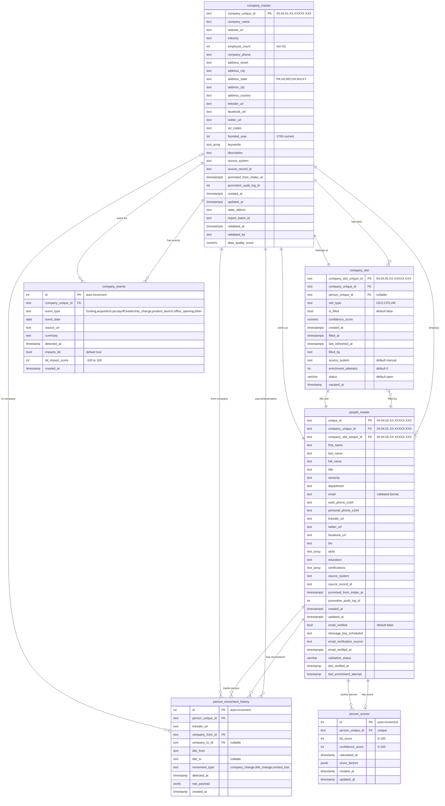

# PLE Schema ERD - Marketing Database

## Entity Relationship Diagram

## Relationship Summary

| Source Table | Source Column | Target Table | Target Column | Relationship Type | Constraint Name |
|--------------|---------------|--------------|---------------|-------------------|-----------------|
| company_slot | company_unique_id | company_master | company_unique_id | Many-to-One | fk_company |
| company_slot | person_unique_id | people_master | unique_id | Many-to-One (Optional) | fk_person |
| people_master | company_unique_id | company_master | company_unique_id | Many-to-One | people_master_company_barton_id_format |
| people_master | company_slot_unique_id | company_slot | company_slot_unique_id | One-to-One | people_master_slot_barton_id_format |
| person_movement_history | person_unique_id | people_master | unique_id | Many-to-One | person_movement_history_person_unique_id_fkey |
| person_movement_history | company_from_id | company_master | company_unique_id | Many-to-One | person_movement_history_company_from_id_fkey |
| person_movement_history | company_to_id | company_master | company_unique_id | Many-to-One (Optional) | person_movement_history_company_to_id_fkey |
| person_scores | person_unique_id | people_master | unique_id | One-to-One | person_scores_person_unique_id_fkey |
| company_events | company_unique_id | company_master | company_unique_id | Many-to-One | company_events_company_unique_id_fkey |

## Constraints Summary

### Primary Keys

| Table | Column | Type |
|-------|--------|------|
| company_master | company_unique_id | Barton ID (04.04.01.XX.XXXXX.XXX) |
| company_slot | company_slot_unique_id | Barton ID (04.04.05.XX.XXXXX.XXX) |
| people_master | unique_id | Barton ID (04.04.02.XX.XXXXX.XXX) |
| person_movement_history | id | Auto-increment Integer |
| person_scores | id | Auto-increment Integer |
| company_events | id | Auto-increment Integer |

### Unique Constraints

| Table | Columns | Constraint Name | Purpose |
|-------|---------|-----------------|---------|
| company_slot | (company_unique_id, slot_type) | unique_company_slot, uq_company_slot_type | Ensures one slot per role per company |
| person_scores | person_unique_id | person_scores_person_unique_id_key | One score record per person |

### Check Constraints

#### company_master

| Constraint | Rule | Description |
|------------|------|-------------|
| company_master_barton_id_format | `^04\.04\.01\.[0-9]{2}\.[0-9]{5}\.[0-9]{3}$` | Validates Barton ID format |
| company_master_employee_count_positive | `employee_count >= 0` | Ensures non-negative employee count |
| company_master_founded_year_reasonable | `1700 <= founded_year <= CURRENT_YEAR` | Validates founding year |
| chk_employee_minimum | `employee_count >= 50` | Minimum 50 employees required |
| chk_state_valid | State in (PA, VA, MD, OH, WV, KY) | Restricts to specific states |

#### people_master

| Constraint | Rule | Description |
|------------|------|-------------|
| people_master_barton_id_format | `^04\.04\.02\.[0-9]{2}\.[0-9]{5}\.[0-9]{3}$` | Validates person Barton ID |
| people_master_company_barton_id_format | `^04\.04\.01\.[0-9]{2}\.[0-9]{5}\.[0-9]{3}$` | Validates company reference |
| people_master_slot_barton_id_format | `^04\.04\.05\.[0-9]{2}\.[0-9]{5}\.[0-9]{3}$` | Validates slot reference |
| people_master_email_format | Valid email regex | Ensures proper email format |
| chk_contact_required | `linkedin_url IS NOT NULL OR email IS NOT NULL` | At least one contact method required |

#### company_slot

| Constraint | Rule | Description |
|------------|------|-------------|
| company_slot_slot_type_check | Type in (CEO, CFO, HR) | Restricts slot types to exec roles |

#### person_movement_history

| Constraint | Rule | Description |
|------------|------|-------------|
| person_movement_history_movement_type_check | Type in (company_change, title_change, contact_lost) | Valid movement types |

#### person_scores

| Constraint | Rule | Description |
|------------|------|-------------|
| person_scores_bit_score_check | `0 <= bit_score <= 100` | BIT score range |
| person_scores_confidence_score_check | `0 <= confidence_score <= 100` | Confidence score range |

#### company_events

| Constraint | Rule | Description |
|------------|------|-------------|
| company_events_event_type_check | Type in (funding, acquisition, ipo, layoff, leadership_change, product_launch, office_opening, other) | Valid event types |
| company_events_bit_impact_score_check | `-100 <= bit_impact_score <= 100` | BIT impact range |

## Data Flow

### Typical Insert Sequence

1. **company_master** - Insert validated company (from intake)
2. **company_slot** - Auto-create slots (CEO, CFO, HR) for company
3. **people_master** - Insert person and link to company + slot
4. **company_slot** - Update with person_unique_id, set is_filled=true
5. **person_scores** - Calculate and insert BIT/confidence scores
6. **company_events** - Track significant company events
7. **person_movement_history** - Track role/company changes

### Enrichment Flow

1. Slot created empty (is_filled=false)
2. Enrichment agent discovers executive
3. Person inserted into people_master
4. Slot updated with person_unique_id
5. person_scores calculated
6. company_slot.last_refreshed_at updated

## Notes

- All Barton IDs follow format: `04.04.XX.YY.ZZZZZ.NNN`
  - 04.04 = SubHive.App
  - XX = Schema (01=company, 02=person, 05=slot)
  - YY = Layer
  - ZZZZZ = Sequence
  - NNN = Counter
- Timestamps use `timestamptz` for timezone awareness (created_at, updated_at, etc.)
- Event tracking uses `timestamp without time zone` for detected_at
- JSONB fields store flexible metadata (raw_payload, score_factors)
- Arrays store multi-value fields (keywords, skills, certifications)
